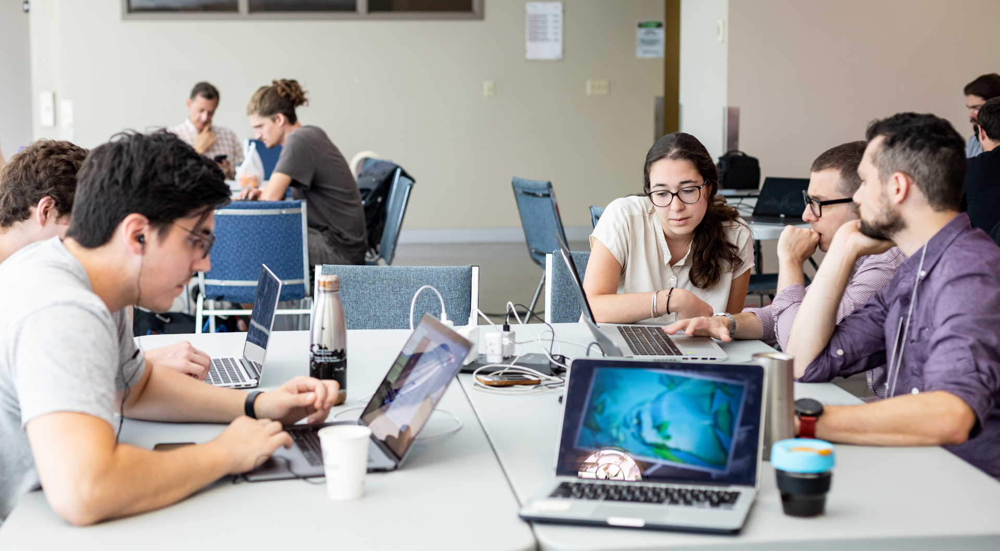

+++
title = "Code of Conduct"
type = "coc"
+++

---

# BrainHack School Code of Conduct

Hello  :wave:, and  
:computer::brain: Welcome to BrainHack School! :brain::computer:

Brainhack is dedicated to providing an environment where people are kind and respectful to each other, a harassment-free Brainhack experience for everyone, regardless of gender, gender identity and expression, sexual orientation, disability, physical appearance, body size, race, age or religion. We do not tolerate harassment of event participants in any form. Sexual language and imagery is not appropriate for any event venue, including talks. Brainhack participants violating these rules may be sanctioned or expelled from the event without a refund at the discretion of the event organizers.

This could really be the end of that code of conduct, but some forms of harassment and negative behavior are fairly hard to identify at first. Please read carefully through the rest of the document to make sure you avoid them. There is also a section to know what to do and expect if you experience behavior that deviates from this code of conduct.

Harassment includes, but _is not limited to_:  
:no_entry: Verbal comments that reinforce social structures of domination related to gender, gender identity and expression, sexual orientation, disability, physical appearance, body size, race, age or religion.  
:no_entry: Sexual images in public spaces  
:no_entry: Deliberate intimidation, stalking, or following  
:no_entry: Harassing photography or recording  
:no_entry: Sustained disruption of talks or other events  
:no_entry: Inappropriate physical contact  
:no_entry: Advocating for, or encouraging, any of the above behaviour  
:no_entry: Unwelcome sexual attention  

### *Microaggressions*
Incidents can take the form of “microaggressions,” which is a damaging form of harassment. Microaggressions are the everyday slights or insults which communicate negative messages to target individuals, often based upon their marginalized group membership. Over time, microaggressions can take a great toll on mental and emotional health, and the target’s feeling of belonging in science and academia. The following examples can all be labeled micro-aggressions:  
:no_entry: Commenting on a woman’s appearance rather than her work;  
:no_entry: Only directing questions at male colleagues when there are female experts in the room;  
:no_entry: Telling someone of colour that they “speak such good English”;  
:no_entry: Forcefully praising meat to an individual with a vegetarian diet;  
:no_entry: Praising alcoholic drinks to an individual who do not consume them.  
:no_entry: Exclusion from a group can be a common nonverbal form of microaggression.  
:no_entry: Microaggressions can be couched in the form of a “compliment,” (e.g. “you’re too attractive to be a scientist”).  

### *Respecting differences*  
Brainhack participants come from many cultures and backgrounds. We therefore expect everyone to be very respectful of different cultural practices, attitudes, and beliefs. This includes being aware of preferred titles and pronouns, as well as using a respectful tone of voice.
While we do not assume Brainhack participants know the cultural practices of every ethnic and cultural group, we expect members to recognize and respect differences within our community. This means being open to learning from and educating others, as well as educating yourself.

### *How to treat each other*  
:+1: Be respectful and value each other’s ideas, styles and viewpoints.  
:+1: Be direct but professional; we cannot withhold hard truths.  
:+1: Be inclusive and help new perspectives be heard.  
:+1: Appreciate and accommodate our many cultural practices, attitudes and beliefs.  
:+1: Be open to learning from others.  
:+1: Lead by example and match your actions with your words.  

## **Enforcement**
Participants asked to stop any harassing behavior are expected to comply immediately. Organizers and presenters are also subject to the anti-harassment policy. In particular, they should not use sexualized images, activities, or other material. Event organisers may take action to redress anything designed to, or with the clear impact of, disrupting the event or making the environment hostile for any participants.

## **Reporting**
If someone makes you or anyone else feel unsafe or unwelcome, please report it as soon as possible to the moderator on Slack or by email (@support will list the Code of Conduct committee members).

### *Reporting Issues*
BrainHack school is supported by the McGill University and Universite de Montreal disciplinary boards in enforcing appropriate behavior throughout the course.

Any incident of unacceptable behavior hurts the learning environment for everyone. We are therefore committed to supporting students to access these resources and ensure a supportive environment.

Both the [McGill Code of Student Conduct and Disciplinary Procedures](https://www.mcgill.ca/secretariat/files/secretariat/code_of_student_conduct_and_disciplinary_procedures.pdf) and the [University of Montreal Bureau d’intervention en matière de harcèlement (BIMH)](https://neurosciences.umontreal.ca/bureau-dintervention-en-matiere-de-harcelement-ou-de-lintimidation-bimh-514-343-7020/) exist to promote a healthy student environment at their respective universities. As BrainHack School straddles these two institutions, we are ready to assist students in submitting reports to either disciplinary board.

When necessary, a support team member will assist students to file a report at the appropriate university office. Complaints can be filed, without limitation periods, for any incident of harassment that has occurred in the course of university activities, whether on or off-campus. If one feels more comfortable to report an issue directly to the BIMH, they can visit their website (https://harcelement.umontreal.ca) or contact them directly (phone 514 343-7020; e-mail harcelement@umontreal.ca). Similarly for McGill University, issues can be reported directly to Robin Beech, the disciplinary officer for Graduate and Postdoctoral Studies (phone 514 398-5222; e-mail robin.beech@mcgill.ca).

Also, if you need moral support, feel welcome to ping the moderators on Slack or by email @support.