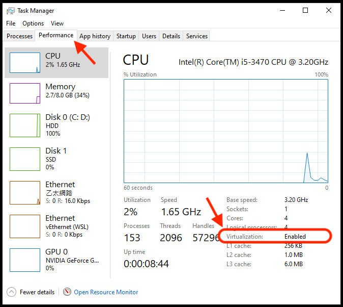
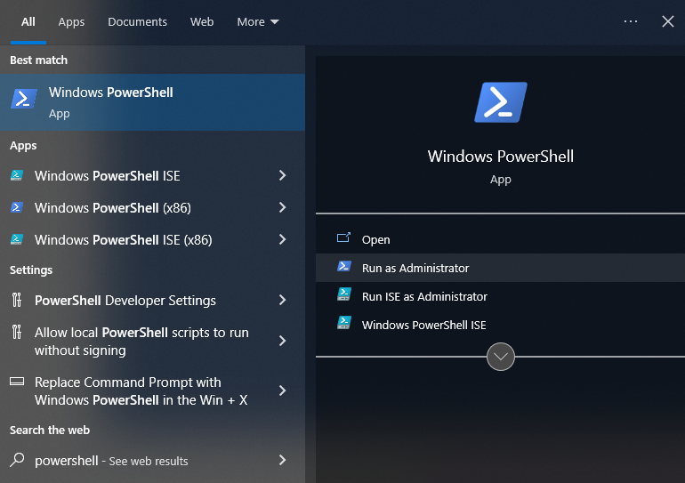
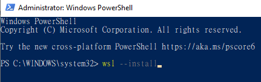
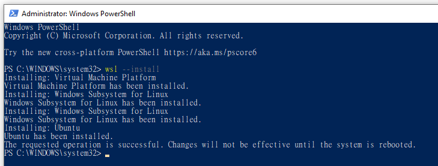
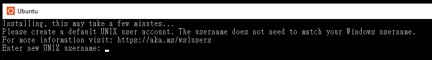
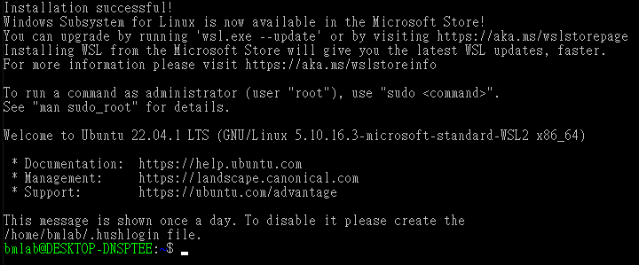
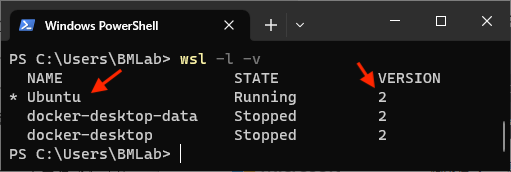
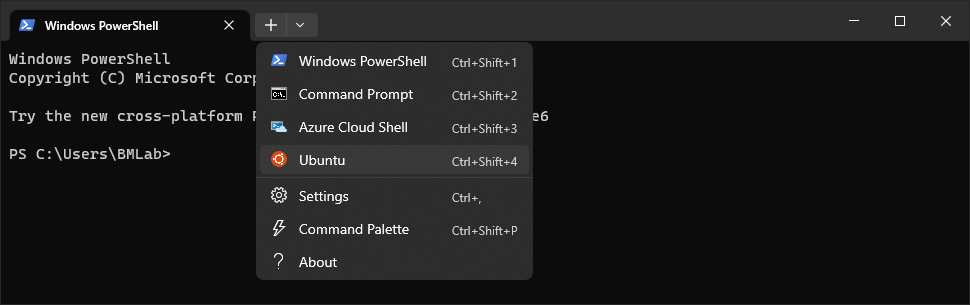
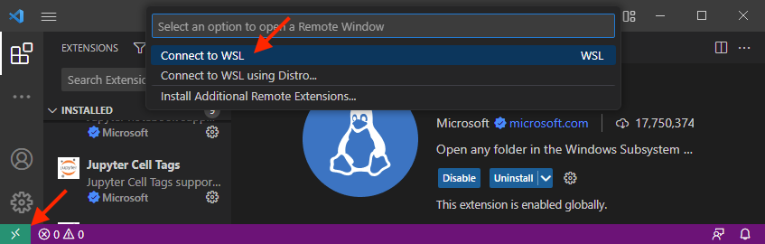
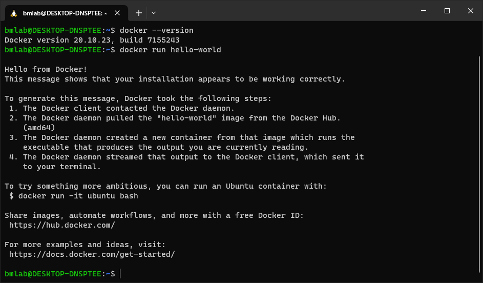

### Prerequisites

1. These installation instructions require Windows 10 version 21H1 or higher, or Windows 11 21H2 or higher. Please check with **Windows Update** to make sure your system is updated.
2. You should enable Virtualization in your BIOS setting. Please click `ctrl+alt+del` then click `Task Manager`, navigate to "Performance" tab and select CPU. Please make sure the Virtualization is `Enabled`.
   
   Note: If the Virtualization is “Disable”, you have to reboot your PC and get into BIOS setting to turn on the Virtualization function. Depending on your PC or motherboard manufacturer (ASUS, Acer, Dell, … etc), there are different ways to get into BIOS settings, so that we cannot provide common step-by-step instructions to help you turn on the Virtualization. If you have a problem on BIOS settings, please consult your friends or local TAs, or reach out on the `#help-installation` channel on our Discord server.

### Windows Subsystem for Linux (WSL)
Windows Subsystem for Linux (WSL) will install a Linux distribution (it is Ubuntu 22.04.1 LTS by default), then users can directly run Linux applications and Bash command-line tools on Windows. But, it should be noted that the Linux subsystem (i.e. Ubuntu) is an independent environment that has their own file structure and text command, which you will learn from another mandatory module. Some applications, such as VScode and Docker, can automatically integrate with WSL when you installed those on Windowns. But most applications, such as Python and probably your analysis softwares, should be installed under WSL. Please be cautious with these instructions in the future.

1. Search for `Windows Powershell` in your applications; right click and select `Run as administrator`.
   Select `Yes` on the prompt that appears asking if you want to allow the app to make changes to your device.
   

2. Type `wsl --install` into the Powershell and then press `Enter`.
   
   - You should see the messages about installing WSL, please wait and follow next step.
   - If WSL help text prompted and no installing takes place, you might already have WSL installed. Check if you have `Ubuntu` in your applications. Or, try `wsl --install -d Ubuntu` to install another Linux distribution.

3. A meesage will prompt to ask you to reboot the computer.
   
4. Once your computer has rebooted, a Ubuntu window will pop up. If no window popped up, search for and open Ubuntu from your applications. If you cannot find Ubuntu, try step 2 again.
5. It will show the message about installing Ubuntu, you will then be prompted to `Enter new UNIX username`. You can use any combination of alphanumeric characters here for your username, but a good choice is `<first_initial><last_name>` (e.g., `jsmith` for John Smith). You will then be prompted to enter a new password. (Choose something easy to remember as you will find yourself using it frequently.)
   
6. You will see the message to inform you that the installation is successful, and you can now close the window.
   
7. The final step is to check if we missed anything. Please search for powershell and run as administrator again. Then type `wsl -l -v` and press enter. Please make sure you have Ubuntu in the list, and the version is 2.
   
   - If the version is not 2, please type `wsl --set-version Ubuntu 2` to update the WSL to version 2. This is necessary for installing Docker on WSL.
8. Finally, in the same powershell window, type `wsl --update`. Hopefully, there is no updates. Then, we can move on to the next step.

(The above step-by-step WSL instructions are distilled from [here](https://learn.microsoft.com/en-us/windows/wsl/install) and [here](https://learn.microsoft.com/en-us/windows/wsl/install-manual).
If you have questions during the installation procedure those resources may have answers!)

### Windows Terminal
Microsoft have [Windows Terminal](https://aka.ms/terminal) that will provide better functionality for command-line interface. This application is now built-in on Windows 11. We will demostrate how to open terminal for WSL (it is Ubuntu by default).

1. Click [here](https://aka.ms/terminal) and download. Then, you can search and open **Windows Terminal** in your applications.
2. By default, it will open a PowerShell for Windows system. For this course, we will use bash terminal on WSL. You can click the down arrow and select Ubuntu to open the terminal.
   
   - If you would like to open Ubuntu terminal by default, you can change the default profile in Settings.

From this point on whenever the instructions specify to "open a terminal" please assume you are supposed to open the terminal for Ubuntu.

### Bash shell

You already have it, now that you’ve installed the WSL!

### Git

You already have it, now that you’ve installed the WSL!

### VSCode

1. Go to https://code.visualstudio.com/ and click the download button, then run the `.exe` file on Windows.
2. Leave all the defaults during the installation with the following exception:
   - Please make sure the box labelled "Register Code as an editor for supported file types" and "add to PATH" are selected.
3. VScode is now installed on your Windows, and also integrated with your WSL. You can now open VScode either on Windows or WSL.

#### VSCode extensions

1. Let's try to open VScode on Windows system and install necessary extensions. Search and open VScode on your Windows application.
2. Press `Ctrl+Shift+P` in the new window that opens and type "Extensions: Install extensions" into the search bar that appears at the top of the screen.
   - Select the appropriate entry from the dropdown menu that appears (there should be four entries; simply select the one that reads "Extensions: Install extensions").
3. A new panel should appear on the left-hand side of the screen with a search bar.
   - Search for each of the following extensions and press `Install` for the first entry that appears. (The author listed for all of these extensions should be "Microsoft".)
     - Python (n.b., you will need to reload VSCode after installing this)
     - Docker
     - WSL
4. Once the WSL extension is installed, you will see a new icon appear at the bottom left corner. You can now access to WSL by this icon. Click on it and select "connect to WSL". The whole VScode will be refreshed and then connected to WSL.
   
5. Press `Ctrl+Shift+P` in the new window that opens and type "Extensions: Install extensions" into the search bar that appears at the top of the screen. You will find that the three extensions are not installed on WSL. Please also install the three extensions, and be cautious that Windows and WSL are isolated systems that the most of extensions, softwares or packages should be installed separately.
6. Close the VScode. Let's try another way to open VScode on WSL. Open the terminal for WSL (it is Ubuntu by default), then type `code .` into the terminal and press `Enter`. Check the icon botom left, you will find that VScode is now on WSL.
   - You can get back to Windows by clicking the icon, and selecting "Close remote connection".

### Python

1. Open a new terminal for WSL and type the following lines (separately) into the terminal, pressing `Enter` after each one:

   ``` bash
   wget https://repo.anaconda.com/miniconda/Miniconda3-latest-Linux-x86_64.sh
   bash Miniconda3-latest-Linux-x86_64.sh
   ```

2. A license agreement will be displayed and the bottom of the terminal will read `--More--`.
   Press `Enter` or the space bar until you are prompted with "Do you accept the license terms? [yes|no]."
   Type `yes` and then press `Enter`
3. The installation script will inform you that it is going to install into a default directory (e.g., `/home/$USER/miniconda3`).
   Leave this default and press `Enter`.
4. When you are asked "Do you wish the installer to initialize Miniconda3 by running conda init? [yes|no]," type `yes` and press `Enter`.
   Exit the terminal once the installation has finished.
5. Re-open the Ubuntu application.
   Type `which python` into the terminal and it should return a path (e.g., `/home/$USER/miniconda3/bin/python`).
   - If you do not see a path like this then please try typing `conda init`, closing your terminal, and repeating this step.
     If your issue is still not resolved skip the following step and contact an instructor on the #help-installation channel on the BHS Discord.
6. Type the following to remove the installation script that was downloaded:

   ``` bash
   rm ./Miniconda3-latest-Linux-x86_64.sh
   ```

#### Python packages

Open a terminal and type the following commands:

``` bash
conda config --append channels conda-forge
conda config --set channel_priority strict
conda install -y flake8 ipython jupyter jupyterlab matplotlib nibabel nilearn numpy pandas scipy seaborn
```

### Docker

1.  Download and run the latest [Docker Desktop installer](https://docs.docker.com/desktop/install/windows-install/). When you see the configuration, please turn on "Use WSL 2 instead of Hyper-V" (this option is not available on some Windows versions). Then the installer will ask you to log out or reboot.
2.  After login, search and open Docker Desktop, it will take a while to initialize the Docker. The initialization will be done when a tutorial guide shows up. You can skip the tutorial and move on to the next step.
3.  Docker Desktop will automatically integrate into WSL. We should test if docker is sucessfully installed on WSL. Open the terminal for WSL (i.e. Ubuntu), once you see a `$` prompt type `docker run hello-world`. A brief introductory message should be printed to the screen, and you have sucessfully installed Docker on Windows and WSL.
   

**Note**: If you restart your computer (or somehow otherwise shut down the Docker VM) you will need to re-open the "Docker Desktop" application before your `docker` commands will work again!
If you are having problems running `docker` commands in the terminal, try re-opening the "Docker Desktop" application.

(The above step-by-step instructions are distilled from [here](https://docs.docker.com/desktop/install/windows-install/) and [here](https://learn.microsoft.com/en-us/windows/wsl/tutorials/wsl-containers).
If you have questions during the installation procedure please check those links for potential answers!)
