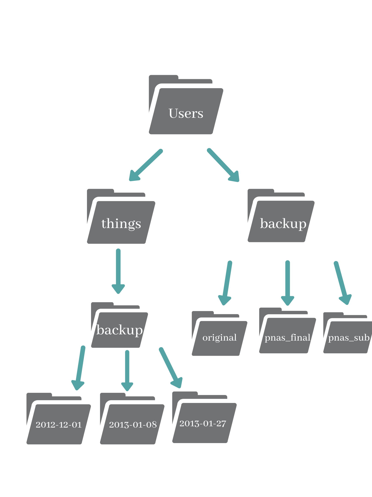

<!-- This is an html comment and this won't appear in the rendered page. You are now editing the "content" area, the core of your description. Everything that you can do in markdown is allowed below. We added a couple of comments to guide your through documenting your progress. -->

## Information

The estimated time to complete this training module is 4h.

The prerequisites to take this module are:
 * The [installation](/modules/installation) module.
   - Windows: Ubuntu application (Windows Linux Subsystem)
   - Mac/Linux: Terminal

Your environment should be ready to go, everything required was set up during the installation! 
In the video, you will be working with a dataset from [Software Carpentry](https://swcarpentry.github.io/shell-novice/index.html). 
Click on this link, and navigate to the section [Download files](https://swcarpentry.github.io/shell-novice/index.html#download-files). 
Download [shell-lesson-data.zip](https://swcarpentry.github.io/shell-novice/data/shell-lesson-data.zip), 
unzip it, and move the file to your Desktop.

Important: Note that if you are working with Windows Subsystem for Linux (WSL), paths will be a bit different than with Mac/Linux. You will want to use : `/mnt/c/Users/${USERNAME}/Desktop/`

If you have any questions regarding the module content please ask them in the relevant module channel on the school Discord server. 
If you do not have access to the server and would like to join, please send us an email at school [dot] brainhack [at] gmail [dot] com.

## Resources

This module was presented by [Ross Markello](https://rossmarkello.com/) during the QLSC612 course in 2021.

All the tutorial notes related to the video below are available [here](https://github.com/school-brainhack/course-materials-2020/blob/master/lectures/11-may/03-intro-to-shell/introduction-to-shell.ipynb). 

The video of the presentation is available below (duration 1h13). Follow along with the video of the presentation, typing the command line into your terminal.

<iframe width="560" height="315" src="https://www.youtube.com/embed/N6soV0dlB-k" title="YouTube video player" frameborder="0" allow="accelerometer; autoplay; clipboard-write; encrypted-media; gyroscope; picture-in-picture" allowfullscreen></iframe>

## Exercises

### Test your knowledge

Once you've completed the tutorial, try testing your understanding by answering the following questions. 

Short answers

 - *What are some of the main advantages of using the shell?*
 - *What are some of disadvantages?*
 - *Name a few command lines that enable to read/write/operate on files. What are they used for?*
 - *What is an option, also called flag or switch?*
 - *What are arguments in a command line*?
 - *Can you tell the difference between relative and absolute paths?*
 - *What is Nano?*
 - *You want to move a file to a folder and avoid overwriting another file with the same name. How can you make this move safely?*

True/False

 - *We are always located somewhere in the file system*
 - *It is possible to be located in more than one place at once*
 - *You can choose multiple options after a command* 
 - *Changing one directory at a time is the same as providing the full path to the final destination*
 - *Environmental variables are preceded by `$`*
 - *Good naming conventions of files include special characters*

## Exercise

Practice makes perfect. 

**Exercise 1**
Starting from `/Users/amanda/data`, which of the following commands could Amanda use to navigate to her home directory, which is `/Users/amanda`?

      a) cd .
      b) cd /
      c) cd /home/amanda
      d) cd ../..
      e) cd ~
      f) cd home
      g) cd ~/data/..
      h) cd
      i) cd ..

**Exercice 2**

This is how your filesystem is organised. 

**2.1.** 
Based on the previous diagram, if `pwd` displays `/Users/things`, what will `ls -F ../backup` display?

    a) ../backup: No such file or directory
    b) 2012-12-01 2013-01-08 2013-01-27
    c) 2012-12-01/ 2013-01-08/ 2013-01-27/
    d) original/ pnas_final/ pnas_sub/

**2.2.**
Using the filesystem diagram, if `pwd` displays `/Users/backup`, and `-r` tells `ls` to display things in reverse (alphabetical) order, what command(s) will result in the following output:

     pnas_sub/ pnas_final/ original/
     
     a) ls pwd
     b) ls -rF
     c) ls -rF /Users/backup

**Exercise 3**
After running the following commands, Jamie realizes that she put the files `sucrose.dat` and `maltose.dat` into the wrong folder. The files should have been placed in the raw folder.*
 
      $ ls -F
      analyzed/ raw/
 
      $ ls -F analyzed
      fructose.dat glucose.dat maltose.dat sucrose.dat

      $ cd analyzed

Fill in the blanks to move these files to the raw/ folder (i.e. the one she forgot to put them in):

      $ mv sucrose.dat maltose.dat ____/____

Hint: the .. refers to the parent directory (i.e., one above the current directory)

**Exercice 4**
What is the output of the closing `ls` command in the sequence shown below:

      $ pwd
      /Users/jamie/data
      $ ls
      proteins.dat
      $ mkdir recombine
      $ mv proteins.dat recombine
      $ cp recombine/proteins.dat ../proteins-saved.dat
      $ ls
      
      
      a) proteins-saved.dat recombine
      b) recombine
      c) proteins.dat recombine
      d) proteins-saved.dat

**Exercice 5 : Copy with Multiple Filenames**
In the example below, what does `cp` do when given several filenames and a directory name?

    $ mkdir backup
    $ cp amino-acids.txt animals.txt backup/

What does cp do when given three or more filenames?

    $ ls
    amino-acids.txt  animals.txt  backup/  elements/  morse.txt  pdb/  planets.txt  salmon.txt  sunspot.txt
    $ cp amino-acids.txt animals.txt morse.txt
  

**Exercise 6: List filenames matching a pattern**
When run in the proteins directory, which ls command(s) will produce this output?

    ethane.pdb methane.pdb

    a) ls *t*ane.pdb
    b) ls *t?ne.*
    c) ls *t??ne.pdb
    d) ls ethane.*
    
Hint: you can try these out using the dataset you downloaded earlier!

**Exercise 7 : Renaming files**
Suppose that you created a plain-text file in your current directory to contain a list of the statistical tests you will need to do to analyze your data, and named it: statstics.txt

After creating and saving this file you realize you misspelled the filename! You want to correct the mistake and remove the incorrectly named file. Which of the following commands could you use to do so?

     cp statstics.txt statistics.txt
     mv statstics.txt statistics.txt
     mv statstics.txt .
     cp statstics.txt .
     
     
 * Follow up with your local TA(s) to validate you completed the exercises correctly.
 * :tada: :tada: :tada: you completed this training module! :tada: :tada: :tada:

## More resources

If you are curious to solidify your capabilities for using the shell, you can check this tutorial "Effective use of bash" by Ankur Sinha organized for the [INCF/OCNS software working group](https://ocns.github.io/SoftwareWG/2021/06/09/software-wg-tutorials-at-cns-2021-online-bash-git-and-python.html).

You can also try out this tutorial which inspired much of the content you saw today, while exploring the shell in further detail. It covers pipes and filters, loops, shell scripts, finding things: [The Unix Shell](https://swcarpentry.github.io/shell-novice/01-intro/index.html).
