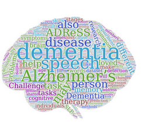
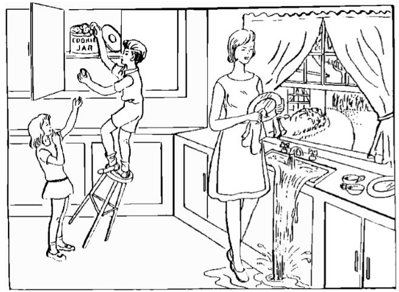
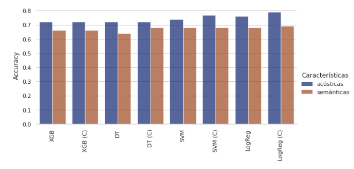

<!-- This is an html comment and this won't appear in the rendered page. You are now editing the "content" area, the core of your description. Everything that you can do in markdown is allowed below. We added a couple of comments to guide your through documenting your progress. -->

## Project definition

### Background

Inspired by the need for scalable and cost-effective diagnostic methods for Alzheimer's disease (AD), our project at BrainHack 2024 focuses on identifying acoustic and semantic markers in the speech of patients. Alzheimer's disease is characterized by a gradual decline in cognitive functions, and early detection is crucial for managing the disease. Speech analysis offers a non-invasive and reliable data source for this purpose.

### Objectives

1. **Extract acoustic and semantic markers from patient speech** to detect the presence of Alzheimer's.
2. **Estimate MMSE scores** based on voice characteristics and semantic indicators from conversations.
3. **Corroborate cognitive decline** using the most relevant linguistic features.

### Tools

The project utilizes several tools and technologies:
 * **Speech pre-processing**: Noise reduction, volume normalization.
 * **Feature extraction**: Acoustic features like pitch, formants, loudness, and MFCC; Semantic analysis using Sentence-BERT and KeyBERT.
 * **Machine learning models**: XGBoost, Random Forest, SVM, and Logistic Regression for classification and regression tasks.

### Data

The dataset used is the **Pitt Corpus from DementiaBank**, employed in the ADReSS Challenge at Interspeech 2021. It includes:
- 156 low-quality interview audios.
- Transcriptions in CHAT format.
- Metadata such as age, gender, condition, and MMSE scores.
- Audios are from interviews of patients describig the "Cookie Theft Picture"

### Deliverables

At the end of this project, we will have:
 - A detailed report on the methodology and findings.
 - Visualizations of data and results, including bar graphs, scatter plots, and network graphs.
 - Code and documentation for reproducibility, available on GitHub.

## Results

### Progress overview

Our project demonstrated that acoustic features are critical for classifying Alzheimer's, with Logistic Regression achieving 79% accuracy. The regression of MMSE scores was more challenging due to limited data, with the best model being SVM.

### Tools I learned during this project

 * **Speech processing techniques** for noise reduction and feature extraction.
 * **Machine learning models** for both classification and regression tasks.
 * **Semantic analysis** using advanced NLP models like Sentence-BERT and KeyBERT.

### Results

#### Classification

- **Best model**: Logistic Regression with 79% accuracy.
- **Key features**: Duration and number of pauses, MFCC, and spectral flux.

#### Regression

- **Best model**: SVM with R² of 0.32, MSE of 25.76, MAE of 3.82, and RMSE of 5.07.
- **Key features**: Proportion of adverbs and nouns, text similarity score.

## Conclusion and Acknowledgement

This study highlights the potential of speech analysis for early detection and cognitive assessment in Alzheimer's patients. The approach using acoustic and semantic features combined with machine learning models shows promising results. We acknowledge the contributions of our team and the support from BrainHack 2024.

