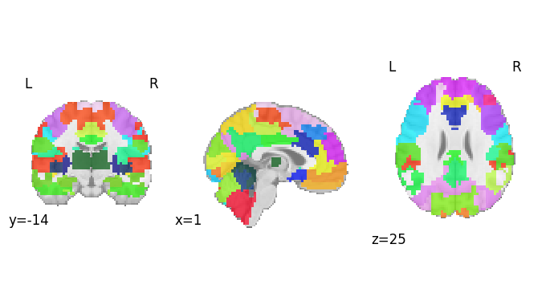
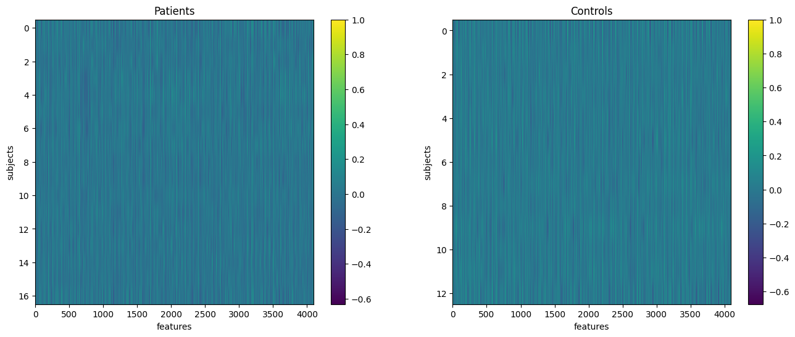
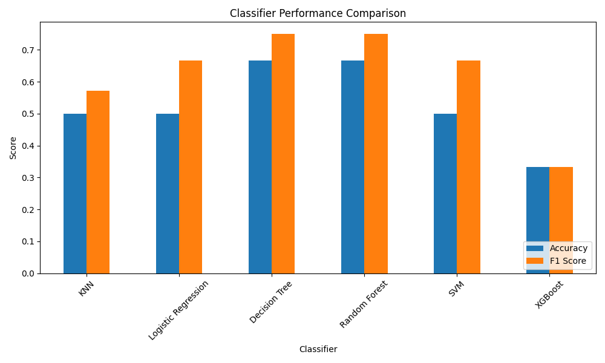
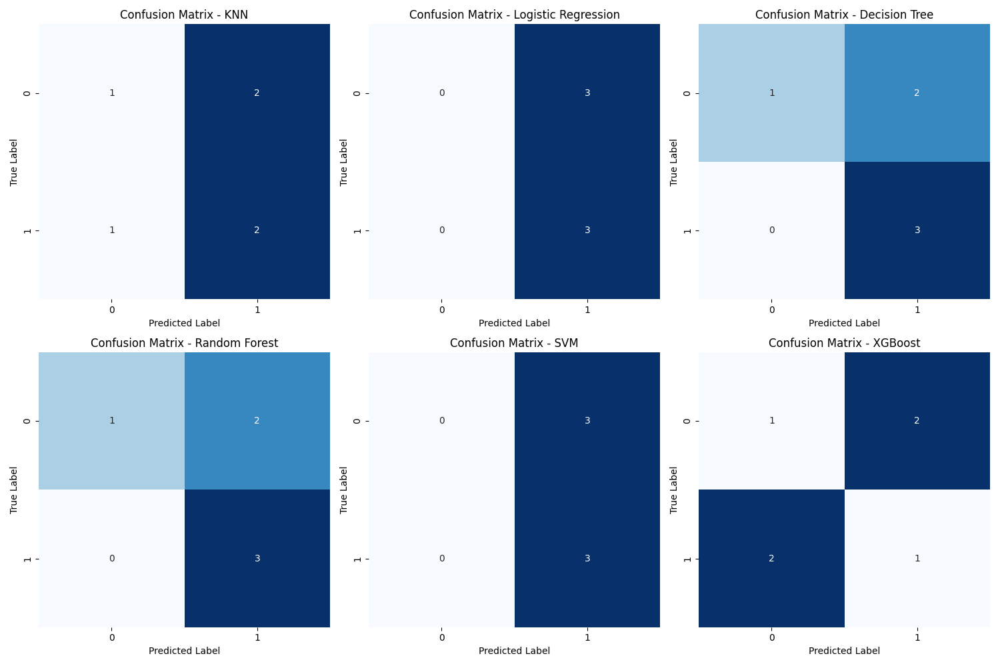

<!-- This is an html comment and this won't appear in the rendered page. You are now editing the "content" area, the core of your description. Everything that you can do in markdown is allowed below. We added a couple of comments to guide your through documenting your progress. -->

## Project definition

### Background

I am a MSc student at  the University of Montreal studying computer science. I completed my BSc in neuroscience at the University of Toronto and I am interested in the intersection between the two fields and hoping to learn more about the application of machine learning in neuroscience.    

This project's goal is to train classification machine learning models to make predictions of ADHD diagnosis from fMRI data in order to learn how to work with fMRI brain data and become more familiar with machine learning tools. 

### Tools

The project rely on the following technologies:
 * Git and Github for version control 
 * Python libraries such as ScikitLearn for machine learning, Nilearn for fMRI connectivity analysis and Pyplot, Ploty Express and Seaborn for data visualization
 * Jupyter Notebook 

### Data

The data used for this project is the Nitric ADHD resting-state dataset which is preprocessed and available through Nilearn. The preprocessed data contains data from 30 subjects (13 ADHD, 17 control).

Information about the dataset: https://nilearn.github.io/dev/modules/description/adhd.html

Information on how to access the data : https://nilearn.github.io/dev/modules/description/adhd.html

### Deliverables

 - Jupyter notebook containing the code and visualization plots for the exploration of the data as well as the fMRI connectivity analysis
 - Python script for the training, testing and evaluation of the machine models
  - Figures and results summarizing the performances of the models 
  - [Github repo](https://github.com/brainhack-school2024/andrianarison_project)
 
## Results

### Tools I learned during this project

 * **Machine learning with scikitlearn** 
 * **Github workflow** 
 * **Getting fMRI connectivity using nilearn** 
 * **Data visualization using pyplot, ploty express and seaborn** 

### Results

#### Getting connectivity data using nilearn

Brain connectivity measures were obtained using nilearn. The BASC multiscale atlas with 64 regions of interest (ROIs) was used for masking.

Information about the atlas can found at: https://nilearn.github.io/dev/modules/description/basc_multiscale_2015.html 

A plot of the atlas can be seen below:

A region x region correlation matrix was obtained for each subject. These matrices were used as features for the machine learning models (targets are adhd diagnosis). The feature matrices for adhd and controls subjects can be seen below: 

#### Classification models performances 

For each model, the accuracy score (# corrected prediction / total # predictions) and F score (2 * (precision * recall / precision + recall)) were calculated. The best models were the decision tree and the random forest with accuracy score of 0.67 and F1 score of 0.75.

A confusion matrix for each model was obtained and can be seen below. The matrices shows the counts of true positive, true negative, false positive, and false negative predictions for each model.

## Conclusion and acknowledgement

Because of the very small size of the data, the results of this project are not significant in term of making predictions using machine learning. To have more meaningful results a much bigger dataset would be needed so that the models can train with low risk of overfitting and underfitting. However, completing this project was still meaningful in terms of learning how to use to tools and working with neuroscience data for the first time. 

Thank you to all the instructors, teaching assistants and organizers for this learning opportunity. 
