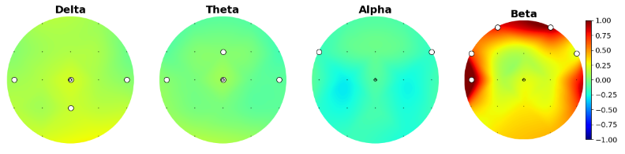
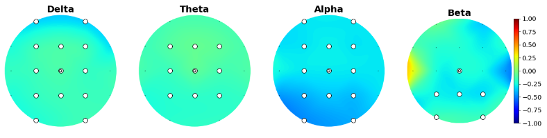
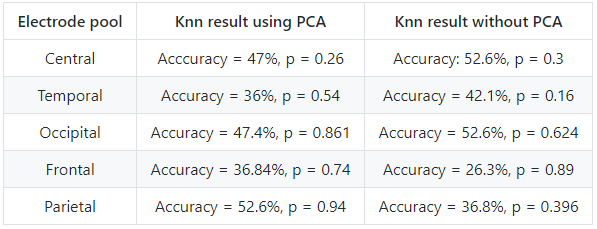
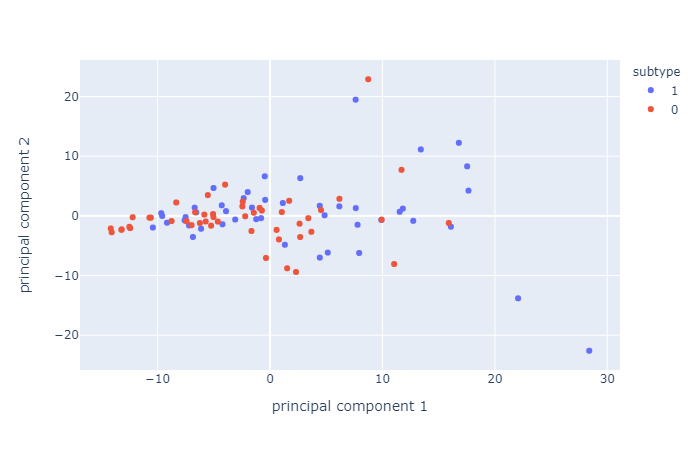
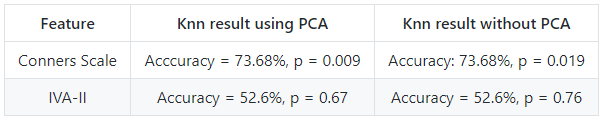
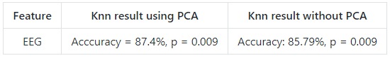
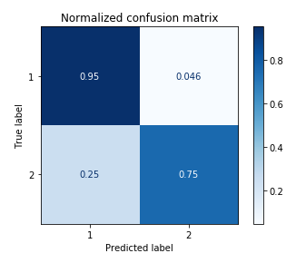

<!-- This is an html comment and this won't appear in the rendered page. You are now editing the "content" area, the core of your description. Everything that you can do in markdown is allowed below. We added a couple of comments to guide your through documenting your progress. -->

### Background

Attention deficit/hyperactivity disorder (ADHD) is one of the most common neurodevelopmental disorders among children and adolescents ([Volkow, 2016](https://www.ncbi.nlm.nih.gov/pmc/articles/PMC4827421/)). It manifests itself through a variety of cognitive and behavioral symptoms, such as (but not limited to) hyperactivity, lack attention, impulsivity, lack of inhibition and diminished working memory ([Wilens, 2010](https://www.ncbi.nlm.nih.gov/pmc/articles/PMC3724232/)). Long-term follow-up studies revealed that in 40 to 60% of children with ADHD, the disorder persists into adulthood ([American Psychiatric Association, 2012](https://psycnet.apa.org/fulltext/2011-28648-001.html); [Hechtman, L., 1999](https://onlinelibrary.wiley.com/doi/10.1002/(SICI)1098-2779(1999)5:3%3C243::AID-MRDD11%3E3.0.CO;2-D); [Klein, RG et al. 2012](https://pubmed.ncbi.nlm.nih.gov/23070149/)). Subtype classification of ADHD has not reach consensus within the literature and research on the correlates of ADHD subtypes show incoherent findings. The most common grouping of adhd subtypes (which is also the DSM categorization) are (1) inattentive, (2) impulsive/Hyperactive and (3) mixed. Those subtypes are for the majority based on criteria derived from behavioral and-self-report data and lack of neurophysiological assessment is prominent([Hegerl et al. 2016](https://pubmed.ncbi.nlm.nih.gov/27178310/); [Olbrich, Dinteren & Arns, 2015](https://pubmed.ncbi.nlm.nih.gov/26901357/)).

### Project definition

This project will aim to investigate the prediction potential of subtypes of ADHD between different types of measurements, those being behavioral measures, self-reporting measures and electrophysiological (EEG) data. More specifically, Principal components analysis (PCA) will be applied in order to achieve dimension reduction and k-nearest neighbor clustering will be used to predict the DSM ADHD subtypes according to each data type. An investigation of the predictive capacity of our 3 data types will be made, as well as observations about the potential prediction of gender using our dataset. For eeg data, an supplementary investigation will be conducted to compare prediction potential of ADHD subtypes according to electrode pools (paired according to brain regions) for brain oscillations of interest (measuring sepctral power). 

### Data

The sample consisted of 96 college students with an ADHD condition. Different types of measurements are included in this data sample. EEG data recording was performed using a 19-channel electrode cap (international 10-20 system) and consisted of eyes-opened at-rest recording of 5-minute duration. Time-frequency analyses were conducted for each electrode in order to extract amplitude means for each frequency band. Neuropsychological assessment measures included were Conners questionnaire (self-report) and IVA-II behavioral test.
For classification comparison, ADHD subtypes identified by the Conners questionnaire are used. Those subtypes are hyperactive, inattentive and mixed, as described by the DSM-IV. More information about EEG preprocessing can be found [here](https://github.com/brainhack-school2020/ADHDsubtypes_project/blob/master/eeg_preprocessing.md).

#### Methods

**Sample** :
 * Women (n = 57) 
 * Men (n = 39)
 * Adhd subtype : hyperactive (n = 2), inattentive (n = 48), mixed (n = 46)

#### Types of measures 

**Conners questionnaire** : standardized questionnaire. Comprizes 66 items about ADHD symptoms and behaviors. Answers are given using a Likert scale (0 = not at all/never and 3 = very often/very frequent). The items are compiled into 4 scales;

   * inattention/memory (IM)
   * hyperactivity/restlessness (HR)
   * impulsivity/emotional lability (IE)
   * problems with self concept (SC) (refers to self esteem).

  These four scores are used as the 4 self report symptoms measures. Test-retest correlation for 18-29 years old ranges from  0,8 to 0,92 depending on items.

**IVA-II** : Behavioral test. Participants are presented with visual and auditive stimuli (numbers). If the stimulus is 1, whether it is visual or auditive, subjects must click as quickly as possible. If the stimulus is 2, whether it is visual or auditive, subjects must refrain from clickling. Stimuli are presented in a randomized order and at random time. 2 main scales are extracted, comprising 2 subscales each. 1st main scale is Attention Quotient (AQ) and its subscales are AQ auditive and AQ visual. 2nd main scale is Response Control Quotient (RCQ) and its subscales are RCQ auditive and RCQ visual.

**Electroencephalography (EEG)** : 19 electrodes caps were used, positioned according to the 10-20 international system and referenced to both ear lobes. Recordings lasted 5 minutes, were participants were instructed to be as still as possible and to keep their eyes opened. The Mitsar System 201 and WinEEG (Mitast) software were used for recording. Test-retest and split-half correlations were higher than 0,9.

### Deliverables predicted

At the end of this project, we will have:

 - A Jupyter notebook markdown describing thoroughly all the steps of our project 
 - Python script of main analyses 
 - Complete published repository access to all commits and changes of our projects
 - An interactive platform to present the different data and analysis

### Progress overview

* As of may 26 2020; the data has been preprocessed and organized into pandas dataframes. 
* As of may 29 2020; the jupyter notebook for data visualization is well advanced; and we are working on our SNF.
* As of june 1st; we decided to let go of our SNF analysis and concentrate our efforts on clustering, PCA and visualization,    as it seems far more appropriate to our data.
* As of june 8th; we have completed our data analysis and data visualization, what is left to do before final submission is some reorganisation of our repository and simplification of our code.

## Results

We were interested in sex differences and ADHD subtype differences, so we started by plotting their scalp distribution. White electrodes indicate the significant differences (computed via Mann-Whitney non parametric test and corrected with Bonferroni).

Here is the scalp plot showing sex differences. 

And here are the scalp plots showing subtype differences.

PCA analysis and KNN classification yielded interesting results. First, we compared the performance of a k-nearest neighbors classification using PCA as features versus using the data without dimension reduction. Here are the results:
First, we tried to predict ADHD subtype (inattentive vs combined) using eeg data, separating pools of electrodes. None of the classifications were statistically higher than chance level (50%).

These results might not be surprising, considering PCA resulted in very similar principal components which are hard to distinguish, for all electrode pools. Here's an example of 2D visualization of PCA, on the frontal electrode pool.

Second, we tried to predict ADHD subtype again, this time using Conners scale (cognitive data) and IVA-II (behavioral data) separately, with and without PCA. Conners scale could predict ADHD subtype with a precision of 73,68%, with or without PCA. IVA-II classificaiton was not significally higher than chance level (50%).

Finally, we also tried predicting sex according to Eeg distribution. This classification yielded the best results, with and without PCA.

Here's an example of a confusion matrix output, in this case for the classification of sex (using PCA):

### Tools used during this project

 * Git and GitHub
 * Bash shell
 * Dimension reduction via PCA
 * Machine learning ( KNN classification)
 * Jupyter Notebook/Jupyter Slides
 * Python packages : pandas, SNFpy, scikit-learn, numpy, scipy, etc.
 * Visualization packages (via python): seaborn, plotly, matplotlib, hytools, etc. 

### Deliverables

#### Week 3 deliverable: data visualization 

This [deliverable](https://github.com/brainhack-school2020/SNF_ADHDsubtypes_project/blob/master/Interactive_plots_deliverable.ipynb) was done entirely as a team. Penelope developed the visualization for Conners (cognitive data) and IVA-II (behavioral data) (interactive plots of distribution for each data type), and Beatrice developed the script for eeg data visualization (interactive plot with facets of spectral power distribution as well as an example of 2D visualization of PCA). Scalp plots were created jointly.

Please make sure to see the [requirements_week3deliverable.txt](https://github.com/brainhack-school2020/SNF_ADHDsubtypes_project/blob/master/requirements_week3deliverable.txt), to pull [Data](https://github.com/brainhack-school2020/SNF_ADHDsubtypes_project/tree/master/Data) file (with all the necessary files) and follow instruction in the notebook (linked). The excel_files folder has to be moved from the Data folder to the same directory as the notebook, in order for the path to stay the same. 

### Final deliverables

* [main_analyses.ipynb](https://github.com/brainhack-school2020/ADHDsubtypes_project/blob/master/main_analyses.ipynb): jupyter notebook of all data wrangling, some interactive data visualization, and complete PCAs, KNN analyses (with comparisons of KNN without PCAs) on all 3 types of data
* [Viz.ipynb](https://github.com/brainhack-school2020/ADHDsubtypes_project/blob/master/Viz.ipynb) : jupyter notebook of all the visualisation and descriptive stats made for all 3 datasets  
* [Scalp_Plots.ipynb](https://github.com/brainhack-school2020/ADHDsubtypes_project/blob/master/Scalp_Plots.ipynb) : jupyter notebook for scalp plots visualization and stastitical analysis (section with topography maps with significance masks for electrode comparisons). 
* [preprocessing.py](https://github.com/brainhack-school2020/ADHDsubtypes_project/blob/master/preprocessing.py) : File with all functions needed to run all the notebooks created
* [requirement.txt](https://github.com/brainhack-school2020/ADHDsubtypes_project/blob/master/requirement.txt) : libraries required for this project

### Conclusion and acknowledgement

We would like to thank greatly the entire Brainhack school team for the initiative and amazing learning experience ! Another big thanks to the intructors for their patience and wise suggestions!

### References

1. [Galarnyk, M. (2017, December 4th). PCA using Python (scikit-learn). Retrieved from https://towardsdatascience.com/pca-using-python-scikit-learn-e653f8989e60](https://towardsdatascience.com/pca-using-python-scikit-learn-e653f8989e60)
2. [Harel, Y. (2020, May 25). hytools. Retrieved from  https://github.com/hyruuk/hytools/tree/master/hytools](https://github.com/hyruuk/hytools/tree/master/hytools)
3. [Hasler, R., Perroud, N., Meziane, H. B., et al. (2016). Attention-related EEG markers in adult ADHD. Neuropsychologia.87:120‐133. doi:10.1016/j.neuropsychologia.2016.05.008](https://pubmed.ncbi.nlm.nih.gov/27178310/)
4. [Ingram, S., Hechtman, L. & Morgenstern, G. (1999). Outcome issues in ADHD: Adolescent an dadult long-term outcome. Developmental Disabilities Research Reviews.5(3), 243-250. https://doi.org/10.1002/(SICI)1098-2779(1999)5:3<243::AID-MRDD11>3.0.CO;2-D](https://onlinelibrary.wiley.com/doi/abs/10.1002/%28SICI%291098-2779%281999%295%3A3%3C243%3A%3AAID-MRDD11%3E3.0.CO%3B2-D)4. 
5. [La Malfa, G., Lassi, S., Bertelli, M., Pallanti, S., Albertini, G. (2008) Detecting attention-deficit/hyperactivity disorder (ADHD) in adults with intellectual disability The use of Conners' Adult ADHD Rating Scales (CAARS). Res Dev Disabil.29(2):158‐164. doi:10.1016/j.ridd.2007.02.002](https://www.sciencedirect.com/science/article/pii/S0891422207000200?via%3Dihub)
6. [Navlani, A. (2018, August 2nd). KNN Classification using Scikit-learn. Retrieved from https://www.datacamp.com/community/tutorials/k-nearest-neighbor-classification-scikit-learn](https://www.datacamp.com/community/tutorials/k-nearest-neighbor-classification-scikit-learn)
7. [Olbrich, S., van Dinteren, R., Arns, M. (2015). Personalized Medicine: Review and Perspectives of Promising Baseline EEG Biomarkers in Major Depressive Disorder and Attention Deficit Hyperactivity Disorder. Neuropsychobiology.72(3-4):229‐240. doi:10.1159/000437435](https://pubmed.ncbi.nlm.nih.gov/26901357/)
8. [Sandford, J. A., & Turner, A. (2000). Integrated visual and auditory continuous performance test manual. Richmond, VA: Brain Train.](https://www.braintrain.com/iva2/) 
9. [Sharma, A. (2020, January 1st). Principal Component Analysis in Python. Retrieved from https://www.datacamp.com/community/tutorials/principal-component-analysis-in-python](https://www.datacamp.com/community/tutorials/principal-component-analysis-in-python)
10. [Sibley, M. H., Pelham, W. E., Jr., Molina, B. S. G., Gnagy, E. M., Waschbusch, D. A., Garefino, A. C., . . . Karch, K. M. (2012). Diagnosing ADHD in adolescence. Journal of Consulting and Clinical Psychology, 80(1), 139-150. http://dx.doi.org/10.1037/a0026577](https://psycnet.apa.org/fulltext/2011-28648-001.html)
11. [Wilens, T. E., & Spencer, T. J. (2010). Understanding attention-deficit/hyperactivity disorder from childhood to adulthood. Postgraduate medicine, 122(5), 97–109. https://doi.org/10.3810/pgm.2010.09.2206](https://www.ncbi.nlm.nih.gov/pmc/articles/PMC3724232/)
12. [Volkow, N. D., & Swanson, J. M. (2013). Clinical practice: Adult attention deficit-hyperactivity disorder. The New England journal of medicine, 369(20), 1935–1944. https://doi.org/10.1056/NEJMcp1212625](https://www.ncbi.nlm.nih.gov/pmc/articles/PMC4827421/)

