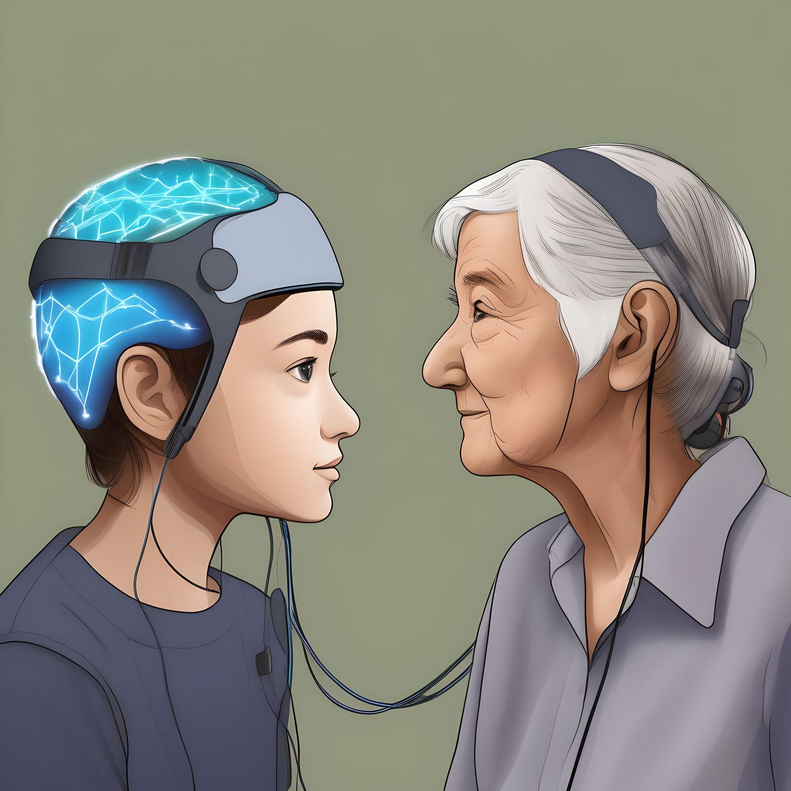

<!-- This is an html comment and this won't appear in the rendered page. You are now editing the "content" area, the core of your description. Everything that you can do in markdown is allowed below. We added a couple of comments to guide your through documenting your progress. -->

## Project definition

### Background

Attention deficit hyperactivity disorder (ADHD) is one of the most common neurodevelopmental and psychiatric disorders. ADHD is characterized by significant neurophysiological differences that can be observed in electroencephalography (EEG) recordings. 
EEG is a neuroimaging technique used to extract features and patterns, such as power spectral bands, where there are five bands that represent different functional characteristics (delta, theta, alpha, beta, gamma). For example, the theta band is associated with deep sleep and the beta band is associated with awake states and concentration. The theta-beta ratio is a well-known pattern in ADHD along with the alpha peak frequency associated with focus.
A promising development in EEG research is the use of artificial intelligence (AI) and machine learning (ML) as an advanced signal processing tool. There are also age-related changes in quantitative EEG in ADHD. However, there is a lack of personalized treatment recommendations based on EEG patterns and age for individuals with ADHD

<iframe width="560" height="315" src="https://www.youtube.com/embed/PTYs_JFKsHI" frameborder="0" allow="accelerometer; autoplay; encrypted-media; gyroscope; picture-in-picture" allowfullscreen></iframe>

### Tools

The "project template" project will rely on the following technologies:
 * Python programming for signal processing and statistics: numpy, scipy, FOOOF
 * R for implementing regression and Random Forest algorithms and visualization: caret, randomForest, ggplot2
 * Jupyter notebooks + local laptops for teamwork collaboration, handling data and metadata
 * Github for project management, collaboration and pull requests.
   
### Data

The data used in this project can be downloaded from https://brainclinics.com/resources/tdbrain-dataset/introduction/downloads upon creation of a BrainClinics account. The TDBrain database is an extensive clinical EEG dataset (n=1274) with 19 electrodes collected over two decades from participants ranging age 5 to 89 years old. The database is publicly available and was originally published by Van Dijk 2022 in Scientific Data. The dataset has since been reanalyzed in several publications. At this link, metadata, raw EEG data, and preprocessing pipeline for artifact identification was provided. The raw EEG data was recording from resting state periods (2 minutes of eyes closed followed by 2 minutes of eyes open). The ADHD cohort (n=274) included a sub-cohort with treatment responses of neurofeeback treatment.

### Deliverables

At the end of this project, we have:
 - Workflows in Python
 - Workflow in R
 - Individual reports
   
## Results

### Progress overview

The project was created by Ingrid Campbell and Amanda/TianYi Liu during Brainhack school 2025. This is the first version.

### Tools I learned during this project

 * **Clinical EEG preprocessing and signal processing** Using signal processing techniques such as artifact detection and removal, epoching, power band feature extraction (of 2019 features from electrodes Fp1, Fp2, F3, F4, Fz, Cz, C3, C4), along with FOOOF, and data cleaning to handle missing data.
 * **Meta data extrapolation** The meta data included demographics (age, gender, education), NEO-FFI personality data, behavioural measures, and treatment responses to ADHD and neurofeedback.
 * **Feature selection** Using bootstrap validation to find the optimal number of features and top features to discriminate between age in participants with ADHD. Using random forest classifier
 * **Age-dependent analysis** age group stratification then pattern visualization. Examining age and EEG correlations as well as random forest classification model performance.
 * **Github collaboration** 

### Results

#### Deliverable 1: Develop age-dependent models to predict treatment responses across different age groups

To assess the age-specificity of EEG-based treatment response, we analyzed how age correlates with key EEG biomarkers and compared the relationships between ADHD treatment responders and non-responders. We found that older individuals (age range 36-55) with ADHD are significantly more likely to respond to neurofeedback treatment, responders (n=50) and non-responders (n=1). Youngest individuals (age range 6-17) had 14 responders and 40 non-responders. Middle aged individuals (age range 17-36) had 4 responders and 48 non-responders.

#### Deliverable 2: Determine whether responders show distinct EEG signatures at different developmental stages

By processing EEG data and machine learning models to identify the EEG signature of neurofeedback response across age development, we found that central delta relative power, central-paretal center frequency, and age were among the top EEG features that showed distinct EEG signatures between developmental stages. The random forest model using bootstrapping validation had a strong predictive accuracy performance with AUC of 0.865 of discriminating between responders and non-responders. Interestingly, the random forest classifier identified age was one of the top-most important features, along with delta frequency band at the frontal lobe electrodes, where patients with ADHD typically generate an abundance of low-frequency delta or theta brain waves.

#### Deliverable 3: project gallery

There is a project gallery, apart of the BHS 2025 github and website. You can still check out the repository [2025 BHS github age_eeg_pattern](https://github.com/brainhack-school2025/age_eeg_pattern)

The repository of this project can be found [here](https://github.com/mtl-brainhack-school-2019/ecg_pupillometry_pipeline_kaufmann). The objective was to create a processing pipeline for EEG data. The motivation behind this task was to learn how to process EEG signals, develop AI tools to analyze and apply to a neurodevelopmental disorder. The repo features:
 * analysis_code: for preprocessing data loading, data cleaning and EEG feature extraction, merging the meta data demographics with the EEG features, a preprocessing notebook for statistical analysis and creating age-grouped dataframes and running analyses, including the pipeline for running the random forest model, bootstrap validation and age-stratified analyses.
 * Notebooks for all analyses.
 * Detailed requirements files, making it easy for others to replicate the environment of the notebook.
 * An overview of the results in the markdown document along with a report by Ingrid Campbell at https://github.com/school-brainhack/Age_ADHD_Project

## Conclusion and Acknowledgement

As the brain matures, brain frequencies measured by EEG are found to decrease, which is supported by literature[2](https://www.sciencedirect.com/science/article/abs/pii/S0167876008007459). Our results align with this as age was a topmost optimal feature: theta and delta bands are represented in the most important features that are age correlated.
The dataset and preprocessing code can be found at the [Brainclinics Foundation](https://brainclinics.com/resources/tdbrain-dataset/introduction/downloads). The training modules for this project were provided by the [Brainhack School](https://school-brainhack.github.io/modules/).
