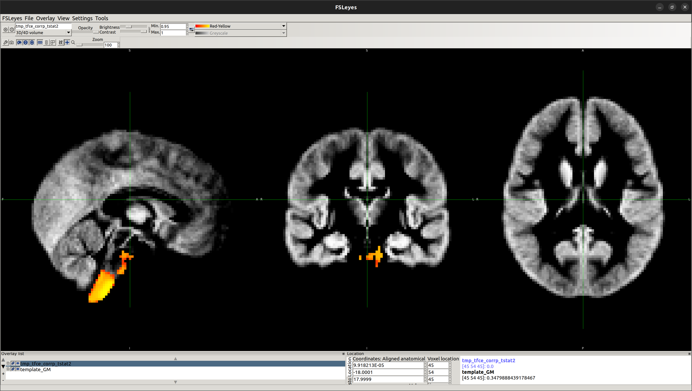
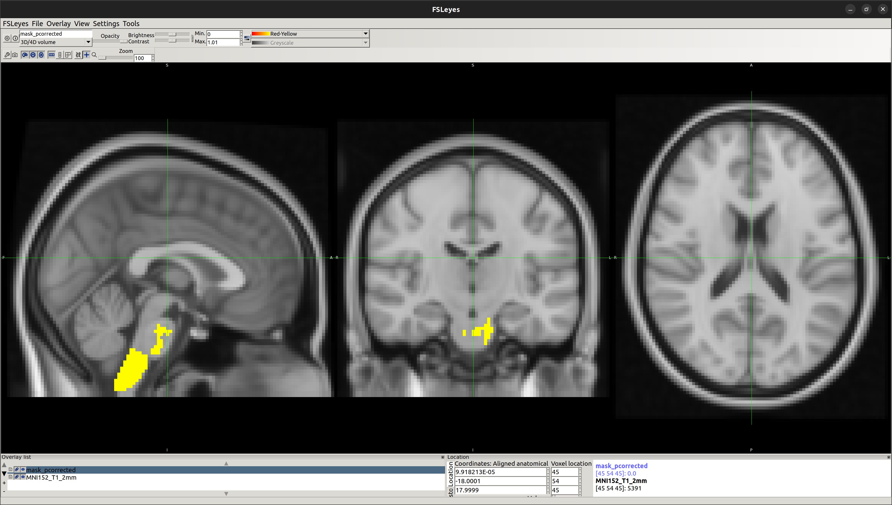
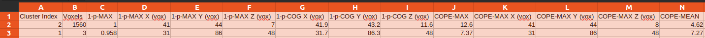
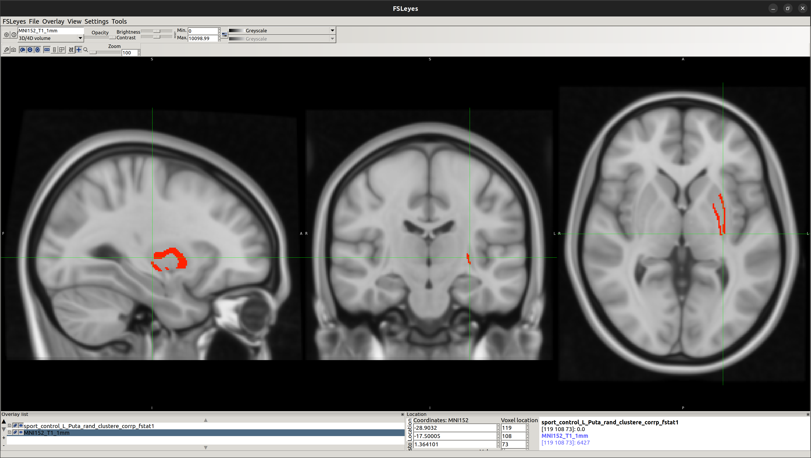
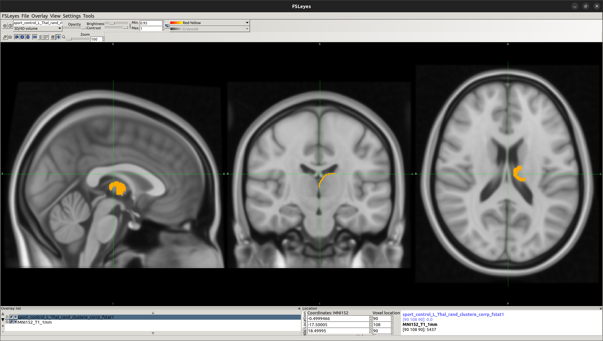

<!-- This is an html comment and this won't appear in the rendered page. You are now editing the "content" area, the core of your description. Everything that you can do in markdown is allowed below. We added a couple of comments to guide your through documenting your progress. -->

## Project definition

### Background

The relationship between athletic performance and brain structure and function has been a topic of interest in the field of neuroscience. Understanding the neural correlates of athletic performance can provide valuable insights into the development of training programs and interventions to enhance physical and cognitive abilities. In this project, I propose to use functional magnetic resonance imaging (fMRI), diffusion MRI (dMRI), and FSL's Voxel-Based Morphometry (FSLVBM) to investigate the differences in grey matter volume and white matter connectivity between elite athletes and non-athletes. I will perform the analysis using Python-based tools, such as Nilearn and Dipy.  

### Tools

This project relied on numerous tools such as:
1. Git and Github for Version Control
2. FSLVBM to preprocess and analyse grey matter volume differences
3. FSL FIRST tool for automatic segmentation of a number of subcortical structures.
4. Python-based tools, such as Dipy and Nilearn, to preprocess the data, perform tractography analysis, and investigate white matter connectivity differences
5. Google Colab and Jupyter Notebook

### Data

I've used a publicly available dataset on college-level athletes for this project. From the dataset, I have chosen data of nine Indiana University (IU) football players (American football) and nine controls (non-athletes) and wish to carry out an AmFB>NonAth comparison as well as NonAth>AmFB comparison.

Please check the Participants' Info Used in this Project here:
Results/Participants_INFO.csv

Information about Dataset:
https://www.nature.com/articles/s41597-021-00823-z

Link to download the dataset:
https://brainlife.io/pub/5f2c3765beafe924c962dd8d

### Deliverables

At the end of this project, these files will be made available:
- Reproducible project workflow, detailed in the GitHub repository with codes
- Jupyter notebooks of the analysis codes and visualisations
- Figures of the results

## Results

### Progress overview

**Data Preprocessing**
> MRI data have been preprocessed using FSL tools.

**Voxel-Based Morphometry (VBM) Analysis**
> Grey matter volume differences between athletes and non-athletes have been investigated using FSLVBM [FMRIB's Software Library - Voxel-Based Morphometry]

OUTPUT

NonAth>AmFB

Showing the local differences in grey matter volume between the two groups:

To obtain statistical data, identify the region of significant difference and validate that:

[1] E2 - Running randomise and displaying cluster-based thresholding results
> Reference: https://fsl.fmrib.ox.ac.uk/fsl/fslwiki/FSLVBM/UserGuide

OUTPUT

[2] Reporting Cluster Information
> Reference: https://fsl.fmrib.ox.ac.uk/fsl/fslwiki/Cluster#reporting

OUTPUT

**Vertex Analysis**
> Automated segmentation of subcortical structures in the brain has been completed using FSL FIRST [a model-based segmentation/registration tool] tool.

OUTPUT

Using this vertex analysis, marked differences in shape have been found in the two following areas: 

[1] Left-Putamen

[2] Left-Thalamus

### Future Work
**dMRI Analysis in Python**
> White matter connectivity will be explored using tractography methods implemented in Python-based tools such as Dipy and Nilearn.

### Tools I learned during this project

During the BrainHack School Project, I learned the following tools:

* **Python:** I learned how to use Python to analyse and manipulate data.
* **FSLVBM:** I learned how to operate FSLVBM to analyse grey matter volume differences between groups.
* **Nilearn:** I learned how to utilise Nilearn to perform functional MRI analysis and visualise data.
* **Dipy:** I learned how to use Dipy to perform diffusion MRI analysis and tractography.
* **Git and Github:** I learned how to use Git and Github for version control and collaboration.
* **Bash Terminal:** I learned how to employ the Bash Terminal to navigate and manipulate files and directories.
* **FSL FIRST tool:** I learned how to utilise the FSL FIRST tool for subcortical segmentation.
* **Google Colab and Jupyter Notebook:** I learned how to use Google Colab and Jupyter Notebook for interactive coding and data analysis.

## Conclusion and acknowledgement
Regarding the project, there are some promising results I've got. The short time at BrainHack School is overwhelming and challenging. But I am pleased with the new skills and knowledge I have gained throughout the program. I'll continue working on this project and try to investigate more athletes from different types of sports. 

I sincerely thank my advisor Professor Neil Muggleton and all the instructors and TAs (special shout-out to the Taiwan Hub) who have generously shared their expertise and provided guidance and support throughout the program. Thank you so much for this amazing opportunity.

## References
### Tools / Tutorials 
**FSLVBM**

1. https://fsl.fmrib.ox.ac.uk/fsl/fslwiki/FSLVBM
2. https://fsl.fmrib.ox.ac.uk/fsl/fslwiki/FSLVBM/UserGuide
3. https://www.youtube.com/watch?v=L1B3Wm-wnyQ&ab_channel=FSLCourse

**dMRI Analysis in Python**

1. https://school-brainhack.github.io/modules/dmri_intro/
2. https://davi1990.github.io/talks/2021-11-05-dMRI_analysis_in_Python
3. https://carpentries-incubator.github.io/SDC-BIDS-dMRI/aio/index.html

**Relevant Research Papers**

1. https://www.frontiersin.org/articles/10.3389/fnhum.2014.00594/full
2. https://www.sciencedirect.com/science/article/pii/S0960982214009798
