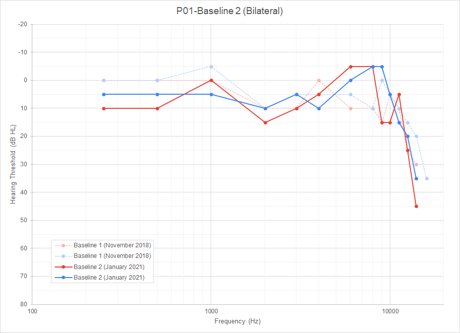
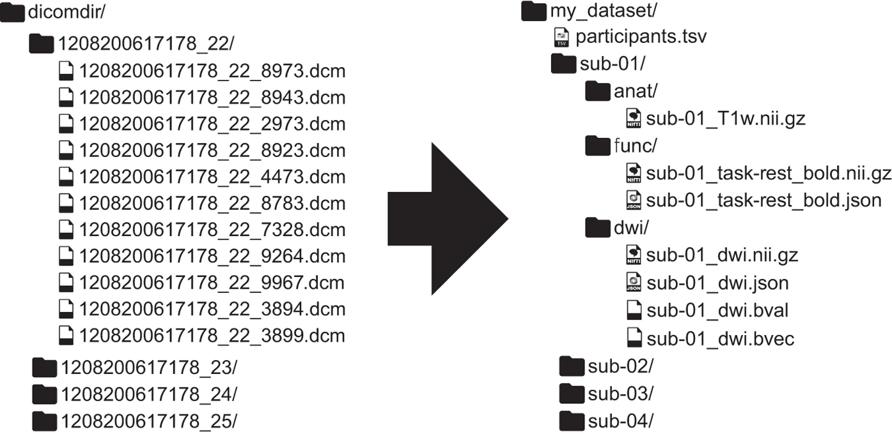
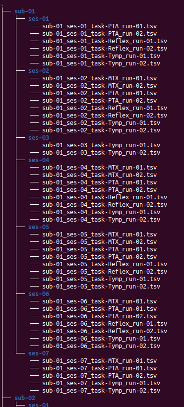

<!-- This is an html comment and this won't appear in the rendered page. You are now editing the "content" area, the core of your description. Everything that you can do in markdown is allowed below. We added a couple of comments to guide your through documenting your progress. -->

## Project definition

### Background

The Projet Courtois NeuroMod is a longitudinal fMRI data acquisition project where participants get scanned almost every week.
One risk associated with intensive protocols like this one is the chronic exposure of the participants to high noise levels during the scan sessions.
This is why it is important to regularly monitor their auditory health to ensure that the research protocol is not causing any damage to the participants' hearing.
Part of the auditory perception team's job is to do this monitoring task.
To do so, the participants go through different clinical tests every month to keep track of the evolution of their auditory health.
For some of these tests, such as the pure-tone audiometry test, the data is more easily interpreted when rendered into graphic displays.
But with these repeated tests comes important amount of data to process.
A first task that could be interesting to do would be, in order to go through the data processing more efficiently, to build an automated pipeline to generate the graphs.

### Exemple of audiogram

### Exemple of Matrix test results graph

.png)

A second task that could be interesting to do would be to try and use this database to try and fingerprint the participants based on their results to the tests.
Since every person's hearing is unique and is affected by the individual auditory experience, it could be interesting to try that kind of machine learning classification task.

The third task that could be interesting to do is regarding the dataset formatting.
Since the dataset is not currently BIDS compatible, it could be interesting to create a jupyter notebook to automatically create a BIDS format database from the data.

### Exemple of a BIDS compatible file structure reformatting

figure reference:

Gorgolewski, K. J., Auer, T., Calhoun, V. D., Craddock, R. C., Das, S., Duff, E. P., Flandin, G., Ghosh, S. S., Glatard, T., Halchenko, Y. O., Handwerker, D. A., Hanke, M., Keator, D., Li, X., Michael, Z., Maumet, C., Nichols, B. N., Nichols, T. E., Pellman, J., … Poldrack, R. A. (2016). The brain imaging data structure, a format for organizing and describing outputs of neuroimaging experiments. *Scientific data*, *3*, 160044. https://doi.org/10.1038/sdata.2016.44

### Tools

The plan is to use the following tools from the BrainHack School's tutorials in this project:

- Python scripts to execute the graph generation and machine learning tasks
- The Bash terminal environment to work on the python scripts and run them
- Git and GitHub for the collaborative work and the version control of the project
- Plotting libraries such as Matplotlib, Seaborn or Plotly
- Machine learning libraries for the fingerprinting task
- Jupyter Notebook to build and execute the BIDS formatting script
- The BIDS validator to make sure that the formatting worked
- Markdown to build this project report

### Data

The dataset used for this project was acquired through multiple sessions with each participant between November 2018 and August 2021.
Multiple clinical tests were performed including:
- Otoscopic inspection of the external auditory canal and tympanic membrane
- Tympanometry
- Stapedial reflex test
- Pure-tone audiometry
    - Regular clinical frequencies range (from 250 Hz to 8 kHz)
    - Ultra-high frequencies extended range (from 9 kHz to 20 kHz)
- Matrix speech-in-noise perception test
    - In the primary language of the participant: French or English (for all participants)
    - In the second language of the participant: French or English (for 5 out of the 6 participants)
- Otoacoustic emissions
    - Transitory evoked otoacoustic emissions (TEOAE)
    - Distortion product otoacoustic emissions (DPOAE) with a L1/L2 ratio of 65/55 dB SPL
    - Growth function (DP Growth) with 2 kHz, 4 kHz and 6 kHz

Baselines were acquired for each of these tests.
Three different combinations of those tests were then designed as experimental conditions and randomly assigned to each of the participant in a way that they will all do each of those conditions four times over the course of a twelve months protocol.
The specific dataset used for this project includes results from the tympanometry, the stapedial reflex test, the pure-tone audiometry and the Matrix speech-in-noise perception test.

### Deliverables

By the end of The BrainHack School, we aimed to have the following:

- A README.md file to present the project
- A [GitHub repository](https://github.com/PSY6983-2021/fortier_project) documenting the project
- Python scripts to create graphs and execute machine learning tasks
- Jupyter notebooks with code and explanations for the BIDS formatting task
- A [slideshow](https://docs.google.com/presentation/d/1TveZjzR9TDlGQA-XrLYjqPEb2E-x2vvl0kyfu43ljaQ/edit?usp=sharing) presentation showing the project objectives

## Results

### Lili El Khalil's progress review

A script that helped in building a BIDS format for organizing our data. As I divided my data into subject, which are the participants. 
Then for each subject the number of sessions they participated and in each session we have the four tests done. The four tests are : Tymp, Reflex, PTA and MTX. 
At the lower level, in each test folders, you can find the results obtained for each run of the test. 

#### Tools and skills that were developped during this project

Many of these contribute in my part of the project:

- <b>Jupyter Notebook</b>: an environment used to write the code
- <b>Windows Subsystem for Linux/Bash</b>: Edit text files such as this README.md
- <b>Python Libraries</b>: os, numpy and pandas
- <b>Git</b>: Track file changes
- <b>GitHub</b>: Organize team project

#### Deliverables

<b>Jupyter Notebook</b>

The notebook contains the code used in order to be able to create BIDS compatible files from our data.

<b>README.md</b>

This README.md file contains all the project details done by each one of us 

### Mr. Fortier's progress overview

A first iteration of functional python scripts to generation single test graphs and test overview graphs for each of the Projet Courtois NeuroMod participants is now available in the code folder of this repository.
These scripts were also linted using flake8 and passed all the generic requirements of this linter.
Unfortunately, it was not possible to create a machine learning task script on top of the graph generation scripts due to time constraint and restrictions linked to the collaborative nature of this project.

#### Tools/skills that were developped during this project (and challenges encountered...)

- **Python scripts**: It was a first attempt to code in python using scripts instead of the Jupyter Notebook controlled environment.
- **Python scripts**: It was also a first attempt at using multiple scripts for a single task and importing functions across them.
- **Git and Github**: This project is the first attempt at building a complete project from the start, using Git's functions and a Github repository.
- **Plot.ly's `graph_objects` tools**: This project was a first on many front regarding Plot.ly.
    - It was a first attempt at doing interactive figures/graphs.
    - It was a first contact with Plot.ly's library.
    - It was a challenge to be able to build graphs that fully represent the particularities of the two different types of figure produced in this project: `plotly.express` might have been easier to use than `plotly.graph_objects`, but it was not as capable to fully build the vision planned for this project.
    - It was an important challenge to navigate in the impressive documentation of the `plotly.graph_objects` library. It is a powerful, extensively customizable tool, but it is also very complex.
- **flake8 linter**: It was the first use of a linter to proof read the scripts' code format.
- **Binder**: It has been a difficult journey to try to figure out a way to make available here examples of the interactive figures generated by this project. Unfortunately, Github doesn't allow for html figures to be embeded into markdown files to be displayed. Binder was a way to go around it.
- **Jupyter Notebook**: In order to display the interactive figures through the use of Binder, two notebooks were created and adapted from the original graph_generator.py code.

#### Deliverables

- First, this README.md file describes multiple aspects of the project.
- Second, the Github repository where this README.md file sits allows people to consult the evolution of the project.
    - Two python scripts generating the graphs needed for this project are available in the `code/` folder.
    - Two Binder based Jupyter Notebooks allow people to consult an interactive sample graph for each of the types of graph generated by the scripts.
      The links to access them are in this README.md file.
    - A requirements.txt file allows the Binder platform to properly run the graph generating Jupyter Notebooks.

### Exemple of interactive HTML audiogram

{:target="_blank"}

### Exemple of Matrix test interactive HTML graph

{:target="_blank"}

## Conclusion

In conclusion, most of the goals of this project were reached: only the machine learning task was left behind.
This project includes:
- a README.md file presenting the project
- a LICENSE file
- a requirements.txt file to be used by a Binder platform to run Jupyter Notebooks
- two python scripts to generate interactive graph figures
- two Jupyter Notebooks to be loaded using a Binder platform
- one Jupyter Notebook to create and format a BIDS compatible dataset from the original dataset's spreadsheet format
- images and html sample figures to be displayed by the README.md file

We would like to thank the BrainHack School 2021 team of mentors for their availability and their help on this journey.
