<!-- This is an html comment and this won't appear in the rendered page. You are now editing the "content" area, the core of your description. Everything that you can do in markdown is allowed below. We added a couple of comments to guide your through documenting your progress. -->

## About me

<a href="https://github.com/behrouzvia">
   
    <b>Behrouz Vejdani Afkham</b>
</a>

I am currently a first-year PhD student at Polytechnique Montreal, specializing in biomedical engineering. My previous academic background includes a major in Medical Imaging from Tehran University of Medical Sciences, which has provided me with a solid foundation in neuroimaging tools and methods. However, as part of my PhD program, I am now required to familiarize myself with cutting-edge data science packages specifically designed for neuroimaging data analysis. These packages aim to streamline the entire process and help me achieve my research goals more efficiently.

## Project Overview
The objective of my project is to develop a comprehensive tutorial on the principles of B0 field mapping in MRI. Additionally, I aim to explain the existing approaches for calculating B0 field maps in an interactive manner. Furthermore, I will investigate the significance of B0 field maps in MRI by comparing the connectivity matrix of rs-fMRI (resting-state functional MRI) from a single subject with and without utilizing the B0 field map during the processing pipeline.

## Introduction
In magnetic resonance imaging (MRI), achieving a homogeneous distribution of the main magnetic field (referred to as B0) is crucial for obtaining high-quality images without significant geometric distortions or undesirable signal dropout [1]. B0 field inhomogeneity can arise from various factors such as manufacturing imperfections or the presence of large metallic objects near the magnet. However, the most common cause of field perturbations is the difference in magnetic susceptibility (χ) among tissues within the human body. Magnetic susceptibility describes the extent to which a specific tissue becomes magnetized within the B0 field. Even with the process of shimming, which aims to compensate for magnetic inhomogeneity, it is challenging to achieve complete homogenization of the B0 field, especially at air-tissue interfaces where the susceptibility difference is particularly pronounced [2].

While the achieved homogeneity after shimming is generally satisfactory for most anatomical images, even subtle remaining B0 offsets can significantly affect the acquisition of Echo Planar Imaging (EPI) sequences. EPI is a commonly used sequence in functional MRI (fMRI), making it crucial to find ways to correct for these distortions to avoid erroneous interpretation of results. The solution to this issue lies in retrospectively correcting EPI images using a B0 field map, which involves shifting pixels in the phase-encode direction [3]. A B0 field map is a quantitative image representing the intensity of the B0 offset in hertz (Hz) or radians per second (rad/s). There are three methods to calculate the B0 field map: double-echo Gradient Echo (GRE) sequence, multi-echo GRE sequence, and EPI-derived field mapping. The latter method requires acquiring two EPI images with opposite phase-encoding directions. 

## Background

### Sources of B0 offset 
The regions of the brain that experience the most significant variations in the main magnetic field, B0, are primarily located at the skull base. This is due to the high χ difference between the paramagnetic air in sinuses and the diamagnetic brain tissues. Paramagnetic materials tend to enhance the B0 field by aligning towards it, while diamagnetic materials weaken the B0 field by aligning in the opposite direction.

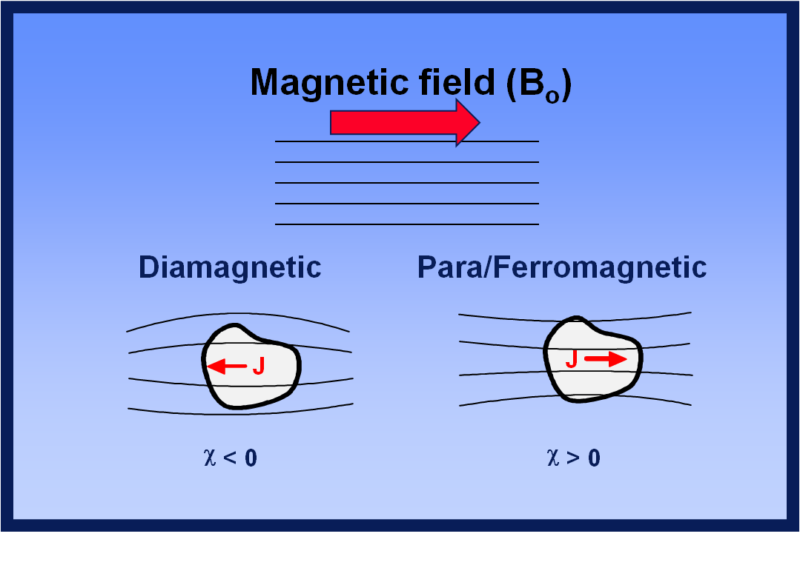

***Courtesy of Allen D. Elster, MRIquestions.com***

Consequently, these local susceptibility differences cause variations in the precessional frequency of spins, also known as the Larmor frequency (ω0). As a result, phase accumulation occurs over time. Therefore, the greater the difference in χ or the longer the duration, the more spread-out the phases become. The relationship between the Larmor frequency, the B0 field offset and phase accumulation can be described as follows:

$$ \omega 0 = \gamma B_0 $$

$$ \omega = \omega 0 + (\omega 0 \cdot \Delta \chi) $$

$$ \phi = \int \omega(t) \ dt $$

### Phase wrap concept
The B0 offset affects magnitude and phase images differently. In magnitude images, the signal decays exponentially with increasing B0 offset, while phase accumulation increases in a linear manner. 

Click [here](https://brainhack-school2023.github.io/Vejdani_project/FID.html) to see the interactive figure. 

As a result, the reconstructed phase map from the complex MRI signal contains information about the B0 field variation. However, due to the involvement of various sources in phase variations, the phase maps can only provide an approximation of the ΔB0 field. Most of these sources do not change with different echo times, except for the phase induced by B0 inhomogeneity, which scales with the echo time. Therefore, to obtain a ΔB0 field map, at least two phase maps with different echo times need to be acquired.
While MRI-based B0 mapping can be performed using any MRI pulse sequence, the fast gradient-echo (GRE) method is commonly used due to its speed, ease of use, and inherent sensitivity to B0 offsets. The pulse sequence diagram for GRE is as follows: 

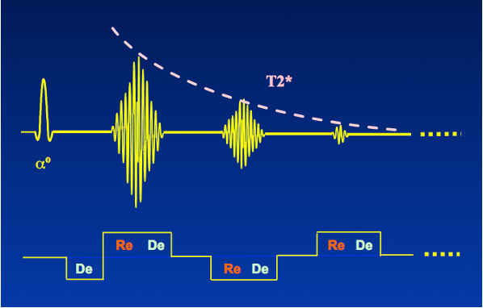

***Courtesy of Allen D. Elster, MRIquestions.com***

One problem with phase images is that any frequency beyond 1/ΔTE will wrap into the range of -π to π. This is because phase is calculated using inverse tangent and cannot accommodate values outside this range.

Click [here](https://brainhack-school2023.github.io/Vejdani_project/Phase_evolution.html) to see the interactive figure.

To avoid phase wrapping, the echo time for the first phase data and the ΔTE (difference in echo times) for the linear fitting approach are typically kept low enough. Consequently, you would expect to observe fewer phase wraps with lower echo times, and an increasing number of wraps with longer echo times and larger B0 offsets (e.g., in the skull base). Additionally, geometric distortion has a more pronounced effect in the phase encoding direction where the sampling rate is lower.

Click [here](https://brainhack-school2023.github.io/Vejdani_project/phase_wraps.html) to see the interactive figure (Note that phase enconding is along AP direction in these images).

## Main Objectives

- Illustration of three previously-mentioned methods of B0 mapping 
- Comparison of fMRI connectivity matrix with and without EPI undistortion

## Personal Objectives

- Emphasize on reproducibility of the analysis pipeline.
- Learn more about advanced visualization of the neuroimaging data.
- Understanding of fMRI connectivity concepts and processing steps.

## Tools
- Jupyter notebook for coding and visualization
- Git and Github for Version Control
- DataLad for data Reproducibility
- Singularity container using NeuroDesk for Reproducibility
- FSL command line tools for EPI undistortion using Neurodesk
- Shimming toolbox for standard multi-echo field mapping
- Python Packages: `matplotlib`, `seaborn`, `nilearn`, `plotly`, `Nibabel`, `scipy`, `Pandas`

## Data

The data utilized in this project were obtained from three different sources. For the double echo GRE and EPI field mapping I utilized a dataset that is part of the fmriprep data examples available on Open Neuro, accessible [here](https://github.com/OpenNeuroDatasets/ds001600).
The second dataset used for Multi-echo GRE field mapping was obtained from our lab. Although we are not permitted to distribute this dataset, users can still follow the steps outlined in calculating the field maps, as the resulting images and analysis procedures are self-explanatory.
The third dataset employed for the fMRI comparison, both with and without distortion correction, originates from National Taiwan University and is also available on Open Neuro, accessible [here](https://github.com/OpenNeuroDatasets/ds000172.git).
It's worth noting that the notebook includes instructions for cloning the dataset and retrieving the necessary files using Datalad, enabling anyone to replicate the analysis steps.

## Project Deliverables

- A Github repository
- A Jupyter notebook
- An explanatory markdown document 

## Results
### Double-echo GRE field mapping
To calculate a field map using the double-echo GRE method, one needs to subtract two consecutive phase maps and divide the result by the difference in echo times between them. However, when dealing with the second phase image, there is a possibility of phase wrapping. When the real phase evolution is larger (e.g., for Δν = 250 Hz and ΔTE = 3.0 ms, resulting in Δφ = 1.5π), the calculated phase will wrap to -0.5π. In general, phase wrapping introduces an incorrect estimation of the local magnetic field. In this specific example, -0.5π would be equivalent to a -83 Hz offset not +250 Hz offset. This highlights the impact of phase unwrapping on the accurate determination of the local magnetic field. So, simply subtracting the phase maps in this case would yield erroneous phase values, as the second phase map is wrapped to a lower phase value compared to the first phase.

To address this issue, there are two recommended approaches. The first is to spatially unwrap both phase images before performing the subtraction [5]. This ensures that the phase values are correctly aligned and eliminates the wrapping effect. Alternatively, a better approach is to calculate the complex difference between the two phase images and then perform spatial unwrapping on the resulting complex difference image. This method is already implemented in the shimming toolbox [6]. By taking the complex difference, we can reduce the need for additional spatial unwrapping, which is known to be error-prone. These concepts can be visualized in the following figure: 

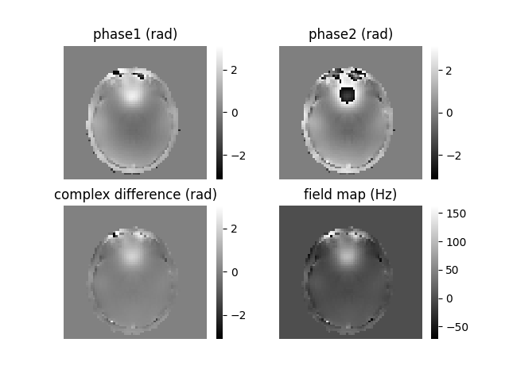

### Mutli-echo GRE field mapping
To calculate a field map using the Multi-echo GRE method, we employ the slope of the linear regression of phases versus echo times. Accurate estimates of magnetic field offsets are achieved by utilizing an increased number of evolution delays and extending the duration of these delays. While the acquired phase during longer delays may be wrapped, the initial delay is typically chosen in such a way that no phase wrapping occurs.
Based on the linear phase-time trend established by the first delay(s), subsequent delays can be unwrapped by adding or subtracting an integer multiple of 2π to the calculated phase. This unwrapping process ensures that the phases are correctly aligned and removes the effects of wrapping. You can refer to [here](https://brainhack-school2023.github.io/Vejdani_project/Phase_evolution.html) for further details. Once all phases have been temporally unwrapped, a linear least-squares fit of the phase-time curve is performed, providing the best estimate of the magnetic field offset. This linear regression analysis allows us to determine the relationship between the phase and time, enabling accurate characterization of the magnetic field offset. 
However, the order of performing temporal and spatial unwrapping is crucial. In the following figure, we can compare the results of field maps calculated with the order of temporal+spatial unwrapping and reverse (spatial+temporal unwrapping).

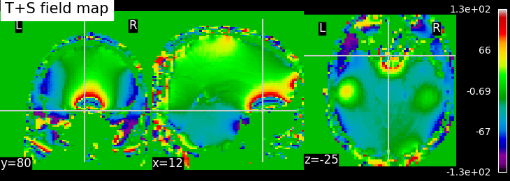

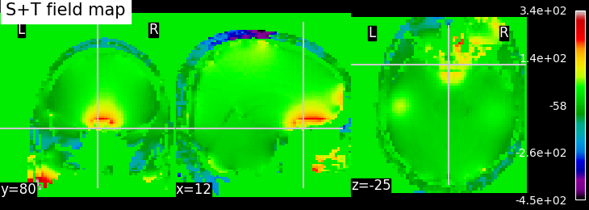

### EPI field mapping
EPI images can be utilized to approximate a field map by acquiring two volumes with opposite phase encoding directions. The difference in distortion between these two acquisitions is then utilized in a least squares algorithm to estimate the field map. Although the resulting field map may exhibit some artifacts, as demonstrated in the following images, it is still sufficient to correct for distortion to some extent.

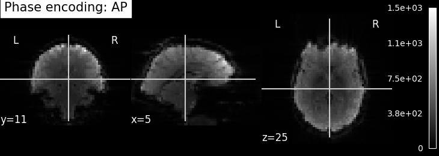

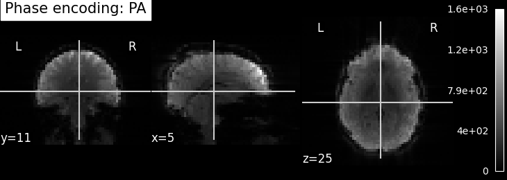

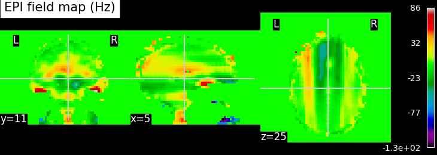

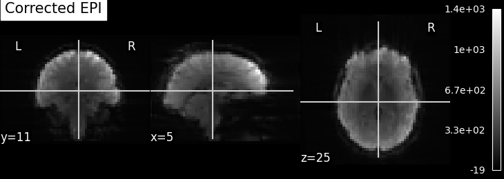

To perform this step, FSL command line tools such as TOPUP, FUGUE, and FLIRT are employed for the analysis. These tools enable the processing and correction of distortion in the EPI images, contributing to improved image quality.

### rs-fMRI with and without distortion correction
For the last part of the project, the third dataset is employed, which consists of resting-state functional MRI (rs-fMRI) data and the unwrapped phase difference image. rs-fMRI allows us to investigate brain regions that exhibit correlated temporal activity, forming functional networks. In order to analyze these networks, various brain regions from a known atlas are selected, and their signal time series are compared to construct a matrix known as the connectivity matrix. 
A figure of this atlas can be seen [here](https://brainhack-school2023.github.io/Vejdani_project/atlas.html).

The connectivity matrix represents the strength of functional connections between different regions of the brain. To quantify these connections, a Pearson correlation is calculated between the time series of different regions in the matrix. The resulting correlation values are encoded using a color bar to visualize the connectivity patterns. Finally, the process of brain masking and retrieving connectivity data was accomplished for a single subject using the nilearn library[7].

The results are as follows:

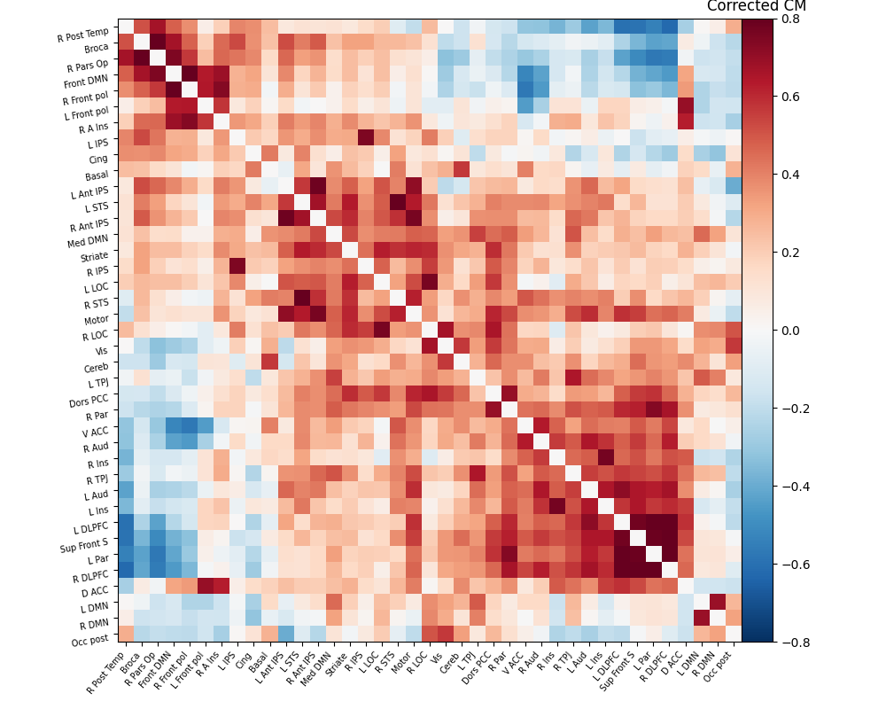

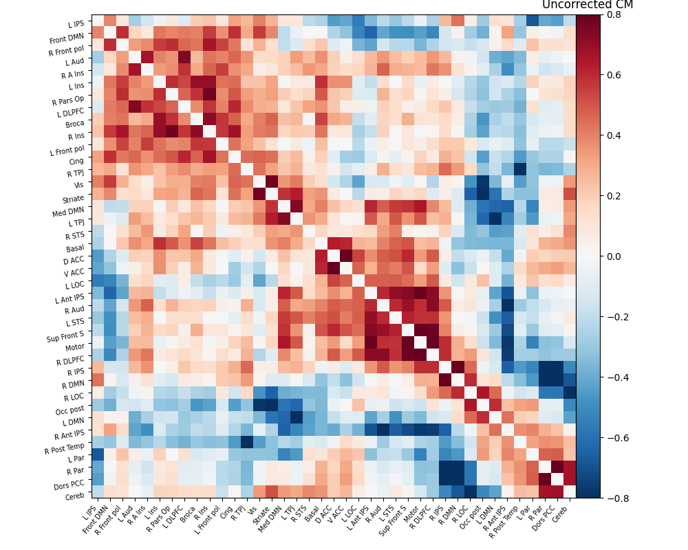

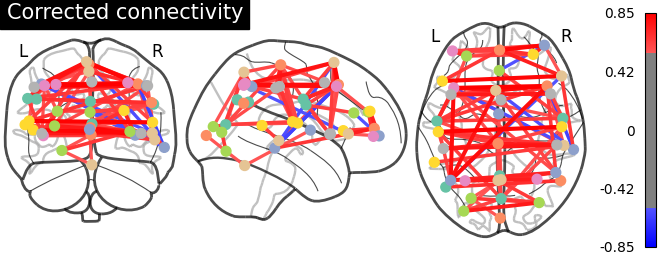

Click [here](https://brainhack-school2023.github.io/Vejdani_project/connectivity_corrected.html) for interactive plot. 

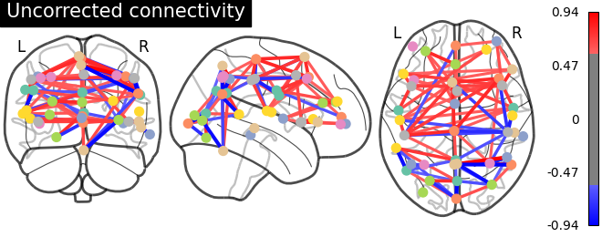

Click [here](https://brainhack-school2023.github.io/Vejdani_project/connectivity_uncorrected.html) for interactive plot. 

To see the overlayed rs-fMRI images on standard MNI space click [here](https://brainhack-school2023.github.io/Vejdani_project/MNI_overlay.html).

As evident from the observations, the lack of a field map to rectify the geometrical distortion in the EPI images leads to a reduced number of functional connections detected in the frontal and temporal lobes, which are particularly affected by a substantial B0 offset.

## Conclusions

In conclusion, these findings highlighted the significance of field mapping in mitigating distortions and improving the detection of functional connections. The integration of advanced tools like nilearn facilitated the calculation and visualization of functional connectivity matrices. Overall, this project underscores the crucial role of field mapping and distortion correction for enhancing the accuracy and reliability of functional connectivity studies.

## Acknowledgements

I extend my sincere gratitude to the Brainhack team of 2023 for their unwavering support throughout the duration of the course. I have learned a lot throughout this course. Also, I would like to express my special appreciation to Dr. Eva Alonso Ortiz for her valuable support and expertise, which proved instrumental in the successful completion of this project.

## References

1. Poot, D.H.J. et al. (2010) ‘Improved B0 field map estimation for high field EPI’, Magnetic Resonance Imaging, 28(3), pp. 441–450. Available at: https://doi.org/10.1016/j.mri.2009.12.020. 

2. Clare, S., Evans, J. and Jezzard, P., 2006. Requirements for room temperature shimming of the human brain. Magnetic Resonance in Medicine: An Official Journal of the International Society for Magnetic Resonance in Medicine, 55(1), pp.210-214.

3. Kim, T., Lee, Y., Zhao, T., Hetherington, H.P. and Pan, J.W., 2017. Gradient‐echo EPI using a high‐degree shim insert coil at 7 T: Implications for BOLD fMRI. Magnetic resonance in medicine, 78(5), pp.1734-1745.
4. Webb, A.G. (ed.) (2016) Magnetic Resonance Technology: Hardware and System Component Design. Cambridge: Royal Society of Chemistry (New Developments in NMR). Available at: https://doi.org/10.1039/9781782623878.

5. m. Jenkinson, fast, automated, n-dimensional phase-unwrapping algorithm, Magn. Reson. Med., 2003, 49, 193–197.

6. D'Astous, A., Cereza, G., Papp, D., Gilbert, K.M., Stockmann, J.P., Alonso‐Ortiz, E. and Cohen‐Adad, J., 2023. Shimming toolbox: An open‐source software toolbox for B0 and B1 shimming in MRI. Magnetic Resonance in Medicine, 89(4), pp.1401-1417.
