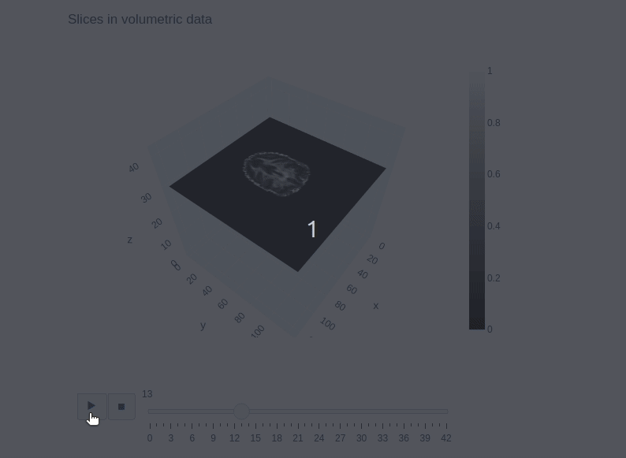
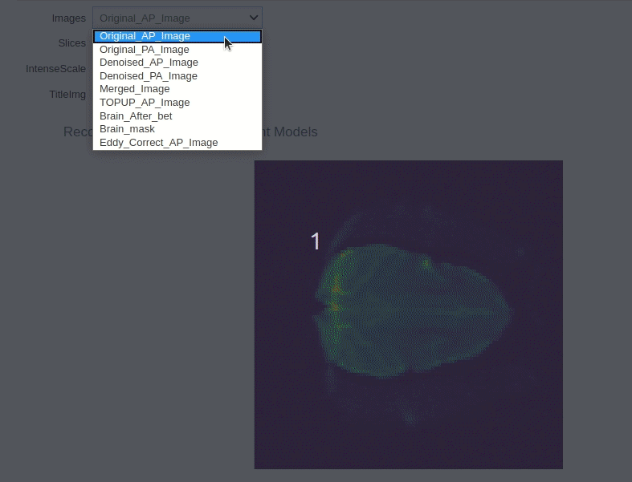
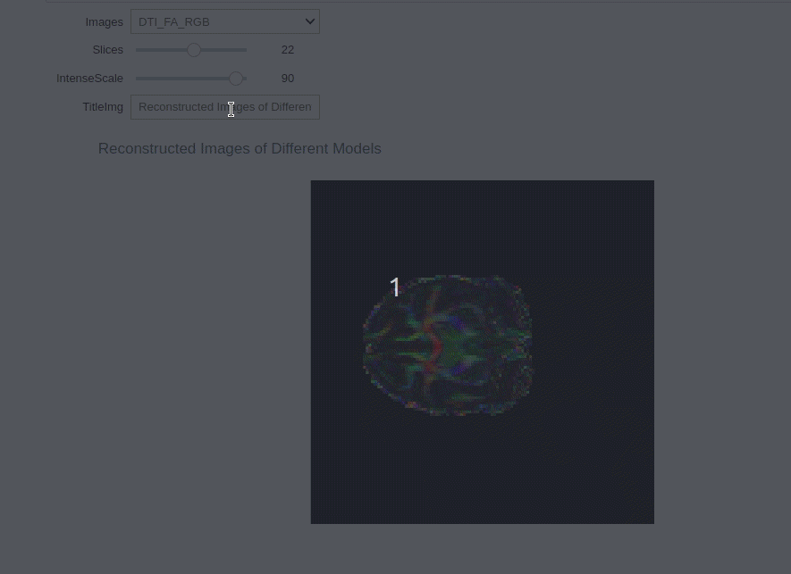
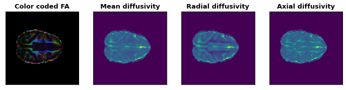
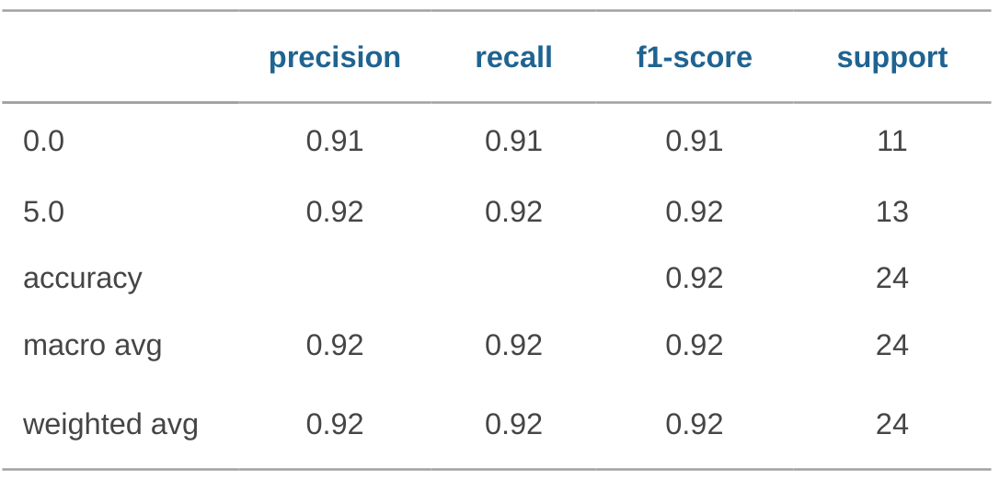

<!-- This is an html comment and this won't appear in the rendered page. You are now editing the "content" area, the core of your description. Everything that you can do in markdown is allowed below. We added a couple of comments to guide your through documenting your progress. -->

## Project definition

### Background

Low blood sugar is a common problem in both children and adults. Existing research showed that it may lead to serious both transient and permanent structural abnormalities on brains. Magnetic resonance imaging (MRI), specially diffusion MRI, has a higher in vivo sensitivity to lesions in soft tissues compared to other imaging modalities, and has potential to identify and quantify brain structure changes. Some of these changes are not appraient enough,even for experienced experts. Machine learning is a useful method to discover potential features. 

Currently, there are some open-source software to reconstruct and analyze diffusion MRI data. However, only using these tools, one, like me as a new student in this field, may get confused about operations and principle behind them. This seriously stops people to reach their long-term goals in their diffusion MRI project. 

Thus, I began this project to preprocess  dMRI data, reconstruct diffusion MR images and do some analysis by using machine learning. The goals are as following:

* Get preprocessed diffusion MR images from raw data;
* Reconstruct diffusion tensor images from the preprocessed data;
* By using machine learning, try to classify two hemispherical brains from preprocessed diffusion images.

### Tools

The "Diffusion MRI reconstruction project" will rely on the following tools: 
 * Python3: coding language used to complete this project (Python2 also needed for some special packages).
 * Github and git: to organize this project and make version control
 * Jupyter Notebook: to file code, visualizations and results 
 * [Markdown](https://guides.github.com/features/mastering-markdown/), to structure the text in README and Jupyter Notebook
 * Visual Studio Code: to be code editor
 * Nipype: to use FSL command preprocessing  image data
 * DIPY: to be used as diffusion tensor imaging (DTI) fitting and denoising
 * matplotlib, plotly and ipython widgets: data visualization
 * Linux (Ubuntu 20.04)

### Data

This project used data from online dataset offered by:
1. [The Developing Human Connectome Project](http://www.developingconnectome.org/second-data-release/). It consists of over 800 neonatal scans and over 250 fetal scans and can be used for data analysis after image reconstruction. 
2. [PRIME](http://fcon_1000.projects.nitrc.org/indi/PRIMEdownloads.html): used this dataset to reconstruct diffusion Images. This also can be downloaded [here](https://drive.google.com/file/d/1zgxynxjUCETBC6MAl4rfh0sL0WhFtKA9/view?usp=sharing) directly. 
3. Since during preprocessing, we used epi data with two opposite phase-encoding directions to correct distortions, other data can also be used as the source data if it meets this requirement.
4. Data used for analysis is generated from image data after preprocessing. The final data can be found in this [github project folder](https://github.com/brainhack-school2020/BHS_Project_dMRI/blob/master/brain_water.csv).

### Deliverables

At the end of this project, we will have: Jupyter notebook will be developed, allowing diffusion MR reconstruction and data analyzation. Weekly Deliverables are as following:
 
 - Week 1: [Assignment 2](https://github.com/zhangerjun/Zhang-EJ-QLS612)
 - Week 2: [README file](https://github.com/brainhack-school2020/BHS_Project_dMRI/blob/master/README.md)
 - Week 3: [Data visualization](https://github.com/brainhack-school2020/BHS_Project_dMRI/tree/master/Visualization)
 - Week 4: [Project report](https://github.com/brainhack-school2020/BHS_Project_dMRI) and [project prosentation](https://github.com/brainhack-school2020/BHS_Project_dMRI/blob/master/BHS_dMRI_Project.pdf)

## Results

### Progress overview

Since May 11, this project goes well and three goals of this project have been reached. This is just to let me be familiar with steps and tools of diffusion MRI processing. Next, I will combine different processing methods into this project. Specifically, I would like to look deep into DTI model fitting and try to replace it by a new model created by myself.

### Tools I learned during this project

1. Python
	* FSL, Nipype.interfaces, DIPY
	* matplotlib, plotly, ipywidgets
	* Function definition and calling
2. Markdown
	* Format this README file
	* Insert figures and animation
	* LaTex to edit mathematical equations
3. Github
	* Version control
	* Project organization
4. BIDS
5. Jupter notebook
6. Found and learnt to use some small but useful tools
	* [Peek](https://github.com/phw/peek) for GIF making
	* [Gedit](https://wiki.gnome.org/Apps/Gedit) to edit code or markdown
7. Medical file format (NII) and data structure (BIDS)
8. Statistical method and machine learning

### Results

#### Data Visualization (see [gif figure](https://github.com/brainhack-school2020/BHS_Project_dMRI/tree/master/Visualization) below):
  - 3D volume slices image 
  - Interactive widgets use to show preprocess results 
  - Interactive widgets use to show reconstruction results 

	
		
	

#### Preprocessing results

	

#### DTI results

	

#### Left and right hemispheres classification results

	

## Conclusion and acknowledgement

This project started with medical imaging data format, then preprocessed the diffusion weighted images, which includes MP-PCA denoising, FSL TOPUP distortion correction and head movement correction. After this, DTI images were reconstructed from these preprocessed images successfully. Additionally, a dataset for left and right hemispheres classification was generated from these preprocessed images. By using the KNN method, classification accuracy of 92% was reached. As a starter, I will continue this project in the future. Soon, self-made models, instead of DTI model, will be used to reconstruct diffusion images. After that, I would like to use machine learning methods to classify potential changes of brain microstructures.

Thanks to [Brainhack Summer School 2020](https://school.brainhackmtl.org/) and all instructors. Specifically, I would like to thank my instructors Noor, Greg and Agah for your advice, instruction and encouragement. I feel so lucky to find and take this summer school. During this short one month, I touched so many new skills and tools and began my first neuroscience project. I would also like to thank all the summer school students, just because of you, I know how wonderful the neuroscience world is and how active the neuroscience group is! 
