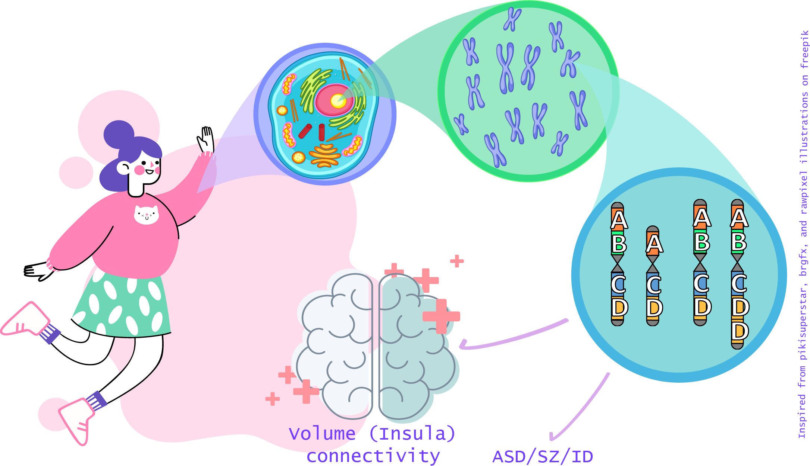
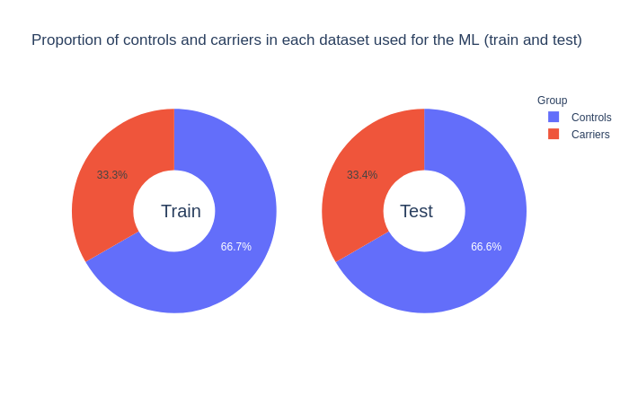
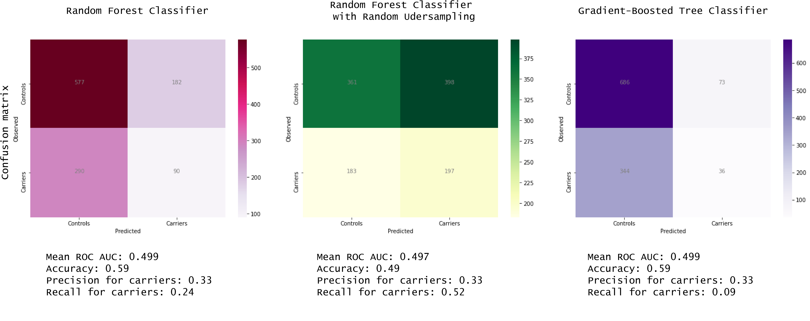

<!-- This is an html comment and this won't appear in the rendered page. You are now editing the "content" area, the core of your description. Everything that you can do in markdown is allowed below. We added a couple of comments to guide your through documenting your progress. -->

# BLUP: Brain Learning Unicorn Project

Click [HERE](https://brainhack-school2020.github.io/EliseD_BLUP_Brain-Learning-Unicorn-Project/) to see this readme as a website.

### ***Can a model predict the genetic profile of an individual based on brain regions volumes?***

*Trying to deal with new stuff learned at the amazing Brainhack school*

<ins>Author:</ins> Elise Alix Douard

<ins>Other project contributors:</ins>
BHS, Hannah Kiesow [@hannahmaykiesow](https://twitter.com/hannahmaykiesow) (also working on UKBiobank), Kuldeep Kumar [@meetkd007](https://twitter.com/meetkd007) (extracting data from UKBB servers)

## Personal presentation

Welcome to this project dear unicorn student ! 

  Source: https://media.giphy.com/
 

I am Elise, Ph.D. student in neurosciences at the UdeM since near to 4 years, and working on **the contribution of genetic to neurodevelopmental disorders** as autism. I don't really fit in a specific domain (genetic/cognitive neurosciences/psychology). I guess it is what we call a *unicorn student*? Currently, I am working with genetic data (Copy Number Variants), clinical phenotypes and doing a lot of statistics and graphs on R. But my initial formation was in cognitive neurosciences where I started to work with multimodal data (combination of Arterial Spin Labelling MRI data and Eye-tracking data). 

Since I started my Ph.D., I never used MRI data nor python, and I am here to take a revenge on that. 

**Skills:**

- Data management (feed me with multimodal data plz)
- Statistics
- Debugging codes

# Project definition

## Background

 Source: Illustration inspired from freepik.com content and adapted on adobe illustrator
 

Copy number variants (CNVs) are a family of structural variation of the chromosomes. They can be either a loss or a gain of a chromosome portion in comparison to a genome of reference. Sometimes, CNVs can be pathogenic, meaning that they are formally associated to neurodevelopmental or psychiatric disorders, such as autism spectrum disorders (ASD), Schizophrenia (SZ) or intellectual disability (ID). Such pathogenic CNVs have been associated to significant alterations of brain volume ([Modenato et al., 2020](https://www.medrxiv.org/content/10.1101/2020.04.15.20056531v1.full) ; [Martin-Brevet et al., 2018](http://www.sciencedirect.com/science/article/pii/S000632231831401X) ; [Maillard et al., 2015](https://www.nature.com/articles/mp2014145)) or connectivity ([Moreau et al., 2019](https://www.biorxiv.org/content/10.1101/862615v1.full)). Notably, there were common alterations of the insula volume when comparing structural brain alterations due to pathogenic CNVs and due to a neurodevelopmental disorder (e.g. ASD or SZ) ([Cauda et al., 2017](https://onlinelibrary.wiley.com/doi/abs/10.1002/aur.1759) ; [Goodkind et al., 2015](https://jamanetwork.com/journals/jamapsychiatry/fullarticle/2108651)).

## Problematic 

Can a model predict the genetic profile of an individual based on brain regions volumes?

## Aims

- **Main goal**: 

This project aims to feed a machine learning model with brain volumes to predict if an individual is carrier of a potentially pathogenic CNV.

 Source: Illustration inspired from freepik.com content and adapted on adobe illustrator
 

- **Subgoals**:

- [x] Making minimal change to the distribution shape of the volumes
- [x] Dealing with imbalanced dataset reflecting the reality of the prevalence of pathogenic CNVs in the general population

- **Personal goals**: 

- [x] Learn how to properly share scientific content
- [x] Learn how to python instead of R
- [x] Learn how to interactive plot
- [x] Learn how to machine learning

# Methods

## Data

### Raw data

For this project, 35,759 individuals from [UK Biobank](https://www.ukbiobank.ac.uk/) with genetic and derived brain volume data were available.
- MRI data (features): All individuals have derived-brain volumes preprocessed on Freesurfer using Desikan parcellation (68 regions) [[cf. documentation for processing pipeline details](https://biobank.ctsu.ox.ac.uk/crystal/crystal/docs/brain_mri.pdf)].
- Genetic data (labels): 1,265 individuals (3.5% of the cohort) were carriers of at least one of 93 potentially pathogenic CNV identified by [Kendal et al. (2019)](https://www.cambridge.org/core/journals/the-british-journal-of-psychiatry/article/cognitive-performance-and-functional-outcomes-of-carriers-of-pathogenic-copy-number-variants-analysis-of-the-uk-biobank/0D144F6880A46DC94EE27ADEACB5942B). These individuals will constitute the carriers class, all the other will be in the controls class. 
- Confounders: age, sex, total intracranial volume (TIV) and site of MRI acquisition were available for all individuals. 

### Data transformation

For all individuals, the 68 region volumes were adjusted for potential confounder effects. 

**Table 1:** Description of the confounders

| Goup | N | Mean age (sd) | Mean TIV (sd) | N Female | N Male | N Site 1 | N Site 2 | N Site 3 |
|:------|:-----:|:---------:|:------:|:---------:|:---------:|:---------:|:---------:|:---------:|
| Carriers | 1265 |63.8 (7.4)| 1540824.3 (150493.6) | 671 | 594 | 781 | 320 | 164 |
| Controls | 34494 | 64.1 (7.6) | 1549091.7 (151512.6) | 18280 | 16214 | 21411 | 8607 | 4476 |

### Final dataset: training and test sets

A subgoal of the project was to make minimal changes to the features used in the machine learning models. The final volumes used as features were the ones adjusted for the confounder effects without z-scoring. 
Another subgoal was to deal with imbalanced dataset which reflect the reality of carriers prevalence in the general population. As an alternative, the imbalance was reduced by pseudo-randomly resampling the controls. The final dataset included the 1,265 carriers and twice more controls. 

Click on the following images to open interactive pie-charts: 

**Figure 1**: Proportion of controls and carriers in the training and test sets used for the machine learning models. 

## Machine learning model used

- Random Forest Classifier using `sklearn.ensemble.RandomForestClassifier` [[documentation]](https://scikit-learn.org/stable/modules/generated/sklearn.ensemble.RandomForestClassifier.html)
- Random Forest with Random Undersampling using `imblearn.ensemble.BalancedRandomForestClassifier` [[documentation]](https://imbalanced-learn.readthedocs.io/en/stable/generated/imblearn.ensemble.BalancedRandomForestClassifier.html)
- Gradient-Boosted Classification Tree using `sklearn.ensemble.GradientBoostingClassifier` [[documentation]](https://scikit-learn.org/stable/modules/generated/sklearn.ensemble.GradientBoostingClassifier.html)

## Step followed for the three machine learning models

- Step 1: Training the model on the training set
- Step 2: Test the model on a validation set
- Step 3: Cross validation (n fold = 10)
- Step 4: Playing with the hyperparameters `max_depth` and `n_estimators` (and `learning_rate` for the gradient-boosted tree classifier)
- Step 5: Testing the model on the test set

## Tools (used and learned)

The project rely on the following technologies:
- Visual Studio Code
- Git/Github 
- Python (libraries: `pandas`, `numpy`, `nilearn`, `nibabel`, `sklearn`, `scipy`, `random`, `seaborn`, `plotly`, `matplotlib`, `ipywidgets`, `itertools`)
- Jupyter notebook (Including Markdown, Python code and Slides using the Rise extension)

## Deliverables

In this GitHub repository:
- README: Readme file for this project repository
- Welcoming_vid.mp4: A non-relevant video of welcoming
- Prep_visualization_ML_allinone.ipynb: Jupyter notebook with all the instructions and code lines for the data preparation and visualization, the machine learning models training and testing and the results visualization
- requirements.txt: List of all the package used for this project
- Slides_Final_week.ipynb: Jupyter notebook using Rise extension for the final presentation of the project
- Data_for_plots/: Data used for two interactive figures (3D Desikan parcellation map and pie-cart of the sex and site distribution in the carriers and controls)
- Interactive_plots/: Folder with the html object of the interactive figures
- Slide_content/: Images used for the Slides_Final_week.ipynb file

### Week 3 deliverable: data visualization

link to the blog created for the assignment: https://elise-douard.github.io/EliseAD_BLUP_BlogPage/

# Results

## Results of the models

**Figure 2**: Results after testing the models (step 5)

</a>

As you can see in the Figure 2, none of the models were better than chance to classify the carriers and the controls. 
BUT it is not a problem because... I learned a lot doing this project! 

## Progress overview

### Week one: 
- Learning tons of new concepts

### Week two: 
- 18 may 2020 Creating the README file
- 20 May 2020 5 min presentation of the project draft using README file
- 21 may 2020 Starting to play with data on python and creating the main jupyter notebook

### Week three: 
- 29 may 2020 Finalization of data preparation (removing confounders) and visualization, starting ML part

### Week four: 
- 3 may 2020 Starting slides on jupyter notebook using Rise extension and creating project illustrations on adobe illustrator
- 5 may 2020 Final presentation of the project with UKBioBank data and the results of the machine learning models

### Week five: 
- 8 may 2020 Final push of the blog for the visualization assignment
- 12 may 2020 Final push of the project on Github and the website

# Conclusion and acknowledgement

This BHS project allows me to learn a lot of concepts and tools concerning the open science. It was also a nice introduction to machine learning models. Hopefully, I will spread the word and I will surely include all these new tools in my practice. I am more than grateful toward all the instructors, mentors and students, who shared their knowledge. 

  Thanks for this enriching experiment!  
 

  Source: https://media.giphy.com/
 

# References

Cauda F. et al., “Are Schizophrenia, Autistic, and Obsessive Spectrum Disorders Dissociable on the Basis of Neuroimaging Morphological Findings?: A Voxel-Based Meta-Analysis.” *Autism Research* 10, no. 6 (2017): 1079–95. https://doi.org/10.1002/aur.1759.

Goodkind M. et al., “Identification of a Common Neurobiological Substrate for Mental Illness.” *JAMA Psychiatry* 72, no. 4 (April 2015): 305–15. https://doi.org/10.1001/jamapsychiatry.2014.2206.

Kendall K. M. et al., “Cognitive Performance and Functional Outcomes of Carriers of Pathogenic Copy Number Variants: Analysis of the UK Biobank.” *The British Journal of Psychiatry* 214, no. 5 (May 2019): 297–304. https://doi.org/10.1192/bjp.2018.301.

Maillard A. M. et al., “The 16p11.2 Locus Modulates Brain Structures Common to Autism, Schizophrenia and Obesity.” *Molecular Psychiatry* 20, no. 1 (February 2015): 140–47. https://doi.org/10.1038/mp.2014.145.

Martin-Brevet S. et al., “Quantifying the Effects of 16p11.2 Copy Number Variants on Brain Structure: A Multisite Genetic-First Study.” *Biological Psychiatry*, 84, no. 4 (2018): 253–64. https://doi.org/10.1016/j.biopsych.2018.02.1176.

Modenato C. et al., “Neuropsychiatric Copy Number Variants Exert Shared Effects on Human Brain Structure.” *MedRxiv*, April 17, 2020, 2020.04.15.20056531. https://doi.org/10.1101/2020.04.15.20056531.

Moreau C. et al., “Neuropsychiatric Mutations Delineate Functional Brain Connectivity Dimensions Contributing to Autism and Schizophrenia.” *BioRxiv*, (2019), 862615. https://doi.org/10.1101/862615.
