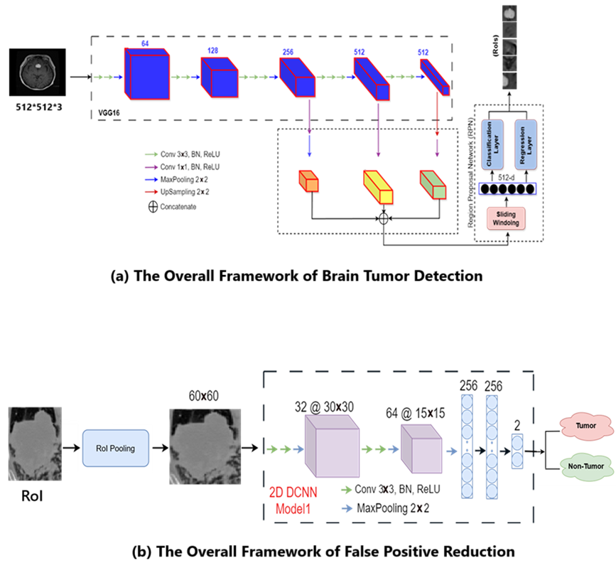
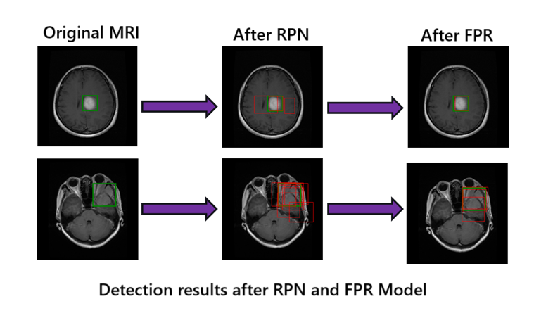

<!-- This is an html comment and this won't appear in the rendered page. You are now editing the "content" area, the core of your description. Everything that you can do in markdown is allowed below. We added a couple of comments to guide your through documenting your progress. -->
---

## Project definition

### Background
Brain tumors are among the most challenging medical conditions to detect and treat. Accurate identification of tumor regions in MRI scans is crucial for diagnosis, surgical planning, and treatment monitoring. Traditional methods rely heavily on expert interpretation, which can be time-consuming and prone to inter-observer variability. Deep learning approaches, especially object detection frameworks like Faster R-CNN, offer a promising alternative by automating tumor localization and classification. In this project, we enhance the classical Faster R-CNN pipeline with a false positive reduction (FPR) stage to improve robustness and reliability.

### Tools

- **Programming Language**: Python 3.x  
- **Deep Learning Framework**: PyTorch  
- **Computer Vision Libraries**: OpenCV, torchvision  
- **Annotation Tool**: LabelImg, Nibabel 
- **Visualization**: Matplotlib, Seaborn  
- **Notebook Environment**: Jupyter Notebook  
- **Hardware**:
  - **Training RPN**: Tesla V100 GPU (via terminal-based access)
  - **Inference and Evaluation**: CPU
- **CUDA**: Used during RPN training for GPU acceleration  

### Data

This project uses publicly available datasets containing 2D T1-weighted contrast-enhanced MRI images of brain tumors along with their ground-truth labels. The data is sufficient in both quantity and quality to allow for effective training and fine-tuning of object detection models such as Faster R-CNN.

1. [Brain Tumor Segmentation @ Kaggle](https://www.kaggle.com/datasets/nikhilroxtomar/brain-tumor-segmentation)  
   - **Original Source & Credit**: [Figshare](https://figshare.com/articles/dataset/brain_tumor_dataset/1512427)  
   - **Description**: This dataset contains 3064 T1-weighted contrast-enhanced brain MRI images in `.png` format, with manually labeled tumor regions provided via ground-truth masks.  
   - **Use Case**: Used for training and fine-tuning the Faster R-CNN model.

All images were preprocessed and annotated for object detection tasks by converting segmentation masks into bounding box labels.

### Project Deliverables

At the end of this project, the following materials will be available:

-  A completed and well-documented `README.md`.
-  Several Jupyter Notebooks.
     - For training the RPN and FPR models using GPU acceleration (Tesla V100).
     - For inference, post-processing, and evaluation (executed on CPU).
- Performance metrics including precision, recall, F1-score, and FROC curves.
- The slide presentation introducing the problem, dataset, model architecture, and key findings.

## Results

### Progress Overview

The Faster R-CNN model demonstrates strong localization capability in detecting brain tumors from MRI scans, even with limited annotated data for training. Our custom RPN training and false positive reduction significantly improved precision without sacrificing recall.

### Tools I Learned During This Project

Throughout this project, I gained hands-on experience with several essential tools and libraries in deep learning and medical image analysis, including:

- **PyTorch** – for building and training the Faster R-CNN and custom RPN models

- **Torchvision** – for using pretrained VGG16 and manipulating datasets

- **OpenCV** – for image processing and visualization tasks

- **Matplotlib & Seaborn** – for plotting training metrics and visual results

- **scikit-learn** – for computing classification metrics like precision, recall, and F1-score

- **Git & GitHub** – for version control and project collaboration

- **Markdown** – for documenting the project and creating a structured README

- **Jupyter Notebooks** – for training, evaluation, and presenting visual results step-by-step

### Deliverables
- Developed a two-stage Faster R-CNN + FPR framework for brain tumor detection.

- Trained and evaluated models using publicly available MRI data.

- Provided Jupyter notebooks for data prep, model training, inference, and evaluation.

- Shared trained models and test dataset via Google Drive for reproducibility.

- Created a slide presentation summarizing the project and results.

### Future work

Optimizing the anchor shape using metaheuristic algorithms

## Conclusion and acknowledgement

This project presents a two-stage deep learning pipeline for accurate brain tumor detection in MRI images, combining the Faster R-CNN architecture with a False Positive Reduction (FPR) model. Through fine-tuning and evaluation on open-access datasets, the system achieves promising detection performance, with enhanced precision and reduced false positives.

Many thanks to the BrainHack School Professor ([Dr. Eva Alonso Ortiz](https://neuro.polymtl.ca/team/faculty/eva-alonso-ortiz.html)), TA (Sebastian Rios), instructors, and fellow participants for their support, feedback, and inspiration throughout this project.

## References
[1] Brain Tumor Segmentation Dataset (Kaggle version). https://www.kaggle.com/datasets/navoneel/brain-mri-images-for-brain-tumor-detection

[2] Cheng, J. (2017). Brain Tumor Dataset. Figshare. https://figshare.com/articles/dataset/brain_tumor_dataset/1512427

[3] Bhanothu Y, Kamalakannan A, Rajamanickam G. Detection and classification of brain tumor in MRI images using deep convolutional network. In2020 6th international conference on advanced computing and communication systems (ICACCS) 2020 Mar 6 (pp. 248-252). IEEE.

[4] Ezhilarasi R, Varalakshmi P. Tumor detection in the brain using faster R-CNN. In2018 2nd International Conference on, 2018 2nd International Conference on 2018 Aug 30 (pp. 388-392). IEEE.

[5] Zamanidoost Y, Alami-Chentoufi N, Ould-Bachir T, Martel S. Efficient Region Proposal Extraction of Small Lung Nodules Using Enhanced VGG16 Network Model. In2023 IEEE 36th International Symposium on Computer-Based Medical Systems (CBMS) 2023 Jun 22 (pp. 483-488). IEEE.

