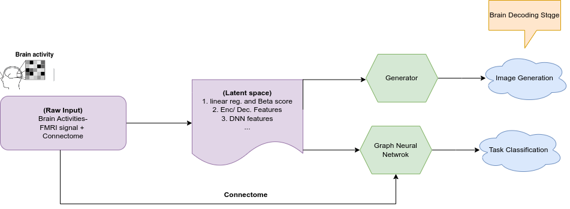
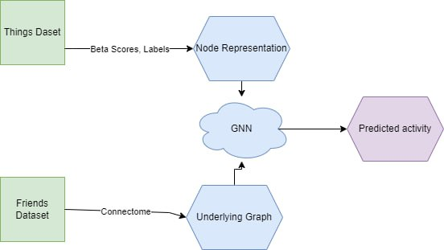

## Brain Decoding, overall perspective
The following provides some details about the Brain Decoding. First the raw data (including, per Voxel FMRI signal, connectome, ...) is preprocessed to a latent space (beta scores, Enc./Dec. and ...), providing a meaningful representation of the input data. Then based on the application including image generation, task classification; the latent space could be cast to the output. 
 

## **Brain Decoding using Beta scores and Graph Neural Networks**
 
For this poject, we have access to the Brain activities, and its parcellation. Then the main task is decode the Brain activites into different classes. Normally as the data per voxcel in the Brain is a Fmri signal, as a preprocesing stage, this data is represented by different techniqes. Here for this project, beta scores as a linear model fitted to the fmri data has the role to represent this data. Therefor after casting the data to the a space called, beta-space, the data has more meaningful representaiton, and also the connectome as the underlying graph connection of the Brain regions is feeded to the Grpah neural netwrok for message passign between different links of the nodes. Eventually, after the trainig, the netwrok is trying to do a classification task based on the training data. Here is the over all procedure for this project: 

 

## **Tools and Deliverables**
This project relies on the following technologies. 

* The main libraries used for this projects are : `torch-geometric`, `nilearn`, `matplotlib`
* The details of coding and results analysis are fully developed in this [jupyter book](https://aarian.github.io/BrainDecoding/GraphNN_Arian.html). 
* Github repo for the code is [here](https://github.com/Aarian/BrainDecoding).

## **Acknowledgements**
I would like to extend my gratitude to the organizers of Brain Hack School for providing this incredible opportunity to delve into such an intriguing and impactful topic. Special thanks go to Dr. Pierre Bellec and Dr. Marie St-Laurent for their invaluable mentorship and guidance throughout this journey. Their expertise and support have been instrumental in my learning and growth, and I am deeply appreciative of their dedication and encouragement. 