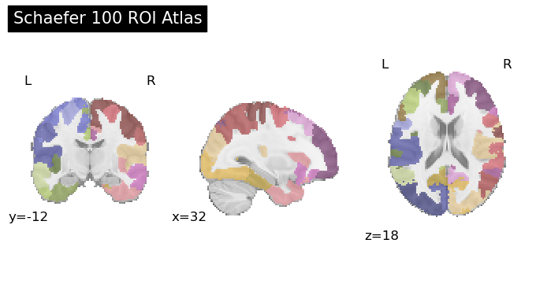
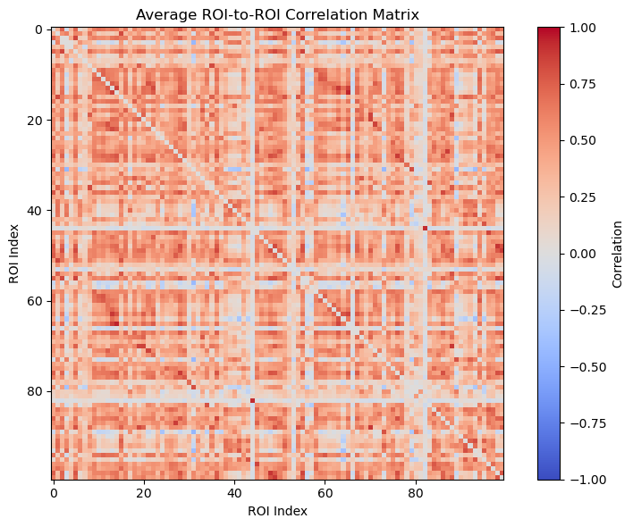
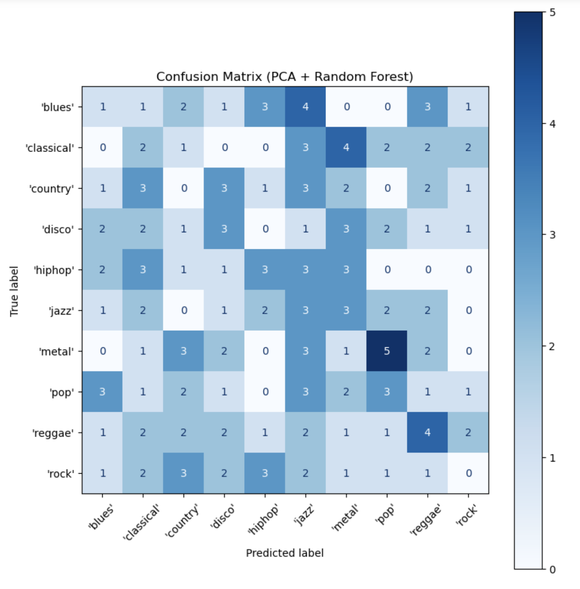

## Project definition

### Background

Music evokes rich and complex responses in the brain—and I wanted to explore whether functional connectivity patterns alone could reflect the genre of music being heard. Inspired by Nakai et al. (2021), who used voxelwise patterns across five participants to decode music genre, I chose to narrow the focus to a single-subject analysis.

Due to event file inconsistencies in sub-001 to sub-004, only sub-005 contained intact and correctly labeled annotations across all six runs. My project thus became a pilot proof-of-concept: could trial-wise ROI-to-ROI correlation matrices, extracted via the Schaefer 100-ROI atlas, support genre decoding even within just one brain?

### Tools

This project used:

- Python & Jupyter Notebooks
- `nilearn` for ROI time series extraction and brain visualization
- `scikit-learn` for PCA and classification (SVM, KNN)
- `matplotlib` & `seaborn` for plotting and visual diagnostics

### Data

- Dataset: [OpenNeuro ds003720](https://openneuro.org/datasets/ds003720)  
  Nakai, T., Koide‑Majima, N., & Nishimoto, S. (2021). *Brain and Behavior*, 11(1), e01936.

- Used only `sub-005` due to complete event labels (manual inspection revealed misalignments in other subjects)

- 6 runs, each with ~40 musical trials; each trial is a 10-second clip; 10 total genres in the dataset

- Brain parcellation: Schaefer 100-ROI cortical atlas (98 usable ROIs after resampling)

- Final dataset: 98 usable trials, filtered to exclude clips <2 TRs or with correlation errors

> Why only sub-005? The other subjects had corrupted or mismatched event files that broke alignment between music clips and fMRI data.

### Deliverables

- Trial-wise ROI-to-ROI correlation matrices
- Atlas and correlation matrix visualizations
- PCA dimensionality reduction pipeline
- Genre classification with SVM and KNN
- Final presentation slide deck (≤15 minutes)

---

## Results

### Progress overview

- Extracted time-series from 98 ROIs using `NiftiLabelsMasker` in `nilearn`
- Computed ROI-to-ROI Pearson correlations → 100×100 matrix → flattened to 4950D feature vector
- Applied PCA (n=20) for dimensionality reduction
- Trained classifiers (SVM, KNN) for multiclass and binary decoding

### Tools I learned during this project

- `nilearn` atlas-based ROI extraction
- Correlation matrix construction + vectorization
- PCA feature compression
- Classification using `SVC`, `KNeighborsClassifier`, and cross-validation
- Confusion matrix and performance visualization

### Deliverable 1: Multiclass genre classification

- SVM + PCA yielded ~13% accuracy (above 10% random baseline for 10 genres)
- Confusion matrix showed some genre-specific signal, particularly for Reggae (not shown in final binary model)

### Deliverable 2: Binary genre decoding (Pop vs. Metal)

- SVM + PCA achieved ~68% accuracy (above chance), though **KNN was too unstable to evaluate**
- Performance varied across runs, likely due to short duration and low trial count

### Deliverable 3: Visualizations

- Schaefer 100-ROI brain parcellation plotted to validate resampling and mask quality
- Average correlation matrix showed strong within-region signals (clean diagonals)

#### Schaefer Atlas

#### ROI Correlation Matrix

#### PCA Confmax

---

## Reflection

This pilot study suggests that even within a single brain, genre-relevant information can be gleaned from ROI connectivity patterns. But limitations remain:

- Generalizability limited by sample size (n=1)
- Low trial count vs. high feature dimension = overfitting risk
- Classifier performance unstable across reruns

## Future directions

- Use more participants (once metadata is cleaned!)
- Try higher-resolution atlases (e.g., Schaefer 200-ROI)
- Experiment with sliding window connectivity or graph-based features
- Combine with music theory-based audio features (e.g., tempo, tonality) for hybrid modeling
- Explore feature importance: which ROI-pairs drive classification?
