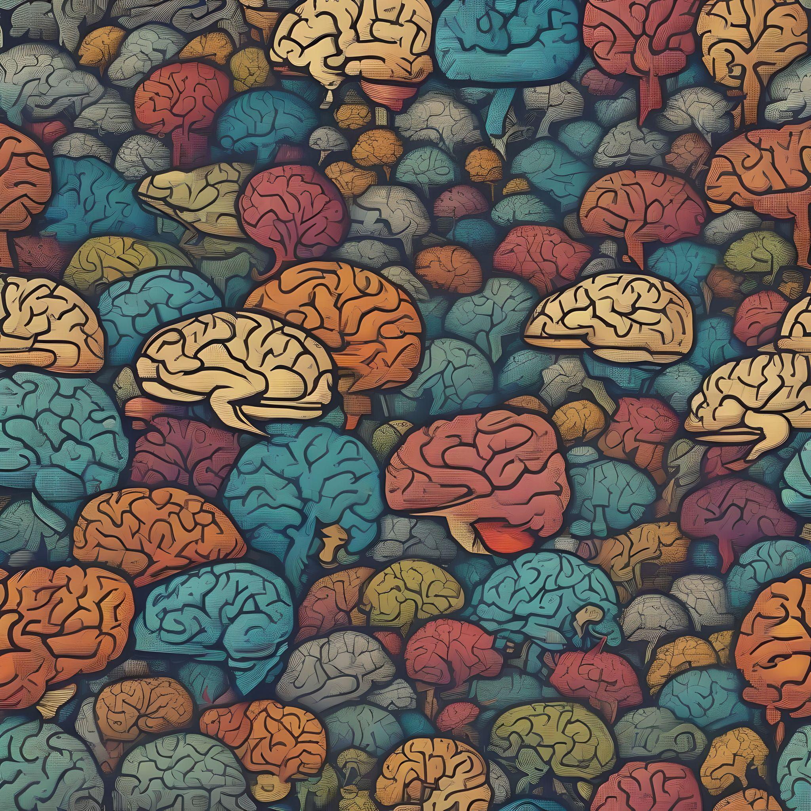
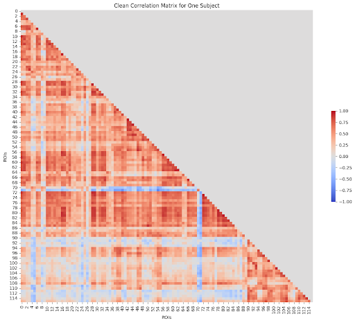
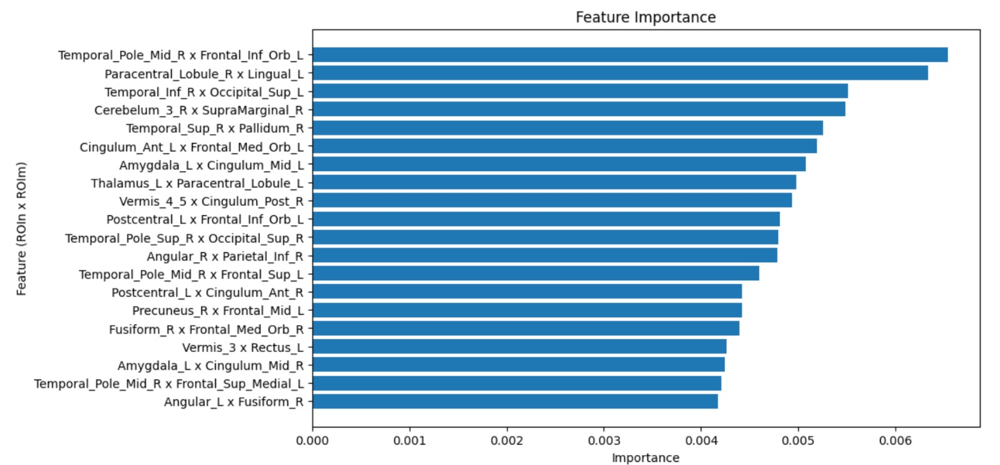

<!-- This is an html comment and this won't appear in the rendered page. You are now editing the "content" area, the core of your description. Everything that you can do in markdown is allowed below. We added a couple of comments to guide your through documenting your progress. -->

## Project definition

### Background

Attention-Deficit/Hyperactivity Disorder, or ADHD, is characterized by inattention, impulsivity and hyperactivity. Currently, 5% of the child and adolescent population Argentina live with this condition. It is still diagnosed using subjective clinical criteria, which are often difficult to evaluate. However, artificial intelligence (AI) techniques hold potential for identifying neuroimaging biomarkers that could facilitate the diagnosis. Our objective is to develop machine learning classification models to detect ADHD through the analysis of resting state functional MRI (rs-fMRI) signals.

### Tools we learned during this project

* **Bash Terminal and Shell scripting:** for command-line operations and scripting.

* **Git and GitHub:** for version control, learn to use a shared workspace, and repositories.

* **Project Managemet:** as a team we collaborate to fulfill the project deadlines week by week.

* **Jupyter Notebook and Google Colab:** we implemented the code within these interactive environments.

* **Python Libraries:**
  * **Numpy and Pandas:** for data manipulation and analysis.
  * **Matplotlib and Seaborn:** for data visualization.
  * **Nilearn:** to facilitate the processing and visualization of neuroimaging data.
  * **IPython:** for interactive computing, providing an enhanced interactive shell and support for Jupyter notebooks.
  * **Scikit-learn:** for machine learning, providing tools for data analysis, metrics and building predictive models.
  * **XGBoost:** for implementing optimized gradient boosting algorithms, which are highly effective for supervised learning tasks such as classification and regression.

* **Scikit-learn Tools:**
  * **Principal Components Analysis (PCA):** for linear dimensionality reduction of the features.
  * **StandardScaler:** standardize features by removing the mean and scaling to unit variance.
  * **RandomizedSearchCV:** for Cross-Validation and Hiperparameter Optimization.
  * **Metrics:** accuracy_score, f1_score, roc_auc_score, roc_curve, confusion_matrix, classification_report.

* **MRIcroGL**: Allows us to view 2D slices and renderings of our brain imaging data, both for structural and for functional MRI.

   

   

 * **AAL atlas**: For an anatomic brain parcellation.

   

**We also gain knowledge in the following areas:**

* **Machine learning for neuroimaging**
* **Introduction to deep learning**
* **Functional connectivity in fMRI**
* **Functional parcellations in fMRI**
* **The Brain Imaging Data Structure (BIDS) ecosystem**

### Data

**ADHD-200 Preprocessed Sample:**

*Pierre Bellec, Carlton Chu, François Chouinard-Decorte, Yassine Benhajali, Daniel S. Margulies, R. Cameron Craddock (2017). The Neuro Bureau ADHD-200 Preprocessed repository. NeuroImage, 144, Part B, pp. 275 - 286. doi:10.1016/j.neuroimage.2016.06.034*

Prepared by the collaboration of 8 international neuroimaging institutes, who held a competition in 2011, to identify ADHD biomarkers.

Composition:
* 947 children and adolescents
* 362 diagnosed with ADHD
* 585 typically developing controls

In order to make the competition accessible to a broader range of researchers, the data was preprocessed and shared by the Preprocessed Connectomes Project (PCP), what resulted in several publications, MS theses, PhD dissertations and even patents.

### Project steps

1. We downloaded the preprocessed ADHD-200 Sample dataset using a script that allowed us to obtain time series parcelled according to the AAL atlas, which has 116 ROIs.
2. We started by creating our Jupyter Notebook, loading the BOLD signal data for a single subject and visualizing the time signals in the 116 ROIs using Matplotlib.
3. With this subject's data, we constructed a Pearson correlation matrix between ROIs using the "corrcoef()" function from NumPy.
4. To visualize the correlation matrix, which in this case would be a connectivity matrix, we used Matplotlib and the "heatmap" function from Seaborn.
5. Then we used the "tril()" function from NumPy to retain only the lower triangle of the matrix, avoiding repeated data and the diagonal that do not provide information for our case study.
6. Using the "tril_indices()" method, we created a list or vector that contains the indices of our matrix.
      This method orders rows-wise from the lower triangular matrix. Specifically, the order follows:
        All elements from the first row below the diagonal.
        All elements from the second row below the diagonal.
        And so on, up to the last row.
7. Once we understood the process for a single subject, we were ready to replicate it for each of the subjects included in our dataset. For this, we used for loops, if-else conditionals, and try-except exception handling.
  For example, to iterate through the downloaded files following the phenotype subject list, avoiding errors in case the file did not exist or had any error that prevented the correct creation of our matrix.
8. The result obtained from the previous iteration was a matrix with 6670 features (PC of ROIn x ROIm) and 820 rows, the considered subjects. We converted this vector matrix into a DataFrame using Pandas.
9. As we had the subjects' IDs and their diagnosis in the phenotype, we could add them to our DataFrame.
10. From this point, we could separate our data into Train and Test sets using train_test_split from the sklearn library:
    a. test_size=0.2
    b. random_state=42
    c. stratify=target
11. Our problem: Supervised Classification Model with a Binary Target Variable.
    First approach: initially, we tried several models, including:
      a. PCA (Principal Components Analysis)
      b. LDA (Linear Discriminant Analysis)
      c. Logistic Regression
      d. XGBoost
12. As our classification was binary, we used the following metrics to evaluate our models obtained from sklearn.metrics:
    a. Train and Test Accuracy
    b. Confusion Matrix
    c. ROC AUC
    d. Additionally, we used the Classification Report, which includes several metrics.
13. Since we got the best results with XGBoost, we focused on optimizing the hyperparameters using RandomizedSearchCV in order to reduce the overfitting.
14. We combined PCA and XGBoost but did not get better results.
15. Finally we used Feature Importance from XGBoost to compare the most important features for the model with the theory about ADHD diagnosis.
16. With all the knowledge gained during this workshop, and building this project, we prepare a conclusion, a presentation and this markdowm.

### Deliverables

At the end of this project, the following files will be made available:
* The current markdown document.
* A GitHub repository to share our work and pipeline, and to encourage other students to build from it: https://github.com/AgustinNR/BrainHack-BsAs-Humai-Team1
* "ADHD_fRMI_ROI_Classification_Project.ipynb" notebook.
* Figures of our results: Connectivity matrix, graphs for statistical analysis, visualizations, feature importance evaluation.
* Our presentation shared at the end of the BrainHack meeting at Humai Institute.

### Results

#### Deliverable 1: Markdown document:

This markdown file in order to share the project in the BrainHack School web repository.

#### Deliverable 2: Github Repository:

A GitHub repository to share our work and pipeline, we would like to encourage other students to build from it: 
https://github.com/AgustinNR/BrainHack-BsAs-Humai-Team1

#### Deliverable 3: "ADHD_fRMI_ROI_Classification_Project.ipynb" notebook:

You can access our public notebook with the step-by-step process in the Github repository:

https://github.com/AgustinNR/BrainHack-BsAs-Humai-Team1/blob/main/notebooks/ADHD_fRMI_ROI_Classification_Project.ipynb

#### Deliverable 4: Figures of our results:

**Time Series:**

Each time series represents the intensity of the BOLD signal of every ROI (Region of Interest)
along the rs-fRMI.

**Connectivity Matrix:**

In order to create a connectivity matrix, we evaluated the Pearson Correlation between each of these signals.

**Feature Importance Interpretation**

* Temporal Pole and Frontal regions appear to be recurrently significant in feature importance, suggesting a key role in ADHD.
* The Cingulum also appears repeatedly, indicating its relevance in connectivity differences for ADHD.
* The Amygdala connectivity to the Cingulum (both Left and Right) highlights potential emotional regulation and cognitive control variations in ADHD.

The importance values are relatively close, ranging approximately from 0.004 to 0.006. This indicates that while some connections are slightly more influential, many features are comparably important in distinguishing ADHD from controls in resting-state fMRI. These identified ROIs and their connectivity patterns could be further studied to develop diagnostic methods.

#### Deliverable 5: Our presentation shared at the end of the BrainHack meeting at Humai Institute

You can find the slides of our presentation in the Github repository: 

https://github.com/AgustinNR/BrainHack-BsAs-Humai-Team1/blob/main/ADHD%20Classification%20Project%20-%20Team%201%20Humai%20-%20Brainhack_2024.pdf

## Conclusion and acknowledgement

We can conclude that with an accuracy of 0.658, there is significant room for improvement in ADHD diagnosis based on classification models.

Our best metrics are achieved using XGBoost with Hyperparameters Optimization and Cross-Validation using RandomizedSearchCV:
  ACC = 0.658

Despite PCA helped us to reduce the dimensionality of our features, when combined with XGBoost the perfomance was lower:
  ACC = 0.628

The identified ROIs and their connectivity patterns could be further studied to develop diagnostic methods.There are many ways to expand and improve this project, and we are excited to explore them.

Finally, we would like to express our gratitude to our teaching assistants from Humai, Buenos Aires, who have supported us from day one and generously shared their diverse expertise in neuroscience and computer science.

## Feel free to contact us :D

If you need assistance with your artificial intelligence project, we would be happy to help!

  **Francisco Covelli:** fcovelli@med.unlp.edu.ar

  **Agustin Rodriguez:** agurodri96@hotmail.com

  **Ezequiel Sirne:** ezequielsirne@gmail.com

## References
Zhu CZ, Zang YF, Cao QJ, Yan CG, He Y, Jiang TZ, Sui MQ, Wang YF. Fisher discriminative analysis of resting-state brain function for attention-deficit/hyperactivity disorder. Neuroimage. 2008 Mar 1;40(1):110-20. doi: 10.1016/j.neuroimage.2007.11.029. Epub 2007 Dec 3. PMID: 18191584.

Buckner RL, Andrews-Hanna JR, Schacter DL. The brain's default network: anatomy, function, and relevance to disease. Ann N Y Acad Sci. 2008 Mar;1124:1-38. doi: 10.1196/annals.1440.011. PMID: 18400922.

Yeo BT, Krienen FM, Sepulcre J, Sabuncu MR, Lashkari D, Hollinshead M, Roffman JL, Smoller JW, Zöllei L, Polimeni JR, Fischl B, Liu H, Buckner RL. The organization of the human cerebral cortex estimated by intrinsic functional connectivity. J Neurophysiol. 2011 Sep;106(3):1125-65. doi: 10.1152/jn.00338.2011. Epub 2011 Jun 8. PMID: 21653723; PMCID: PMC3174820.

Cortese S, Castellanos FX. Neuroimaging of attention-deficit/hyperactivity disorder: current neuroscience-informed perspectives for clinicians. Curr Psychiatry Rep. 2012 Oct;14(5):568-78. doi: 10.1007/s11920-012-0310-y. PMID: 22851201; PMCID: PMC3876939.

Sripada C, Kessler D, Fang Y, Welsh RC, Prem Kumar K, Angstadt M. Disrupted network architecture of the resting brain in attention-deficit/hyperactivity disorder. Hum Brain Mapp. 2014 Sep;35(9):4693-705. doi: 10.1002/hbm.22504. Epub 2014 Mar 25. PMID: 24668728; PMCID: PMC6869736.

Bellec P, Chu C, Chouinard-Decorte F, Benhajali Y, Margulies DS, Craddock RC. The Neuro Bureau ADHD-200 Preprocessed repository. Neuroimage. 2017 Jan;144(Pt B):275-286. doi: 10.1016/j.neuroimage.2016.06.034. Epub 2016 Jul 15. PMID: 27423255.

Damiani S, Tarchi L, Scalabrini A, Marini S, Provenzani U, Rocchetti M, Oliva F, Politi P. Beneath the surface: hyper-connectivity between caudate and salience regions in ADHD fMRI at rest. Eur Child Adolesc Psychiatry. 2021 Apr;30(4):619-631. doi: 10.1007/s00787-020-01545-0. Epub 2020 May 8. PMID: 32385695.

Hroncich, Camila. “¿Qué sabemos de TDAH?” CONICET, 12 January 2023, https://www.conicet.gov.ar/que-sabemos-de-tdah/. 

Wang, Z., Zhou, X., Gui, Y. et al. Multiple measurement analysis of resting-state fMRI for ADHD classification in adolescent brain from the ABCD study. Transl Psychiatry 13, 45 (2023). https://doi.org/10.1038/s41398-023-02309-5
