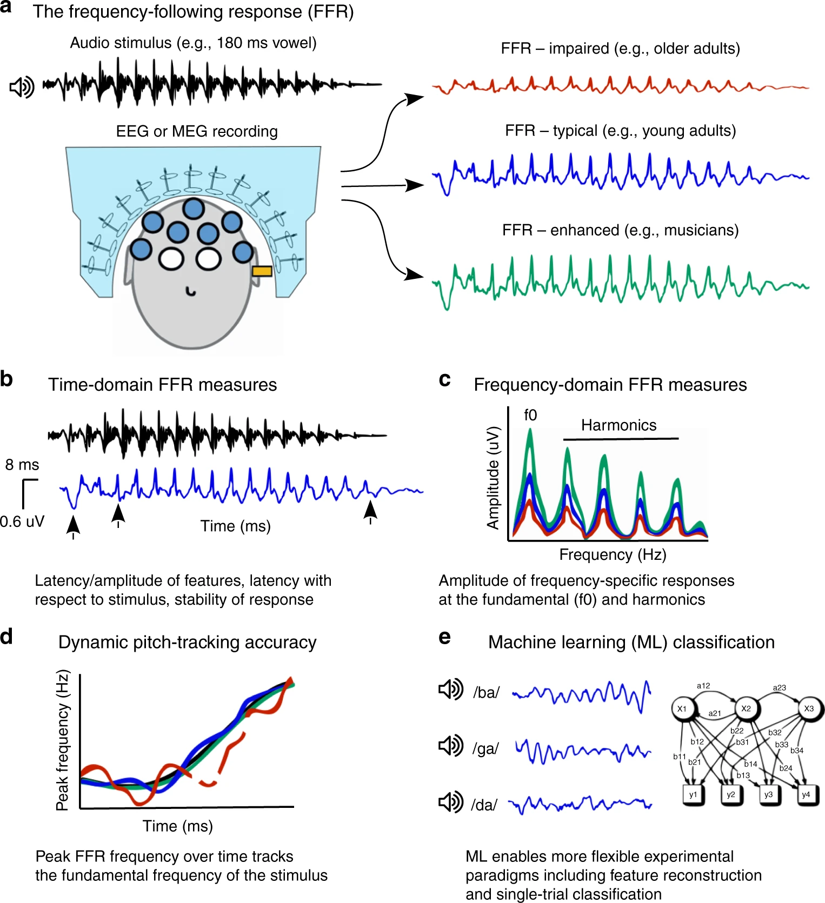
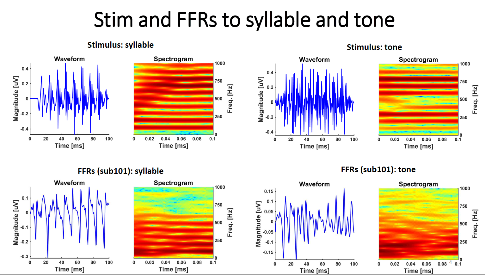
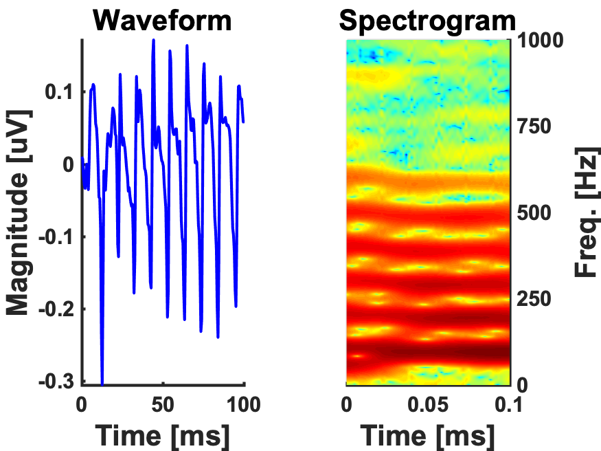
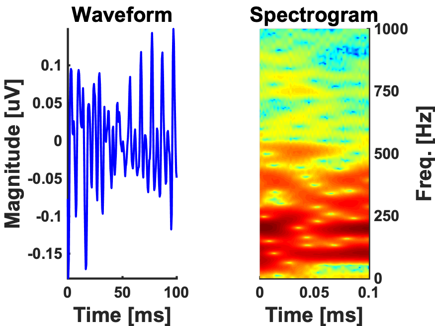
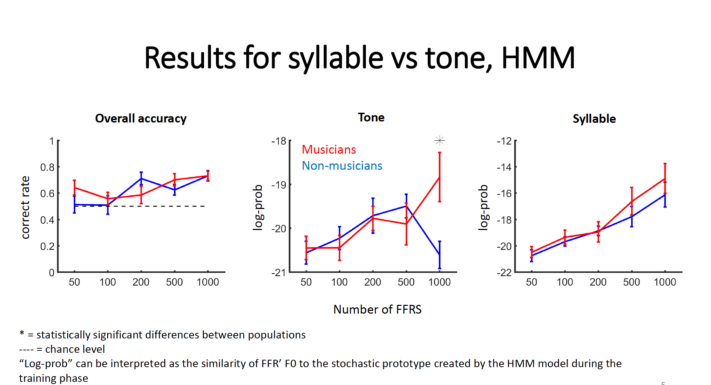

<!-- This is an html comment and this won't appear in the rendered page. You are now editing the "content" area, the core of your description. Everything that you can do in markdown is allowed below. We added a couple of comments to guide your through documenting your progress. -->

## Project Definition

This tutorial first aim is to provide a reproducible workflow, that is beginner-friendly, with machine-learning (ML) procedures written in MATLAB. As I am novice with coding, I aim to implement a classifier that I use repeatively in my doctoral research (an Hidden Markov Model [HMM]) into a structure that would provide some flexibility for future usages (with other variables or datasets), and would allow to build extensions (e.g. for other classifiers such as a Support Vector Machine (SVM), Cross-correlation (XCorr), LSTM). I aim to put together a set of resources that would be accessible to my research assistants, collaborators (who also have students to train on these ML procedures), other FFR researchers, and my futur self! Thus, the data of this tutorial will be in format that align with components of standards in project management (EEG-BIDS), use jupyter notebooks implemented in a virtual environment (allowing the use MATLAB scripts), and use basic matlab visualization tools to generate figures of the results. 

## Notes on Open Science Practices and Matlab

_Is it mandatory to abandon MATLAB to have open science practices? Matlab may be a commercial software, but it would be sad to limit the open science movement to open source software users. Specialized fields, such as FFR research, have the wide majority of their resources, expertise, and tools in matlab. Thus, at the current moment, it would be extremely difficult to study FFR without using MATLAB. Nevertheless, there are many open science tools that are compatible with matlab scripts and files. Hence, I tried to implement an open approach in this ML tutorial. Feel free to contribute to it or indicate issues with the link below. We aim to build from this structure and repository!_ https://github.com/brainhack-school2020/ArsIsabelle_BHS_Project  

### Hidden Markov Model - Classification Goal: 

The machine-learning classifier targeted in this tutorial, the Hidden Markov Model, aims to classify __if the EEG-FFRs__ of each participants __were generated by__ a stimulus that was either a __speech sound__ or a __piano tone__ of the same fundamental frequency (98 Hz) and duration (100ms). These procedures were done on 26 participants (13 musicians vs. 13 non-musicians). 

As the equipment used to collect FFRs and population targeted can influence the quality of the signal, this script also __tracks the number of FFR trials__ required to obtain certain levels of __decoding accuracy__. This information is useful to validate experimental procedures, adjust research designs and target research questions. As enhanced FFR reproduces features of the stimuli with more fidelity, the decoding accuracy of the classifier can be __used as a dependent measure__ to reveal experience-dependent effects in certain populations (Llanos et al., 2017; 2019). 

### Background

Over the last decades, neuroimaging studies have provided cumulative evidence of the benefits of musical training, in particular how such training promotes neuroplasticity (Herholz et al. 2012). A clear benefit of musical training is manifested at the level of the frequency following response (FFR), an electrical potential sensitive to phase-locking captured by EEG that arises from subcortical and cortical sources (Coffey et al., 2016). The FFR is an extremely rapid (starting at 7 ms) reaction of the brain to an auditory stimulus. It is a neural representation of the periodicity of the entering auditory information and allow us to recognize speech or music sounds (Coffey et al., 20161; Kraus et al., 2010; 2014; 2017b; 2017c). With both cortical and subcortical contributors that modify its quality (Coffey, Herholz, Chepesiuk, Baillet, & Zatorre, 2016), the FFR represents an integrated response of the entire auditory system (Irvine et al., 2018).  

Interestingly, the FFR varies in individuals as a function of experience (enhanced in musicians, tonal language speakers, bilinguals [Coffey et al., 2016; Kraus & Chandrasekaran, 2010; Krizman, Marian, Shook, Skoe, & Kraus, 2012]) or pathologies (decreased in autism, dyslexia, traumatic brain injuries [Hornickel & Kraus, 2013;  Nina Kraus et al., 2016;, for extensive literature survey, see Kraus et al., 2017]. Several authors have thus proposed that it may serve as an auditory biomarker to target treatments and educational interventions (Kraus et al., 2015; Bidelman et al., 2017). Musicians are of particular interest because of correlations between the augmentation of their FFR quality and enhancements in their perception skills (Coffey et al., 2016; Kraus & Chandraserakan, 2010). The greater the musical training, the closer the neuronal representation approaches its corresponding auditory stimuli (Kraus et al., 2010b, 2015, 2017). The signal is transmitted faster, and becomes more precise and robust, which then benefits higher-order cognitive functions (Coffey et al., 2016; Kraus, Anderson, White-Schwoch, Fay, & Popper, 2017). This is a remarkable phenomenon, but how these enhancements are achieved remains unclear because of technical limitations associated with the neural signal. 

A considerable challenge for the understanding of FFR enhancements mechanisms is the very small amplitude (measured in nanovolt) and the bad signal-to-noise ratio (SNR) of the neural signal. Hence, recording FFRs typically requires several thousand exposures to the same auditory stimulus (which are averaged to cancel out the noise). These constraints considerably limited the research questions that could be expored with FFRs, while this signal would remain a key component of neuroplasticity mechanisms associated with musical training. 

Fortunately, machine-learning classifiers recently developed with speech-evoked neurophysiological responses have considerably reduced the number of trials necessary to obtain a usable FFR signal (Xie et al., 2019). The classification of FFR is starting to emmerge as an objective mean to assess auditory perception (Holdgraf et al., 2017; Llanos et al., 2019). The current BHS project aims to run one of these classifiers, which I also use in my doctoral research, on FFR-EEG data. I hope to implement these ML procedures in a way that will facilitate access, collaborations and open science practices.  

#### The Frequency Following Responses: Procedures (a), Features (b-d) and Machine-Learning Analysis (e)

_Figure from [Coffey et al., 2019](https://www-nature-com.proxy3.library.mcgill.ca/articles/s41467-019-13003-w), with permission)_

### Tools

The "EEG-FFR Classification" project will rely on the following technologies:
 * Bash Shell
 * [Markdown](https://guides.github.com/features/mastering-markdown/)
 
 * MATLAB
 * MATLAB Toolboxes (GPU, Bioinformatics, and HMM)  
 * Jupyter Notebook
 * MATLAB script of an Hidden Markov Model (originally developed by F. Llanos)
 * A Virtual Environment for Jupyter Notebook with MATLAB
 * Supplementary classifiers scripts (SVM, X-Correlation and SLTM developed by F. Llanos)
 
 * GitHub 
 * GitKraken
 * BIDS-EEG format 
 * Data Archiving with OSF
 * Open Source Licence compatible with Matlab Scripts (MIT)

### Data

The dataset for this tutorial project was previously published and generously provided by Emily Coffey and colleagues from the Zatorre Lab at McGill University (see Coffey et al., 2017). It consists of a set of pre-processed EEG-FFR collected with 27 subjects (13 musicians and 13 non-musicians) and the auditory stimuli used during the data collection. Demographic and music experience information (collected with the Montreal Music History Questionnaire [Coffey et al., 2011]) will also be made available on OSF for futur analysis, but is not explored under the scope of this tutorial. Thus, the data under this project is limited to the auditory stimuli (.wav) and EEG-FFR (.eeg) files. 

For more details on this dataset, please see [Cortical Correlates of the Auditory Frequency-Following and Onset Responses: EEG and fMRI Evidence](https://www.jneurosci.org/content/37/4/830). Questions can also be directed to emily.coffey@concordia.ca 

#### 1) Stimuli

The auditory stimuli used were a speech |dah| and a piano tone stimuli, with both a duration of 100ms and a fondamental frequency of 98 Hz. Stimuli were presented in blocks of da/piano, alternating polarity every second stimulus (see Krizman & Kraus, 2019 for more information about alternating the stimulus polarity).

100ms 'da' syllable-stimuli vs piano tone-stimuli compared to the FFR of Subject 101

#### 2) EEG Data

The EEG data is provided from each subject separately as a MATLAB structure array with two fields: .eeg and .sti. 
The name on the structure array represents the subject number (e.g. 001). The first field (e.g., 001.eeg) contains a * .mat 2-dimentional matrix with the EEG data. Rows and columns will correspond to single-stimulus trials and EEG data-points, respectively. The second field (e.g., 001.sti) is a * .mat 1-dimensional vector including the target stimulus numbers associated to each row in the EEG matrix. 

If you use this classifier with a different EEG-FFR dataset, note that before creating a MATLAB matrix, you will need to make sure that your EEG data has been already re-referenced, band-pass filtered (zero phase filter, pass-band from 80 to 1000Hz) and that its sample rate is higher than 2000Hz. You will also need to adapt the scripts "setup.m" to the features of your dataset.

#### 3) Important Data Information (Required to adjust the scripts if used with other dataset)

* __Pre-Stimulus Duration__: 50 ms
* __Stimulus Duration__: 100 ms 
* __Trial Duration__: 0.2228 seconds
_(Note from 1st author: "It is a funny number because I shifted the data to account for air conduction delay such that 0 (or 50 ms into the file) is when the sound hits the ear) - in any case there are 3650 data points at 16384 Hz.")_
 
 * __EEG Sample-Rate__: 16384 Hz
 * __Artifact Rejection Criteria (if any)__: None in the current pre-processed dataset 
 _(Note from 1st author: "In the data used for the Jounal of Neuroscience publication, a precedure based on similarity to the grand average was applied. It was less appropriate to use such a procedure here as it may mask some of the inter-individual differences we are interested in.)_/   
* __Electrodes used for re-referencing__: This was a simple Cz to linked mastoids montage, it's already been referenced.

Here is what a grand average of the FFR looks like:

100ms 'da' syllable-FFR (_N=26_)

100ms piano tone-FFR (_N=26_)
 

## Results

### Progress Overview

I faced a few challenges with the matlab jupyter notebook as it required extra installation and set-up that needed to be addressed to access the tutorial. I realized that I missed elements to have a more reproducible workflow so I decided to adapt to tutorial accordingly. I found myself with a lot more text than I would have thought for something beginner-friendly! However, by the end of this project, I became able to run classifiers on EEG-FFR and have a structure for the scripts and workflow documentation that I will be able to reuse (with more ease) in the future. I must say that there is a considerable amount of revisions needed in my HMM Notebook and on the overall documentation for this tutorial to be beginner friendly. I actually ended up making a [notebook tutorial](https://github.com/brainhack-school2020/ArsIsabelle_BHS_Project/blob/master/Tutorial_Introduction.ipynb) on how to use the tools of this tutorial!! There is also a lot of text epuration that I need to do, and the scripts needs a bit of modification (for the subjects selection, in order to be able to reproduce all the figures). In order to be usable with other datasets, the script setup.m still require more comments and annotations). I also have MIT licences that needs to be extended & procedures for futur scripts that needs to be archived. I think that using the "Project" section on the git repository might be the next step to keep track of what is left to do. Nevertheless, the EEG-FFR dataset is achived on osf.oi and I feel that I got my lab more invaded by open sciences practices. So at this point, the seeds are at least planted and I hope that this project, even if in a rougher shape right now, will grow from there. 

### Tools I learned during this project

 __ALL__ the tools I mentioned in the 'Tools' list above! 

### HMM Classification Results

The figure below shows the results for overall HMM decoding accuracy of the syllable vs. tone FFRs. Recognition above chance start at about 100 trials (left panel). Differences related to music experience do not emerge until 1000 trials (center panel). As well, differences related to music experience only emerge for the HMM decoding of the tone (musicians>non musicians); they are not present for the decoding of the syllable stimuli (right panel). 

It is worth noting that the absence of music experience differences in overall decoding accuracy ( syllable & tone together), even with 1000 trials, may be related to the fact that both populations are familiar to the syllable (e.g. both musicians and non-musicians skpeak and use the syllable |da| in their everyday life). This possible explanation is supported by the fact that no music experience differences seem to emerge from the HMM decoding of the syllable stimulus (right panel). Hence, the music experience differences in the HMM decoding of the auditory stimuli could be related to the familiarity to the auditory stimulus, which is greater for the piano tone among musicians. 

As both the tone and the syllable share the same F0 contour, it is worth emphazing that the differences in the FFRs are really fine. More than 100 trials to reach accuracy over chance may be improved by abjusting the parameters of the HMM. (However, this require further exploration and would be under the scope of another tutorial.) It may also take hundreds of trials for very small context-determined perturbations to emerge in the FFR. Further experimentation will tell! :)  

## Course Deliverables

#### ASSIGNMENT WEEK 1: [P-Hacking Exercise](https://github.com/arsisabelle/Arseneau-Bruneau-I-QLSC612)
#### ASSIGNMENT WEEK 2: [README.md File](https://github.com/brainhack-school2020/ArsIsabelle_BHS_Project/blob/master/README.md) + Issues
#### ASSIGNMENT WEEK 3: [Video Presentation of the Project](https://www.youtube.com/watch?v=6lX_-AgOXug) 
#### ASSIGNMENT WEEK 4: [Project Repository](https://github.com/brainhack-school2020/ArsIsabelle_BHS_Project) 

## Project Deliverables

 - [Project in the Gallery of the BHS website](https://school.brainhackmtl.org/project/EEG-FFR-Classification)
 - Project Report ([README.md File](https://github.com/brainhack-school2020/ArsIsabelle_BHS_Project/edit/master/README.md))

 - [Video Introduction on this project](https://www.youtube.com/watch?v=6lX_-AgOXug) 
 - Documentation for a reproducible ML workflow 
 - [Tutorial Introduction Jupyter Notebook (beginner-friendly)](https://github.com/brainhack-school2020/ArsIsabelle_BHS_Project/blob/master/Tutorial_Introduction.ipynb)
 - [Tutorial HMM in Matlab Jupyter Notebook](https://github.com/brainhack-school2020/ArsIsabelle_BHS_Project/blob/master/Matlab_HMM_Scripts_Notebook.ipynb) (beginner-friendly)
 - Stand-alone versions of the [classifiers scripts](https://github.com/brainhack-school2020/ArsIsabelle_BHS_Project/tree/master/FFRclassifiers) for advanced users 
 - [EEG-FFR Dataset shared by the Zatorre Lab (McGill University) on OSF.oi](https://osf.io/c2b3t/?view_only=d1b30d4e0e7c4d53a8ec80d4d87b33d2)
 - Supplementary ML Scripts (SVM, x-corr, and SLTM) created by Fernando Llanos  
 - MIT license (& coming soon: procedures to get open source licence with MATLAB scripts in the future)

#### Supplementary Developments to Integrate to the Tutorial After the BHS 2020
* Adding video of the Setup Procedures and the HMM Workflow
* Fixing the data selection for the SVM and XCorr models 
* Adding a section to explain differences between the folder FFRs and Input1
* Adding a function for subject selection
* Testing the tutorial on different computer
* Integrating the SLTM (script developed by Fernando Llanos)
* Cutting excedentary text
* Extensive proof reading for typos
* Proof reading by a novice learner to identify terms that require explanations 
* Uploading the License procedures for future scripts & tutorials

## Conclusion 

Through this project, the Brainhack School provided me with tools and guidance to tame the aspects of my doctoral research that I feared the most (programmation, machine-learning, neural signal analysis)! I still have a lot to learn, but I now feel that with the jupyter notebook tutorials, with organized documentation to reproduce the workflow, and an extendable structure for the scripts, I now have many elements in place to continue to learn and to share with other. Many seeds are planted, I just need to keep growing! As a matter of fact, the structure generated by this project will serve to integrate other classifiers that my research team will use. (Although, you may check the list ('Supplementary Developments') in the last section to see all the items that need to be done next). Thus, this project/tutorial does not finish with the BHS. That is a good news, right?!

With an Open Science approach, I also found practices in academia that resonnate much more with values in research that I aim to encourage, accessibility being at the core of these. (Perhaps, did I become a little less cynical?) Anyways, even if we look at this only practically, it remains that the tools that I developed through this project will facilitate my work at the lab as well as the exchanges with current and future collaborators. Hopefully, these platforms will increase the impact of my research. In the very least, I will be able to direct colleagues and students to online-resources when they ask about the analysis techniques used in my research. 

## Acknowledgement

I would like to acknowledge the assistance (and patience!) of Pierre Bellec, Tristan Glatard, and Yann Harel as my Individual Instructors at the Brainhack School Montréal 2020 and the __extremely generous__ contributions of my collaborators Fernando Llanos (for the classifiers original scripts, recommendations on the HMM report conclusions and the two aggregated figures), Emily Coffey (for providing the dataset and information about it), as well as Marcel Farres Franch (for regular rescues and technological assistance, notably with Git Hub and Git Kraken).

## References 
Coffey, E. B. J., Herholz, S. C., Chepesiuk, A. M. P., Baillet, S., & Zatorre, R. J. (2016). Cortical contributions to the auditory frequency-following response revealed by MEG. Nature Communications, 7, 11070. https://doi.org/10.1038/ncomms11070

Coffey, E. B. J., Musacchia, G., & Zatorre, R. J. (2016). Cortical correlates of the auditory frequency-following and onset responses: EEG and fMRI evidence. Journal of Neuroscience, 1265–16. https://doi.org/10.1523/JNEUROSCI.1265-16.2016

Coffey, E. B. J., Nicol, T., White-Schwoch, T., Chandrasekaran, B., Krizman, J., Skoe, E., Zatorre, R. J., & Kraus, N. (2019). Evolving perspectives on the sources of the frequency-following response. Nature Communications, 10(1), 5036. https://doi.org/10.1038/s41467-019-13003-w

Herholz, S. C., & Zatorre, R. J. (2012). Musical Training as a Framework for Brain Plasticity: Behavior, Function, and Structure. Neuron, 76(3), 486–502. https://doi.org/10.1016/j.neuron.2012.10.011

Holdgraf, C. R., Rieger, J. W., Micheli, C., Martin, S., Knight, R. T., & Theunissen, F. E. (2017). Encoding and Decoding Models in Cognitive Electrophysiology. Frontiers in Systems Neuroscience, 11. https://doi.org/10.3389/fnsys.2017.00061

Krizman, J., & Kraus, N. (2019). Analyzing the FFR: A tutorial for decoding the richness of auditory function. Hearing Research, 382, 107779. https://doi.org/10.1016/j.heares.2019.107779

Llanos, F., Xie, Z., & Chandrasekaran, B. (2019). Biometric identification of listener identity from frequency following responses to speech. Journal of Neural Engineering, 16(5), 056004. https://doi.org/10.1088/1741-2552/ab1e01

Llanos, F., Xie, Z., & Chandrasekaran, B. (2017). Hidden Markov modeling of frequency-following responses to Mandarin lexical tones. Journal of Neuroscience Methods, 291, 101–112. https://doi.org/10.1016/j.jneumeth.2017.08.010

Xie Z., Reetzke, R., & Chandrasekaran, B. (2019). Machine Learning Approaches to Analyze Speech-Evoked Neurophysiological Responses. Journal of Speech, Language & Hearing Research, 62(3), 587–601. https://doi.org/10.1044/2018_JSLHR-S-ASTM-18-0244

Yi, H. G., Xie, Z., Reetzke, R., Dimakis, A. G., & Chandrasekaran, B. (2017). Vowel decoding from single-trial speech-evoked electrophysiological responses: A feature-based machine learning approach. Brain and Behavior, 7(6), e00665. https://doi.org/10.1002/brb3.665