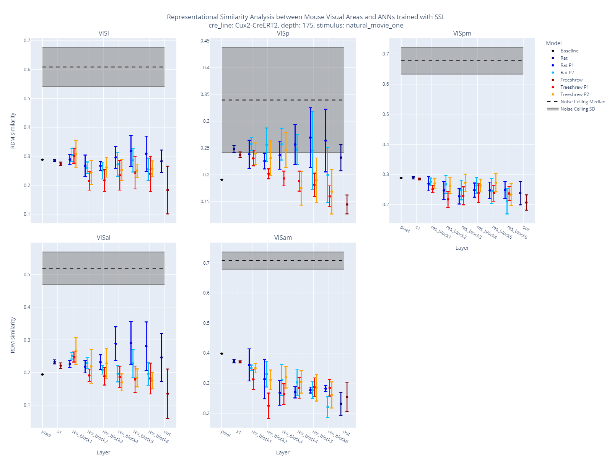
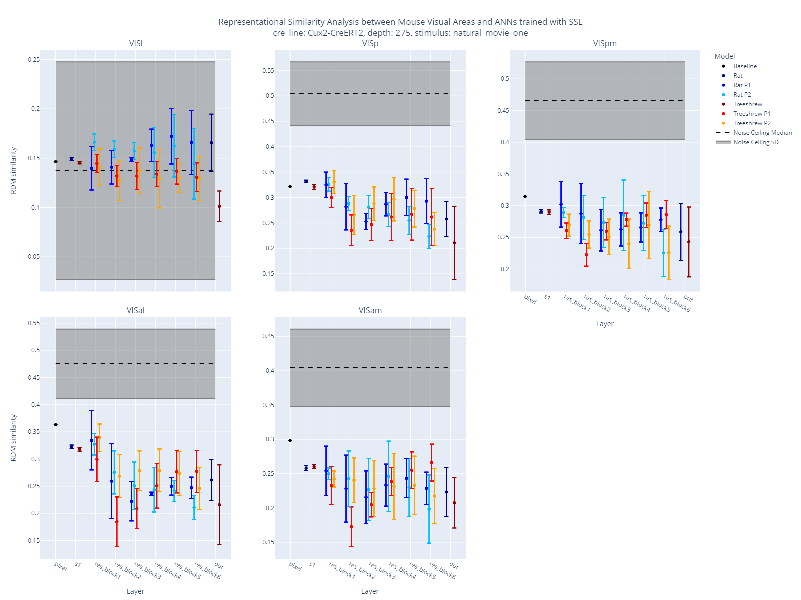
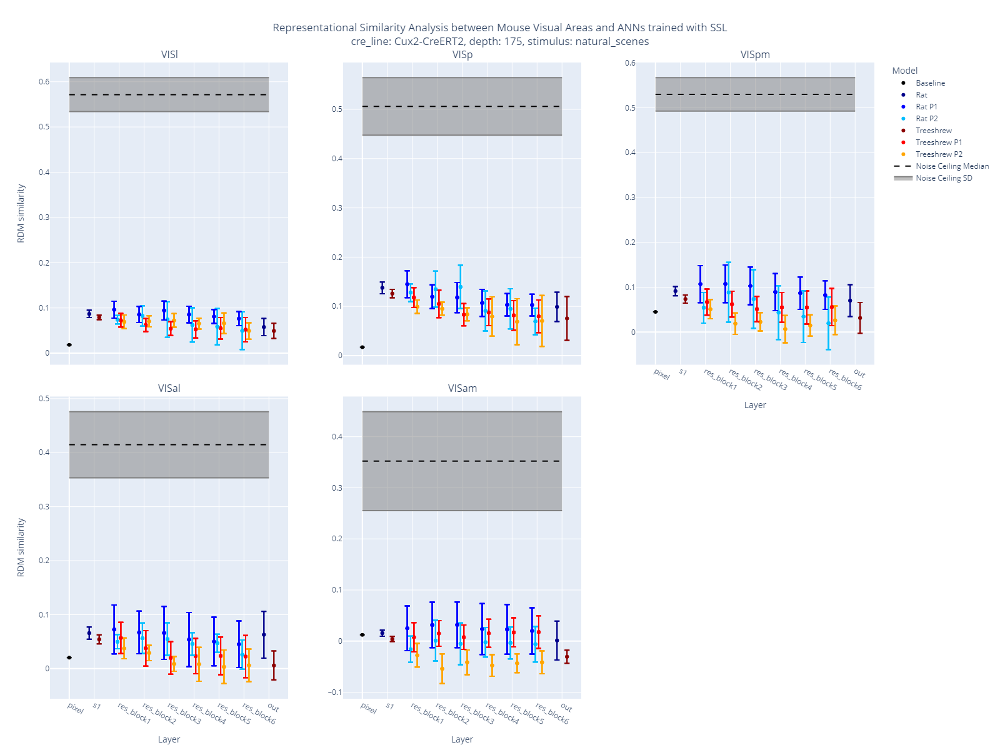
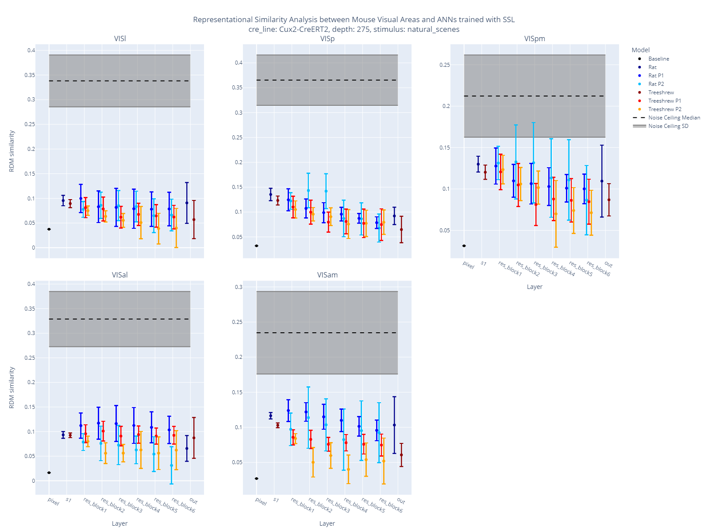

<!-- This is a html comment and this won't appear in the rendered page. You are now editing the "content" area, the core of your description. Everything that you can do in markdown is allowed below. We added a couple of comments to guide your through documenting your progress. -->

## Project definition

### Background

* ANN models are often used to understand the visual system in the brain, specifically the ventral pathway.
* First, image classification models were shown to predict neural responses in the ventral pathway ([Yamins et al., 2014.](https://doi.org/10.1073/pnas.1403112111)).
* Similarly, the representations learned by self-supervised models produce good matches to the ventral pathway ([Talia Konkle, George Alvarez, 2020.](https://doi.org/10.1167/jov.20.11.498)).
* Recently, it was shown that it is not only possible to predict neural responses in the ventral pathway but also in the dorsal pathway with a model that has two parallel pathways ([Bakhtiari et al., 2021.](https://doi.org/10.1101/2021.06.18.448989)).
* We trained self-supervised models on videos from treeshrew and rat's point of view with two pathways.
* RSA is used to compare two representational spaces:
  * Response matrices are created for every brain area and every layer of the ANNs, where each element represents the response of a neuron to a video sequence.
  * Use Pearson correlation to calculate the similarity of every pair of columns in the response matrix, forming a Representation Dissimilarity Matrix (RDM).
  * The RDMs describe the representation space in a network, either a brain area or an ANN layer.
  * Kendall’s τ is used between the vectorized RSMs to quantify the similarity between the two representations.

### Tools

The "Evaluating ANNs of the Visual System with RSA" project will rely on the following technologies:
* **AllenSDK** for mouse brain data
* **PyTorch** to retrieve the representations of the ANNs
* **rsatoolbox** for the RSA analysis
* **Plotly**, **Matplotlib** and **Seaborn** for visualizations

### Data

* Our collaborators videos from treeshrew and rat's point of view, which were used to train the ANN models of the visual system using SSL.
* Calcium imaging data from the [Allen Brain Observatory](https://observatory.brain-map.org/visualcoding/).

### Deliverables

At the end of this project, we have:
* A [GitHub repository](https://github.com/brainhack-school2024/crijnen_project) containing the code and model checkpoints to reproduce my results
* A [jupyter notebook](https://github.com/brainhack-school2024/crijnen_project/blob/main/notebooks/analysis.ipynb) of the RSA
* A [jupyter notebook](https://github.com/brainhack-school2024/crijnen_project/blob/main/notebooks/results.ipynb) containing the visualisations of my analysis

## Results

### Visualizing the Representational Similarity Analysis

The following figures show the results of the RSA between the visual system of the mouse brain and the ANNs of the visual system trained on treeshrew and rat videos. 
Each figure shows the similarity between the representations of the visual system and the ANNs for five different brain areas. 
The noise ceiling is shown in grey, the similarity between the representations of the visual system and the rat ANNs is shown in blue, and the similarity between the representations of the visual system and the treeshrew ANNs is shown in red. 
Since the ANN models have two parallel pathways, the similarity between the representations of the visual system and the two pathways of the ANNs are shown separately.
Two stimuli were used: Natural Movie One and Natural Scenes. For each stimulus, I used two depths of mouse brain recordings from the allen brain observatory: 175 and 275, respectively.

#### Natural Movie One Stimuli

#### Natural Scenes Stimuli

## Conclusion and acknowledgement

The results show that the representations of the visual system in the mouse brain are more similar to the representations of the ANNs trained on rat videos than to the ones trained on treeshrew videos. 

I would like to thank the brainhack school for providing me with the opportunity to work on this project. I would also like to thank my collaborators for providing me with the data and the guidance to complete this project.

## References

* [Yamins et al., 2014. Performance-optimized hierarchical models predict neural responses in higher visual cortex](https://doi.org/10.1073/pnas.1403112111)
* [Talia Konkle, George Alvarez, 2020. Deepnets do not need category supervision to predict visual system responses to objects](https://doi.org/10.1167/jov.20.11.498)
* [Bakhtiari et al., 2021. The functional specialization of visual cortex emerges from training parallel pathways with self-supervised predictive learning](https://doi.org/10.1101/2021.06.18.448989)
