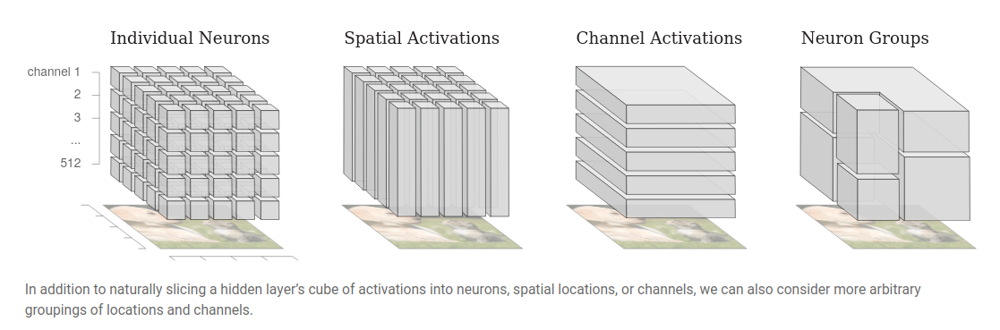
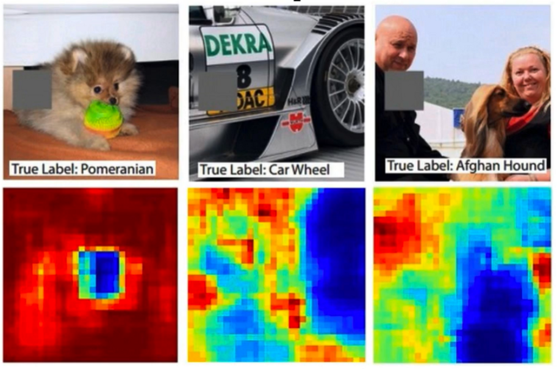

<!-- This is an html comment and this won't appear in the rendered page. You are now editing the "content" area, the core of your description. Everything that you can do in markdown is allowed below. We added a couple of comments to guide your through documenting your progress. -->

# Weights and features visualisation of a neural network

## Context
As Deep Neural Networks become more investigated and used in many fields, the question of how and what such networks decipher in data arise along. These questions seem particularly relevant when using brain encoders and decoders, since it will greatly help in understanding how such models whether differ from actual brain processing, or work in similar way, as much as our knowledge goes about these processes. Visualisation of weights and how they specialized or not in differents features in trained networks and during the training could help in better understanding brain processing.

## Project Definition and Overview

### Current state of the project
   This project was made during Brainhack School 2022 in Montréal, and at first it was supposed to be a whole pytorch module to simplify neural networks investigations.
   As I delved further into this field, I quickly realized that this goal was far too wide for a 4-weeks project, so I began experimenting differents libraries such as Pytorch and Tensorboard.
   Even if BrainHack School has ended, this project is still a work in progress, as it give me an excuse to play and experiment with different ways to visualize model weights & features.
   Right now I'm examining occlusion as a way to investigate CNN processing, especially in visual and audio modality.

### Installation of Deliverable
Right now, the module is still quite empty as it is more a playground than anything else.
I still intend to develop it more, so that it can be used to visualize activation maps and heatmaps resulting from occlusion in CNN, especially in audio CNN.

Even so, I tried to have a public repository clean and easily shareable ; You can install this module by downloading it from GitHub and and using the following command inside the repository : 

`pip install -e .`

## To-Do List (not ordered)
- finish occlusion test with VGG16 and others visual networks : on it
- implementing auditory occlusion (time, frequency): on it
- exploring others occlusion caracteristics (visual, audio)
- implementing real testing that makes sense for this project
- separating user's interface (occlusion module) from source code
- create more utils for modifying data samples
- documenting the functions 
- ... and a lot more probably.

## Tools that are used in this project
- Python and Python libraries: 
   - Deep Neural Networks : Pytorch.nn, Torchvision and Pytorch.utils.tensorboard (some trials in Keras, not present in the repo)
   - basic data manipulation : Numpy, Pandas, PIL, Librosa ...
   
- High Performance Computing : Compute Canada (trial tests with Tensorboard)
- Control Versioning : Git and Github
- module packaging : pypi, setuptools
- testing (WIP, not present in this repo) : pytest, GitHub Actions

 ## Bibliography
 Here's some documentation that I used to better understand the field:
   - [Visualizing Weights](https://distill.pub/2020/circuits/visualizing-weights/) by Voss and collaborators
   - [The Building Blocks of Interpretability](https://distill.pub/2018/building-blocks/) by Olah and collaborators
   - [Looking inside neural nets](https://ml4a.github.io/ml4a/looking_inside_neural_nets/)
   - [A Guide to Understanding Convolutional Neural Networks (CNNs) using Visualization](https://www.analyticsvidhya.com/blog/2019/05/understanding-visualizing-neural-networks/) by Saurabh Pal
   - [An Interactive Visualization for Feature Localization in Deep Neural Networks](https://www.frontiersin.org/articles/10.3389/frai.2020.00049/full) by Zurowitez and Nattkemper
   - [A Survey on Understanding, Visualizations, and Explanation of Deep Neural Networks](https://arxiv.org/abs/2102.01792) by Atefeh Shahroudnejad
   - [Visualizing Convolution Neural Networks using Pytorch](https://towardsdatascience.com/visualizing-convolution-neural-networks-using-pytorch-3dfa8443e74e) by Niranjan Kumar
   - [#028 PyTorch – Visualization of Convolutional Neural Networks in PyTorch](https://datahacker.rs/028-visualization-and-understanding-of-convolutional-neural-networks-in-pytorch/)

## Conclusion and acknowledgement

Thanks for everyone in the brainhackschool team !
