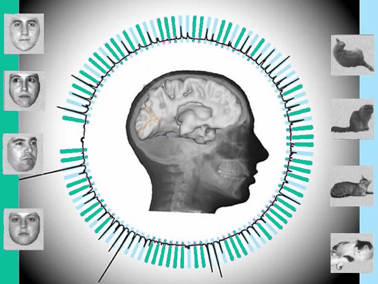
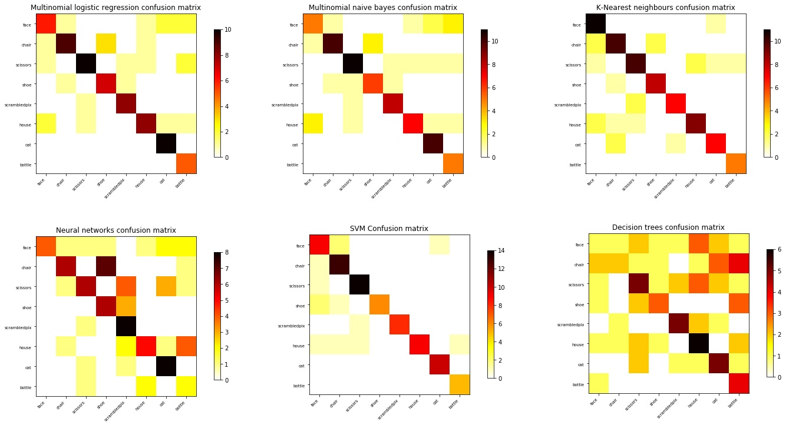
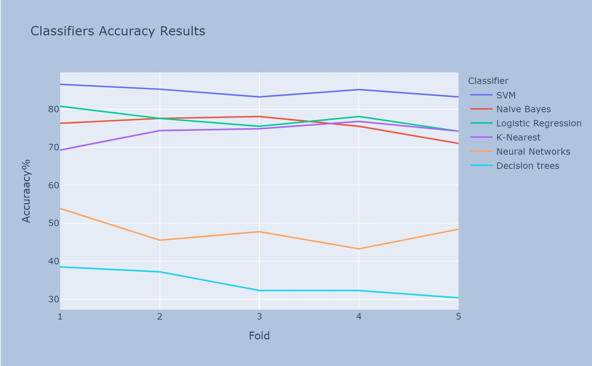
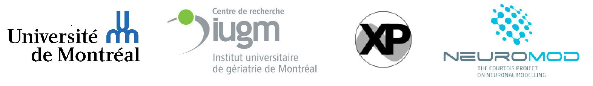

<!-- This is an html comment and this won't appear in the rendered page. You are now editing the "content" area, the core of your description. Everything that you can do in markdown is allowed below. We added a couple of comments to guide your through documenting your progress. -->

# Intro to brain decoding and classification of Haxby dataset using six different common approaches

 

## Project definition

### Background
I have B.S in computer software engineering and currently I am a Master’s student in computer science at Université de Montréal (Jan. 2020). Since I am still in the early steps of my master’s project, my main goal is to learn as much as possible and making use of several tools that we have learned during BHS training courses.

### Brain_decoding overview
Brain decoding or mind-reading using neuroimaging data has been an active topic for years. This project focused on brain decoding using visual stimuli. In the human brain, the functional architecture of the object vision pathway can be investigated using fMRI. It can be done by considering the patterns of response in the ventral temporal cortex while subjects are looking at the different objects. Several studies indicate that the brain responses to the vision of each category of objects are widely distributed and overlapping. Therefore, a distinct pattern of response exists for each stimulus category in the ventral temporal cortex.

### Project
For BHS project, I ran and compared the results of six common classifiers ("Naive Bayes", "Nearest Neighbours", "Neural Networks", "Logistic Regression", "Support vector machine" and "Decision trees" classifiers) on Haxby dataset. During the classification stage, I was trying to find the best results for each approach by playing with parameters. As an example, for Neural Networks classifier, my accuracy result increased significantly when I changed some parameters (it is indicated in the Classifiers.ipynb). 
This change of accuracy made me curious about training ANN on Haxby dataset to examine its performance and learn better about this method (that wasn't a plan at the beginning). Moreover, to make the notebook reproducible and easy to follow for those who don't have a background of machine learning (similar to me before Brainhack school!), I have added a clear description for each cell and a quick overview of each classifier's theory.

### Tools
* Git/Github
* Nilearn & sklearn
* Python visualization, statistics & machine learning libraries (e.g. NumPy, Seaborn, scikit-learn, Matlplotlib, nibabel, graphviz, and pydotplus)
* Compute Canada/Calcul Québec
* Binder

### Data
For BHS project I used [Haxby et al.(2001)](http://data.pymvpa.org/datasets/haxby2001/) which is a high-quality block-design fMRI dataset from a study on face & object representation in the human ventral temporal cortex (This cortex is involved in the high-level visual processing of complex stimuli). It consists of 6 subjects with 12 runs per subject. In this experiment during each run, the subjects passively viewed greyscale images of 8 object categories, grouped in 24s blocks separated by rest periods. Each image was shown for 500ms and was followed by a 1500ms inter-stimulus interval.

### Progress overview

**Week 1:** During BHS training week I was trying to use the new concepts that we learned, by practicing and following different tutorials. I started using Git & Github.

**Week 2:** In the second week, I created the README file, made slides and became prepare for the project draft presentation. Moreover, I started to play with brain decoding scripts, mostly by following Nilearn and sklearn tutorials. I explored how they work by experimenting and personalizing them.

**Week 3:** From the third week, I started to create my main jupyter notebook called [Classifiers.ipynb](https://github.com/brainhack-school2020/BHS_project_SRastegarnia/blob/master/Classifiers.ipynb) to try six different classification methods on Haxby dataset and compare the results. For me, this approach was challenging not only because of writing scripts but also for understanding the classifiers algorithms and work follows. Since I am new in this field and have never had a machine learning course before, I had to read several references to figure out these approaches, their strengths, and their weaknesses. It gave me the opportunity to learn about several ML models and to get a much better understanding of the reasons that some classifiers return better results on certain datasets compared to the rest.

**Week 4 & 5:** During these weeks, I executed some performance metrics such as "Classification Accuracy”, "Cross-Validation" and “Confusion Matrix” in order to check my different ML model results. I also added documentation to make my notebook reproducible and easy to understand for everyone even those without ML background.  Moreover, I uploaded and ran one of my scripts on Compute Canada.
After doing all the mentioned tasks, I decided to try a more complicated model and as I mentioned above I chose ANN that can be found as [ANN_onHaxby.ipynb](https://github.com/brainhack-school2020/BHS_project_SRastegarnia/blob/master/ANN_onHaxby.ipynb). Similar to the previous notebook I added a quick review about the ANN algorithm and some explanation for all the cells in order to make it easy to follow.

I have written down all my progressions in detail, divided per week, in my BHS repository [README](https://github.com/brainhack-school2020/BHS_project_SRastegarnia/blob/master/README.md) file under "TO-DO LIST " section.

## Results
The following figures demonstrate the confusion matrix of all the classifiers.

 

As depicted in the following image the support vector machine classification has the best performance while the decision tree returned the worst accuracy, which is understandable considering the classifiers algorithms and the nature of the data.

 

### Tools I learned during this project

 * **Git/Github** 
 * **Terminal and Shell commands** 
 * **Compute Canada/Calcul Quebec** 
 * **TensorFlow** 
 * **New python libraries**
 * **Binder**
 * **Nilearn**
 
In general, this course taught me how to make a deliverable project based on open-science.

### Deliverables

* [Jupyter Notebook with code to produce plots of my results](https://github.com/brainhack-school2020/BHS_project_SRastegarnia/blob/master/Data-visualization.ipynb)
* [Jupyter Notebook with code for comparing different classifiers](https://github.com/brainhack-school2020/BHS_project_SRastegarnia/blob/master/Classifiers.ipynb)
* [Jupyter Notebook with code for Artificial Neural Network model training](https://github.com/brainhack-school2020/BHS_project_SRastegarnia/blob/master/ANN_onHaxby.ipynb)
* [Jupyter Notebook with code for introduction to brain decoding](https://github.com/brainhack-school2020/BHS_project_SRastegarnia/blob/master/BHS_Haxby_BrainDecoding.ipynb)
* [Batch script used on Compute Canada to run BHS_Haxby_BrainDecoding.py script](https://github.com/brainhack-school2020/BHS_project_SRastegarnia/blob/master/BHS_Batch.sh)
* [Github repository including project description with all mentioned Jupyter Notebooks clearly commented](https://github.com/brainhack-school2020/BHS_project_SRastegarnia)
* [First](https://drive.google.com/open?id=1ABaOXwWPks8xB28OlkiwDvqx7D0B2htQ) and [Final](https://drive.google.com/file/d/1qFHRrdjRLgfP-5dDYNs12vHyDhFCYVp6/view?usp=sharing) presentation slides
* Final report summarizing the entire project

### Future directions
My future goal post brain hack school would be increasing my knowledge of machine learning and deeplearning and training and learning about different models including GCN!

## Special thanks to:
Pierre Bellec, Désirée Lussier,Valerie Hayot and Jacob Vogel for all their help and support during Brain hack school time!

## Aknowledgments

 
