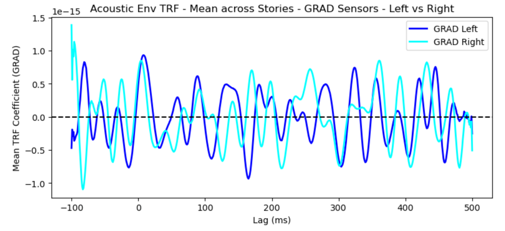
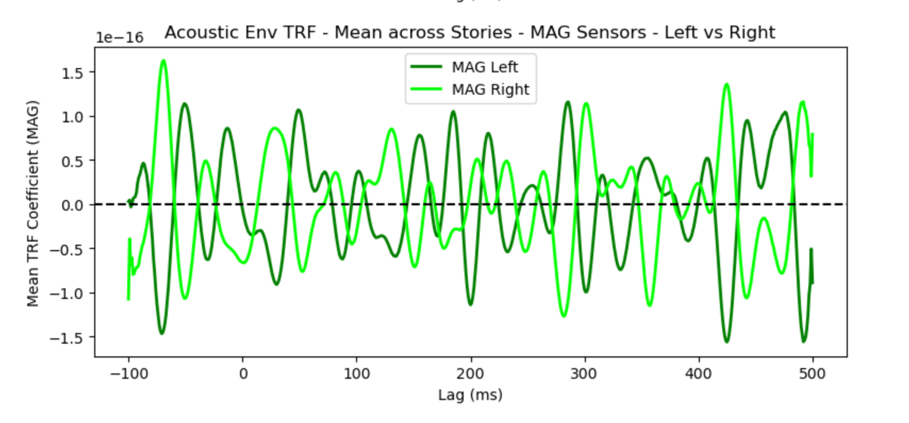
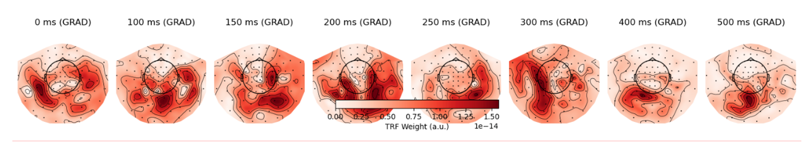
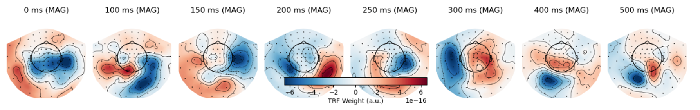

<!-- This is an html comment and this won't appear in the rendered page. You are now editing the "content" area, the core of your description. Everything that you can do in markdown is allowed below. We added a couple of comments to guide your through documenting your progress. -->

## Project definition

### Background

This project was developed as part of Brainhack School 2025, where students from diverse backgrounds explore neuroscience tools through hands-on, open-science projects. Inspired by this spirit, I set out to investigate how the brain responds to naturalistic language.

Specifically, I used the SMN4Lang dataset, which provides synchronized MEG and audio recordings of Mandarin stories. By extracting time-aligned word-level features and modeling their relationship to brain signals using Temporal Response Functions (TRF), I explored how different linguistic properties -such as the acoustic envelope -shape neural responses.

At first, I couldn't really tell if the signals made any sense. But after much trial and error (and some brave plotting), the curves started to take shape - and although I still wasn't sure how meaningful they were, the instructor at my final presentation said they "mean something." That gave me a surprising sense of accomplishment.

The project also included a bold, exploratory attempt to decode word categories using machine learning... which didn't quite work - but the learning process absolutely did.

### Tools

The "Chi_brainhack_project" project will rely on the following technologies:
 * MNE-Python: For preprocessing and analyzing MEG data, including filtering and visualization.
 * NumPy: For numerical operations and signal processing.
 * Matplotlib: For generating custom plots and visualizations.
 * Scikit-learn: For an exploratory (and brave) attempt at machine learning–based word classification.
 * Jupyter Notebook: To write, test, and document code in an interactive, reproducible way.
 * Git & GitHub: For version control and sharing the project with the Brainhack community.

### Data

This project uses the SMN4Lang dataset(https://openneuro.org/datasets/ds004078), which contains magnetoencephalography (MEG) recordings and time-aligned annotations of Mandarin speech from 60 naturalistic story-listening sessions across 12 participants. The dataset includes synchronized audio, transcripts, and preprocessed MEG signals, enabling analysis of how the brain tracks both linguistic and acoustic features during continuous speech.
This rich, real-world dataset allows researchers to move beyond controlled laboratory stimuli and investigate language processing in more ecologically valid settings.

### Deliverables

At the end of this project, the following deliverables were completed:
 - Word-level stimulus .csv tables for each story, including POS, word frequency, and onset time.
 - TRF coefficients for acoustic envelope features, with corresponding visualizations.
 - Scripts to segment raw MEG data based on the annotated word-level features.
 - SVM classification of nouns vs. verbs using LOSO-CV accuracy and feature weight analysis.

## Results

### Progress overview

This project was developed during Brainhack School 2025, where students are encouraged to learn open neuroscience tools through hands-on projects. Initially unfamiliar with MEG data and the TRF framework, I gradually gained confidence by replicating small parts of existing pipelines and troubleshooting errors. The process was at times frustrating, especially when interpreting signal outputs, but became deeply rewarding after discussing the results with instructors who reassured me that "this already means something.

### Tools I learned during this project

 * **MNE-Python** for loading, preprocessing, and analyzing MEG data.
 * **Scikit-learn** for exploratory machine learning (SVM classification).
 * **Matplotlib** for visualization of TRF weights and decoding results.
 * **NumPy / SciPy** for signal processing and numerical computations.
 * **GitHub & Markdown** for project management and documentation

### Results

#### Deliverable 1: Integrating required annotations into a single CSV file

At first, I had to repeatedly load multiple files, and I was always worried that the timestamps didn't align correctly or that data types were mismatched. Later, I realized it was more efficient to extract all necessary information and consolidate it into a single CSV file. This made subsequent data access much more convenient and allowed me to quickly visualize and verify the alignment.

* a presentation [made in a Jupyter notebook](https://github.com/Chi-WangPsy/Chi_brainhack_project/blob/main/notebook/alignstimuli.ipynb) 

#### Deliverable 2: TRF coefficients and visualization

I initially attempted to use Brodbeck's eelbrain, but the data format differences caused repeated failures. Eventually, with help from ChatGPT and a better understanding of TRF principles, I created a custom TRF pipeline. In future work, I'd still like to revisit eelbrain since it might produce cleaner TRF signals.

In my current pipeline, I first save the TRF coefficients, which can later be loaded and plotted as needed. I visualized GRAD channels separately, explored hemispheric differences (left vs. right), and also generated topomaps to observe the dynamic patterns across the brain.

**TRF GRAD Waveform**

**TRF MAG Waveform**

**TRF GRAD Topomap**

**TRF MAG Topomap**

* a presentation [made in a Jupyter notebook](https://github.com/Chi-WangPsy/Chi_brainhack_project/blob/main/notebook/TRF.ipynb) showing the analysis process and results.

#### Deliverable 3: Epoching based on word-level timing

Using word-level time-aligned annotations, I segmented the raw MEG data into epochs and saved them for further analysis.

* a presentation [made in a Jupyter notebook](https://github.com/Chi-WangPsy/Chi_brainhack_project/blob/main/notebook/epoch.ipynb) 

#### Deliverable 4: SVM classification

I selected nouns and verbs and fed them into an SVM classifier to test whether they could be distinguished based on brain signals. The output included LOSO-CV accuracy and feature weight analysis. However, I later realized that this approach may not be appropriate and needs further refinement.

* a presentation [made in a Jupyter notebook](https://github.com/Chi-WangPsy/Chi_brainhack_project/blob/main/notebook/POVSVM.ipynb) 

## Conclusion and acknowledgement

This project marked my first journey into analyzing MEG data in a naturalistic language context. Although I encountered early confusion and technical hurdles, I gradually gained hands-on experience in data pipelines, TRF modeling, and machine learning evaluation.

At the outset, I didn't even know how to use Bash. Thanks to the clear and detailed module instructions, I felt like I had evolved from a digital novice into someone capable of confidently navigating their own computing environment.

During the final presentation, the instructor suggested that I treat the Brainhack School Discord community like a real-time GPT-freely asking questions and receiving instant feedback. I believe this approach could help me clarify confusion more efficiently and explore new analysis directions. Moving forward, I hope to become more proactive in seeking support and initiating discussions.

Special thanks to the Brainhack School team and instructors for fostering such a supportive learning environment-one that transformed initial uncertainty into curiosity and meaningful progress.