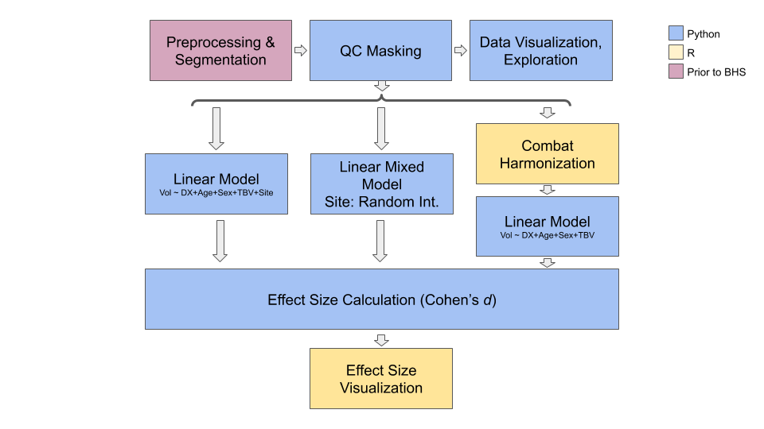
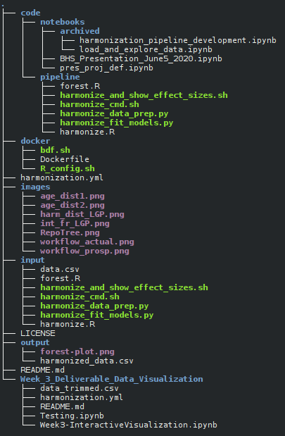
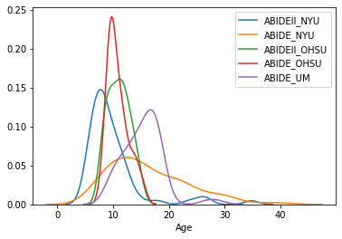
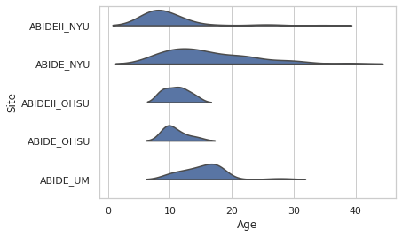
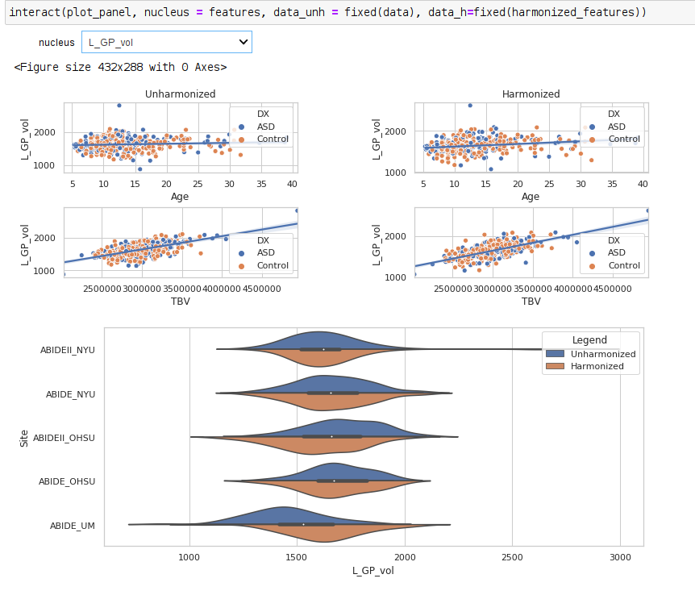
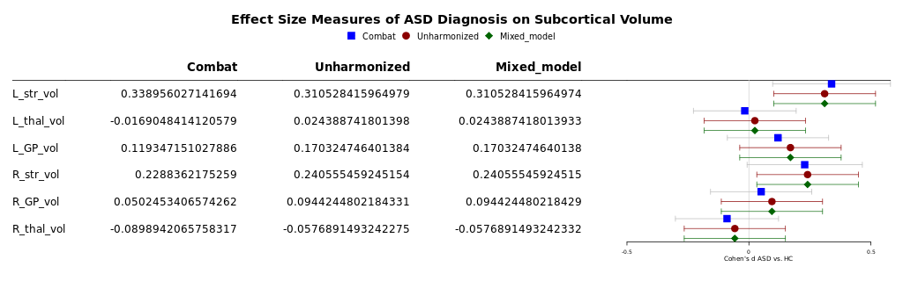

<!-- This is an html comment and this won't appear in the rendered page. You are now editing the "content" area, the core of your description. Everything that you can do in markdown is allowed below. We added a couple of comments to guide your through documenting your progress. -->

# Harmonizing Multi-Site Structural MRI Data Using ComBat

David MacDonald

## Summary 
This project involves using [ComBat](https://github.com/jfortin1/ComBatHarmonization), an open-source library for multi-site data harmonization, to remove site effects from subcortical volumetric data derived from a subset of the [ABIDE](http://fcon_1000.projects.nitrc.org/indi/abide/) dataset, and to compare this method to using linear models and mixed effects models without harmonization. 

## Project definition 
### Background
I have been working with a large, multi-site dataset to examine subcortical anatomy in autism. Multi-site MRI datasets can be difficult to work with, as scans are typically acquired on different equipment, using different protocols, by different operators. In addition, different sites may be sampling different populations. This can result in a dataset in which a significant portion of the variance is due to non-biological factors. Up to now, I have been using meta-analytic techniques to combine the data from the different sites. 

The purpose of this project is to learn and apply two other techniques for inter-site data harmonization:
 * the open source [ComBat](https://github.com/Jfortin1/ComBatHarmonization) library, which was originally intended to mitigate batch effects in genetic studies, but has since been adapted to work with neuroimaging data.
 * linear mixed-effect models. 

Other goals are to: 
 * Use the tools we have been introduced to in the BrainHack School to make this project more transparent, easy to maintain, reproducible, and open to collaboration.
 * To compare these techniques.

### Tools 
Tools learned and used during this project include:
 * git and github for version control, code sharing, project management, and collaboration
 * Bash scripting
 * Jupyter notebook
 * Conda for virtualization, to improve reproducibility
 * Python libraries for data manipulation (pandas), visualization (matplotlib, Seaborn) and analysis (numpy, statsmodels)
 * Interactive figures in Python using ipywidgets
 * [ComBat](https://github.com/Jfortin1/ComBatHarmonization)
 * R, for using ComBat and for some data visualization
 * Docker, to containerize the R- and Python-based pipeline and improve reproducibility
 * DockerHub

#### ComBat
[ComBat](https://academic.oup.com/biostatistics/article/8/1/118/252073) is a tool for mitigating batch effects in genomic data. It has since been [adapted](https://www.biorxiv.org/content/10.1101/116541v1) for use in neuroimaging, and is now [available](https://github.com/Jfortin1/ComBatHarmonization) as an open source library in R, Python, and MATLAB for use in multi-site neuroimaging studies. ComBat harmonizes data by fitting a linear model, with location and scale (L/S) terms accounting for site-specific differences, to the data, then reconstructing each data-point without the location and scale terms. These terms are fit using an Empirical Bayes approach, allowing pooling across features to improve the estimate of site effects.

### Data 
This project made use of subcortical volumes, previously derived from a subset (n = 359, across three sites and two releases) of the [ABIDE](http://fcon_1000.projects.nitrc.org/indi/abide/) dataset using the [MAGeT Brain](https://github.com/CobraLab/MAGeTbrain) pipeline.
 
### Deliverables
 * github repository containing 
    * Analysis code in Jupyter notebooks and the subcortical volume data to be processed 
    * All visualizations for the linear mixed-models and ComBat harmonization implementations 
    * Virtual environment requirements.txt file, or conda environment.yaml file
    * README.md file summarizing the background methodology, and results
    * Final presentation slides

## Progress overview
### Workflow
The workflow encapsulated in the pipeline and jupyter notebook are described in the figure below.

T1w structural MRI scans from several sites in the ABIDE dataset were preprocessed, then segmented using the [MAGeTBrain](https://github.com/CobraLab/MAGeTbrain) segmentation pipeline, which provided volumes for left and right striatum, thalamus, and globus pallidus. The pipeline developed here then masked out volumes for structures that did not pass quality control checks (QC). This data was examined using interactive visualizations in Python and Jupyter notebook. The same masked data was processed in three streams by the pipeline. In all three cases, linear models were used to quantify the effect of an autism spectrum disorder diagnosis on the volumes of the subcortical structures listed above. Age, sex, and total brain volume were used as covariates.

In the first stream, linear models were fit, as shown in the figure, to the unharmonized data, with imaging site added as a covariate. In the second, linear mixed effects models were fit, with site as a random effect (random intercept). In the third, the raw volumes were harmonized using ComBat, and linear models were fit to this harmonized data. The harmonization included age and sex as covariates, to preserve variation due to those factors. Because ComBat was expected to remove site-specific effects, site was not included as a covariate in these models.

Cohen's _d_ effect sizes were computed from the linear models in all three streams. These were used to generate a forest plot, to allow comparison between the three methods.

Note that the Jupyter notebook also supports the examination of the harmonized data.

Data harmonization and effect size visualization were done in R, where the available tools were more sophisticated.

### Pipeline: Python vs. R
Initially, the project was meant to run entirely in Python. However, two challenges arose. First, the current Python version of neuroCombat is not able to accept data with missing values. Since this data is masked based on segmentation quality (structures whose segmentation failed are not used), the data contains missing values. The R version of neuroCombat does support missing values. Also, R has much more sophisticated packages available to generate forest plots, which are used here to compare the results of the different harmonization methods. Since the language of the Brainhack School is Python, the project was reconceived as a mini-pipeline, using both R and Python.

### Jupyter Notebooks
Jupyter notebooks are used in this project both for data visualization and for presentation (using RISE). Initially, data harmonization was done in Python, and all of the code was run inside of Jupyter notebooks. When QC masking was added, it was necessary to move the ComBat harmonization code to R. For this reason, the Jupyter Notebooks depend on having access to the harmonized data from the pipeline. Several interactive visualizations are provided in the Jupyter notebooks, and conda environments are provided to allow them to be run on other machines without version conflicts.

### Docker Container
[neurodocker 0.7.0](https://github.com/ReproNim/neurodocker) was used to create the dockerfile that contained the specifications for the container. This was fairly straightforward:
 1. The neurodocker command was written in a bash script (bdf.sh).
 2. Ubuntu was used as the base. Packages to install in the first layer were specified with neurodocker's --pkg-manager and --install options. Only those packages that were necessary to run the pipeline were installed here.
 3. R configuration was accomplished by instructing neurodocker to include R base packages, and through an additional script that called R to install its own packages and manage dependencies. This resulted in a slightly smaller docker image. The script:
    * Used apt-get to install Ubuntu packages that are required by R to build the R packages that will be installed: make, gcc, g++, but NOT required to run the pipeline.
    * Ran an R command to download and install the necessary packages.
    * Used apt-get to remove the temporary Ubuntu packages (make, gcc, g++ and packages that were installed to satisfy their dependencies).
    * Cleared the apt cache.

The docker container was configured to run the pipeline bash script at startup in non-interactive mode. Input and output directories are set on the command line. All code that is run in the Docker container is provided on the command line (i.e. it has not been built in to the container). This is to allow for modifications, for example to use it on a different dataset, while maintaining the same environment. 

## Deliverables
Note that the deliverables changed somewhat over the course of the project, and are more extensive than the original conception.
### Deliverable 1: Github Repository
The [Github repository](https://github.com/brainhack-school2020/dnmacdon_ASD_multisite_smri) contains the following:

 * Data, generated from the [ABIDE](http://fcon_1000.projects.nitrc.org/indi/abide/) dataset as described above.
 * Code for the analysis "pipeline" using R and Python
 * Code used to generate the docker container in which the pipeline runs
 * Jupyter notebook for interactive data visualization
 * This README.md file describing the project
 * Examples of visualizations created using the pipeline and notebooks
 * The slides used for the final Brainhack School presentation

The structure of the repository is shown below:



| File/Directory    | Content |
| ----------------- | ------- |
| code              | Jupyter notebooks and pipeline code |
| docker            | Contains scripts used to create docker container |
| images            | Images used in this README.md |
| input             | Default input directory for the pipeline. Includes input data and copy of pipeline code. |
| output            | Default output directory for the pipeline |
| Week_3_Deliverables_Data_Visualization | Deliverables for Week 3 of Brainhack School |
| harmonization.yml | conda environment description for the pipeline and the Jupyter notebooks |


### Deliverable 2: Mini-Pipeline to test ComBat Data Harmonization
The pipeline takes as input a .csv file containing the data: volumes for each subcortical structure for each participant, as well as ASD diagnosis, Age, Sex, Total Brain Volume, Imaging Site, and Quality Control (QC) values describing the quality of each segmentation. Its output consists of two files: a .csv file in which the subcortical volumes and total brain volume have been harmonized using ComBat, and a forest plot showing the effect sizes of diagnosis on subcortical volumes, while controlling for Age, Sex, and Total Brain Volume. The forest plot shows the results of a linear model fit on the harmonized data, a linear model fit on the unharmonized data with Site as a covariate, and a linear mixed-effects model fit on the unharmonized data with Site as a random factor (random intercept).

The pipeline consists of a bash script, which calls several R and Python scripts to harmonize the input data using ComBat, fit linear models to the harmonized and unharmonized data, fit linear mixed effect models with site as a random factor to the unharmonized data, compute effect size measures in all three cases, and display the effect sizes and confidence intervals obtained in a forest plot for comparison. It consists of:
| File     | Description |
| -------- | ----------- |
| harmonize_cmd.sh | Contains the bash command used to start the pipeline. This script is called on startup by the Docker container. All command-line options are specified here. |
| harmonize_and_show_effect_sizes.sh | Bash script that manages data flow through the pipeline |
| harmonize_data_prep.py | Python script to load the data, remove rows with missing values, and mask the dependent variables according to quality control (QC) results |
| harmonize.R | R script that takes the masked data and performs ComBat harmonization |
| harmonize_fit_models.py | Python script that fits linear models to both harmonized and unharmonized data, adding site as a covariate to the unharmonized models, and linear mixed effects models on the unharmonized data, with site as a random factor. |
| forest.R | R script that operates on the effect size values computed in the previous step. Saves a forest plot comparing the three methods on each of the dependent variables. |

Note that, although the pipeline is here run non-interactively inside a Docker container, each segment is built in such a way that it can be run independently, and the command line arguments can be specified at runtime.

### Deliverable 3: Jupyter Notebooks
Jupyter notebooks were written to facilitate interactive data exploration. Several interactive plots were created, using seaborn and ipywidgets. These plots allow the user to explore both the harmonized and unharmonized distributions, overlaid with different covariates (such as site and diagnosis). Note that these notebooks require harmonized data from the pipeline, as the Python version of ComBat is not able to work with masked data. 
 
### Deliverable 4: Virtualization
The conda environment file harmonization.yml is included in the repository, allowing the Python environment used in this project to be recreated. Note that the R environment was not virtualized in the same way, necessitating the use of Docker.

### Deliverable 5: Containerization with Docker
The pipeline uses both Python and R. While virtualizing Python environments is readily done with conda, it is more difficult to do so with R. For this reason, the entire environment was constructed in a Docker container in which the pipeline runs. See above for more details. The docker folder in the repository contains:
 * bdf.sh: contains the shell command used to build the dockerfile using neurodocker
 * R_config.sh: contains a script called during dockerfile construction, to configure R
 * Dockerfile: the specification file for the Docker container, build using the scripts above.
The Docker container is available on DockerHub at dnmacdon/harmonizer:environment_only

Note that this container does NOT contain the data or code. When you run it (see below), you will need to specify the input and output directories, and the input directory must contain the pipeline code and the data. This was done to allow for greater flexibility, to make it easier to use the pipeline with other data or to modify it. For maximum reproducibility, it would make sense to produce a Docker container that incorporates the pipeline code as well.

## Results
 1. Differences between sites included different age distributions, meaning that different sites were sampling different populations. This indicates that there is biological variability between sites that should be preserved. Below are two views on the age distributions.

 

 2. Combat harmonization shifted the subcortical volume distributions, typically subtly. The large panel below shows one example, for the left globus pallidus. Harmonized volumes are in brown, unharmonized in blue. The smaller panels show, for the same structure, the distributions of volume with age and total brain volume, both before and after harmonization. These are biological sources of variability that we want to preserve.




 3. The effects of ASD diagnosis on subcortical volumes were generally non-significant using all three measures.
 4. Cohen's _d_ effect sizes and confidence intervals were similar across all three methods.


## Instructions
### Pipeline Instructions
To run the code yourself, you will need to have Docker and conda installed on your system. To run the pipeline:
1. Download this repository.
2. Run the containerized pipeline:
   1. Change to the input directory. This contains both the data and the pipeline code: ```cd input```
   2. Run the pipeline. You must specify where the input and output directories are. You will most likely be running the Docker container downloaded from DockerHub, however you must specify the input directory that contains the code and data. In this repository, that is the "input" folder. Note that this will download the container, which is quite large (1.5Gb).
```
docker run --rm -v path_to_repository/input/:/input/:ro -v path_to_repository/output/:/output/ dnmacdon/harmonizer:environment_only
```
   3. The output will be in the output directory that you specified, and will consist of a .csv file of harmonized data and a forest plot showing the comparison between three modelling methods: linear models on harmonized data, linear models on unharmonized data, and linear mixed effects models on unharmonized data. The forest plot shows the Cohen's _d_ effect size of ASD diagnosis on the volume of each of six subcortical structures, controlling for Age, Sex, and Total Brain Volume.
   4. If you want to change any of the command-line options to the pipeline, you can edit the command in input/harmonize_cmd.sh. The structure of the command line is as follows:

./harmonize_and_show_effect_sizes.sh -i /input/data.csv \
				     -o /output \
				     -s Site \
				     -x DX \
				     -c Age,Sex,TBV \
				     -l Control \
				     -q "L_str,L_thal,L_GP,R_str,R_GP,R_thal" \
				     -z "Age,Sex" \
				     -t 0.5

where the options are:
| Argument | Meaning |
| -------- | ------- |
|  -i      | Input filename |
|  -o      | Output directory|
|  -s      | Site / Name of feature to harmonize |
|  -x      | Name of independent variable / regressor, here diagnosis. Should be categorical |
|  -l      | Name of control condition for independent variable |
|  -c      | Comma-separated names of covariates for linear models |
|  -q      | Names of QC variables / columns |
|  -t      | QC threshold. All features below this QC value will be masked |
|  -z      | ComBat covariates: covariates for data harmonization, not linear modeling |

The dependent variables must be named the same as the QC variables, with the suffix _vol. For example, L_str and L_str_vol. They are not specified on the command line.

### Instructions: Building Docker Container
If you wish to build the Docker container that was built in this project:
1. From the docker directory, create the Dockerfile that contains the specifications for the container:
``` ./bdf.sh ```
2. Build the container:
``` docker build -t harmonizer . ```
Please be aware that building the container will use current versions of the software and libraries, which may affect results. Building the container should not be necessary to reproduce the results reported here. Only rebuild the container if you wish to make changes to the pipeline.

### Instructions: Jupyter Notebooks
If you wish to run the Jupyter notebook for data exploration and presentation:
1. If you are using your own data, you must first run the pipeline. This will create a file of harmonized data that the notebooks need to run. If you wish to use the data provided, you do not need to run the pipeline first. The pipeline has already been run and the results are in the output directory.
2. Load the conda environment in which the notebook will run. From the repository's root directory, run: ``` conda env create -f harmonization.yml && conda activate harmonization```
3. From the same directory, open the directory in jupyter and select the notebook you wish to open. They are in code/notebooks: ``` jupyter notebook ```
4. Specify the name and location of the input files, if different from the names and locations already in the notebook.
5. Run all cells.

## Improvements
A number of improvements are possible.
 * Using a library such as rpy2 to call R from within Python would eliminate the need for the bash scripting, the complex command-line arguments, and the use of temporary files, which would reduce the apparent complexity of the process.
 * The entire pipeline could be constructed in Python, if the Python version of neuroCombat supported missing values in the data.
 * With some minor modifications, vertex-wise analyses could be run using this code. ComBat harmonization may be better suited to vertex-wise data.
 * This design, with the Docker container used only to contain the environment, not the data or code, allows the container and code to be reused more easily in different applications. However, for reproducibility, it would also be useful to provide a Docker container that included all of the code, and perhaps the data as well.
 * As configured, the linear mixed effects models do not converge with some optimization routines and some subsets of data. It is important to troubleshoot this, as it may indicate a problem in the model specification.
 * The Docker container is very large at about 1.5 GB. This size is due mainly to the R installation, and could likely be optimized.
 * The pipeline code exists in both code/pipeline and input directories. Ideally symbolic links would be used, however Docker does not follow links (perhaps for security reasons) and GitHub stores the contents of the links. It may be worthwhile to reorganize the repository to eliminate the duplicated code.

## Acknowledgements
Thanks to all of the instructors, teaching assistants, and participants of the Brainhack School 2020! Thanks to the organizers, J.B. Poline, Pierre Belec, Tristan Glatard, and Benjamin de Leener, with particular thanks to Pierre for his patience.

