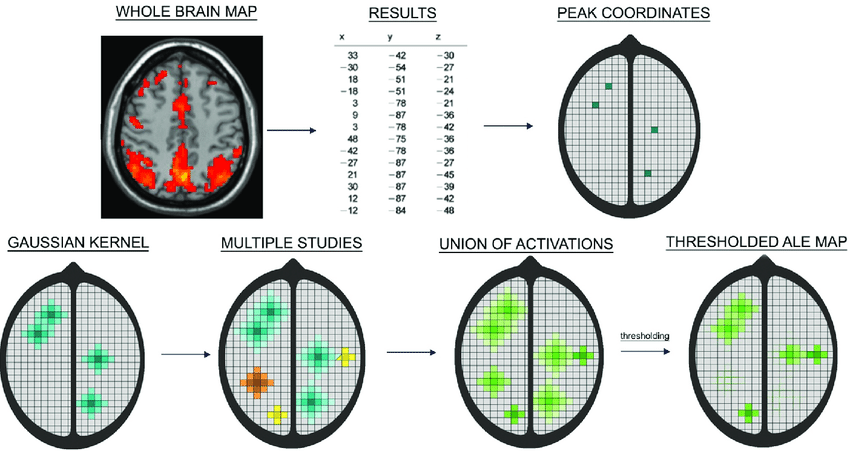
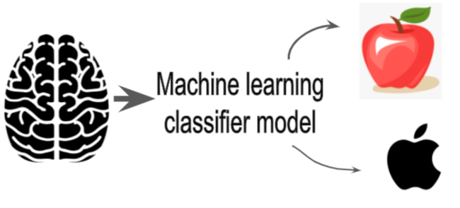
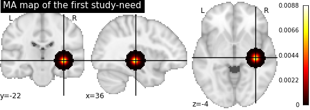
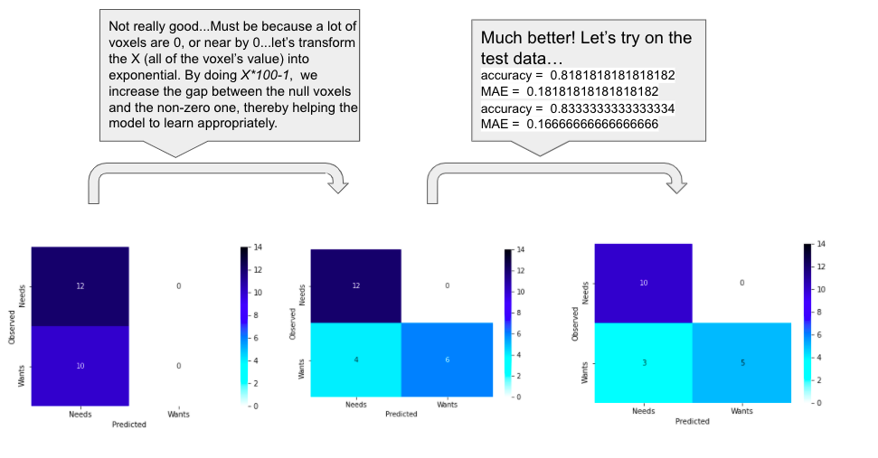

<!-- This is an html comment and this won't appear in the rendered page. You are now editing the "content" area, the core of your description. Everything that you can do in markdown is allowed below. We added a couple of comments to guide your through documenting your progress. -->

# Using ALE algorithm and machine learning to classify need and desire states

### Personal background

My name is Laurence and I've completed a bachelor's degree in cognitive neuroscience at Montreal University. I am currently a master student in psychology at Montreal University. I am particularly interested in social neurosciences, thereby working at the NeSC (Neuroscience en contextes sociaux)lab. My master project is a coordinate based meta-analysis on social hierarchy.

I really wish to contribute to scientific findings by adopting approaches that consider the current issues of reproductibility and social inclusion in neuroscience! I've decided to do brainhack school in order to familiarize myself with coding and neuroimaging datas.

* * *

# Project Definition
* * *

## Using ALE algorithm and machine learning to classify need and desire states

### Theoritical background
* * *
Overconsumption is associated with several environmental, social and individual problems (Lipschutz, 2001). One explanation suggested for overconsumption is that "we consume what we want belong what we need" (Stearns, 2006), (Juvénal et al., 2021). Some stimuli are sought for their survival value (food, water,...), while others are sought for their reward value (money, interesting objects,...). While motivation towards the former seems to increase, or even be triggered, by a state of deprivation, motivation towards the latter seems to increase as a function of the previously learned value of the stimulus, corresponding to the association between this stimulus and a reward. However, since a stimulus can be pursued for its *needing* value **AND** for its *wanting* value, for example some kind of food, or even some activities, we can wonder what are the similarities and the differences between those two conditions at a neural level?

To answer this question, we previously made a coordinate-based meta-analysis with the ALE (Activation likelihood estimation) algorithm in order to find the consistent activations reported in the litterature for each of those conditions. Therefore, we identified regions more commonly reported in the experiments regarding *needs* than in the expriment of *wantings*, vice versa.

#### ALE
* * *
The ALE approach is used to show the convergence between the regions reported in the litterature of a specified topic. For each of the selected studies, the coordinates of the significant voxels are taken (activation peaks). Then, the algorithm is making a gaussian matrice representing the spatial uncertainty, based on the sample of the corresponding study, around the activation peaks reported and thus making what is call a *MA map (main activation map)*.Therefore, each of the experiment has it own *MA map* where each voxels is associated with an activation probability (that increase in the closest to the peaks).Then, the union of the MA maps are taken and the algorithm is making permutations to identify which activations peaks are significantly reported across the experiments, thus representing the convergence of activations.

[Acar, F et al.,2018](https://journals.plos.org/plosone/article?id=10.1371/journal.pone.0208177)

### Objectives
* * *

The goal of the present project is to build a machine learning model which will make the distinction between the studies focusing on the *needs* and the studies focusing on the *wantings* based on the MA maps generated by ALE algorithm during the first step.   

The puposes of this project are :
 - Build a machine learning model which will classify the *needs* and the *wants* state based on studies included in the meta-analysis to train the model.
 - Retrieve the most contributing features in the machine learning classification model and interpret the coefficient's value in comparison of ALE meta-analysis results.
 - Familiarize myself with open science pratices, programming and machine learning.   

### Tools
* * *
 - Python
 - Jupyter notebooks
 - [nilearn](https://nilearn.github.io/index.html#)
 - [scikit-learn](https://scikit-learn.org/stable/index.html)
 - github
 - [nimare](https://nimare.readthedocs.io/en/latest/about.html)  

### Data
* * *

The dataset is composed of all the activation peaks of included studies in the meta-analysis.

*needs* : 38 studies
Contrasts of interest were meeting those criterions:
 - Perception of a food stimulus during a hunger state > perception of a stimulus during a satiety state.
 - Perception of a food stimulus during a hunger state > perception of a non-food stimulus during a hunger state.

*wantings* : 33 studies
Contrasts of interest were meeting those criterions:
 - Perception of a cue announcing a reward (or a larger reward) > perception of a cue not announcing a reward (or a smaller reward).  

Here's all the coordinates of the sample in the brain.
 - Green : Needs
 - Red : Wants

### Deliverables
* * *
At the end of this project, I'll get :
 - Markdown README.md for the description of the present project
 - Jupyter notebook including the code, and the brain images  

# Results
* * *
#### Summary

### Data preparation
 - Transform all of the activation peaks of each study into a MA map with [nimare](https://nimare.readthedocs.io/en/latest/about.html).This ended up with 71 MA map, because 71 studies had been included.
 - Apply a mask to select the voxels of the grey matter. I used the [MNI152 mask](https://nilearn.github.io/modules/generated/nilearn.datasets.load_mni152_brain_mask.html)

##### Here is an example of a MA maps with the mask:

### Machine learning
I used a [linear support vector classification](https://scikit-learn.org/stable/modules/generated/sklearn.svm.SVC.html) to build the model.

At first, the model classified all the data into *needs*. This problem occurred *maybe* because the value of most of the voxels is zero, or close to zero (as you can notice in the above MA map). By arranging the data in order to increase the gap between the null voxels and the non-zero ones, the classification has been improved.  

Finally, the model predicted the data with an accuracy of 83.3 ± 16.6 %.
There are the confusion matrices that shows the results:

#### Interpretation
Even if the accuracy is quite good, because the dataset contains more *needs* than *wants*, the model have initially more than 50% of accuracy if it classifies all the datas into *needs*. Therefore, we should be careful with the interpretation of that accuracy value. This also explains why the model never classifies the *needs* into *wants* and why it is only making errors by classifying the *wants* into *needs*. A solution to overcome this problem would be to balance the weight of the different conditions according to the proportions in the dataset.

Moreover, I've split the data into training set and test set by myself with a proportion of 75% for the training set and 25% for the test set, and I've split again the training set into 60% training set and 40% validation set. Thus, the model is not optimal, because it is only learning with 45% of the initial dataset, which is quite small when having 71 datas. A cross-validation method would have been more efficient in that case.

#### Features importance
There you can see the most contributing features on the brain. The more the region is *yellow clear*, the more changes in the value of that voxel influence the decision of the model.

## Tools I learned during this project
* * *
 - Python
 - Packages to run machine learning with scikit-learn
 - Packages ro run meta-analysis on python with nimare
 - Tools to create great brain images and data visualization (matplotlib, seaborn...)

# Conclusion
* * *
In conclusion, the objectives of my project are mostly reach. Even if the model is not optimal and few modifications should be applied to improve it's validity, I've succeeded in building a machine learning model and in formatting the initial datas so the model can process them.

Finally, I've started this course without a significant background in coding and a little fear about it (I admit). One of my motivation to do brainhack school was to demystify this field in order to be ready to make great neuroscience! I'm glad I did it, learned python and many useful packages to analyse and play with neuroimaging datas.

I really want to thank BrainHack School team for their remarkable competence and exceptional support during all the course!

### References
* * *
[L. Charbonnier, F. van Meer, A.M. Johnstone, D. Crabtree, W. Buosi, Y. Manios, O. Androutsos, A. Giannopoulou, M.A. Viergever, P.A.M. Smeets, Effects of hunger state on the brain responses to food cues across the life span,NeuroImage,Volume 171,2018,Pages 246-255,ISSN 1053-8119,https://doi.org/10.1016/j.neuroimage.2018.01.012.](https://neurovault.org/collections/3235/)

[Simon B. Eickhoff, Danilo Bzdok, Angela R. Laird, Florian Kurth, Peter T. Fox, Activation likelihood estimation meta-analysis revisited, NeuroImage, Volume 59, Issue 3, 2012,Pages 2349-2361,ISSN 1053-8119, https://doi.org/10.1016/j.neuroimage.2011.09.017.](https://www.sciencedirect.com/science/article/abs/pii/S1053811911010627?via%3Dihub)

[Assessing robustness against potential publication bias in Activation Likelihood Estimation (ALE) meta-analyses for fMRI, Acar F, Seurinck R, Eickhoff SB, Moerkerke B (2018) Assessing robustness against potential publication bias in Activation Likelihood Estimation (ALE) meta-analyses for fMRI. PLOS ONE 13(11): e0208177. https://doi.org/10.1371/journal.pone.0208177](https://journals.plos.org/plosone/article?id=10.1371/journal.pone.0208177)
