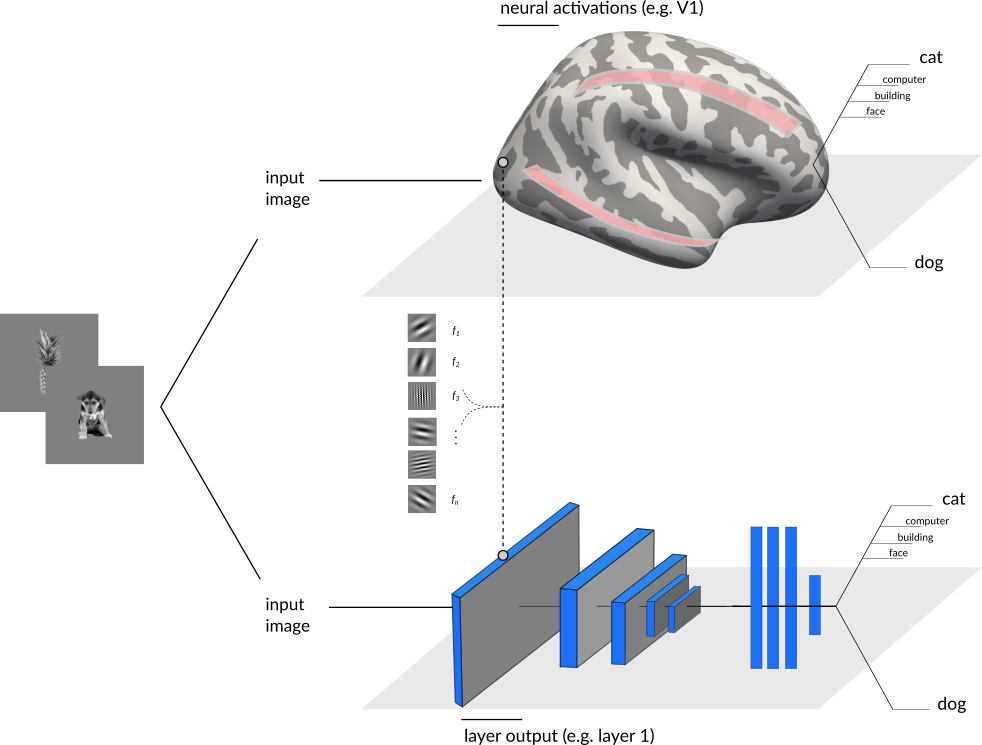
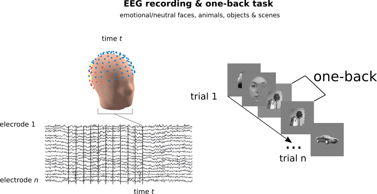
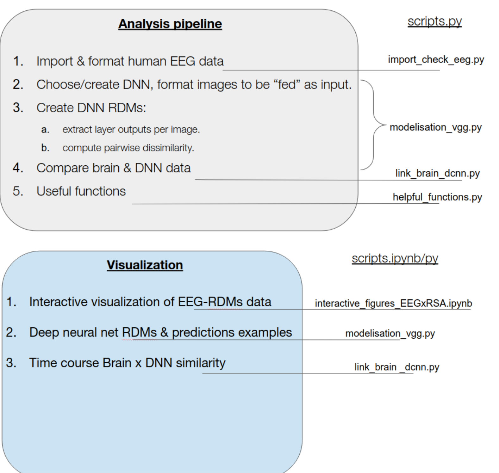
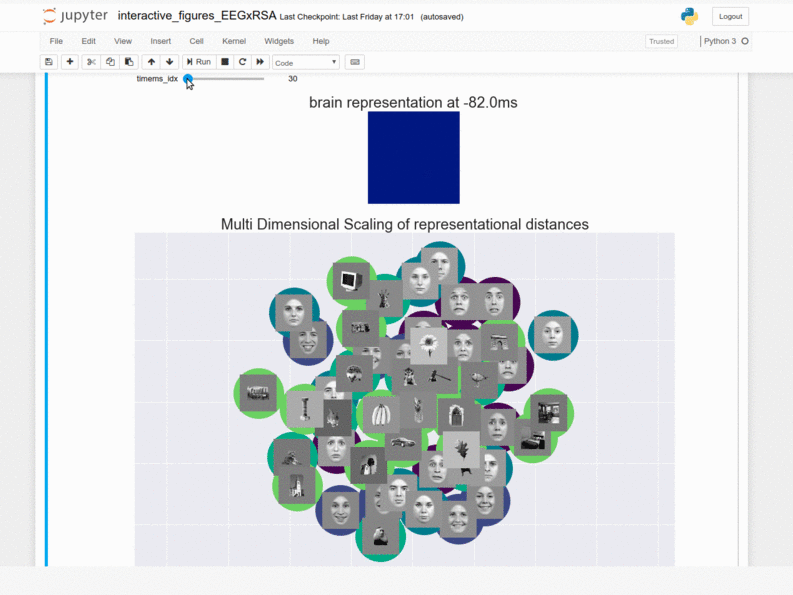
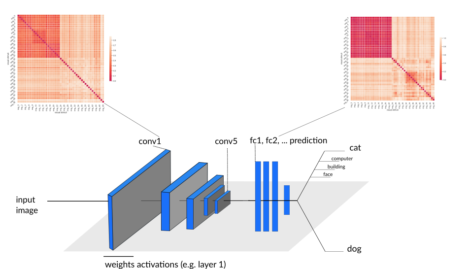
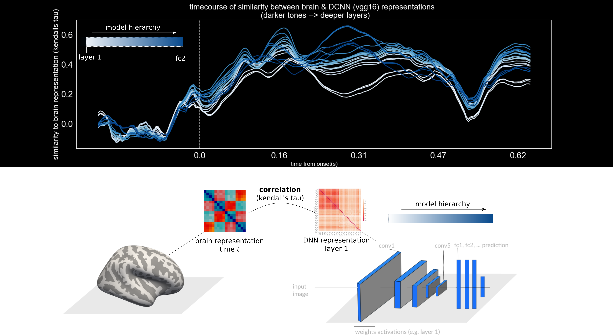

<!-- This is an html comment and this won't appear in the rendered page. You are now editing the "content" area, the core of your description. Everything that you can do in markdown is allowed below. We added a couple of comments to guide your through documenting your progress. -->

# Exploring representations of deep neural networks and their similarity with the human brain 
 
## Summary

I'm a PhD student at Université de Montréal & University of Birmingham (UK). I use an aggregate of psychophysics, EEG, and computational techniques to understand individual differences in vision, specifically in object/face recognition.

The practical objectives of this project were to develop skills in Python, data visualisation and developping better coding habits with Github. 

The general aim of this project is to understand and visualize how deep neural networks represent visual stimuli compared to our brain. For human representations, we will use high-density EEG signal from a simple visual task.
 
 
The project will unfold in three steps. 

1) Create a custom deep convolutional neural network (DCNN; using  TensorFlow & Keras). 
2) Create, from high-density EEG time series, group-averaged representational dissimialrity matrices (RDMs; we will be feeding eeg topographies to linear classifiers to do so).
3) Compare the representations (RDMs) from each of the DCNNs' layers to human brain representations (RDMs) unfolding in time. 

The first two steps will be developed in parallel. The last step will integrate their output.

Initially, the plan was to train from scratch a DCNN to "learn" more human/brain representations. This is a mid/long-term role, and here I chose to focus on learning programming tools (described below).

## Project definition
### Background

The idea of comparing and restraining a DCNN  weight representations is highly inspired by work from [Cichy et al., (2016)](https://www.nature.com/articles/srep27755)
[Kietzmann et al., (2019)](https://www.pnas.org/content/116/43/21854).

Deep neural networks (DNNs) encode information in a similar way to the visual brain (e.g. primary visual cortex V1 encodes similar information than convolutional filters in the first layer of a DNN). 
The idea here is to come up with a common measure of processing between DCNN and brain imaging signal, here electroencephalogrpahy (EEG), and link the computations in both modalities. 

A good summary of brain and DNN computations can be obtained with a Representational Dissimlarity Matrix (RDM, see DATA section).

## Tools

The structure of the analyses will rely on :

- developping analysis in **Python** scripts: pyrsa, scikit-learn, tensorFlow & keras
- basics in visualisation tools : jupyter notebooks, interactive widgets, seaborn, and scikit-learn for multi-dimensional scaling.  
- Considering that the data is not completely available, no need to focus on BIDS standards that much.
- **Github**
- **Binder**
- I will also familiarize with **deep learning**

## Data

Description (general): 

we previously used brain EEG data to "decode" pairs of images (faces, objects, scenes, animals, etc.) that were presented to human participants.
By doing this with all pairs of images presented (49 stimuli = 1178 pairs), we created a Dissimilarity Matrix that is a summary of how the brain of each participant encodes diverse visual stimuli.
This Representational Dissimilarity Matrix (RDM) was used as the base data input of this project.

-RDMs were averaged across particpants (N=23). Preprocessed EEG recordings at 128 electrodes (BioSemi)

Task: simple one-back task over a stream of images containing faces of different emotions/gender, human-made/natural objects, animals and scenes. 

## Deliverables

The plan is to have at least: 

- Python scripts for steps 1 and 3
- Markdown README.md explaining the whole pipeline.

And perhaps :

- A container that enables to reproduce these analyses

For the course : 

**Week 2 deliverable:** [README file](https://github.com/brainhack-school2020/deep_representational_learning/blob/master/README.md)

**Week 3 deliverable:** : *Binder environment for data visualization*

This link redirect to an interactive visualisation of the human brain data (RDMs):

**Week 4 deliverable:** [presentation](https://github.com/brainhack-school2020/deep_representational_learning/blob/master/presentation/BHS_2020.pdf)

## Results

## Pipeline (analysis and visualization) with scripts.

## human brain RDMs

An interactive visualisation of the human brain data (RDMs) can be found here :

Results for group-average **Representational Dissimiarlity matrices (RDMs)** had previously been derived at every time step from image onset. These  *stimulus* x *stimulus* matrices contains pairwise decoding accuracies between all images (e.g. image face vs image car), indicating the brain's representational model across various visual stimuli.

Here, the 2D coordinates of the representational distances from the RDMs are computed "online" using Multi-Dimensional Scaling from sklearn MDS method (to play interactively with this, see binder link above).

## DNN representations and link with brain data

### DNN representations
Using the same stimuli we showed to participants as input to DNNs, I computed an RDM for every layer of the VGG16 neural network (weights from imagenet).

### Similarity between brain signal and DNN representations
By correlating these DNN representations with the human RDMs, I obtained the time courses of similarity between VGG16 hierarchical processing and the EEG brain representations.

<!--  -->

## Tools & Skills I developed during this project

- **Python**, and useful libraries (e.g. pingouin, pandas, scipy, sklearn, tensorflow, keras)
- Machine learning (**deep learning**).
- Interactive figures in **Jupyter notebooks** and visualization libraries (e.g. matplotlib, seaborn, ipywidgets)
- **Binder** reproducible environments to share code and figures. 
- **GitHub**
- **Markdown**
- **Inkscape** for figures.

## Conclusion and acknowledgements

Big thanks to all instructors, to Peer & Valerie, and to all the BHS community. This was a full month but I learned and enjoyed it a lot. I should also thank Michelle, which reminded me all the deliverables and deadlines throughout the way!

Thanks to my supervisors (F. Gosselin, I.Charest) and collaborators of this project, which will be integrated as part of my phD.

