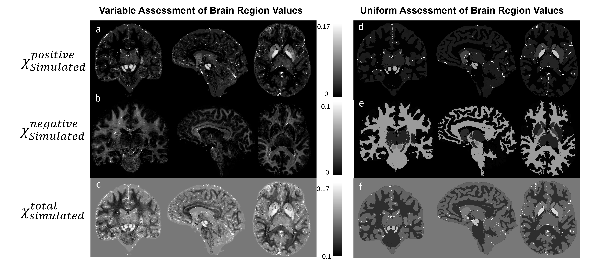
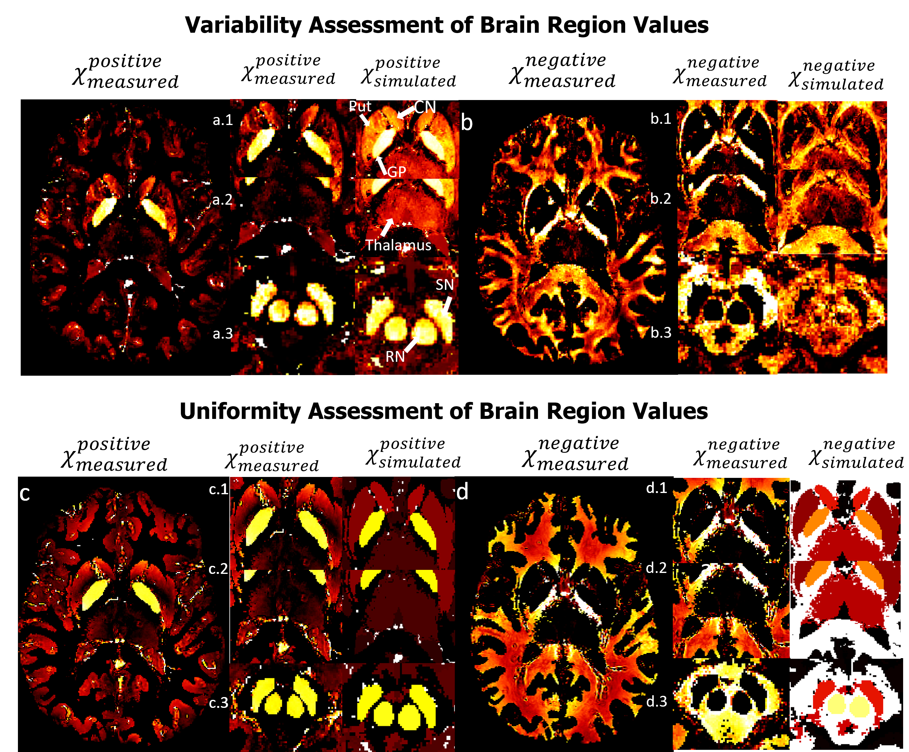
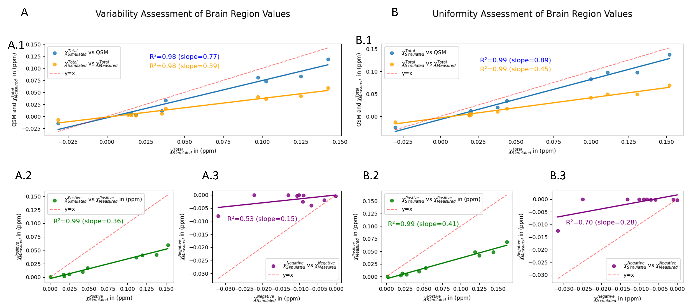

<!-- This is an html comment and this won't appear in the rendered page. You are now editing the "content" area, the core of your description. Everything that you can do in markdown is allowed below. We added a couple of comments to guide your through documenting your progress. -->


## About Me


Hello everyone, my name is Daniel Ridani. I am a first-year PhD student at Polytechnique Montreal, majoring in biomedical engineering. I did my Bachelor's in general physics and my Masters in biomedical engineering, where I fell in love with this field and decided to pursue a PhD. Currently, I am working on quantitative MRI, specifically quantitative susceptibility mapping (QSM). In my research, I focus on studying the susceptibility contributions from iron and myelin and developing methods to effectively separate them. Brain Hack School has given me the opportunity to improve my Python skills and explore new topics such as deep learning and machine learning.

## Project Summary

### Introduction

My project aims to validate χ-separation algorithm using realistic in silico head phantom simulation. Susceptibility denoted as (χ), is a measure of how easily a material can be magnetized in response to an external magnetic field. Positive susceptibility implies that the material aligns its magnetization parallel to the main field, while negative susceptibility indicates an opposing alignment. The main two sources of susceptibility are myelin (χ<0) and iron (χ>0) and they co-exist in almost every region in the human brain. Using the susceptibility, we can generate maps known as Quantitative susceptibility mapping (QSM) which does not have a ground truth. In the absence of ground truth for QSM, efforts have been made (QSM reconstruction challenge 2.0) to create a phantom that can serve as a reference standard for validation. QSM measures the total susceptibility rather than the distinct positive and negative susceptibility sources, hence, to address this, χ-separation techniques, are employed to separate the two susceptibility sources. The distinction between positive and negative sources of susceptibility plays a crucial role in understanding the underlying physiological processes and their implications for brain function. The ability to accurately discern and differentiate between these sources contributes significantly to the reliability of the assessments conducted in this study. The aforementioned phantom can be utilized to validate the accuracy of the χ-separation results. 

### Main Objectives
- Get more familiar with χ-separation limitation.
- Validate χ-separation algorithm using ground truth data (phantom simulations).
- Implement python scripts to analyze and visualize the results.
- Create a GitHub repo to share my results.

### Personal Objectives
- Gain a deeper understanding of susceptibility contribution in the human brain.
- Develop the skill to manage a small project in a short period.
- Improve my programming skill using the BrainHack school modules.
- Share my knowledge with others to encourage open science.

### Tools
- χ-separation GUI developed by Hyeong-Geol Shin et al.
- QSM reconstruction challenge 2.0 code for GRE simulations of custom phantoms.
- Git and GitHub for Version Control
- Python Packages: "matplotlib", "seaborn", "pandas"
### Data
The dataset used in this study was simulated using the Matlab code from the QSM reconstruction challenge 2.0 article developed by José P. Marques et al. This article also provided susceptibility values for 10 different regions in the brain.

A summary of the susceptibility values is as follows:

|Brain Regions |Susceptibility (ppm)|
|:---------------|:----------------:|
|Caudate Nucleus |0.044             |
|Globus Pallidus |0.1305            |
|Putamen         |0.038             |
|Red Nucleus     |0.1               |
|Dentate Nucleus |0.152             |
|Substanial Nigra |0.111             |
|Thalamus        |0.02              |
|White Matter    |-0.03             |
|Grey Matter     |0.02              |
|CSF             |0.019             |

Table 1: Susceptibility values of different brain region
### Project Deliverables

At the end of this project, we will have:
- A phantom  for χ-separation used as a ground truth.
- Detailed project workflow documented in a GitHub repository.
- Executable python scripts  for data visualization and analysis.
- Markdown file providing comprehensive project details.

## Method

### Phantoms

To generate the phantoms used in this study, two experiments were performed:
- The first experiment involved assigning variable values to each voxel within a specific region, with the mean value ± standard deviation being used for analysis. 
- The second experiment, a uniform value was assigned to every voxel within the same region.
This approach will help reduce the complexity of the phantom model to see if the complexity  of the phantom is a limitation of χ-separation.

### χ-separation input

χ-separation requires three main inputs:

- Magnitude image.
 
- Frequency shift (Δf): This map can be obtained by the phase image after we apply a couple of processing steps that will be explained in the next section.
- R<sup>\'</sup><sub>2</sub> map (R<sup>\'</sup><sub>2</sub>  = R<sup>\*</sup><sub>2</sub>  - R<sub>2</sub> ): In order to obtain an R<sup>\'</sup><sub>2</sub> map, you will need to follow these steps. First, acquire two different scan sequences: Gradient-echo (GRE) and Spin-echo (SE). From each sequence, generate magnitude images. Next, perform an exponential fitting on the magnitude images separately. This will provide you with T<sup>\*</sup><sub>2</sub> and T<sub>2</sub> maps for the GRE and SE sequences, respectively.
To calculate R<sup>\*</sup><sub>2</sub>, take the inverse of T<sup>\*</sup><sub>2</sub> (denoted as <sup>1</sup>&frasl;<sub>T<sup>\*</sup><sub>2</sub></sub>). Similarly, calculate R<sub>2</sub> by taking the inverse of T<sub>2</sub> (denoted as 1 / <sup>1</sup>&frasl;<sub>T<sub>2</sub></sub>). Finally, obtain R<sup>\'</sup><sub>2</sub> by subtracting R<sub>2</sub> from R<sup>\*</sup><sub>2</sub>.


### Pipeline and preprocessing

Figure 1: Reconstruction pipeline from raw data to χ-separation<br><br><br>

Figure 1 represents the entire pipeline used to get two separate images of iron and myelin. The custom phantom (χ<sup>Total</sup><sub>Simulated</sub>) is simulated into GRE data to give magnitude and phase images. The magnitude image is used to extract a binary mask to identify the region of interest and an R<sup>\*</sup><sub>2</sub>. Since χ-separation requires an R<sup>\'</sup><sub>2</sub> map and the simulation only provides GRE data an approximation adapted from Alexey V. Dimov et al was used to estimate the R<sup>\'</sup><sub>2</sub> map. In his work he found a strong correlation between R<sup>\*</sup><sub>2</sub> and R<sup>\'</sup><sub>2</sub> maps and establish a relation between them: R<sup>\*</sup><sub>2</sub> = αR<sup>\'</sup><sub>2</sub>. Afterward a phase unwrapping algorithm is applied to obtain the true phase followed by a background field removal to remove the induced background field from the region of interest and finally a dipole inversion technique is applied to estimate the local susceptibility. At this point we apply the χ-separation algorithm to separate the positive (χ<sup>Positive</sup><sub>Measured</sub>) and negative (χ<sup>Negative</sup><sub>Measured</sub>) susceptibilities. Finally, the positive and negative susceptibility maps are combined to obtain the total susceptibility (χ<sup>Total</sup><sub>Measured</sub>), which will be used for comparing the total susceptibility before and after χ-separation.

## Results
### Phantoms

Figure 2: Phantom maps of variable and uniform assessments of brain region values. The left set (a, b, c) illustrates a variable assessment approach, where image a represents χ<sup>Positive</sup><sub>Simulated</sub>, image b represents χ<sup>Negative</sup><sub>Simulated</sub>, and image c represents χ<sup>Total</sup><sub>Simulated</sub> values. The right set (d, e, f) presents a uniform assessment approach, with images d, e, and f mirroring the same representation as a, b, and c, respectively. <br><br><br>

Figure 2 represents the phantom maps that will be used as ground truth. This figures present two sets of maps: the first (a, b and c) has a variable assessment of brain region values and the second (d, e and f) has a uniform assessment of brain region values. Each image in the left set of images corresponds to an image in the right set, sharing comparable contrast characteristics. Thus the same color bar was used for the two sets of images. The figure presented in this study exemplifies the comparative analysis of variable and uniform assessments. The findings of these experiments will shed light on the limitations of χ-separation when it comes to the complexity of the used model.

### χ-separation 
#### Qualitative assessment<br><br>

Figure 3: Visual comparison between χ<sup>Positive</sup><sub>Measured</sub> and χ<sup>Negative</sup><sub>Measured</sub> vs χ<sup>Positive</sup><sub>Simulated</sub> and χ<sup>Negative</sup><sub>Simulated</sub> respectively for both variable and uniform assessment of brain regions values. Figure a represents χ<sup>Positive</sup><sub>Measured</sub> values, showcasing three subfigures (a.1, a.2, a.3) that focus on specific brain regions, namely the Caudate Nucleus (CN), Putamen (Put), and Globus Pallidus (GP), as well as the Thalamus, Red Nucleus (RN), and Substantia Nigra (SN). Similarly, figure b corresponds to χ<sup>Negative</sup><sub>Measured</sub> values. It also contains three subfigures (b.1, b.2, b.3) that highlight the same brain regions as figure a but with negative susceptibility. Figure c (c.1, c.2, c.3) and Figure d (d.1, d.2, d.3) follow the same configuration as Figure a (a.1, a.2, a.3) and Figure b (b.1, b.2, b.3) respectively.<br><br><br>

Figures 3 provide a compelling visual representation of the clear separation observed between positive and negative sources of susceptibility in the assessment of brain regions. Notably, the measured maps obtained through x-separation exhibit an astonishing resemblance to the ground truth, validating their accuracy and reliability in both the evaluation of variability and uniformity within the brain regions of interest which demonstrates the successful separation of positive and negative susceptibility sources in the assessment of brain regions. Through a meticulous comparison of the measured maps with the ground truth, it becomes evident that the applied x-separation method effectively captures the intricate details of the brain regions under investigation. The remarkable similarity observed between the measured maps and the ground truth maps validates the effectiveness of the employed methodology and strengthens confidence in the obtained results.

#### Quantitative assessment<br><br>

Figure 4: Quantitative comparison between simulated and measured values. Figure A illustrates the variability assessment of brain regions which comprises three subfigures: A.1: comparison between QSM, χ<sup>Total</sup><sub>Measured</sub> and χ<sup>Total</sup><sub>Simulated</sub>. A.2: comparison between χ<sup>Positive</sup><sub>Measured</sub> and χ<sup>Positive</sup><sub>Simulated</sub>. A.3: comparison between χ<sup>Negative</sup><sub>Measured</sub> and χ<sup>Negative</sup><sub>Simulated</sub>. Each plot contains a red dotted line depicting y=x. Figure B illustrates the uniformity assessment of brain region values which replicates the structure and comparisons of Figure A. In addition, each plot indicates the correlation value between the values as well as the slope values. <br><br><br>

Figure 4 presents the quantitative comparative analysis between simulated and measured susceptibility values for both variable and uniform assessment of brain region values. Each plot includes a y=x line to facilitate visual comparison and evaluate the consistency between measured and simulated data. This comparison is important to demonstrate the validity of the χ-separation algorithm. Ideally, the measured values should be equal to the simulated values, thus, the closer the value of the slope is to 1 the more accurate the measured values are to the simulated values. On the firs hand, when we took a variable assessment of brain region values approach the linear regression results of Figure A are as follows: slope=0.77, R<sup>2</sup>=0.98 when comparing QSM vs χ<sup>Total</sup><sub>Simulated</sub>; slope=0.39, R<sup>2</sup>=0.98  when comparing χ<sup>Total</sup><sub>Measured</sub> vs χ<sup>Total</sup><sub>Simulated</sub>; slope=0.36, R<sup>2</sup>=0.99 when comparing χ<sup>Positive</sup><sub>Measured</sub> vs χ<sup>Positive</sup><sub>Simulated</sub> and finally slope=0.15,  R<sup>2</sup>=0.53 when comparing χ<sup>Negative</sup><sub>Measured</sub> vs χ<sup>Negative</sup><sub>Simulated</sub>. On the other hand, when we took a uniform assessment of brain region values approach to make the model less complex, the linear regression results of Figure B are as follows: slope=0.89, R<sup>2</sup>=0.99 when comparing QSM vs χ<sup>Total</sup><sub>Simulated</sub>; slope=0.45, R<sup>2</sup>=0.99  when comparing χ<sup>Total</sup><sub>Measured</sub> vs χ<sup>Total</sup><sub>Simulated</sub>; slope=0.41, R<sup>2</sup>=0.99 when comparing χ<sup>Positive</sup><sub>Measured</sub> vs χ<sup>Positive</sup><sub>Simulated</sub> and finally slope=0.28,  R<sup>2</sup>=0.70 when comparing χ<sup>Negative</sup><sub>Measured</sub> vs χ<sup>Negative</sup><sub>Simulated</sub>. An immediate rise in the value of correlation and slope was observed when the model was simplified at a small rate.

## Conclusion and future work
- χ-separation is a great and easy tool to use that allows us to separate myelin from iron.
- Simulations are an important step to obtain the ground truth and validate the measured values.
- χ-separation showed great visual results compared to the simulated maps but it poorly performed  numerically especially when it come to negative susceptibility. 
- χ-separation performed better when the χ-model was less complex, which could be one of this algorithm's limitations.
- Using Python for data visualization and analysis is easy and produces the best plots.
- Other χ-separation limitations should be explored
- Other separation algorithms should be explored.
- Add microstructure information to the algorithm to make it more accurate (such as myelin fiber orientations)


### Objectives, Tools, and Deliverables
Regarding the objectives, learning tools, and deliverables, I consider the project to be a successful endeavor. It has resulted in the creation of a comprehensive pipeline that encompasses all the necessary steps, starting from raw data processing and leading to the visualization of results. Furthermore, the project has successfully incorporated the targeted tools, enabling me to gain proficiency in their utilization. The deliverables of the project have been met, as evidenced by the provision of a detailed project walkthrough and the availability of reproducible Python scripts for future use.

## Detailed guide to Reproducibility
Requirements:
- Download χ-separation code from GitHub, you can find the repository [here](https://github.com/SNU-LIST/chi-separation). They have a well documented manual on how to use the GUI.
- Download QSM reconstruction challenge 2.0 simulation code. you can find the files [here](https://data.donders.ru.nl/collections/di/dccn/DSC_3015069.02_542?1). Note that you will have to request access in order to download the file, but it's really simple you just have to connect to your ORCID account. In case you don't have an ORCID-ID you can create one [here](https://orcid.org/)
- Download and install python packages for data visualization and analysis you will need three: Seaborn, Matplotlib, Pandas. You can install them use these command line:`pip install seaborn` || `pip install matplotlib` || `pip install pandas` 
- Download qMRLab software for data fitting. you can find the software [here](http://qmrlab.org/).
- Matlab 

Once all the files are installed, carefully read the manuals that are provided by the developers as well as this report. I suggest also read their corresponding articles so you can have an idea on how the algorithms work. You can find the link for the χ-separation article  [here](https://www.sciencedirect.com/science/article/pii/S1053811921006479), and the link for the QSM reconstruction challenge 2.0 [here](https://onlinelibrary.wiley.com/doi/10.1002/mrm.28716).

After reading everything, you have a general idea of what you should expect from these codes. First, open your simulation file and create your custom phantom. You can do that by changing, for example, the values of each region of the brain provided by a file named "parameters.mat", which will contain susceptibility values used as a reference for your work denoted as "chiref". "chiref" will present the total susceptibility, I suggest adding two more columns named "chipos" and "chineg" so you can add your positive and negative susceptibilities (always make sure that chiref=chipos+chineg). Now RUN the file named `MacroCreateSusceptibiltyPhantom.m` that will call the main function `CreateOwnRealisticPhantom.m`. Now before running you might want to consider one of these two options:
- Run the code through chiref, chipos, chineg individually. (By default, the code will use chiref since we manually added chipos and chineg so to run the code over the values of chipos and chineg you will have to change in `CreateOwnRealisticPhantom.m` every chiref into chipos or chineg).
- Change the code! So you change the so you can automatically get the chipos and chineg that add them together and same the results as chiref. Here is my suggestion: 1) Make a copy of the original code so you don't lose it. 2) In `CreateOwnRealisticPhantom.m` change every chiref to chipos. 3) Copy-paste almost all the code and now change it to chineg. At this point you should have the exact code repeated twice once for chipos and once for chineg. 4) To get chiref add these few lines at the end: 
```matlab
%Calculation of ChiTotal from ChiNeg and ChiPos
% File paths of the two NIfTI images to be loaded
ChiNegPath = 'data/chimodel/ChiNeg.nii';
ChiPosPath = 'data/chimodel/ChiPos.nii';
% Load the first NIfTI image
chineg = load_untouch_nii(ChiNegPath);
chinegdata = chineg.img;
% Load the second NIfTI image
chipos = load_untouch_nii(ChiPosPath);
chiposdata = chipos.img;
% Perform addition of the two images
Chitotal = chinegdata + chiposdata;
% Save the result as a NIfTI image
resultNii = chineg;  % Use image1 as a template for header information
resultNii.img = Chitotal;  % Assign the result to the image data
% File path to save the result NIfTI image
resultPath = 'data/chimodel/Chi.nii';
% Save the result NIfTI image
save_untouch_nii(resultNii, resultPath);
% Display a message upon successful save
disp('Result NIfTI image saved successfully.');
```
Now we have 3 images chiref saved as `Chi.nii`, chipos saved as `ChiPos.nii` and chineg saved as `ChiNeg.nii`. For the next step (data simulation) use only the `Chi.nii` file since the `ChiPos.nii` and `ChiNeg.nii` are only used for comparison reasons. Open `MacroCreateSimulationData.m` file, after you make sure you used the parameters you want ( in this project I used a protocol called Challenge protocol that is already in `MacroCreateSimulationData.m`) run the file and wait until the simulation ends. This simulation will result in multiple phase and magnitude images each correspond to it's TE time. You can use this file [here](https://github.com/brainhack-school2023/Ridani_project/blob/main/Scripts/Concatenate_echoes.py) to concatenate the files into one file named `Magnitude_data.nii.gz` and `Phase_data.nii.gz`. Now go ahead and open χ-separation GUI and follow the instruction to get the separated images. Note that you can use this code [here](https://github.com/brainhack-school2023/Ridani_project/blob/main/Scripts/R2Prime_calculation.py) to calculate an estimation of R<sup>\'</sup><sub>2</sub> map.

In order to create susceptibility maps and other maps that have constant regions as I did in this project you can use this python  code [here](https://github.com/brainhack-school2023/Ridani_project/blob/main/Scripts/Make_uniform_chi.py) to create uniform susceptibility maps and this code [here](https://github.com/brainhack-school2023/Ridani_project/blob/main/Scripts/Make_uniform_maps.py) to create other uniform maps that you will need in this work.

The final step is to make the plots that I showed in the results section. To do this you will have first to download this .csv file [here](https://github.com/brainhack-school2023/Ridani_project/blob/main/susceptibility.csv) that will contain all the values used to plot the figures and you can find the code [here]([https://github.com/brainhack-school2023/Ridani_project/blob/main/Scripts/Figure_plotting.ipynb](https://github.com/brainhack-school2023/Ridani_project/blob/main/NoteBook/Figure_plotting.ipynb)) which a Jupyter Notebook code.

IMPORTANT NOTE: Always make sure that everything is on the same path (requirements and data)

## CONGRATULATIONS YOU REPRODUCED MY PROJECT!!


## Acknowledgments
I would like to thank the Brank Hack School 2023 for organizing this course and for their support. The course has been highly beneficial, and I would like to express my appreciation to Dr. Eva Alonso Ortiz for delivering excellent instruction.
## References

Shin, Hyeong-Geol, et al. "χ-separation: Magnetic susceptibility source separation toward iron and myelin mapping in the brain." Neuroimage 240 (2021): 118371.

Marques, José P., et al. "QSM reconstruction challenge 2.0: A realistic in silico head phantom for MRI data simulation and evaluation of susceptibility mapping procedures." Magnetic Resonance in Medicine 86.1 (2021): 526-542.

Krebs, Nikolaus, et al. "Assessment of trace elements in human brain using inductively coupled plasma mass spectrometry." Journal of Trace Elements in Medicine and Biology 28.1 (2014): 1-7.

Waskom, M. Seaborn: Statistical Data Visualization. Retrieved from https://seaborn.pydata.org/

Hunter, J. D. (2007). Matplotlib: A 2D graphics environment. Computing in Science & Engineering, 9(3), 90-95. https://doi.org/10.1109/MCSE.2007.55

McKinney, W. (2010). Data Structures for Statistical Computing in Python. In Proceedings of the 9th Python in Science Conference (pp. 56-61). https://doi.org/10.25080/Majora-92bf1922-00a


