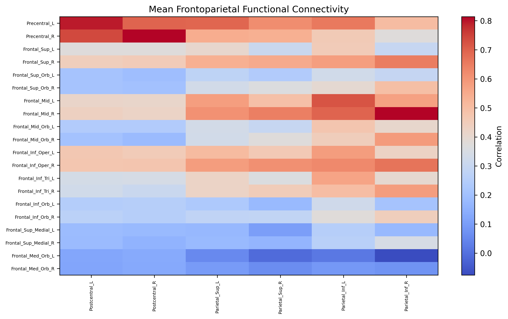

<!-- This is an html comment and this won't appear in the rendered page. You are now editing the "content" area, the core of your description. Everything that you can do in markdown is allowed below. We added a couple of comments to guide your through documenting your progress. -->

## Project definition

### Background
Working memory is a core component of executive function, and spatial working memory is often impaired in ADHD.
Deficits in working memory contribute to:
* Inattention, impulsivity, and poor task performance
* Difficulty sustaining attention in spatial contexts
Neural Mechanisms:
SWM tasks typically activate:
* Dorsolateral prefrontal cortex (DLPFC): for maintaining and manipulating information
* Parietal cortex: for spatial processing

In ADHD, these areas show reduced activation.

### Tools

* The "project template" project will rely on the following technologies:
* Git and Github
* Python libraries: 
* ScikitLearn for machine learning, 
* Nilearn for fMRI connectivity analysis 
* Pyplot, Matplotlib, Seaborn for data visualization
* Jupyter Notebook

### Data
The dataset obtained from following project.

Alpha oscillations and working memory deficits in ADHD: A multimodal imaging investigation (R01MH116268)

https://nda.nih.gov/edit_collection.html?id=3101

It was a multimodal data containing both fMRI and EEG. This project only focused on the fMRI data. A total of 68 young adults was used in these analyses (39 ADHD, 29 Control; Mage: 21.35)
The data was based on a computerized version of the spatial working memory (SWM) task. 

### Deliverables

At the end of this project, I have:
- A Github repository with code scripts (https://github.com/nilayoh/swm_fmri_project.git)
- Figures and results summarizing the performance of the model and showing the functional connectivity across regions
- Jupyter notebook that includes analysis codes and visualizations

## Results

	image: "BrainAllDiff.png"
These images show mean functional connectivity across frontoparietal regions of the brain. Blue color indicate higher functional connectivity for Control than ADHD patients. Red color indicates higher functional connectivity for ADHD patients than control group.
 	
	image: "signdifferencesinfrontoparietalconnec.png"
        image: "BrainSignDiff.png"
These images show significant differences between ADHD and control group across frontoparietall regions of the brain before FDR correction.

	image: "FDRCorrected.png"
No significant difference between ADHD and Control group across these areas after FDR correction.

Even though I could not find significant difference for practice I would like to continue to investigate my second part of the project.
I used machine learning methods to classify participants as ADHD or control. I used k-fold cross validation (k=5) to test my model.
The cross validation accuracy across folds can be seen in following graph.
	image: "KFold_ML.png"

## Conclusion and acknowledgement

What I’ve Learned:

Understanding fMRI Data:
* Downloading, organizing datasets
* Managing confounding variables
Functional Connectivity Analysis:
* Comparing ADHD vs. Control groups using connectivity matrices
* Using atlases for brain parcellation
Debugging & Code Practice:
* Troubleshooting analysis pipelines in Python
* Gaining confidence in working with neuroimaging libraries (e.g., Nilearn, Nibabel)
Introduction to Machine Learning:
* Applying classification techniques to distinguish between ADHD and Control groups
* Exploring pipelines for diagnosis-based predictions

Thank you to all TAs, Dr. Erin Dickie, for all your help in the process and this opportunity. Also, thank you to Joel Diaz for providing the data and helping. 
