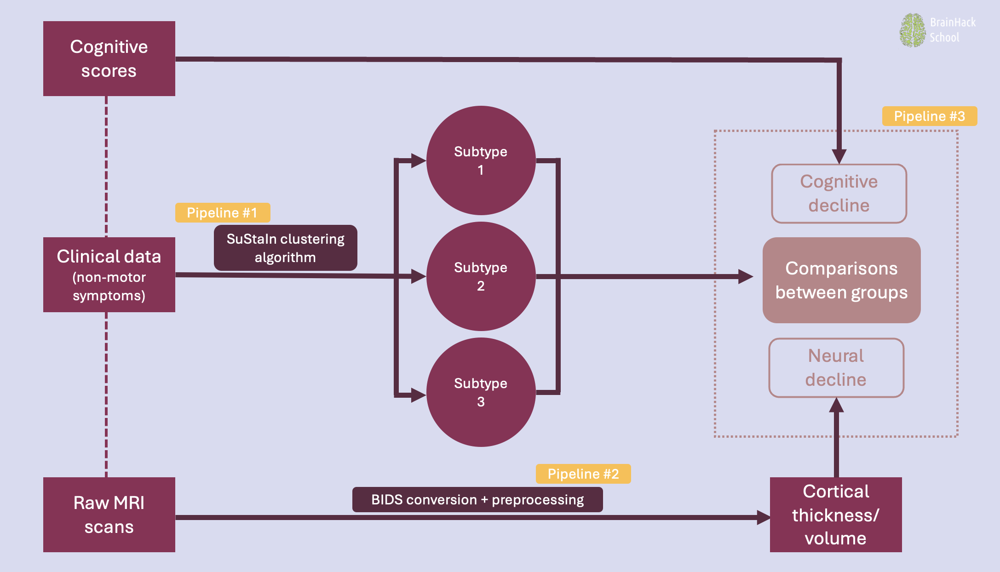

<!-- This is an html comment and this won't appear in the rendered page. You are now editing the "content" area, the core of your description. Everything that you can do in markdown is allowed below. We added a couple of comments to guide your through documenting your progress. -->

## Project definition

### Background
Parkinson's disease (PD) is the second most prevalent neurodegenerative disorder globally and is rapidly growing in Canada. While PD is often associated with motor symptoms, it is in fact characterized by a combination of both motor and non-motor symptoms (NMS). NMS cover a wide range of disruptions, including mood disorders, anxiety, perceptual disturbances, and pain. They often precede cognitive decline, which makes them potential predictors of such decline. Yet to this day, NMS most associated with cognitive decline in PD patients have not been identified. As PD is a **heterogeneous** disease, NMS need to be examined together rather than individually when aiming to predict cognitive decline. Data-driven techniques like clustering algorithms are well-suited for identifying patterns in data comprising numerous attributes.

#### Objectives

**This project aims to investigate the association between NMS and cognitive and neural decline over time in individuals with PD.** 

Specifically, the objectives are to:
1. Identify subtypes of PD with respect to NMS evolution.
2. Verify whether a specific subtype of PD is associated with faster cognitive decline longitudinally.
3. Verify whether a specific subtype of PD is associated with faster neural decline longitudinally.

### Tools

Throughout the school, I used the following tools:

**1. Python scripting in jupyter notebooks:** most of my work was done in notebooks, including tasks such as data manipulation and plotting, visualization of neuroimaging data, statistical analyses, etc.
**2. Git & Github:** allowed the version control of the project
**3. BIDS and Freesurfer:** conversion of raw MRIs to BIDS, then going through the Freesurfer pipeline for preprocessing
**4. Basics of ML:** learned ML basics such as the ML pipeline (training, validation and testing phases), h-parameter tuning, evaluating models, etc. 
**5. High-performance computing:** parallelization of MRI data preprocessing, clustering of high dimensional data
**6. Bash scripting:** automation of neuroimaging preprocessing
**7. Weights & Biases:** tracking algorithm runs and hyperparameter tuning
**8. Sphinx:** documentation for Python deliverables

### Data

3 independant datasets of PD patients are used in this project, comprising cross-sectional clinical data of NMS and longitudinal cognitive and neuroimaging data:
- Canadian Open Parkinson Network (COPN)
- Parksinson's Progressive Markers Initiative (PPMI)
- UK Biobank

### Deliverables

The deliverables of this project consist of [three pipelines in the form of Jupyter notebooks](https://song-y.github.io/SubtypingPD/):

**1. Pipeline #1: Clustering**
- Data visualization
- Preparing and adjusting algorithm inputs
- Running the algorithm
- Model stability tracking
- Model performance evaluation

**2. Pipeline #2: Imaging**
- Raw MRI conversion to BIDS
- Preprocessing with Freesurfer
   - [Small section of the pipeline in .sh](https://github.com/song-y/SubtypingPD/tree/main/brainhack_source/resources/freesurferPreproc)
- Manipulating neuroimaging data

**3. Pipeline #3: Statistical analyses**
- Descriptive statistics
- Statistical comparisons of cognitive and neural decline between identified clusters
- Visualization of results

[Project source code](https://github.com/song-y/SubtypingPD)

## Acknowledgement

A HUGE thank you to the BHS organizers for this incredibly enriching experience. A sincere thank you to everybody who contributed to making this a great, positive experience. A special thank you to Pierre-Lune and Marie for your exceptional support and dedication!!
