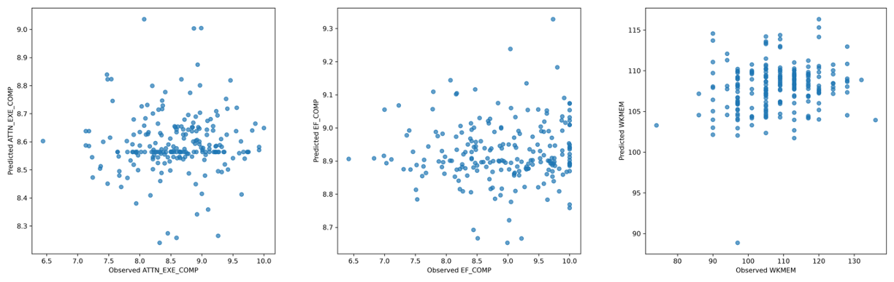
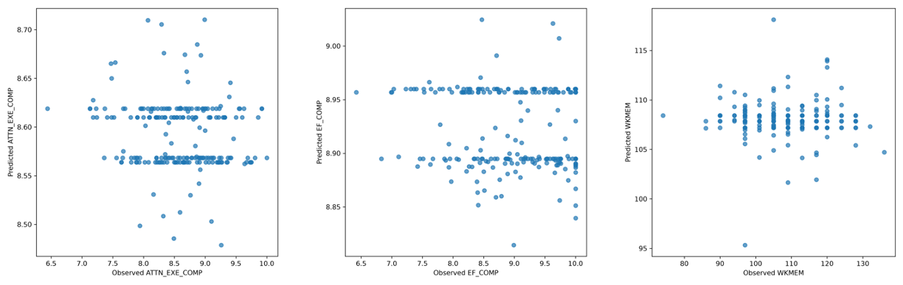
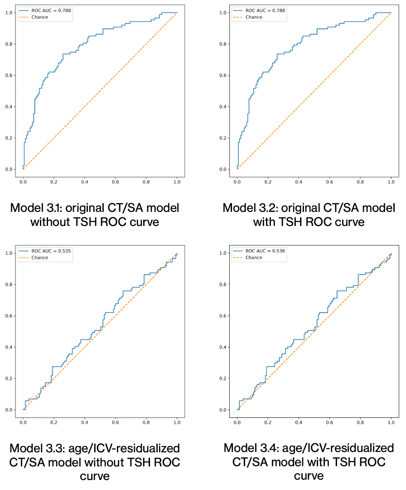

## Project definition
---
## Background

Cognitive impairment is a leading cause for loss of functional independence in old age and often precedes cognitive disorders such as Alzheimer’s Disease (AD). Dementia is predicted to increase to 152.8 million cases by 2050 (1). However, more research is needed to identify modifiable factors to decrease risk of cognitive decline and dementia (2). 

Thyroid hormones have an established role in the development and the maturation of the brain through neurogenesis, synaptogenesis, and myelination (3). However, the impact and the role of thyroid hormones on the adult brain is more unclear. There are conflicting findings of the impact of thyroid dysregulation on cognitive impairment (4). An association was found between the thyroid function and the cortical architecture in functional areas of the brain linked to neurodegeneration (5), suggesting a mechanistic link. In addition, thyroid function is known to modulate mood, and result in certain psychiatric conditions such as depression and bipolar disorder (6). Comorbid depression and sub-threshold hypothyroidism comorbidity was shown to result in reduced gray matter volume in the middle frontal gyrus and lower executive function performance (7). The middle frontal gyrus is also associated with working memory and attention, suggesting that these cognitive subdomains may also be impacted. Together, these suggest that thyroid function may modulate function in multiple cognitive domains through more than one pathway. 

Thus, this research project seeks to answer the following questions:

**Primary**: Can brain structure, combined with circulating levels of thyroid stimulating hormone (TSH), predict cognitive performance?

**Exploratory**: Which variables contribute most to the model predictions?

### Tools
This project relied on numerous tools such as:
1) Git and GitHub to use and share methods;
2) Python Packages: `sklearn`, `shap`, `pandas`, `numpy`

### Data
The database used for the project was *The National Institute of Mental Health (NIMH) and Research Volunteer Data Set* from OpenNeuro. This dataset consists of clinical assessments, mood-related psychometrics, cognitive function neuropsychological tests, structural and functional MRI, diffusion tensor imaging (DTI), comprehensive magnetoencephalography battery (MEG), and blood samples. 

Link to the dataset: https://openneuro.org/datasets/ds005752/versions/2.1.0

### Project deliverables 
At the end of this project, these files will be made available:
1) Python scripts for the 3 different predictive models;
2) Figures of model performance results; 
3) A repository on GitHub;

## Methodology

### Variables
Based on prior evidence linking them to thyroid activity and each was measured as a continuous score, these specific cognitive subdomains were selected from the *NIH Toolbox Cognitive Battery*:

 1) Flanker Inhibitory Control and Attention Task Score: Attention
 2) Dimensional Change Card Sort Task Score: Executive Function
 3) List Sorting Working Memory Task Score: Working Memory

Additionally, a secondary control model was developed to predict participant sex (either female and male).

### Models
Elastic net regression was selected to address the relatively high number of predictors. This approach utilizes penalty coefficients that perform feature selection and enhance model stability. Additionally, SHAP (SHapley Additive exPlanations) values were also calculated to give insight into which predictors had the highest predictive power.

While the primary goal of this project was to predict cognitive scores based on TSH levels and structural brain features, supplementary models were developed to ensure robustness and validate the analytical pipeline against established relationships.

The following models were created:   
 

#### Model 1: Original cognition model

This is the original planned model to determine if TSH and brain features are able to predictive various cognitive subdomain scores
Outcomes:

(1) Flanker Inhibitory Control and Attention Task Score

(2) Dimensional Change Card Sort Task Score

(3) List Sorting Working Memory Task Score

Predictors: log(TSH), 68 CT variables, 68 SA variables, ICV, age

 

#### Model 2: Age/ICV-residualized brain cognition model

This model modifies the first model by residualizing the brain variables to account for head size and age.

Outcomes: 

(1) Flanker Inhibitory Control and Attention Task Score

(2) Dimensional Change Card Sort Task Score

(3) List Sorting Working Memory Task Score

Predictors: log(TSH), sex, 68 CT residuals after adjusting for age and ICV, 68 SA residuals after adjusting for age and ICV

 

#### Model 3: Sex-classification positive-control exercise

This model serves to confirm the pipeline developed works for variables and outcomes that have more literature evidence.

Outcome: Sex

&emsp; **Model 3.1**

&emsp; Predictors: age, ICV, CT, SA

&emsp; **Model 3.2 (added log(TSH)**

&emsp; Predictors: log(TSH), ICV, CT, SA

&emsp; **Model 3.3 (residualized and without log(TSH)**

&emsp; Predictors: age, CT and SA residualized for age and ICV

&emsp; **Model 3.4 (residualized with log(TSH)**

&emsp; Predictors: log(TSH), age, CT and SA residualized for age and ICV

---
## Results

**Cognitive Performance Models**

Across the cognition outcomes, neither elastic-net model showed meaningful held-out prediction of cognitive performance as most R² values were close to zero or below zero. Overall, these results suggest that the tested combinations of TSH, sex, age, ICV, cortical thickness, and surface area did not robustly predict cognition in held-out participants.  

SHAP outputs were generated to inspect variable contributions, but they should be interpreted cautiously because overall prediction performance was weak. Across the cognition models, log(TSH) showed no meaningful SHAP contribution. In the original working-memory model, age was the strongest SHAP contributor and ICV also contributed, but this result should be interpreted cautiously because the held-out prediction was very weak and convergence warnings occurred during fitting.

For the rest of the cognition models, the highest SHAP values were mainly assigned to cortical thickness and surface-area features, including residualized CT/SA features in Mod2.

### Model 1 Performance Metrics

| Outcome | R-squared | RMSE | MAE |
| --- | --- | --- | --- |
|ATTN_EXE_COMP | -0.021 | 0.644 |  0.510 |
|WKMEM | -0.008 | 10.352 | 8.357 |
|EF_COMP | -0.003 | 0.813 | 0.679 |

 

### Model 2 Performance Metrics

| Outcome | R-squared | RMSE | MAE |
| --- | --- | --- | --- |
|ATTN_EXE_COMP | -0.643 | 0.644 |  0.513 |
|WKMEM | -0.042 | 10.541 | 8.578 |
|EF_COMP | -0.015 | 0.818 | 0.682 |

 

 

Please see the full results in: [The performance metrics for the main models predicting cognitive performance for both the original and residualized](https://github.com/brainhack-school2026/TSH-predict-CogPerformance/blob/main/03_results/cognition/results.md)

### Model 3 Performance Metrics

| Model | Pooled ROC AUC | Accuracy | Balanced Accuracy |
| --- | --- | --- | --- |
|Original | 0.788 | 0.729 |  0.723 |
|Original + TSH | 0.788 | 0.729 | 0.723 |
|Residualized | 0.535 | 0.518 | 0.507 |
|Residualized + TSH | 0.536  |  0.523 | 0.510  |
 

 

Please see the full results in:  [The performance metrics for the sex predictive model](https://github.com/brainhack-school2026/TSH-predict-CogPerformance/blob/main/03_results/sex_classification_exercise/results.md)

**Sex Predictive Models**

The non-residualized CT/SA sex-classification models showed moderate held-out classification performance. The SHAP summaries indicate that ICV was the strongest individual contributor in these models, consistent with the drop to near-chance performance after CT and SA were residualized for age and ICV.

Adding log(TSH) did not improve the printed performance metrics and did not produce a meaningful SHAP contribution.

Overall, the positive-control exercise shows that the pipeline can recover a sex-classification signal when age, ICV, cortical thickness, and surface area are included. After age/ICV residualization, this signal was no longer recovered above chance-level performance.

In the original, non-residualized sex-classification models, ICV was the strongest individual SHAP contributor. Additional contributions came from cortical surface-area and cortical-thickness features. Age had little SHAP contribution, and adding log(TSH) did not produce a meaningful SHAP contribution.

In the residualized models, the highest SHAP values were assigned to age/ICV-residualized cortical thickness and surface-area features. However, these models performed close to chance, so the SHAP rankings should be interpreted cautiously. 

## Discussion
The main predictive models did not reliably predict cognitive performance. Across all outcomes, held-out R² values were near zero or negative, indicating no improvement over a baseline mean-prediction model. This suggests that the combination of TSH, age, sex, ICV, and cortical thickness/surface area did not provide meaningful predictive information for cognition in this dataset using elastic net regression.

SHAP analyses were used to explore feature contributions, but given the weak model performance, these results should be interpreted as descriptive only. No variable, including log(TSH), showed a consistent or meaningful contribution to prediction across cognitive models. Variability in cortical feature importance likely reflects model instability under low signal conditions.

Residualizing cortical thickness and surface area for age and ICV did not improve predictive performance and in some cases reduced it, suggesting that these adjustments did not enhance signal detection for cognitive outcomes in this dataset.

A sex classification model was included as a positive control. This model achieved moderate performance in the non-residualized case but dropped to near-chance levels after residualization. This indicates that the pipeline can recover known structure when a strong signal is present, but this signal was not observed for cognitive outcomes.

Overall, the results suggest that the lack of predictive performance in cognitive models is likely due to weak or absent signal in the available predictors within this dataset, rather than a failure of the modeling approach.

## References
1) Nichols, E. et al. Estimation of the global prevalence of dementia in 2019 and forecasted prevalence in 2050: an analysis for the Global Burden of Disease Study 2019. Lancet Public Health 7, e105–e125 (2022).

2) Rasmussen, J. & Langerman, H. Alzheimer’s Disease – Why We Need Early Diagnosis. Degener. Neurol. Neuromuscul. Dis. Volume 9, 123–130 (2019).

3) Bernal J. Thyroid Hormones in Brain Development and Function. [Updated 2025 Sep 29]. In: Feingold KR, Adler RA, Ahmed SF, et al., editors. Endotext [Internet]. South Dartmouth (MA): MDText.com, Inc.; 2000-. Available from: https://www.ncbi.nlm.nih.gov/books/NBK285549/

4) Eslami-Amirabadi, M., & Sajjadi, S. A. (2021). The relation between thyroid dysregulation and impaired cognition/behaviour: An integrative review. Journal of neuroendocrinology, 33(3), e12948. https://doi.org/10.1111/jne.12948

5) Wu X, Liu H, Cui L, Mo M, Li C. Genetically determined thyroid function and cerebral cortex structure: A Mendelian randomization study. Adv Clin Exp Med. 2025 Nov;34(11):1863-1879. doi: 10.17219/acem/199321. PMID: 40699126.

6) Hendrick V, Altshuler L, Whybrow P. Psychoneuroendocrinology of mood disorders. The hypothalamic-pituitary-thyroid axis. Psychiatr Clin North Am. 1998 Jun;21(2):277-92. doi: 10.1016/s0193-953x(05)70005-8. PMID: 9670226.

7) Zhao S, Du Y, Zhang Y, Wang X, Xia Y, Sun H, Huang Y, Zou H, Wang X, Chen Z, Zhou H, Yan R, Tang H, Lu Q and Yao Z (2023) Gray matter reduction is associated with cognitive dysfunction in depressed patients comorbid with subclinical hypothyroidism. Front. Aging Neurosci. 15:1106792. doi: 10.3389/fnagi.2023.1106792

