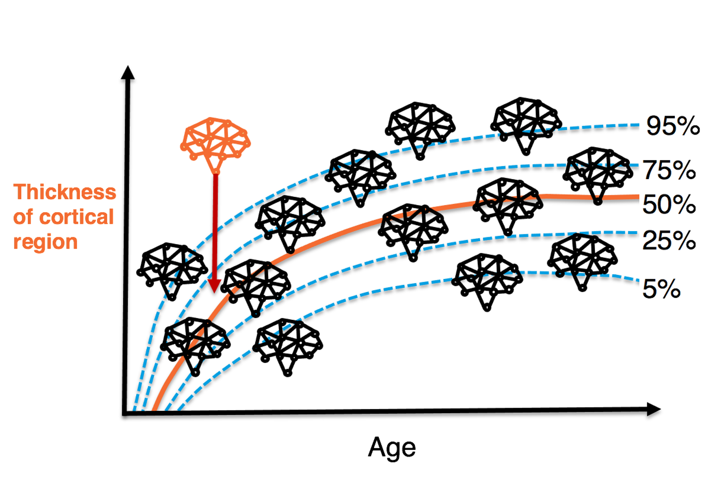
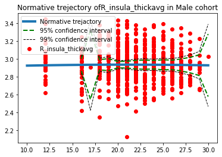

<!-- This is an html comment and this won't appear in the rendered page. You are now editing the "content" area, the core of your description. Everything that you can do in markdown is allowed below. We added a couple of comments to guide your through documenting your progress. -->

## Project definition

### Title
Normative modelling on structural neuroimaging data from the Queensland Twin IMaging (QTIM) data set to compare individualized deviations of twins from the norm.
### Background

Normative modelling is known from growth charts, where it describes height in form of an individualized z-score/percentile score of deviation from the norm.
Similarly, normative models can be used in neuroimaging to describe an individual's deviation from a the normative variation of a  brain measure, for example from cortical thickness.

## Tools

The "project template" project will rely on the following technologies:
 * Normative modelling using the [PCN toolkit](https://github.com/amarquand/PCNtoolkit)
 * python packaging.
 * google collab.
 * the [brainhack cloud](https://brainhack.org/brainhack_cloud/)

### Data

The data for this project  is the [Queensland Twin IMaging (QTIM)](https://openneuro.org/datasets/ds004169/versions/1.0.5) dataset: a multimodal neuroimaging dataset of young adult twins and siblings (18-30 years, N = 1026), including a subsample of participants, scanned a second time to assess test-retest reliability (N = 78, test-retest interval ~ 3.5 months).

I am going to use the derivatives from FreeSurfer parcellation that can be downloaded from the repository:
* cortical thickness data (mm)
* cortical surface area data (mm^2)
* subcortical volumes data (mm^3) 

### Deliverables

At the end of this project, we will have:
 - A first run  of the PNC toolkit on the twin data.
 - A package to structure the data to be able to load them into toolkit.
 - Tests that are integrated into the package to test the input data.

## Results

I was able to run the model on an initial region the data set, for males and females separately.
These are preliminary results:

## Predictions for the thickness of the right insula cortex (mm^2):

### Predictions for women:

### Predictions for men:

### Progress overview

* the model was trained using a **2 fold cross validation** 
* the model calculates **measures of model fit**, such as:
    * explained variance
    * standardized root mean square error
    * Pearson's correlation coefficient

### Tools I learned during this project

 * **Deeper understanding of the PNC toolkit** I have now a better understanding of the Python implementation, and I customized the implementation in the Jupyter book that is included in this repository.
 * **Python packaging** I wrote my first ever Python package.
 * **Python testing** I added some tests to the package, which gave me a deeper understanding of unit tests in Python.

##### Other projects
Here are other good examples of repositories:
- [The Predictive Clinical Neuroscience toolkit](https://github.com/amarquand/PCNtoolkit) by Andre Marquand's group

## Next steps
* run the model on remaining brian regions
* look at changes of z-scores over time within individuals
* look at twin differences

## Conclusion and acknowledgement
I thank the brainhack school staff for all their support and hope to be able to join Brainhack school next year again!
