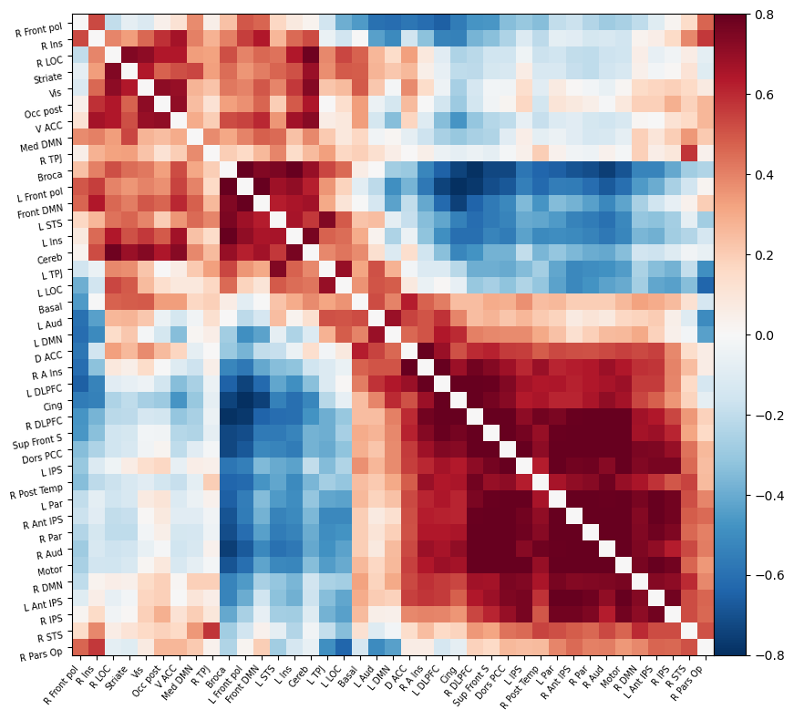
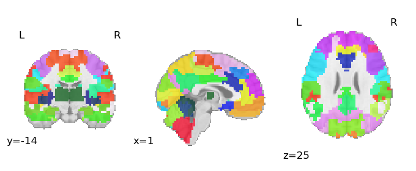
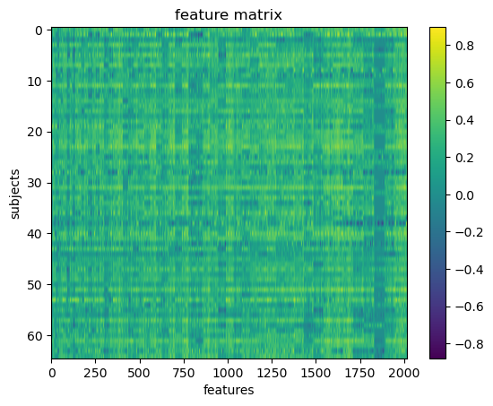
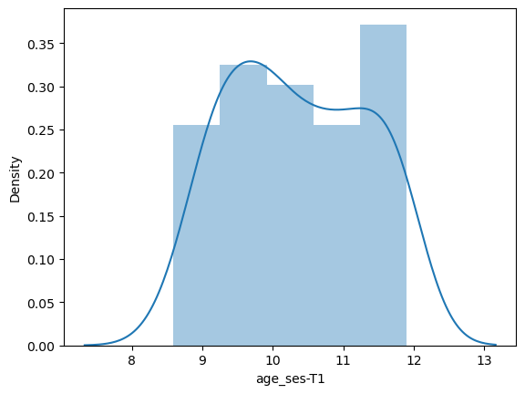
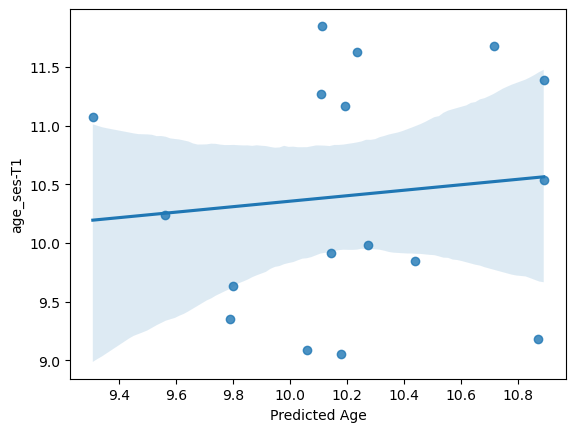
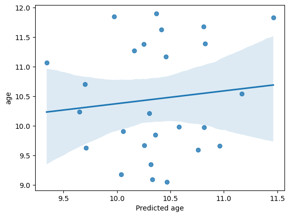
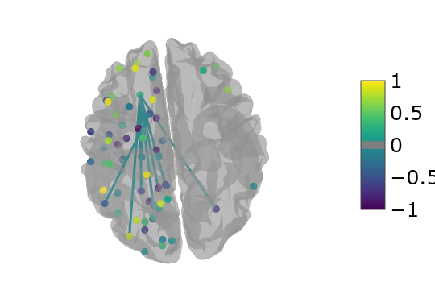

<!-- This is an html comment and this won't appear in the rendered page. You are now editing the "content" area, the core of your description. Everything that you can do in markdown is allowed below. We added a couple of comments to guide your through documenting your progress. -->

## Project definition

### Background
 Inspired by the work of [(Hammer et al., 2025)](https://www.ncbi.nlm.nih.gov/pmc/articles/PMC4576365/) that looks for neurobiological markers to differentiate a population of children with ADHD from those without the disorder. In this study, four memory tasks were applied while a group of 20 children with ADHD and 20 healthy controls underwent functional magnetic resonance imaging (fMRI) scans and a machine learning model was fitted. fMRI data from the four VSWM tasks enabled a classification accuracy of 92.5%, with high predicted ADHD probability values for most clinical cases. The project was attempted through a simple machine learning model, using the tools learned during the brainhack to predict a trait such as age from the connectivity matrices.

### Tools

For this project, several tools were used, such as:
 * Markdown, to structure the text.
 * Git and Github,to maintain repositories
 * Pyton for programming the analysis
 * jupyter-Notebook to analysis and visualization
 * Nibabel to fmri data processing
 * Nilearn to conectivity analysis
 * scikit-learn: machine learning in Python
 * Numpy and Pandas to structure the data
 * Adding the project to the website relies on github, through pull requests.
 * Openneuro to download the data set

### Data

The data was downloaded from Openneuro  [website](https://openneuro.org/datasets/ds002424/versions/1.2.0)
James R. Booth and GE Cooke and Jessica Gayda and Rubi Hammer and Marisa N. Lytle and MA Stein and Michael Tennekoon (2021). Working Memory and Reward in Children with and without Attention Deficit Hyperactivity Disorder (ADHD). OpenNeuro. [Dataset] doi: 10.18112/openneuro.ds002424.v1.2.0

### Deliverables

At the end of this project, we will have:

- The current markdown document.

- A repository with the dataset .

- The jupyter notebook with data analysis and visualisation

## Results

### Progress overview

### Overview of progress
This project was developed solely for the purpose of learning new techniques applicable to magnetic resonance imaging. It was carried out exclusively for the Brainhack school and is not directly related to my line of research. It is a first approximation to an analysis of this kind and therefore it is a simple project with several aspects to improve. It is hoped that feedback from the community will lead to further rapid improvements to this first version.We split the data into a training set and a test set to train a machine learning model. We use the SVR model to try to predict the age of the children based on their functional connectivity matrices.  We did not achieve a model that could effectively distinguish diagnosis.
We tried to fit a model to predict the age of children.

### Tools I learned during this project

* **Project-Management** During brainhack school I learn how to manage a project, think about its different parts and the tools that would be useful. 
* **Github workflow** I learned how to use git and github to manage directories, organise files and be able to do collaborative work.
* **python for data science** Through branhack school I learned to use python and its various libraries for MRI data analysis. I usually perform resonance analysis using SPM (Matlab), and incorporating these tools is very useful for my academic future.
* *** course content *** much of the course content is new to me, from connectivity, to installing packages, to using machine learning.
### Results

#### Deliverable 1: Markdown document
Generate a marckdown file in order to submit it to the school web repository.

#### Deliverable 2: Report directory

You can access all the data and analysis done during the project in [my public repository](https://github.com/sebastianmorales-lab/BHS_project_repo/). 

#### Deliverable 3: Project analysis
#####Correlation connectivity matrix

I calculate the correlation matrices per subject. The presence of two large clusters seems to be observed. One encompassing regions such as the frontal pole, the posterior occipital region, the anterior cingulate cortex and others.
Another cluster comprises regions such as dorsolateral prefrontal cortex, posterior temporal region, auditory and motor regions. Activations in visual and motor regions may be due to the characteristics of the task presented.
The one subject matrix is presented  for ejample

#####Classification
######Using the classifier to see if I can predict the children ages looking at the connectivity matrices.

First upload the atlas, and thus visualise the regions of interest

extract the timeseries from the ROIs in the atlas and plotting the he feature matrix  

the feture matrix is what the model was trained with.
We want to predict age by plotting the age distribution. Only session 1 was taken because not all subjects had a second session. 
 

See the age distribution.
#####Machine Learning Model

Run the Machine Learning model

As this is counted as a small number of participants, we decided on a standard regression model called Support Vector Regressor (SVR). This model usually gives robust results.

accuracy (R2) =  -0.15458416133781716
MAE =  0.884920224737749

The model does not fit well, there is a low accuracy and a rather high Mean Absolute Error.
We tried to do some manipulations like cross-validation but did not get any better settings. 

##### Can our model predict the ages from the functional connectivity matrices?

accuracy (r2) = -0.15576602592786326

mae =  0.8901443045170564

## Conclusion and acknowledgement
 The model has not been efficient in predicting the age of children using the functional connectivity matrices. It is likely that there are not many differences in the functional connectivity of children between the ages of 8 and 13. However, it is also likely that the model used is not able to distinguish efficiently and another model should be used or the hyperparameters should be adjusted. The dataset used consisted of only 65 subjects, for age prediction no distinction was made between children who received the diagnosis and those who did not.
Further research is needed in the search for neural markers of Attention Deficit Hyperactivity Disorder (ADHD).

I would like to thank Brainhack School for these weeks of intense training and learning, and the organisers for this initiative. I think this school is an important experience that strengthens the ties between the neuroscience community. 

### References
Hammer R, Cooke GE, Stein MA & Booth JR (2015). Functional neuroimaging of visuospatial working memory tasks enables accurate detection of attention deficit and hyperactivity disorder. Neuroimage – Clinical, 9, 244-252. (PMCID: PMC4576365)

James R. Booth and GE Cooke and Jessica Gayda and Rubi Hammer and Marisa N. Lytle and MA Stein and Michael Tennekoon (2021). Working Memory and Reward in Children with and without Attention Deficit Hyperactivity Disorder (ADHD). OpenNeuro. [Dataset] doi: 10.18112/openneuro.ds002424.v1.2.0
