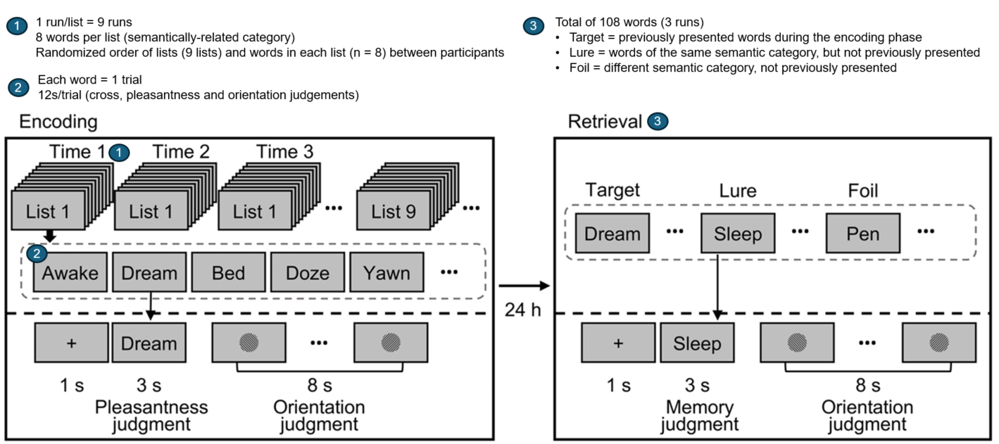

<!-- This is an html comment and this won't appear in the rendered page. You are now editing the "content" area, the core of your description. Everything that you can do in markdown is allowed below. We added a couple of comments to guide your through documenting your progress. -->

I am a PhD student in clinical neuropsychology (research and intervention stream) at the Université de Montréal. I completed my undergraduate studies in Psychology with a concentration in Neuroscience. I am interested in investigating the neurobiological basis of cognitive training gains and whether it shares similar underlying neurobiological mechanisms with cognitive reserve. Brainhack School 2025 provides an exciting first opportunity for me to delve into neuroimaging analysis using task-based fMRI. Prior to Brainhack school, I had no experience in neuroimaging analyses nor coding.
## Project definition

### Background

Studies have shown that there are numerous factors that might account for up to 40% of cases of Alzheimer’s disease, such as those pertaining to cognitive engagement and cognitive reserve (CR) proxies (Livingston et al., 2020). Thus, gaining a better understanding of cognitive interventions and protective mechanisms, such as CR, that may alter the cognitive aging trajectory to prevent or delay the onset of neurocognitive disorders in older age has become a priority. Shedding light on the underlying neurofunctional mechanisms put into action following cognitive interventions and the interplay with CR proxies will ultimately promote the development of better, more personalized, cognitive interventions and uncover whether they can be useful for the development of CR, even in older adults.

Functional Magnetic Resonance Imaging (fMRI) represents an important technique for discerning functional changes over time and between populations. fMRI is the main technique used in previous research to investigate both the neurofunctional basis of CR and effects of cognitive training gains (Pappalettra et al., 2014), and has been shown to be sensitive to chronological age, thus qualifying it as a potential biomarker of aging and neurodegenerative disease (Belleville & Bherer, 2012).

#### ENGAGE Study

My doctoral project is on the ENGAGE study, which was a randomized controlled, double-blind preference trial with a comprehensive cohort design that aimed to test the efficacy and long-term impact of an intervention that combines cognitive training and cognitively stimulating leisure activities in older adults with subjective cognitive decline. More information can be found in the study protocol (Belleville et al., 2019). The objectives of my thesis will be to explore the neurofunctional basis of a multi-faceted cognitive training and cognitive stimulation intervention (ENGAGE) and the relationship between CR and task-related brain activation.

## Brainhack Objectives
The primary objective of my Brainhack School project was to analyze fMRI activation data from one open-access subject. This project consists of a first exposure and learning opportunity for neuroimaging analyses and coding, which will be useful for future analyses using data from the ENGAGE study.

### Specific Objectives
Skills development (coding, visualization, open science)
Modeling (GLM, contrasts, activation maps)
Conceptual notions pertaining to data handling (BIDS format, preprocessing tools)

### Tools

* GitHub: Sharing the project via a public repository
* Jupyter Notebook/Python code: Code writing and documentation, narratives
* Nilearn: GLM fitting (subsequent memory paradigm), statistical contrasts, and brain visualizations

### Data
We used raw data from an open-access dataset (OpenNeuro ds003789). We used snapshot 2.0.0, corresponding to Git commit 26d526316b558d23eea68db5cd48736950fa22ca, which follows the BIDS 1.0.1 specification and can be downloaded using Datalad. Though fMRIPrepped data is available for this dataset, it is not complete, in that it did the steps of head motion correction and coregistration, but not of spatial normalization to MNI space. Therefore, we were unable to do any second-level (group-level) analyses.

This specific dataset was chosen because the task resembles that used in the ENGAGE study. The task used in the current study was composed of two phases: 1) encoding and 2) retrieval. In the first phase of the task, participants were asked to remember 9 lists of words, each presented 3 times. In the retrieval phase, which took place 24 hours later, the participants were presented with a series of words and indicated whether or not the word was presented in the lists shown on the previous day. We analyzed brain activations during memory encoding as participants were shown the lists for the first and third time (rep1 and rep3). The figure below shows a more detailed description of the task.

### Deliverables
- Markdown folder for project description
- Creation of a GitHub repository to share my results
- Comprehensive Jupyter Notebook with narratives
- Memory-related brain activation maps
- Bonus: interactive brain maps

## Results
The repository of this project, with the complete Jupyter Notebook and interactive map, can be found [here](https://github.com/brainhack-school2025/Ruddy_project).
We created a Jupyter Notebook with narratives explaining step-by-step the analysis process, which can be found in my GitHub repository. The Notebook includes not only the code, but also descriptions of each conceptual step and provides some theoretical background to key concepts to help guide the reader.

The steps include:

* Importation of libraries, accessing the data, “preprocessing”
* Familiarization with the data: display of anatomical and mean functional images, events files
* Specify and apply the GLM, design matrix, expected BOLD signal
* Definition and computation of the contrasts
* Extraction of different brain activation maps (+ interactive map)
* Extraction of predicted and observed time series
* Exploration of statistical tests and next steps, reporting of results

#### Example activation map
The image below shows a z-map when we apply the contrast rep1 > rep3. Therefore, here, we see regions that are more active during the first presentation of the word list stimuli compared to the activity during the third presentation of the word lists. We also chose to look at specific coordinates based on the clusters table.

These results remain exploratory and should be interpreted with caution as they are based on a single participant across nine runs and have not been corrected for multiple comparisons. In addition, the images have not been properly preprocessed. These preliminary results seem to align with the hypothesis that there would be more activation during rep1 than rep3 in regions involved in memory encoding, such as the Prefrontal Cortex, perhaps because the participant is generating memory strategies to memorize the words. When the list is presented for the third time, the subject may be more familiar with the word list, and therefore less effort is required to encode the information at that point.
An interactive visualization of this map is available in my repo. 

#### A note on open science best practices
Through this project, I developed a deeper appreciation for open science practices, many of which are underemphasized in formal training. I now better recognize their critical role in ensuring transparency, collaboration, and equitable access to scientific knowledge. I look forward to working to integrate these principles into my future work, whether through open-access tools, publicly shared code, or accessible community-oriented knowledge translation efforts.
In line with best practices in open-science, we used the following tools:

* GitHub: Sharing the project via a public repository, including the complete Jupyter Notebook, interactive image, and complete references to the version of the dataset used. More generally, by exploring this tool, I see potential for collaborations and sharing information/code/results with a larger audience.

* Python: Learning to code using Python allows for the project to be more reproducible by automating the commands, as opposed to manually executing steps through graphical user interfaces, which are harder to track, share, and replicate.

* Jupyter Notebook with narratives: The narratives provide context, which helps others follow along exactly what we did and to detect potential errors in my code or approach. This allows for full transparency and minimizes the "black box" science.

* BIDS format: Though we did not directly work to organize the files in BIDS format, I became familiar with this structure, which I now see as being very important for standardization, compatibility with other tools and collaborators, transparency and reusability.(https://github.com/brainhack-school2025/Ruddy_project).

## Conclusion
Due to only using a limited amount of data from one subject that was not fully preprocessed, the results of this project are not significant in terms of scientific advancement. However, completing this project over the intensive course of four weeks was a great first learning opportunity and exposure to these tools. I look forward to continuing to build on my skills acquired during Brainhack School and apply them to my own projects.
#### Next Steps
Though this project focused on acquiring basic competencies for single-subject (first-level) fMRI activation analyses with open-access data, I also acquired some experience and exposure to a series of tools and theoretical concepts that I envision will be useful in the future when working with the ENGAGE study data.

- Docker: Containerized environment for running neuroimaging tools (BIDS-validator, fMRIPrep)
- BIDS-validator: Ensures raw data complies with BIDS format
- fMRIPrep: Standardized preprocessing pipeline for fMRI data

A heartfelt thanks to all those involved for this rich learning experience and growing opportunity.
