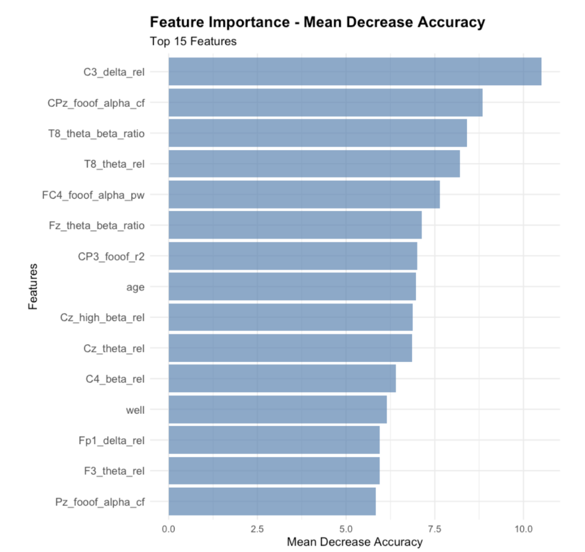
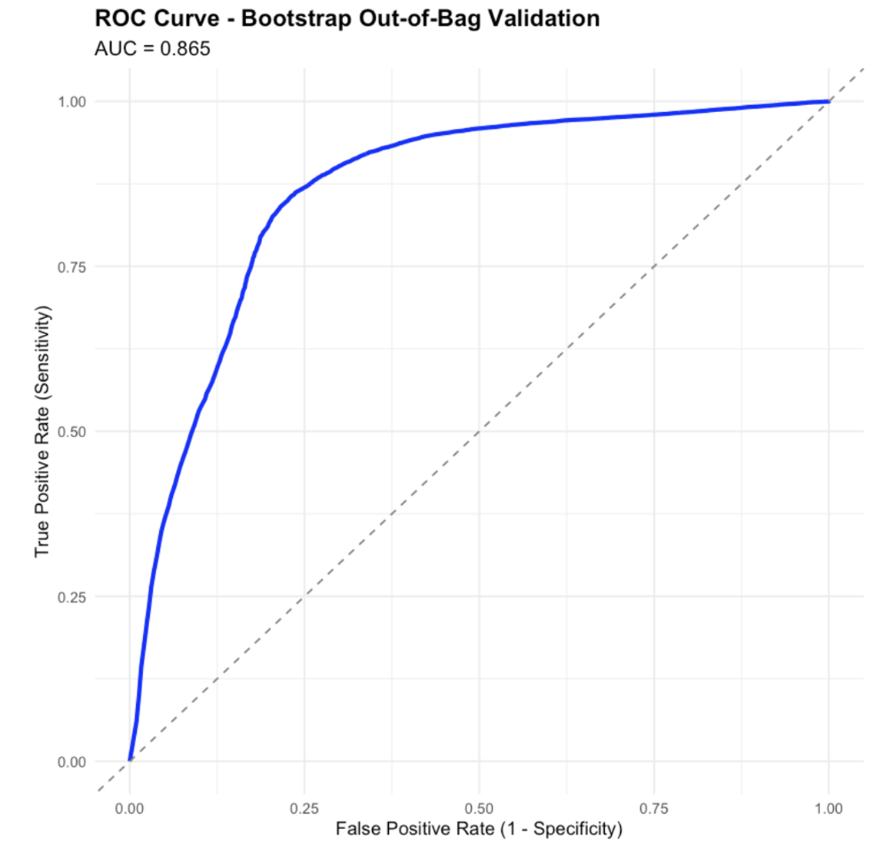
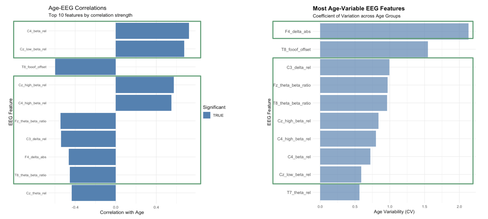

<!-- This is an html comment and this won't appear in the rendered page. You are now editing the "content" area, the core of your description. Everything that you can do in markdown is allowed below. We added a couple of comments to guide your through documenting your progress. -->

## Project definition

### Background

Attention Deficit Hyperactivity Disorder (ADHD) is a neurodevelopmental and psychiatric disorder that exhibits significant age-related changes throughout development. Electroencephalography (EEG) has emerged as a powerful neuroimaging technique for extracting neural features and patterns associated with ADHD, such as theta-beta ratios and alpha peak frequency. While machine learning approaches have shown promise for age prediction using neural data, there remains a critical gap in developing treatments based on EEG patterns and age-specific considerations for individuals with ADHD.

Current research has established that EEG biomarkers change across the lifespan, but the relationship between these developmental patterns and treatment response remains poorly understood. Therefore, this project aims to address the question: How can we use EEG patterns to predict treatment responses for individuals with ADHD across different age groups?

### Tools

 * **Python**: `numpy`, `FOOOF`, `matplotlib` for data processing, feature extraction and visualization
 * **R**: `caret`, `randomForest`, `ggplot2` for machine learning and statistical analysis
 * **Jupyter notebooks**: interactive analysis
 * **GitHub**: version control and collaboration

### Data

[**TDBrain Database**](https://www.brainclinics.com/resources)

We utilized the comprehensive TDBrain database, an extensive clinical EEG dataset containing:

- **Sample size**: 1,274 participants collected over two decades
- **Age range**: 5-89 years
- **Data types**: Raw resting-state EEG recordings, NEO-FFI personality data, demographic information, and behavioral measures
- **ADHD subset**: 204 ADHD participants, with 70 having treatment response data for neurofeedback therapy

### Deliverables

**[GitHub Repository](https://github.com/brainhack-school2025/age_eeg_pattern)**

- Workflows in both Python and R
- Documentation with figures and visualizations
- Reproducible analysis pipeline

### Results

#### Dataset Characteristics

While the ADHD sample contains 204 samples, only 70 individuals have neurofeedback treatment response data.

| Age Group | Non-Responder (Number of sessions) | Responder (Number of sessions) |
| --------- | ---------------------------------- | ------------------------------ |
| Youngest  | 14                                 | 40                             |
| Middle    | 4                                  | 48                             |
| Oldest    | 1                                  | 50                             |

The distribution of number of sessions for responder v.s. non-responder is very imbalanced.

#### Feature selection

Using bootstrap, we determined the maximum number of features to be used in the model is 60. The selected 60-feature set demonstrated high stability across bootstrap iterations, with minimal variance in feature rankings across different data samples. The above figure presents the top 15 features being selected by our model. Top tier precitors includes C3_delta_rel, CPz_fooof_alpha_cf and T8_theta_beta_ratio represents central region delta relative power, central-parietal alpha center frequency and right temporal theta-beta ratio. Notably, age emerged as a significant predictor, ranking 8th among all features, confirming the importance of developmental considerations in treatment prediction.

#### Random forest classification results

The AUC of our random forest model achieve 0.865, indicating strong predictive performance, although there is potential of overfitting due to imbalanced dataset and small sample size. The model is evaluated by out-of-bag bootstrap method.

### Age-Related EEG feature

We evaluated whether the selected features are correlated with age and has variabiltiy across age groups. 

The left panel shows age-EEG correlations for the top 10 features by correlation strength. Features like C4_beta_rel and Cz_low_beta_rel show significant correlations with age, indicating that these brain activity patterns change systematically across development. The right panel displays the most age-variable EEG features using coefficient of variation across age groups. F4_delta_abs shows the highest variability, followed by T8_foof_offset and C3_delta_rel. This suggests these features may be sensitive developmental markers that can play crucial role for age-specific treatment prediction.

We then visualized the overlapping features identified by correlation and variability analysis. The left heatmap displays developmental patterns by response group, showing clear differences in EEG feature means across age groups between responders and non-responders. The right panel shows developmental trajectories, illustrating how EEG features change with age differently for responders versus non-responders. For example, the C3_delta_rel and C4_beta_rel features show divergent developmental patterns between groups. There is no significant visual difference between age groups, possibly due to small sample size. Additionally, due to imblanaced dataset, the pattern shown for non-responders may be not highly reliable. Further tests are needed for validate model accuracy in larger samples.

### Tools Learned and Applied

- **Machine Learning**: feature selection and random forest implementation using bootstrap
- **EEG Analysis**: Frequency domain analysis and biomarker extraction
- **Data Integration**: Merging multiple data sources and handling missing data

## Conclusion

This project demonstrates that age-dependent EEG patterns provide valuable information for predicting neurofeedback treatment response in ADHD. The Random Forest model achieved strong performance (AUC=0.865), with age emerging as an important predictor with several EEG features showing robust correlations with developmental stage. However, there is potential for overfit due the small sample size and imbalanced case-control sessions. There is need to validate findings in a larger dataset.

## References

1. van Dijk, H., van Wingen, G., Denys, D. et al. The two decades brainclinics research archive for insights in neurophysiology (TDBRAIN) database. Sci Data 9, 333 (2022). https://doi-org.myaccess.library.utoronto.ca/10.1038/s41597-022-01409-z
2. Arns, M., Conners, C. K., & Kraemer, H. C. (2012). A Decade of EEG Theta/Beta Ratio Research in ADHD: A Meta-Analysis. Journal of Attention Disorders, 17(5), 374-383. https://doi-org.myaccess.library.utoronto.ca/10.1177/1087054712460087 (Original work published 2013)
3. Clarke, A. R., Barry, R. J., Heaven, P. C. L., McCarthy, R., Selikowitz, M., & Byrne, M. K. (2008). EEG in adults with Attention-Deficit/Hyperactivity Disorder. International Journal of Psychophysiology, 70(3), 176-183.

## Acknowledgments

We thank the [Brainclinics Foundation](https://brainclinics.com/) for providing the [TDBrain dataset](https://brainclinics.com/resources/tdbrain-dataset/introduction/downloads) and the [BrainHack School](https://school.brainhackmtl.org/) community for tutorials and learning material. Special appreciation to our instructors, TA and participants who provided valuable feedback throughout the project development.
