<!-- This is an html comment and this won't appear in the rendered page. You are now editing the "content" area, the core of your description. Everything that you can do in markdown is allowed below. We added a couple of comments to guide your through documenting your progress. -->

## Project definition

### Background: Behavioural task

The goal of the task is for the mouse to learn that specific objects on the screen will give a reward only if they are touched when in specific locations. Otherwise, they are a distractor. For example, for Trial type 1, the flower will give a reward because it is displayed on the left, but the spider will not. For Trial type 6, the flower will not give a reward because it is in the middle, but the spider will, because it is on the right.

6 Different trial type combinations exist from 3 object-location associations (flower-left, airplane-middle, spider-right) that the mice need to learn. These 6 trial types are presented randomly. 36 total trials (6 x 6) per session:

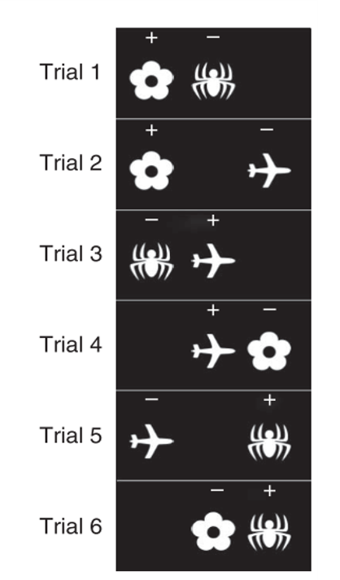   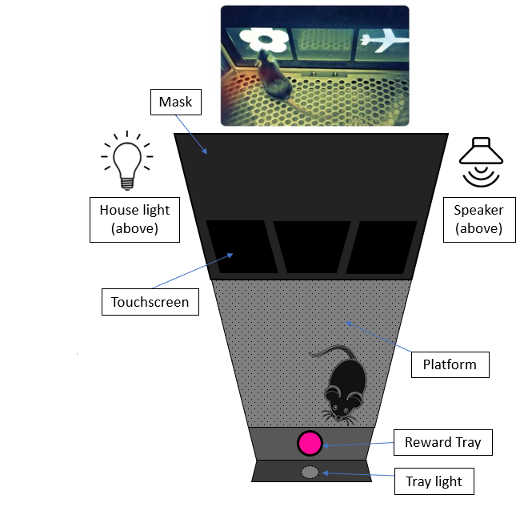     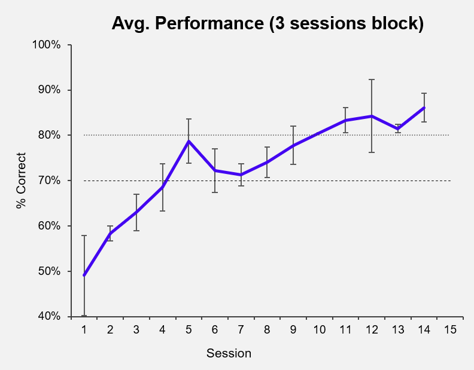

### Background: Calcium imaging

The mouse completes the task with a miniatrue microscope (miniscope) implanted on its head, which shines an LED light onto an implanted lens to illuminate genetically modified neurons that fluoresce (i.e., light-up) whenever calcium is being used by the cell. In the same way that fMRI infers brain activity from blood-oxygen levels, calcium imaging infers neuronal activity from calcium concentration in the cell (indicating action potentials, graded potentials, synaptic potentials etc.)

This is what the camera sees. A MATLAB script takes each frame and determines which groups of pixels are neurons and which are not and tags and counts them.

Once tagged, each neurons's brightness level is measured to infer calcium activity. The raster plots generated here looks similar to what you would see in 'spiking' data for single-unit electrophysiology.

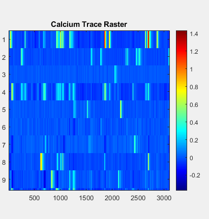     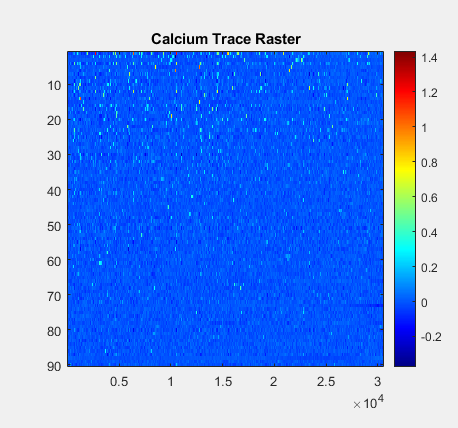

(left; zoomed in, right; same but zoomed out) The y axis is each one individual neuron. The x-axis is time (in frames; ~30ms). A more yellow colour = stronger fluoresence measured = higher likelihood of neuronal activity.

Big overarching question: How does neural activity change over time as the animal gets better at the memory task? Are there clusters of cells that activate during certain events? (Incorrect vs. correct choices, left vs. right vs middle response, etc.).

For a detailed review of general tools and methodology, see: https://www.biorxiv.org/content/10.1101/2020.02.06.937573v1.full

### Data

Behavioural data is time-stamped for every action done by the animal (touching the screen, drinking reward, incorrect choice, correct choice, etc.)

Calcium data is a matrix representing NumberofCells x TotalFrames (e.g., 100 cells and 30,000 frames is a 100 x 30000 matrix). Where each value in the matrix represents fluoresence level (inferred spiking probability) for a particular cell at a particular frame in time.

Hence, the design of my data uses the activity of individual neurons as its features (x-values), the behavioural events as its dependent or predictor variables (y-values). A 'sample' here is defined as each individual attempt made by animal on the task.

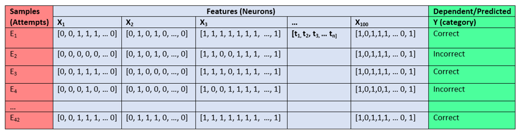

Note: Ones and zeros here denote the cell being 'on' or 'off' for sake of simplicity. In reality, the activity is defined as a transient of activity based on the change in fluoresence measured by the image analysis software.

### Learning Goals

The primary issue with my analysis design is that each cell's activity is its own time-series, which makes it difficult or impossible to use with traditional machine learning tools (at least, in its current format). Thus, my first goal is to pre-process my time series data into a meaningful format for cell-by-cell and population level analyses. My second goal is to use machine learning to predict and decode correct vs incorrect events from individual cell and population level activity.

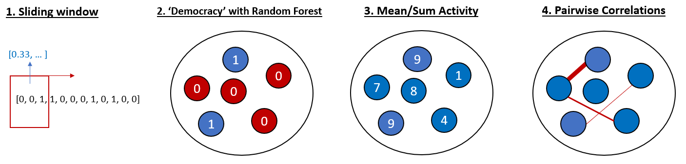

1. For single-cell analysis, I have the option of using the time series data of a single cell. However, treating each frame in the time series as its own independent variable is not realible; any slight jitter in the cell activity from trial to trial will make it impossible to find recurring patterns. To fix this, I will use a sliding window that takes the average of a few frames, effectively smoothing out the time series for each trial to allow a more liberal overlap of activity between trials.

2. From the single-cell analysis, I have the option of taking the cell-by-cell predicted categories and inputting them into a random forest analysis to test whether neurons show any kind of 'democratic' coding for correct vs. incorrect attempts.

3. For the population level analysis, I have the option of condensing my time series data into mean firing or total firing across the time series per cell, then using this overall activity score to predict behavioural events.

4. Finally, I can also apply nilearn tools to compute a correlation matrix between cells, and using those correlation values as my features to predict behaioural events.

### Tools

* Python
* Jupyter notebooks
* nilearn
* scikitlearn
* MATLAB

## Results

### Single Cell - Sliding window analysis

Below are histograms depicting the distribution of test scores (top) and 5-fold cross validation scores (bottom) for three machine learning classifiers tested on 109 individual cells with windowed (4 frames) time-series data. Training and test data was shuffled and re-tested 50 times, and counts of cells that scored >80% accuracy on each test are tabulated next to each classifier method.

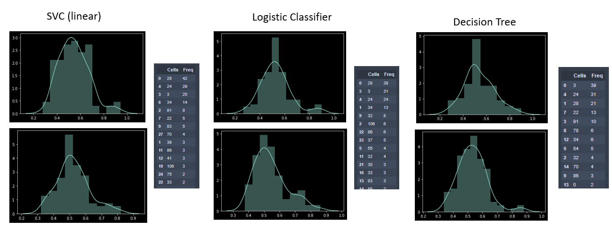

Adding +1 to the Cell ID, it appears that cells 29, 25, and 4 most frequently scored above 80% prediction accuracy for correct vs. incorrect trial attempts. Let's see what they look like:

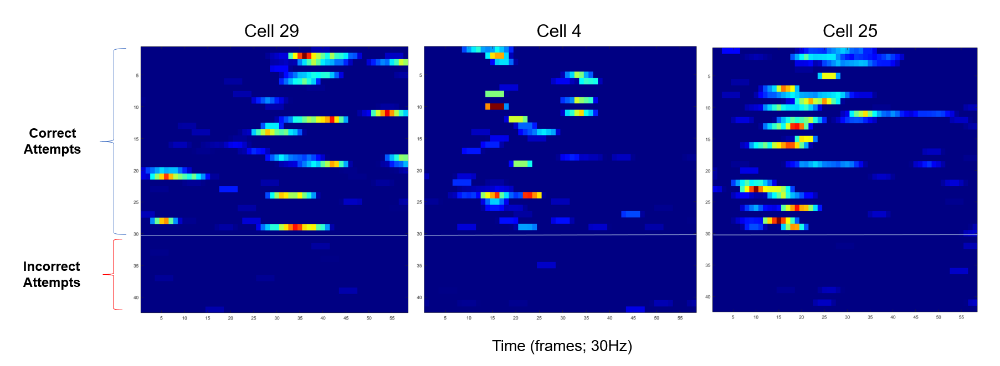

Here we can see visually that these cells do indeed differ significantly between correct and incorrect responses. These results were, in fact, already known. Several cells in the hippocampus are expected to light up whenever an animal receives a reward for a correct trial. Thus, the purpose of this test was just to validate that my machine learning tools were working properly.

### Population level - 'democracy'

Now then, what about population level activity? Is there something about the activity of all these cells, or groups of cells, that can indicate correct vs. incorrect response choices? One idea is to test whether hippocampal cells function as some kind of 'democracy'; where the predictions of individual neurons accounted together could somehow improve the overall accuracy of the machine learning tools.

To do this, I took the predctions of each individual neuron from the training set of the linear SVC analysis and put it into a Random Forest classifier. Unfortunately, the results were quite poor (41.6% +/- 11% accuracy on cross validation). This isn't too surprising, as hippocampal cells aren't really expected to work 'democratically' to predict single, specific events.

### Population level - Summed Activity

Equally bad were the results of the summed time-series activity all 109 cells. This is again to be expected, as temporal dynamics cannot be ignored on the large timescales over which activity was averaged (over 2 seconds). Cells with distinct and specific activity in very narrow timeframes (left image) are treated the same as cells that fire sparsely, but the same amount overall, within the same time-frame (right image). However, this type of 'summed' activity might be more useful for more specific and narrow time windows of interest (<1 second) that are tied to specific, expected events. Accuracy might also improve by 'leaving out' features (i.e., cells) with inconsistent activity from the model. Indeed, not all cells would be expected to contribute equally (or at all) to the coding of a correct or incorrect trial.

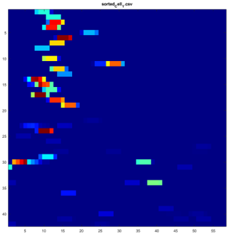   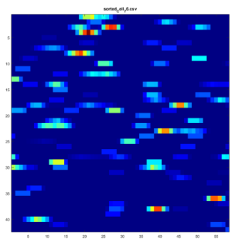

### Population level - Cell-to-Cell Correlations

Another way to look at population level activity is through cell-to-cell correlations, similar to what is done fMRI connectivity analyses. Except here, each region of interest is an individual neuron. Adapting the script learned from the machine learning with nilearn tutorial, I generated a 109 x 109 correlation matrix for all cells, as well as a feature matrix of 5800+ correlations between pairs of cells' windowed time series data:

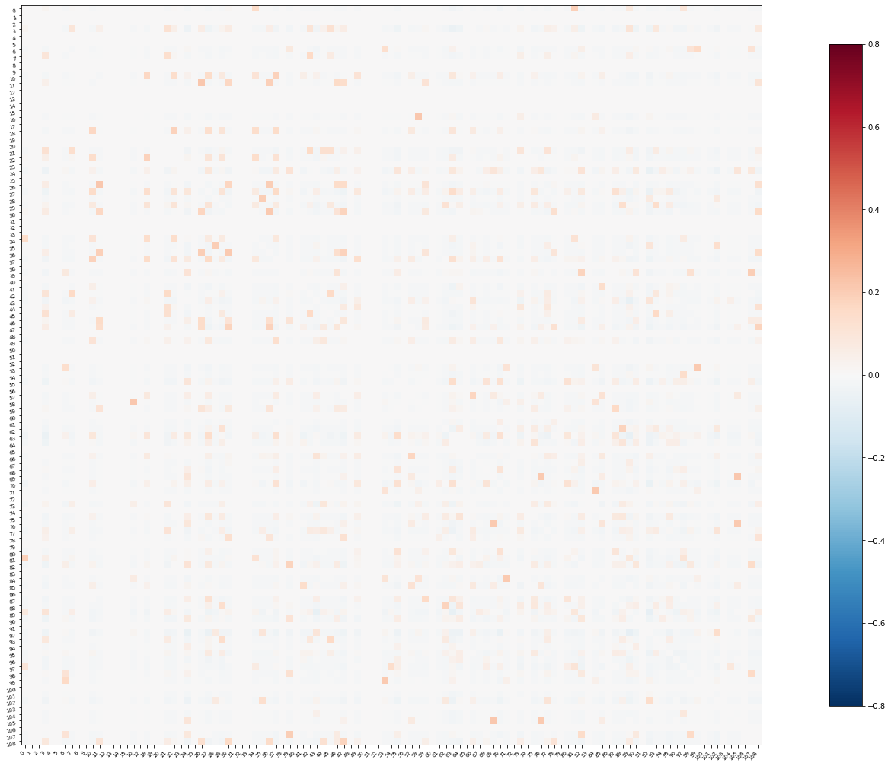 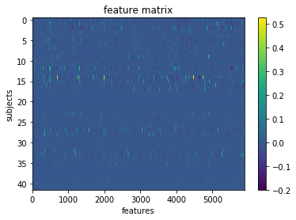

Feeding these featrues into a few machine learning classifiers, we get some cool test results (+ cross validation)!

* SVC (rbf): 78.8% (82.5 +/- 10%)
* Decision tree: 82.6% (65 +/- 10%)
* Random forest: 73.5% (72.5 +/- 9%)

It appears that looking at correlated activity is a reasonable approach for understanding correct vs. incorrect responses in this task, when the animal is collecting reward. This again makes intuitive sense, as we know that large populations of cells fire together whenever the animal receives a reward, so highly correlated activity would be indicative of a 'reward' event (and thus, a 'correct' event), perhaps even more so than any single cell's activity.

## Conclusions

Here, we see that both single cell and population level analyses can be useful for modelling correct vs. incorrect performance on a reward-driven behavioural task. However, some methods seem to work better than others, and both the methods that do and do not work help us understand the functional dynamics of the hippocampal cells that govern certain aspects of reward-driven learning.

## Future directions

* Use machine learning to predict and decode other events in the population activity of the cells, such as trial and object types.
* What does the 'connectome' of relevant correlations for specific events look like? How does it change over time?
* How does prediction accuracy for each of these tests change over time? Does this reflect anything about how the hippocampus handles the learning of new information?
* Create a polished machine learning pipeline to systematically decode different types of events in the behaviour and pick return a rank of the best models and their respective prediction accuracies and how they change over time.

## Acknowledgements

I'd like to thank the BrainHack team for putting together this wonderfully fun and fascinating course on neural data science! I've learned a lot about how other neuroscientists are tackling their analyses and how best to share my data with collaborators and labmates. Special thanks to Yann and Loic for helping me out with the machine learning aspects of my project.
