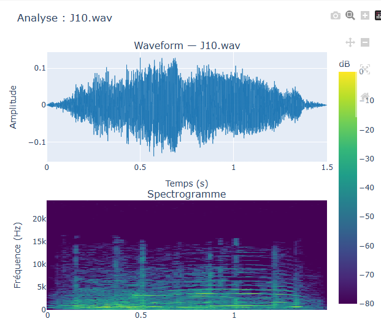
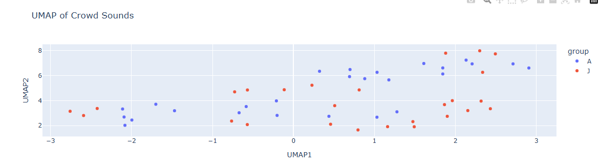
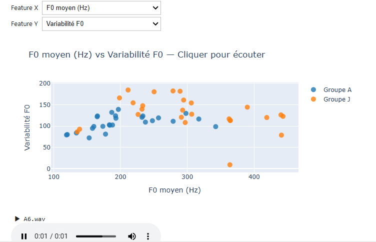

## Project definition

### Background
This project focuses on the organization, visualization, and exploration of crowd sound stimuli. Crowd vocalizations are widely used to investigate emotion perception, multisensory integration, and social behavior, but current crowd-audio stimuli are often custom-made, difficult to reproduce, poorly standardized, and limited in experimental control.

The objective of this project is to develop an interactive and reproducible framework for exploring crowd sounds through automated feature extraction, dimensionality reduction, and statistical comparison between stimulus groups.

The project organizes sounds according to several perceptual and acoustic dimensions, including temporal, dynamic, vocal, spectral, and spatial parameters. This framework is intended to facilitate the creation, organization, and reuse of auditory stimuli in experimental research contexts.

The project also emphasizes reproducibility and open science practices through the use of Python, Jupyter notebooks, GitHub, and structured workflows for audio processing and metadata organization. Final deliverables will include reproducible scripts, interactive audio exploration tools, audio visualizations, structured datasets, and documentation to support reuse and long-term accessibility.

### Tools
This project relied on numerous tools such as:
- **Python** - scripting, data manipulation, and analysis pipeline
- **librosa** - audio feature extraction (F0, MFCC, spectral features)
- **Jupyter Notebooks** - interactive analysis and documentation
- **Plotly & ipywidgets** - interactive visualizations with audio playback
- **seaborn & matplotlib** - static plots (boxplots, PCA, K-Means)
- **GitHub** - version control and project organization
- **Binder** - one-click reproducible environment
- **MyST Markdown** - interactive Jupyter Book site deployed via GitHub Pages

### Data
The dataset includes 52 crowd sound stimuli (~1.5s each), divided into two groups:
- **Group A** - 26 sounds
- **Group J** - 26 sounds

Features extracted per sound using librosa:
- total duration
- global intensity level
- intra-sound amplitude variation
- mean fundamental frequency (F0)
- F0 variability

### Project deliverables
At the end of this project, these files will be made available:
- Reproducible feature extraction pipeline with JSON outputs per sound
- Static visualization notebook - boxplots, PCA, K-Means
- Interactive exploration notebook - UMAP, waveform, spectrogram, audio playback, statistical comparison
- Jupyter Book site deployed on GitHub Pages
- Structured GitHub repository (MIT license, v1.0.0)
- Binder environment for fully reproducible execution

## Results
---
### Progress overview

##### Figure 1. Waveform and Spectrogram of a crowd sound stimulus

*Waveform (top) shows the amplitude over time. Spectrogram (bottom) shows the frequency content over time in dB.*

##### Figure 2. PCA and UMAP projections of MFCC features

*Each point represents one sound, colored by group (A vs J). PCA and UMAP reduce the 13 MFCC coefficients to 2 dimensions for visualization.*

##### Figure 3. Statistical comparison - Group A vs Group J

*Boxplots of acoustic features by group. F0 (p=0.0001***) and spectral centroid (p=0.047*) show significant differences between groups.*

### Tools I learned during this project
- **librosa** - audio signal processing and feature extraction
- **UMAP & PCA** - dimensionality reduction on 13 MFCC coefficients → 2D
- **Mann-Whitney U tests** - non-parametric statistical comparison between groups
- **Plotly & ipywidgets** - interactive visualizations with on-click audio playback
- **GitHub Actions** - automated deployment of Jupyter Book to GitHub Pages

- **MyST Markdown** - structured scientific web publishing

### Deliverables
The results of my project were mostly:
1. Reproducible audio feature extraction pipeline (`01_extraction.ipynb`) with JSON outputs per sound
2. Static visualization notebook (`02_visualization.ipynb`) - boxplots, PCA, K-Means clustering
3. Interactive exploration notebooks:
   - `03a_dimensionality_reduction.ipynb` - PCA, UMAP, t-SNE
   - `03b_individual_sound.ipynb` - waveform, spectrogram, audio playback
   - `03c_feature_comparison.ipynb` - feature scatter plots, click to listen
   - `03d_statistical_comparaison.ipynb` - boxplots, Mann-Whitney tests
4. Jupyter Book site deployed on GitHub Pages with Binder integration
5. Structured GitHub repository with README (MIT license, v1.0.0)

### Interactive Website & Code Access

The full project is accessible in two ways:

- **Jupyter Book site** (read-only, no installation required): [brainhack-school2026.github.io/Mourgues_Project](https://brainhack-school2026.github.io/Mourgues_Project/)
- **Binder** (fully interactive, run the code in your browser): 

### Presentation

[Click here to view the slides](https://docs.google.com/presentation/d/1v9t9jJARwTjZ2fG6t1Csj8lXJtg4WSRqbLEC1cxJR6A/edit?usp=sharing)

### Future work
- Extract more spatial parameters (spatialization, source distribution)
- Add t-SNE as a third dimensionality reduction method
- Integrate stimuli into multimodal experiments combining eye-tracking, HRV, and EEG
- Expand the dataset with additional crowd sound categories
- Submit stimuli to OSF for open access sharing

## Conclusion and acknowledgement
This project delivered a reproducible and interactive framework for acoustic analysis of crowd sound stimuli. Results show clear acoustic differences between groups, particularly in F0 and spectral centroid, which aligns with perceptual differences in crowd emotionality.

These stimuli are designed to support future neuroimaging experiments combining eye-tracking, HRV, and EEG to investigate how the brain processes emotional crowd vocalizations.

Thanks to the Brainhack School 2026 team and instructors for their guidance and support.

## References
Banse, R., & Scherer, K. R. (1996). Acoustic profiles in vocal emotion expression. *Journal of Personality and Social Psychology*, 70(3), 614–636. https://doi.org/10.1037/0022-3514.70.3.614
