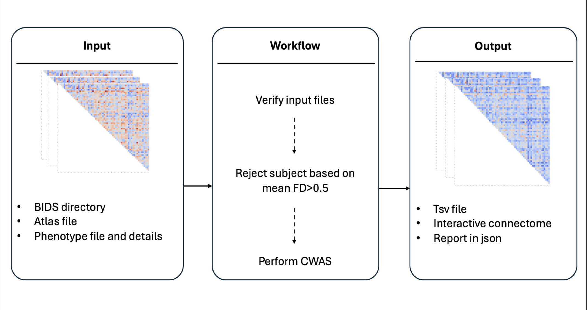
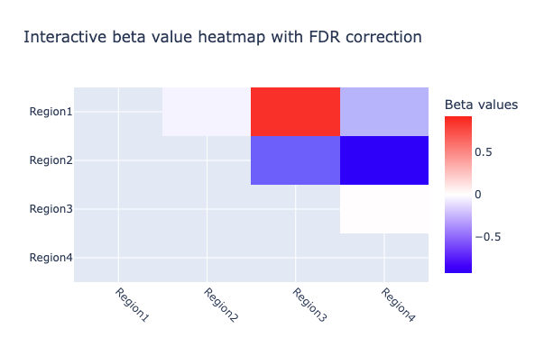

<!-- This is an html comment and this won't appear in the rendered page. You are now editing the "content" area, the core of your description. Everything that you can do in markdown is allowed below. We added a couple of comments to guide your through documenting your progress. -->

## Project definition

### Background

The reproducibility crisis in neuroimaging has affected many research domains, and psychiatric research is no exception <sup>[1](https://doi.org/10.1016/j.bpsc.2022.12.006)</sup>. Indeed, psychiatric studies using neuroimaging tools have long struggled with poor reproducibility, largely due to small sample sizes and heterogeneity in analysis methods.

To address this issue, initiatives such as the ENIGMA consortium (Enhancing NeuroImaging Genetics through Meta-Analyses) were launched <sup>[2](https://doi.org/10.1007/s11682-013-9269-5)</sup>. ENIGMA is a consortium comprising international research sites and organized into several Disease Working Groups that focus on most major psychiatric conditions. It promotes a collaborative framework: while data remain at local sites, analyses follow standardized protocols, enabling large-scale meta-analyses across cohorts.

This approach has proven successful for structural and diffusion MRI, thanks to the development of open and reproducible protocols (https://enigma.ini.usc.edu/protocols/). In this context, Waller et al., 2020 developed HALFpipe <sup>[3](https://doi.org/10.1002/hbm.25829)</sup>, an open-source software that facilitates the preprocessing and extraction of connectivity matrices from functional MRI data. However, no standard tools has yet been proposed by ENIGMA for statistical analyses of functional connectivity matrices.

#### Objectives
This project aims to support the broader collaborative effort by developing a dedicated BIDS-App for conducting Connectome-Wide Association Studies (CWAS) based on connectivity matrices.

#### Objectives for BrainHack school
Learn how to : 
1. Write scripts in python following the BIDS-app workflow 
2. Build a GitHub repository with automated tests with GitHub Actions
3. Develop a sustainable and easy-to-use python package
4. Produce interactive plots and interactive website ✨
 
### Tools

This project uses the following tools and standards to ensure reproducibility, openness, and long-term usability:
- **Python scripts** : To write functions, modules and be able to test them
- **Git & GitHub**: 
   - *Public repo*: Enables version control and promotes open-source, collaborative development of the library.
   - *GitHub Actions*: Implements automated testing and continuous integration to maintain code quality during development (Git Actions).
- **BIDS Ecosystem**: Ensures compatibility with the BIDS standard, following the workflow of a BIDS App <sup>[4](https://doi.org/10.1371/journal.pcbi.1005209)</sup>.
    - For this package, we followed the [BEP-017 proposal](https://bids.neuroimaging.io/extensions/beps/bep_017.html)
- **Python Packaging with uv**: Distributes the tool as an installable open-source Python library for easy integration and reuse.
- Interactive documentation : Provides documentation and examples on the website.
   - **Jupyter Notebooks**
   - **Plots with Plotly**
   - **Website with MyST**

### Data

To test the integration of the pipeline, toy data have been generated using `numpy` and `pandas`.

Local tests have been made base on [Giga-connectome outputs](https://giga-connectome.readthedocs.io/en/latest/). 

### Deliverables

1. Python scripts following the BIDS-App workflow
2. A python package ready to be used available on [GitHub](https://github.com/brainhack-school2025/elkhantour_project)
3. A public [GitHub repository](https://github.com/brainhack-school2025/elkhantour_project) with integration test
4. A [website](https://brainhack-school2025.github.io/elkhantour_project/) with interactive plots

## Results

### Progress overview

During Brain Hack School 2025, I developed a functional and pip-installable Python package. I also set up a website with all the documentation you need to run the CWAS pipeline. This first version of the Python package is now open to feedback and collaboration.

### Tools I learned during this project

- **Python scripts** : All original scripts were refactored into modular Python files. Scripts are now organized by topic and function to improve readability and maintainability.

- **Git, GitHub & Testing with pytest** : This project introduced me to advanced GitHub features, including GitHub Actions for continuous integration. I learned to use `pytest` to write and integrate tests that ensure the pipeline remains functional after updates. 

- **Python Packaging with uv** : I discovered `uv` during one of the BHS2025 modules in Montreal, and used it to build this package.

- **BIDS Ecosystem** : This project helped me to understand the importance of the BIDS ecosystem and all the related BIDS-App. I discovered BIDS extension proposals (BEPs) such as those for derived data like connectivity matrices.

- **Website with MyST** : I used MyST Markdown to build and publish a clean, structured documentation website.

- **Plots with Plotly** : To create interactive visualizations, particularly for complex connectivity maps involving many brain regions.

### Results

#### Deliverable 1: BIDS workfow implementation 
This pipeline was created to follow the BIDS-App workflow as proposed by [Gorgolewski et al., 2017.]((https://doi.org/10.1371/journal.pcbi.1005209))



This pipeline takes as input a directory structured according to the [BEP-017 proposal](https://bids.neuroimaging.io/extensions/beps/bep_017.html). Both the input and output directories are defined via command-line arguments.

#### Deliverable 2: Python package
This package was initialize using [`uv`](https://github.com/astral-sh/uv). 

Thanks to this setup, the repository can be installed using  using `pip install .`. This configuration ensures that:
- All required dependencies are installed 
- The pipeline can be tested using `pytest`

###### Quick start
To run this pipeline, you simply need to follow the next 3 steps: 

1. Clone the repository
```
git clone https://github.com/brainhack-school2025/elkhantour_project.git
```
2. Install the package

```
pip install -e .
```

3. Run the pipeline using the command `cwas-rsfmri` followed by the flags.

```bash
cwas-rsfmri --bids_dir=bids_directory --output_dir=results --atlas_file=atlas.txt --atlas=example_atlas --phenotype_file=participants.tsv --group=diagnosis --case_id=NDD --control_id=HC --session=timepoint1 --task=task01 --run=01 --feature=denoiseSimple
```

#### Deliverable 3: Continuous integration with GitHub Action

The tests were implemented using [pytest](https://docs.pytest.org/en/stable/).

Since this package serves as a *glue* between already existing pipelines, the focus is on integration testing rather than unit testing. To support this, toy datasets are automatically generated and deleted during each pytest run to avoid unnecessary disk usage.

For now, two integration tests are included: 
1. One without any optional arguments (`scan`, `sequence`, `medication`).
2. One using all optional arguments

These tests are automatically run on GitHub via GitHub Actions on every push to the `main` and `dev_test` branches, as well as on pull requests.

#### Deliverable 4: MyST Website 
To provide complete documentation and show example figures generated by the pipeline, a website was built using MyST and is hosted on GitHub Pages.

The documentation is available directly on the site https://brainhack-school2025.github.io/elkhantour_project/

To visualize the interactive figure, please see: https://brainhack-school2025.github.io/elkhantour_project/interactive-plots



#### Contribution to Open Science
This project aims to:
1. Promote __collaborative science__ through:
- A public GitHub repository open to contributions
- Continuous integration with GitHub Actions, which automatically run on new pull requests
2. Ensure __reproductible pipeline and results__ by:
- Providing a Python package that can be run with just three command-line commands
- Following the BIDS standard for input organization, aligning with community efforts to standardize neuroimaging workflows
3. Offer extensive __documentation__ using MyST markdown, a tool designed for open-source projects that supports clear, structured scientific communication and web-based publishing.

## Conclusion and acknowledgement

This project provides an easy-to-use and fast Python package for researchers working with fMRI connectivity matrices. It's fully open-source and welcomes collaboration from the community.

The package was built using recent, open-source tools and follows principles established by the neuroimaging community to align with current standards in neuroimaging research.

### Next steps
- **Expand integration tests**: Improve existing tests and add failing test cases to ensure the pipeline handles incorrect inputs and edge cases properly.
- **Publish to PyPi**: Once the pipeline is more stable and mature, release an official version to PyPI for easier installation and distribution.
- **Docker & Apptainer**: Containerize the pipeline to ensure full environment reproducibility using Docker and Apptainer.

### Brain Hack School presentation materials
[Project description - Week 2](https://docs.google.com/presentation/d/1BFQEd32ZGSvIpQaBQh5KjRjrZ0RL78illSvqR80Dr_E/edit?usp=sharing).

[Final presentation - Week 4](https://docs.google.com/presentation/d/1AT7jvhL63toRHIYBsFZYHyxpPp-cLphSkeC5kAkJMak/edit?usp=sharing).

## Aknowledgements
This library is based on code originally published by Dr. Clara A. Moreau & Dr. Sebastian Urchs.

The original version of the scripts can be found here : https://github.com/claramoreau9/NeuropsychiatricCNVs_Connectivity

Thanks to Sara & Cleo for their help to create the Myst website! I would like to thank all the Professors, TAs, speakers of Brain Hack School 2025 Montreal. Special thanks to Lune Bellec who was mentoring me over the past few weeks.

## References
1. 	Botvinik-Nezer R, Wager TD. Reproducibility in neuroimaging analysis: Challenges and solutions. Biol Psychiatry Cogn Neurosci Neuroimaging. 2023;8: 780–788.
2. 	Thompson PM, Stein JL, Medland SE, Hibar DP, Vasquez AA, Renteria ME, et al. The ENIGMA Consortium: large-scale collaborative analyses of neuroimaging and genetic data. Brain Imaging Behav. 2014;8: 153–182.
3. 	Waller L, Erk S, Pozzi E, Toenders YJ, Haswell CC, Büttner M, et al. ENIGMA HALFpipe: Interactive, reproducible, and efficient analysis for resting-state and task-based fMRI data. Hum Brain Mapp. 2022;43: 2727–2742.
4. 	Gorgolewski KJ, Alfaro-Almagro F, Auer T, Bellec P, Capotă M, Chakravarty MM, et al. BIDS apps: Improving ease of use, accessibility, and reproducibility of neuroimaging data analysis methods. PLoS Comput Biol. 2017;13: e1005209.