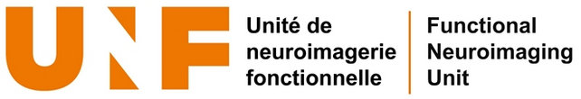
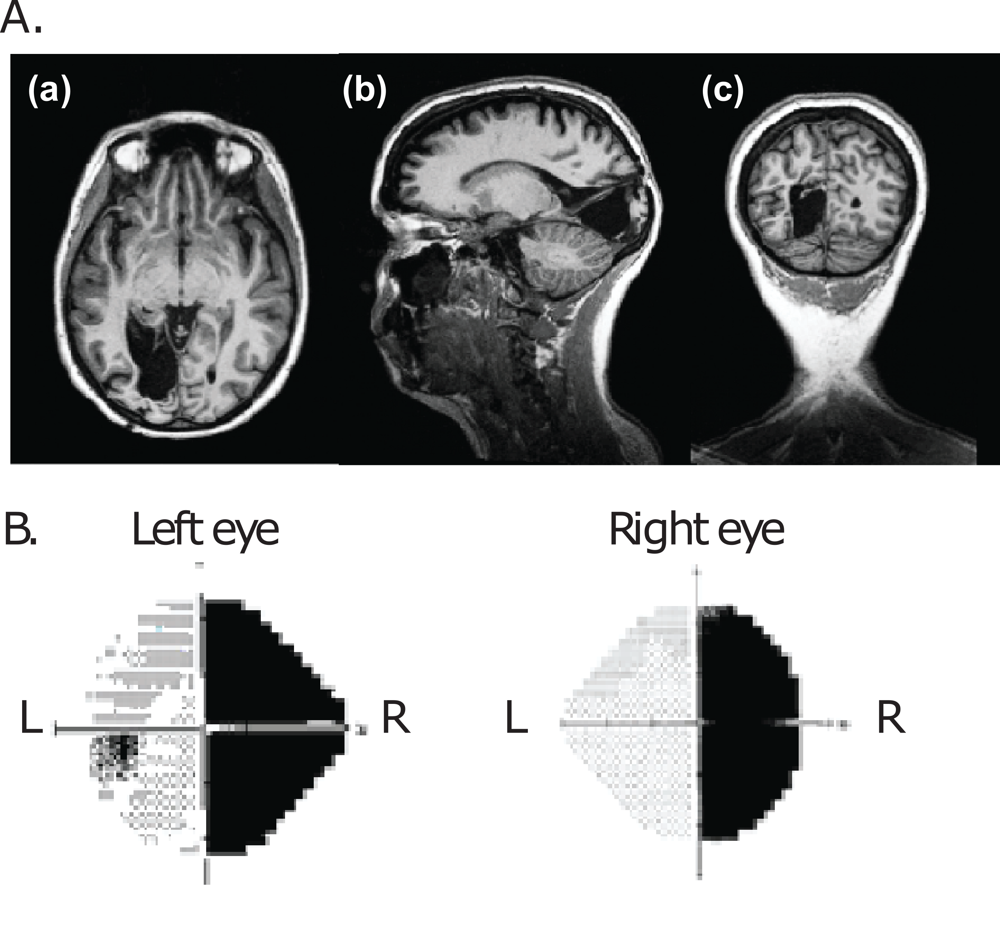
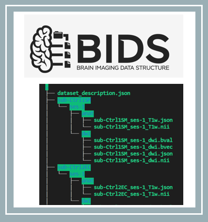
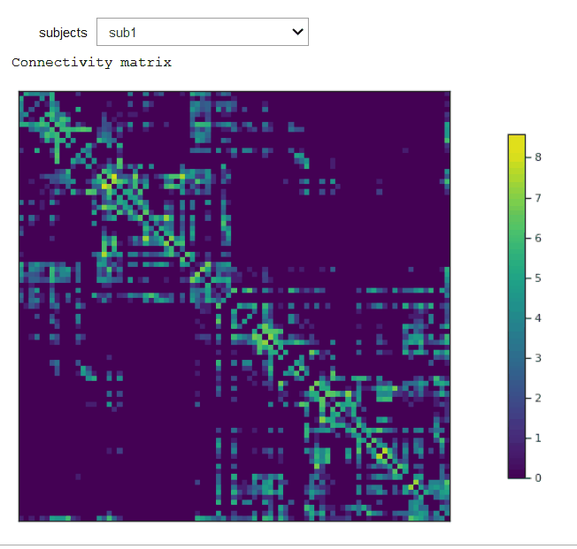
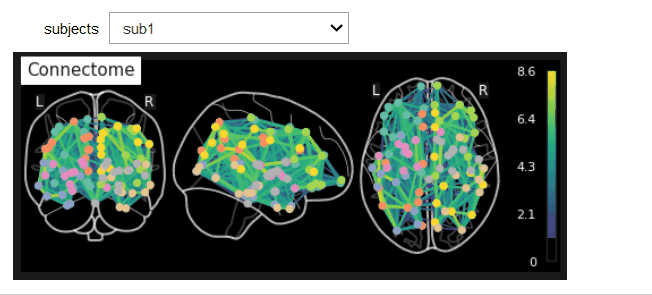
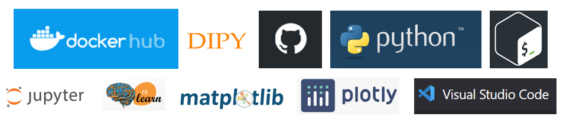

<!-- This is an html comment and this won't appear in the rendered page. You are now editing the "content" area, the core of your description. Everything that you can do in markdown is allowed below. We added a couple of comments to guide your through documenting your progress. -->

# Diffusion MRI- From raw data to mapping brain connectomes.
## Organizing, preprocessing, analyzing and visualizing diffusion MRI data. 
### This project is part of the Brainhack Summer School 2020.

### Contributors: Michèle W. MacLean & Brainhack School Members

## Summary 

Hello! I'm currently a PhD student in Cognitive Neuroscience at l'Université de Montréal. My main focus is to study cortical visual impairment using MRI techniques. Damage to the primary visual areas can result in clinical blindness and prompt a cascade of dynamical structural and functional alterations of the neural networks at both the cortical and subcortical level. Following this damage, individuals can sometimes preserve the ability to non-consciously process visual information in their blind field, a striking phenomenon know as blindsight. My fascination resides in understanding how the brain can process visual information without conscious awareness.

The overall goal of the current project was to combine, use and present the new tools learned during the BrainHack Summer School to organize, preprocess, analyze and visualize diffusion MRI data acquired at l'Unité de neuroimagerie fonctionnelle during my PhD.  

 

# Project definition 

## Background

This project explored the steps for analyzing diffusion magnetic resonance imaging data starting from the raw data all the way to data visualization. For this, I used previously acquired data from l'Unité de Neuroimagerie Fonctionnelle in Montréal. 

**Project objectives during BHS 2020:** 
The first steps were to **1)** organize the MRI data in a BIDS friendly format and then **2)** preprocess the data. Then, I  explored **3)** analyzing diffusion MRI (i.e. tracking) and **4)** performed data visualization.

**Overarching goal:**
The long term goal is to investigate the consequences of a primary visual cortex lesion on structural and functional connectivity using both diffusion MRI and resting state functional connectivity.

## Tools 
This project will rely on the following:
* **GitHub** for creating a repository & assembling all the resources.
* **Bash terminal**
* **Visual studio code** as a code editor
* **BIDS** as a standard to organize the neuroimaging data
* **Python** 
* **Docker container** to run preprocessing pipeline and basic tracking
* **DIPY** for preprocessing and basic tracking of diffusion MRI
* **Jupyter Notebook** and for data visualization
* **Interactive data visualization tools**: Nilearn, Plotly, Numpy, Matplotlib, Seaborn, Widgets, etc.

## Data 
MRI data was acquired with a high resolution 3 Tesla scanner (Siemens Trio system) and consists of a preliminary data set of 5 subjects, including 1 individual with cortical visual impairment with blindsight and 4 neurotypical controls. For each participant, raw structural MRI, resting state functional connectivity, fMRI and diffusion MRI data is available. 

Given the time course of the summer school, after the initial preprocessing of the data, I focused on working with the diffusion MRI data. This data set will allow to first become familiarized with the new neuroimaging tools learned during the BrainHack summer school. When I will acquire a larger data set, during the rest of my PhD, I plan to incorporate it to this project. 

The figure above is an example of an individual with cortical visual impairment to give you an idea of the type of data, where A) shows a T1-weighted anatomical scan with three different slice views showing the primary visual cortex removal in the left hemisphere and the destruction of the primary visual areas (V1) and B) the individual's visual field showing a symmetric loss across both eyes leading to a complete contralateral visual loss in the right visual field.

As the dataset is not yet open access, feel free to send me a message if you have any questions and I'll be happy to answer!

## Deliverables
For the project:
* The current markdown document, completed and revised.
* Organization of MRI data into BIDS format
* The diffusion MRI data preprocessed.
* Basic tracking performed on the preprocessed diffusion MRI data with an output of streamlines & connectivity matrices.
* Data visualization within a jupyter notebook using plotly, nilearn and matplotlib.
* Requirements.txt for the Jupyter notebook

For the course:
* **Week 1 Deliverable:**  [Assessement](https://github.com/mwmaclean/MacLean-M-QLSC612)
* **Week 2 Deliverable:** [README file](https://github.com/brainhack-school2020/mwmaclean-BHS2020/blob/master/README.md)
* **Week 3 Deliverable:** [Data visualization](https://github.com/brainhack-school2020/mwmaclean-BHS2020/tree/master/data_visualization)
* **Week 4 Deliverable:** [Presentation](https://github.com/brainhack-school2020/mwmaclean-BHS2020/tree/master/presentation)

## Methods
1. **Data Organization/Management.**
* Convert dicoms to a BIDS friendly dataset. [This tutorial](http://reproducibility.stanford.edu/bids-tutorial-series-part-1b/) served as a guideline.

2. **Preprocessing diffusion MRI data.**
* Running a preprocessing pipeline using [this docker image](https://hub.docker.com/r/gkiar/dwipreproc_fsl-5.0.11_minified)
* [This python script](https://github.com/gkiar/stability/blob/master/code/preprocessing/preprocessing_pipeline.py) was used within the docker container.
* Labels from Klein & Tourville (2012) were applied.

3. **Creating a seed mask.** 
* [This python scricpt](https://github.com/gkiar/mask2boundary) was used to create a seed mask for each participant.

4. **Tracking of diffusion weighted images (DWI)**
* [This docker image](https://hub.docker.com/r/gkiar/dipy_tracking) was used to perform tracking of the diffusion data.
* [This python script](https://github.com/gkiar/stability/blob/master/code/tractography/dipy/dipy_tracking.py) was used within the container. This script is based off of [this tutorial](https://dipy.org/documentation/1.0.0./examples_built/tracking_introduction_eudx/) for DIPY tracking.

5. **Data visualization**
* Data visualization was performed within a Jupyter notebook using Plotly, Nilearn, Matplotlib, Seaborn and more (see visualization examples with gif below).

## Progress & Results

### Data visualization
1. Connectivity matrix 
2. Connectome projected on 3 views of a 2D glass brain
3. Connectome projected on a 3D glass brain

* The [jupyter notebook](https://github.com/brainhack-school2020/mwmaclean-BHS2020/blob/master/data_visualization/dMRI_data_visualization.ipynb) version of all three figures is interactive with a drop-down for each subject using widgets.
* The connectivity matrices (.mat files) used for the data visualization can be found [here](https://github.com/brainhack-school2020/mwmaclean-BHS2020/tree/master/data_visualization/connectivity_matrices)
* The figures (saved as .png or .html) for each subject can also be found [here](https://github.com/brainhack-school2020/mwmaclean-BHS2020/tree/master/images) 

### Progress overview
This project was initiated by Michèle MacLean May 19th 2020 as part of the BrainHack Summer School 2020. 
Organization of MRI data into BIDS format, preprocessing and basic tracking of the data is complete as well as data visualization for the deliverable for week 3. See the methods section for a detailed description. This will be an ongoing project that I will continue to work on after BrainHack Summer School. Feedback is welcome!

#### Tools and skills I learned during this project
* **Bash terminal**
* **GitHub**
* **Markdown**
* **Visual Studio Code**
* How to implement **BIDS** 
* **Python** scripts 
* **Docker container** 
* **DIPY** for preprocessing and basic tracking of diffusion MRI
* **Jupyter Notebook** 
* Interactive figures in Jupyter Notebook using **data visualization libraries**: Nilearn, plotly & matplotlib, etc.
* **Preprocessing diffusion MRI data**
* **Tracking diffusion MRI data**
* **Mapping connectomes**

## Conclusion 
The BrainHack Summer School 2020 provided a theoretical framework as well as an extensive set of practical neural data analysis and visualization tools that were mainly all new to me. For the current project, my goal was to maximize using these new tools, to learn and apply the open science protocols in order to analyze data within my own doctoral project. Within the time frame of the summer school, I set out to perform all the steps starting from raw diffusion MRI data, which I previously acquired at l'Unité de neuroimagerie fonctionnelle, leading to data visualization. In particular, this dataset was organized into a BIDS friendly format, preprocessed with a python script within a docker container, basic tracking was also performed using another python script within a second container and finally data visualization was done using multiple libraries within a jupyter notebook. As a neuroscientist with a limited previous background in programming, I believe I sensibly improved my skills towards performing independently the whole process to analyze neuroimaging data. As I plan to continue working on this project with the new tools learned, my next immediate step will be to increase the number of subjects. Also, my next challenge will be to specifically account for brain injuries leading to cortical visual impairment during the analyses as this requires additional algorithmic tools and modifications to the preprocessing and analysis pipelines.

## Acknowledgements
Thanks to the wonderful BrainHack Summer School 2020 for this experience as well as all the excellent resources provided!
I would like to thank my instructors Noor and Benjamin for their advice and for providing specific resources for this project. Special thanks to my instructor Greg who originally developed the python scripts and docker images I used and invested a lot of time to help and contribute to this project. I would also like to thank my new friend and coding partner Daniel and my friend Simon who was a great study buddy throughout the summer school!

Be sure to check out the other cool projects from the BrainHack Summer School 2020 [here](https://school.brainhackmtl.org/project/)!

## References
1. Abraham, A., Pedregosa1, F., Eickenberg1, M.,  Gervais, P., Mueller, A., Kossaifi, J., Gramfort, A., Thirion, B., Varoquaux, G. (2014). Machine learning for neuroimaging with scikit-learn. Frontiers in Neuroinformatics 8: 14. https://doi.org/10.3389/fninf.2014.00014 (for using nilearn)
2. Garyfallidis E, Brett M, Amirbekian B, Rokem A, van der Walt S, Descoteaux M, Nimmo-Smith I and Dipy Contributors (2014). DIPY, a library for the analysis of diffusion MRI data. Frontiers in Neuroinformatics, vol.8, no.8.
3. Gorgolewski, K.J., Auer, T., Calhoun, V.D., Craddock, R.C., Das, S., Duff, E.P., Flandin, G., Ghosh, S.S., Glatard, T., Halchenko, Y.O., Handwerker, D.A., Hanke, M., Keator, D., Li, X., Michael, Z., Maumet, C., Nichols, B.N., Nichols, T.E., Pellman, J., Poline, J.-B., Rokem, A., Schaefer, G., Sochat, V., Triplett, W., Turner, J.A., Varoquaux, G., Poldrack, R.A., 2016. The brain imaging data structure, a format for organizing and describing outputs of neuroimaging experiments. Sci Data 3, 160044.
4. Kiar, G. <gkiar.github.io>. (2020). Dipy Tracking and Connectome Generation (Version v0.4.0). Zenodo. http://doi.org/10.5281/zenodo.3699595
5. Kiar, G. (2020). dipy. Retrieved from https://github.com/gkiar/stability/tree/master/code/tractography/dipy
Kiar, G. (2019). Using FSL from FMRIB at Oxford- BIDS App - FSL Diffusion Preprocessing (Version 5.0.9). Zenodo. http://doi.org/10.5281/zenodo.2566455
6. Kiar, G. (2019). preprocessing. Retrieved from https://github.com/gkiar/stability/tree/master/code/preprocessing 
7. Kiar, G. (2019). mask2boundary. Retrieved from https://github.com/gkiar/mask2boundary
8. Klein, A. and J. Tourville (2012). 101 labeled brain images and a consistent human cortical labeling protocol. Frontiers in Neuroscience 6: 171.https://doi.org/10.3389/fnins.2012.00171

