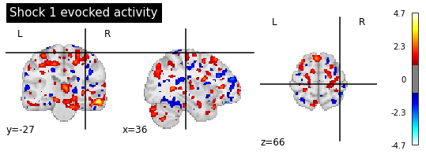
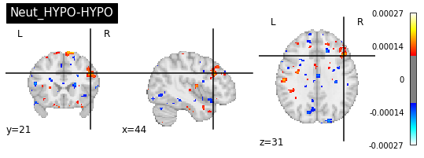
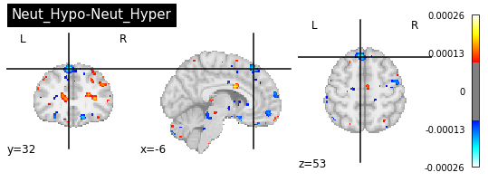
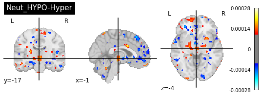
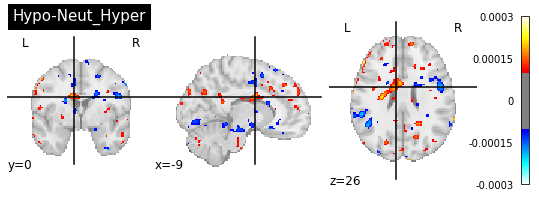
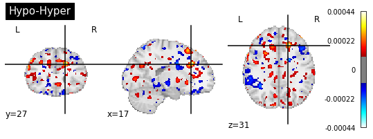
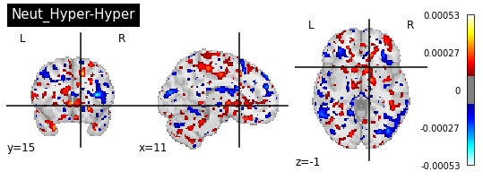

### Background
#### personal background

Link to Github page : <a href="https://github.com/dylansutterlin">
    <b>Dylan Suttelrin-Guindon</b>
</a>

Education :
  * B.Sc. Neuroscience cognitive(fundamental research option)  from Université de Montréal

### Project definition

Pain is a multi-dimensional experience involving emotional, sensory and motivational aspects. Hypnosis is one intersting psychological
 tool among many others (like placebo or meditation) that have been shown to effectively modulate pain. Verbal suggestions are an important component of hypnosis and are defined as verbal instructions that are intended to change or induce a cognition, behavior or sensory experience. In the case of pain, suggestions can be hyperalgesic or hypoalgesic, and are intended to increase or decrease pain, respectively. Verbal suggestions to reduce pain can reduce or amplify the brain activity evoked during painful experiences (e.g. during the administration of electrical shocks).

Studies show that the experience of pain is not correlated with spatially restricted brain activity, but rather is the result of activity in several regions (e.g. anterior mid-Cingulate Cortex, insula, thalamus, somatosensory cortex). Given the distributed nature of brain activity during the experience of pain, multivariate pattern analyses seem to be a good approach to study the subjective experience of pain.

In order to better understand how verbal instructions (such as hyper/hypoalgesia) are integrated by the brain and then result in a modulation of brain activity during the administration of painful stimuli, this project aims to decode pain-related brain activity and identify activation patterns that predict a specific type of verbal suggestion.

### Tools

A machine learning approach will be used to decode pain-evoked brain activity and predict verbal suggestions that was administered prior to painful stimulation.

The tools used to accomplish this task are:

* Python scripts
* Python modules (pandas, numpy, sklearn, nilearn, nibabel,  matplotlib, seaborn)
* Bash to run the scripts on elm server
* Git and Github to keep track of the project's evolution

### Data

The dataset that will be used comes from Desmartaux et al., 2021 and has restricted access. It includes 24 participants (13 women and 11 males) and mean age is 26.9. Subjects participated to a fMRI scanning session where they received hypnosis to either increase or decrease pain. After hypnotic suggestions to modulate pain,a serie of either 6 or 9 painful stimuli were administered. In total, each participant received 72 electrical shocks. Across all participants, a total of 1728 trials/shocks were done.

### Method

A Support vector classifier from [sklearn documentation](https://scikit-learn.org/stable/modules/generated/sklearn.svm.SVC.html) was applied to 1726 statistical brain maps, each modeling the brain activation during a single painful shock. Those contrast maps were generated using a General Linear Model for which the code can be found [here](https://github.com/dylansutterlin/decoding_pain_experience). Those 1726 trials were used to predict the pain modulating condition administered prior to each shock.

* Example of a statistical map :

There were four different type of verbal suggestion to modulate (or not for the control sugestions) the pain experience. Hence, there were four classes to predict with the model. Those four classes are listed a the following :

   * Hyperalgesia
   * Neutral suggestion in Hyperalgesia run
   * Hypoalgesia
   * Neutral suggestion in hypoalgeisa run

#### Target deliverables

* Python scripts (main script that run the analyses)
* Metrics and statistics of the performances of the model
* Graphics (e.g. ROC curve, confusion matrix)
* fMRI maps of the voxels that best predicted suggestions plotted as 3D interactive plots
* A markdown README.md describing globaly the project and putting it in a scientific context
* Github repository provinding a fairly open science/reproductible aspect to the project

## Results

### Overview

#### Actual deliverables

* - [x] Python scripts (main script that run the analyses)
* - [x] Metrics and statistics of the performances of the model
* - [x] Graphics (e.g. ROC curve, confusion matrix)
* - [x] fMRI maps of the voxels that best predicted suggestions plotted as 3D interactive plots
* - [x] A markdown README.md describing globaly the project and putting it in a scientific context
* - [x] Github repository provinding a fairly open science/reproductible aspect to the project

#### Final script's structure
* data : Permission pending to give access to date (...)
* docs : A readme file descripbing the pipeline
* images : The images used in this README.me
* results : Saved metrics' dataframe, brain maps (.nii files) showing the voxels that were the most predictive of the target
* scripts : The main scripts with a function file that are called in main.py
* src : All the general function that can be reused wihout context

### Statistical model

* The SVC model was performed with a linear kernel
* A nifti masker was used to project the 3 dimmensional contrast maps to 1 dimensional with the argument `(mask_strategy = 'whole-brain-template', standardize = True)`
* Then a SVC was applied using on a K-fold cross-validation with the following parameters : `GroupShuffleSplit(n_splits = 5, test_size = 0.3, random_state = 33)`

* The final model was fitted all the training set and was then tested on a subset of data for that the model had never 'seen'. The final model accuracy = **0.60970874**

* A Matrix confusion is presented to illustrate the model'performance
*  * Class 1 = Hyperalgesia
   * Class 2 = Neutral suggestion in Hyperalgesia run
   * Class 3 = Hypoalgesia
   * Class 4 = Neutral suggestion in hypoalgeisa run

* With the final model, all the coefficients were reprojected to the MNI space using `masker.inverse_transform()`. Since there were four classes, six different class comparisons can be made and the highest coefficient for each comparison are presented in the plots below. The highest peaks represents the brain regions that either when activated or deactivated (red or blue) had the highest preictive value of the class(type of suggestion). For example, when looking at the first plot, the activation of the dlPFC appears to be the most predictive to predict the Neut_HYPO vs HYPO class.

## Conclusion

The main objective of this project was to complete a decoding model having the voxels of statistical brain maps as features and type of verbal suggestions as classes. Globally this project and it objectives have been reached. The delivarables were mostly acheived. Also, althought the code to train the decoding model has been made and is operational, the statistical maps that were used to train the model are prone to change in the sense that quality-control is still required in order to be confident about the validity of the results.

## Acknowledgement

Thanks to all the instructors, espicially Marie-Eve and Francois who took the time to sit down with me and precise some concepts and shed some light on many topics such as the proper workflow, debugging techniques, proper use of sklearn, nilearn modules and so on!

## References

Casiglia, E., Finatti, F., Tikhonoff, V., Stabile, M. R., Mitolo, M., Albertini, F., Gasparotti, F., Facco, E., Lapenta, A. M., & Venneri, A. (2020). MECHANISMS OF HYPNOTIC ANALGESIA EXPLAINED BY FUNCTIONAL MAGNETIC RESONANCE (fMRI). International Journal of Clinical and Experimental Hypnosis, 68(1), 1 15. https://doi.org/10.1080/00207144.2020.1685331

Desmarteaux, C., & Rainville, P. (2021). Brain Responses to Hypnotic Verbal Suggestions Predict Pain Modulation. Frontiers in Pain Research, 2, 18.
Franz, M., Schmidt, B., Hecht, H., Naumann, E., & Miltner, W. H. R. (2021). Suggested visual blockade during hypnosis : Top-down modulation of stimulus processing in a visual oddball task. PloS One, 16(9), e0257380. https://doi.org/10.1371/journal.pone.0257380

Hofbauer, R. K., Rainville, P., Duncan, G. H., & Bushnell, M. C. (2001). Cortical Representation of the Sensory Dimension of Pain. Journal of Neurophysiology, 86(1), 402 411. https://doi.org/10.1152/jn.2001.86.1.402

Jiang, H., White, M. P., Greicius, M. D., Waelde, L. C., & Spiegel, D. (2017). Brain Activity and Functional Connectivity Associated with Hypnosis. Cerebral Cortex (New York, N.Y.: 1991), 27(8), 4083 4093. https://doi.org/10.1093/cercor/bhw220

