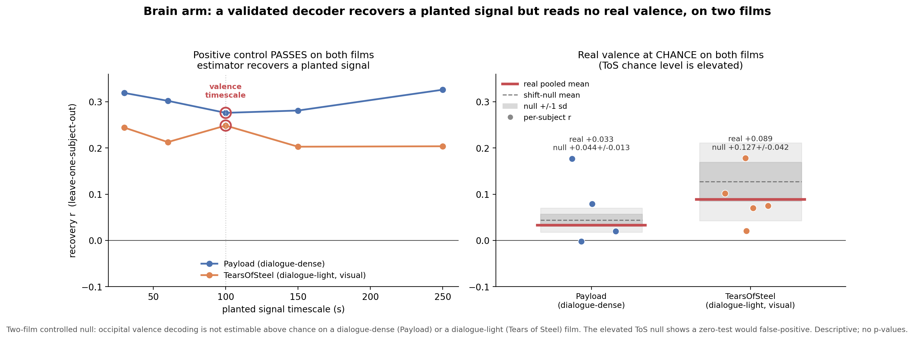
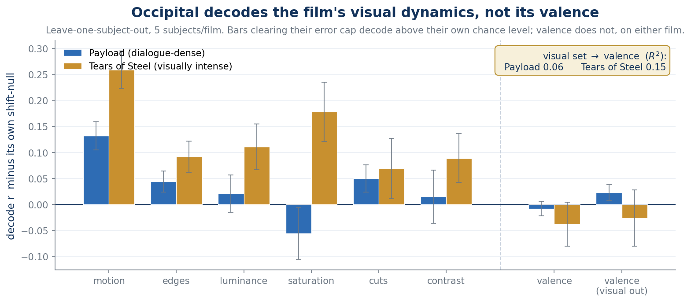

# Emo-FilM: validating automatic emotion labels against human annotation and brain data

### About me

Le Thi Thach Thao (Jessica), PhD student, Graduate Institute of Linguistics, National Taiwan University. My background is sociolinguistics and corpus linguistics. I came to Brainhack School to add neuroimaging as an instrument alongside language data, not to replace it.

GitHub: [jessicathao](https://github.com/jessicathao)

## Project definition

### Background

Naturalistic film fMRI needs a continuous emotion signal to model against. Producing that signal by hand is slow and expensive: the [Emo-FilM dataset](https://doi.org/10.1038/s41597-025-04803-5) (Morgenroth et al., 2025, *Scientific Data*) required 44 raters to annotate 50 items across 14 films. It is therefore tempting to generate the signal automatically from the dialogue with a sentiment model.

The question this project asks is whether that substitution is defensible, and if it is only partly defensible, what exactly governs when it works. The interest is not a leaderboard number. It is the validity of an annotation shortcut that the field is already reaching for.

### Tools

The project used, and in several cases the project only became possible because of, the following:

- **Git and GitHub** for version control and for publishing every analysis script, figure, and results file.
- **DataLad** to retrieve fMRI derivatives one subject at a time from OpenNeuro, which is what made a 30-subject naturalistic dataset workable on a 16 GB laptop.
- **BIDS**, since both Emo-FilM releases are BIDS-organised and the annotation and imaging arms had to be aligned on a common time base.
- **Python**: nilearn and nibabel for masking and BOLD extraction, scikit-learn for the decoders, pandas and numpy throughout, matplotlib for figures.
- **Machine learning**: cross-validated ridge and logistic decoding with leave-one-subject-out folds, planted-signal positive controls, and circular-shift null distributions.
- **Transformers and LLMs**: BERT, DistilBERT, and SiEBERT for per-segment sentiment, and Gemini 3.5 Flash through the REST API for context-aware scoring.
- **Whisper** transcripts as the text input, with credits and non-speech audio handled explicitly.
- **Jupyter and Google Colab** for the compute-heavy decoding runs.

### Data

Both components are public and CC0.

- **Annotations**: OpenNeuro `ds004872`. The target throughout is the human consensus *PleasantOther* valence series, the highest-agreement item in the dataset, sampled at 1 Hz.
- **fMRI**: OpenNeuro `ds004892`, 30 participants watching the same films, preprocessed derivatives.
- **Stimuli**: the Creative Commons short films distributed with the dataset, transcribed with Whisper.

Eleven films enter the text arm. Two films carry the brain arm.

### Deliverables

- A public, reproducible analysis repository: [emotion-label-validation-fmri](https://github.com/jessicathao/emotion-label-validation-fmri), containing the text arm, the brain arm, the visual-feature decomposition, all figures, and the results files.
- A `NOTICE.md` recording what was retracted and why.
- A project website with the arc of the work in short form.
- This report.

## Results

### Progress overview

Both arms were run, and both were then re-run against their own controls. The controls changed the answers, twice, and that is the most useful thing I can report.

### Text arm: context helps the model that can use it

Scoring each dialogue segment in isolation and correlating the resulting series against human valence gives weak agreement, well below the human inter-rater reference. Giving the model surrounding dialogue as context improves the context-capable model on dialogue-driven films and leaves it flat on dialogue-light films, which is the principled null the design predicts.

The per-segment BERT arm looked, on one film, as though it also gained from context. A direct control settled it: a plain moving average over the isolated BERT series reproduces the supposed context curve. The gain was smoothing, not comprehension.

Across eleven films the two architectures agree with each other far more closely than either agrees with humans, which makes agreement a property of the film rather than of the model.

### Text arm: the operative variable is not the one I expected

The project began with the expectation that agreement would track dialogue density: more speech, more for the text model to work with, better labels. Across eleven films the relationship runs the other way, in both models.

What predicts agreement instead is **emotional selection**: how much more emotionally marked the spoken seconds of a film are compared with its silent seconds. When a film's speech lands on its emotional peaks, text labels track human valence. When a film talks continuously through emotionally flat stretches, they do not. Dialogue coverage bounds *applicability*, since a film with no speech cannot be labelled from text at all, but among scorable films it does not bound accuracy.

This refuted the project's original headline, and the headline was retired rather than defended.

### Brain arm: a mechanistic controlled null, and one region that holds

Decoding human valence from occipital BOLD returns a null on both films tested, single-subject and pooled, with the estimator's planted-signal positive control passing on the same data.

*Figure 1. The same estimator that recovers a planted signal recovers no valence signal from occipital cortex, replicated on two films. The control is what separates a null from a broken pipeline.*

A visual-feature decomposition explains why: occipital BOLD decodes the film's low-level visual dynamics, motion most strongly, and simply carries no valence code. The null is mechanistic rather than a failure of the pipeline.

*Figure 2. Occipital cortex reads the picture, not the feeling. Motion is the strongest carrier. Valence does not clear its own null.*

Extending to affective regions and scaling the sample from a handful of subjects to the full cohort, one region, the insula, holds its effect across the scaling curve and across random subject draws, while the others dilute or drift as subjects are added. A subsample test on the low-n regime confirmed that small-sample estimates in this dataset are inflation-prone, which is the reason the scaling was run at all.

### Inference stance

No p-values are reported anywhere in this project. The human annotation series are strongly autocorrelated, on the order of a minute and a half of integrated autocorrelation, which leaves only a handful of effectively independent samples per film. Block-bootstrap resampling under those conditions produced false-positive rates far above nominal. Everything is therefore reported as a descriptive effect size against a circular-shift null, and the evidentiary standard is replication across models and across films rather than a threshold.

### Self-correction log

- An early single-subject occipital decode was **retracted** after a powered, control-validated re-analysis. That subject ranked near the bottom of the cohort on motion, and the effect did not survive.
- The **convergence thesis**, that the text arm and the brain arm hit the same dialogue-density wall, was **retired**. Two films with nearly identical selection profiles behave differently in the brain. The arms measure different things and are now reported as two contributions rather than one story.

Both are documented in the repository rather than quietly dropped.

### Tools I learnt

- DataLad, and with it the practice of treating a large dataset as something you query rather than something you download.
- nilearn and nibabel masking, ROI extraction, and the mechanics of aligning a continuous stimulus annotation to a TR grid.
- Cross-validated decoding with leave-one-subject-out folds, and the habit of never reporting a decode without a positive control and a null distribution beside it.
- Bash and a terminal-based Git workflow, including branches, remotes, and pull requests.
- The reproducibility discipline the school actually teaches: a public repo, scripts that run from the repo root, and a written record of what was wrong before.

## Conclusion and acknowledgement

Automatic emotion labels are not a drop-in replacement for human annotation on naturalistic film. They agree with human valence to the extent that a film's speech coincides with its emotionally marked moments, which is a property of the stimulus rather than of the model, and which cannot be assumed in advance for a new film. On the brain side, valence is not readable from visual cortex on this dataset, and the one affective region that survives sample scaling does so narrowly.

A rigorously established negative result is still a result, provided the controls are strong enough to distinguish it from a broken pipeline. Most of this project's effort went into exactly that distinction.

Thanks to the Brainhack School 2026 instructors and TAs, in Taiwan and Singapore, for the modules and the review, and to Elenor Morgenroth and colleagues for making Emo-FilM public under CC0. This work would not exist without that release.
