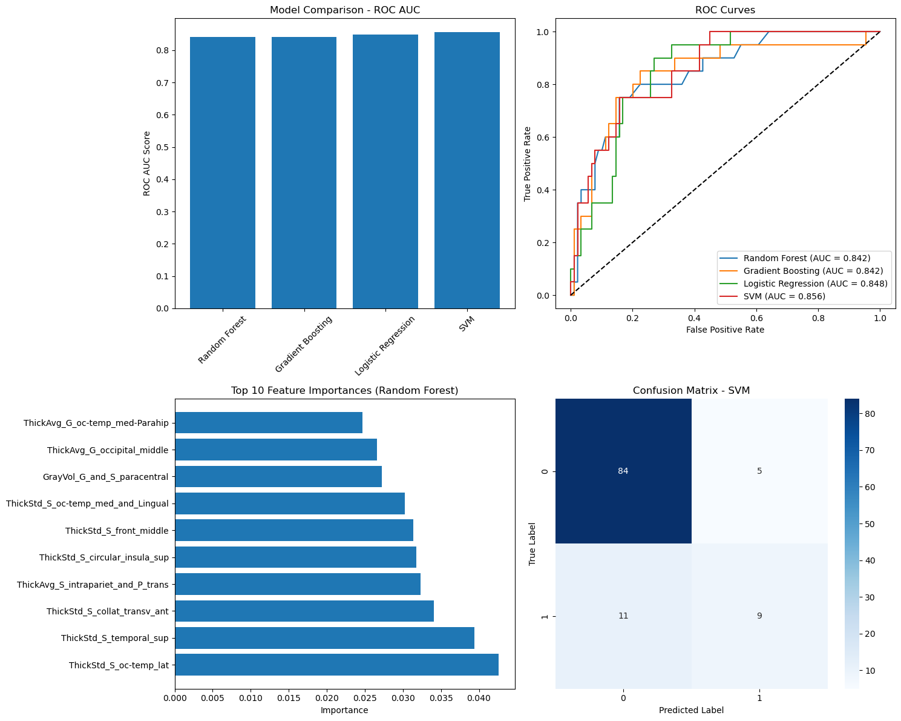
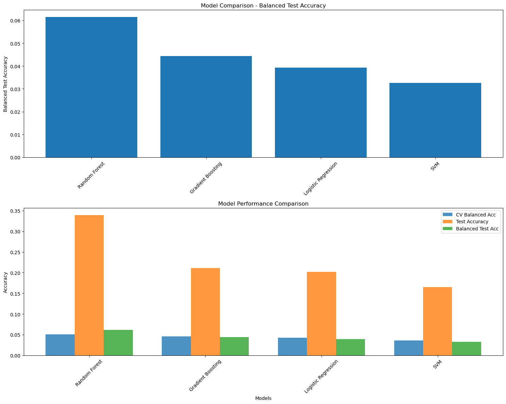
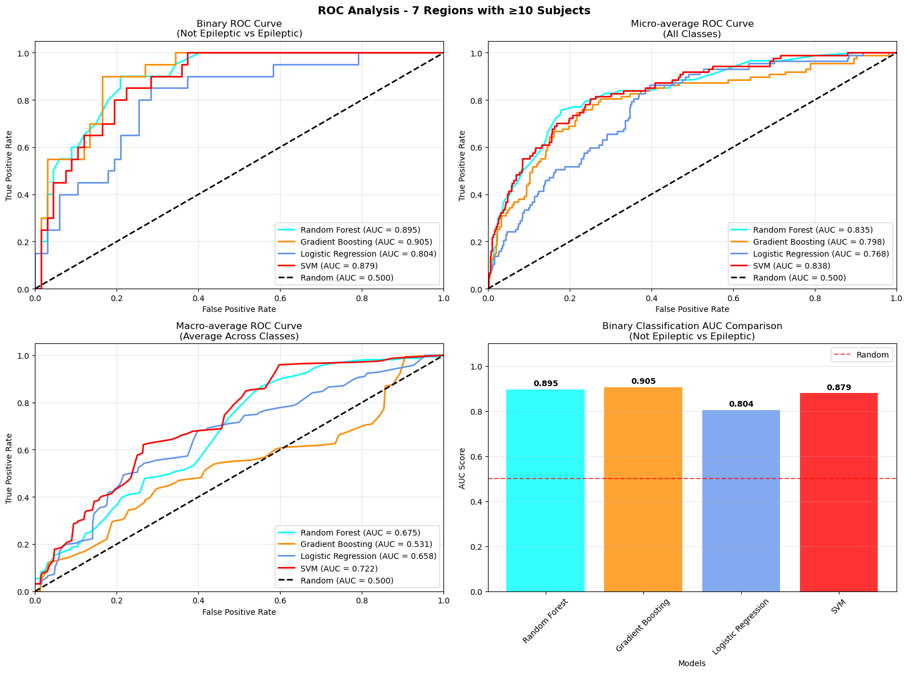

<!-- This is an html comment and this won't appear in the rendered page. You are now editing the "content" area, the core of your description. Everything that you can do in markdown is allowed below. We added a couple of comments to guide your through documenting your progress. -->

## Project definition

### Background

Focal epilepsy is a type of epilepsy in which seizures originate from a specific region of the brain, often associated with structural abnormalities visible on neuroimaging. Accurate localization of the epileptogenic zone is essential for effective treatment planning, especially in cases considered for surgical intervention. In this project, we aim to classify the anatomical region of seizure onset using structural MRI data (T1-weighted images) processed with FreeSurfer.
FreeSurfer enables the extraction of detailed cortical morphometric features such as thickness, surface area, curvature, and volume across predefined brain regions. These quantitative features can potentially reflect subtle structural anomalies associated with focal epilepsy. By using a mixed-age dataset of patients with focal epilepsy, we aim to build a machine learning model that predicts the anatomical region of the epileptic focus based on these morphometric biomarkers. This approach could contribute to more objective and automated presurgical evaluation workflows.

### Objectives

 * To develop a machine learning model capable of classifying the anatomical region of seizure onset in focal epilepsy patients using cortical morphometric features extracted from T1-weighted MRI scans.
 * To evaluate the performance of different classifiers and identify the most informative brain features associated with focal epileptogenic zones.

### Tools

 * GitHub – for version control and collaborative code management
 * DataLad – to manage and track neuroimaging datasets in a reproducible way
 * Python – for data processing, feature extraction, and model development
 * Bash – for automation and scripting of preprocessing pipelines
 * FreeSurfer – to extract cortical morphometric features from T1-weighted MRI scans
 * scikit-learn – for implementing and evaluating machine learning classification models

### Data

This study uses the Imaging Database for Epilepsy and Surgery ([IDEAS](https://pubmed.ncbi.nlm.nih.gov/39636622/)), an open-source dataset available on OpenNeuro. The dataset includes 442 pre-operative T1-weighted and FLAIR MRI scans from patients with focal epilepsy, along with 100 healthy control scans acquired on the same scanner for consistency. In addition to imaging, the dataset provides rich metadata such as age of seizure onset, sex, number of medications, scan and surgery timing, histopathological findings, and surgical outcomes. The additional data can be found [here](https://openneuro.org/datasets/ds005602/versions/1.0.0) 

### Deliverables

At the end of this project, we will have a [GitHub repository](https://github.com/school-brainhack/epilepsy-detection) containing the code :
 * data.ipynb to process the data from freeSurfer
 * model.ipynb to run the classification models
 * the processed csv files obtained after running the data.ipynb for testing purposes

## Results

The first model was a binary classification task distinguishing between epileptic patients and healthy controls based on cortical morphometric features extracted from T1-weighted MRI using FreeSurfer. The classifier achieved promising results, with a receiver operating characteristic (ROC) curve showing a clear separation between the two groups. The area under the curve (AUC) was approximately 0.85, indicating that the model was able to effectively capture structural differences associated with epilepsy.

In the second model, the task was extended to multiclass classification to predict the specific anatomical region of the epileptic focus using the full set of regions. However, the performance of this model was limited. This can be attributed to both class imbalance and the increased difficulty of distinguishing between many finely segmented areas in a relatively small dataset.

To address this, a third model was developed where only regions with a significant number of patients are used. This simplification led to a noticeable improvement in classification performance. 

## Conclusion and acknowledgement

This project demonstrates the feasibility of using morphometric features extracted from structural MRI to classify focal epilepsy and localize the seizure onset zone. While binary classification between epileptic and control subjects showed strong performance, multiclass classification across specific brain regions remains a challenging task.These results highlight both the potential and the limitations of current approaches, pointing toward the need for larger, balanced datasets and more advanced modeling techniques.

I gratefully acknowledge the use of the IDEAS dataset (Imaging Database for Epilepsy And Surgery), an open-access resource available on OpenNeuro. This dataset was developed to support research in epilepsy diagnosis and surgical planning, and I thank the authors and contributors for making this valuable resource publicly available.
Taylor PN, Wang Y, Simpson C, Janiukstyte V, Horsley J, Leiberg K, Little B, Clifford H, Adler S, Vos SB, Winston GP, McEvoy AW, Miserocchi A, de Tisi J, Duncan JS. The Imaging Database for Epilepsy And Surgery (IDEAS). Epilepsia. 2025 Feb;66(2):471-481. doi: 10.1111/epi.18192. Epub 2024 Dec 5. PMID: 39636622; PMCID: PMC11827737.

I also gratefully acknowledge the developers of FreeSurfer, whose open-source neuroimaging software made it possible to extract detailed cortical morphometric features essential to this analysis.

Finaly, I would also like to sincerely thank the Brainhack School for providing this unique opportunity to explore applied neuroimaging and data science in a collaborative setting. Special thanks to Eva and Sebastian for their guidance, support, and insightful feedback throughout the project.
