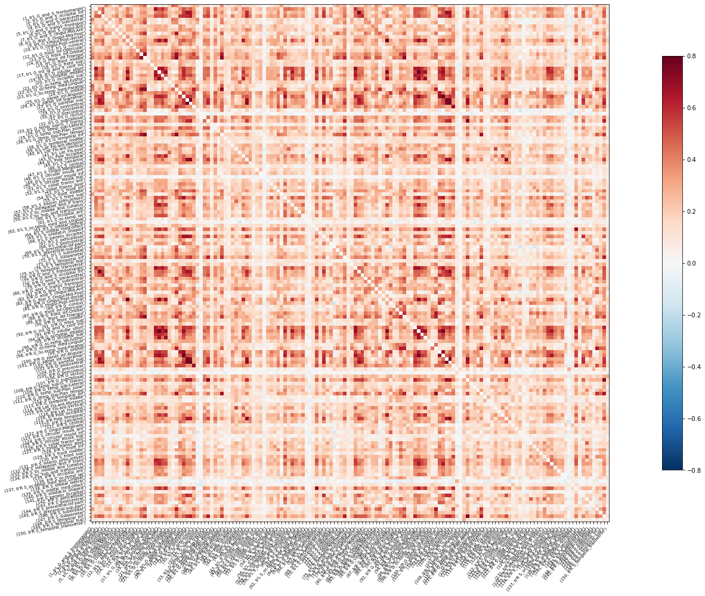
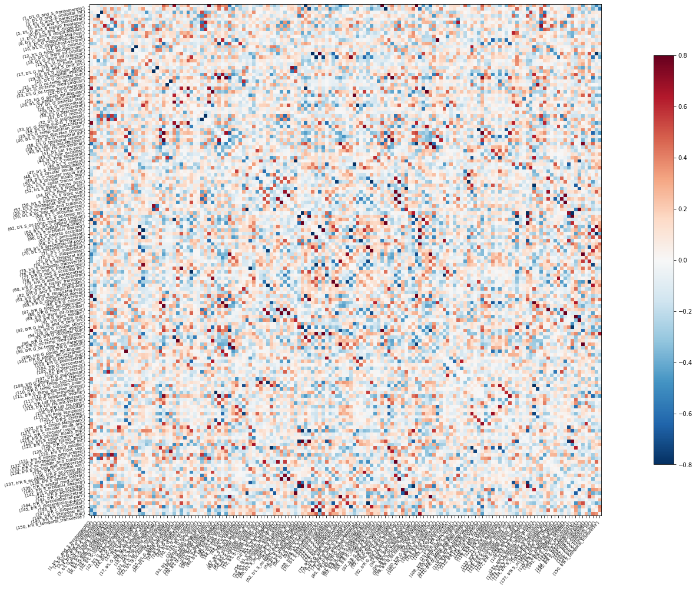

<!-- This is an html comment and this won't appear in the rendered page. You are now editing the "content" area, the core of your description. Everything that you can do in markdown is allowed below. We added a couple of comments to guide your through documenting your progress. -->

- Hi!, I'm a first year PhD student at McGill. My BHS project aimed to use some of the visualization tools we have learned to display functional connectivity results from both MEG and fMRI data.
- I used data from 12 subjects from the Human Connectome Project (https://www.humanconnectome.org).
- I would love to hear from other people projects and see what they have achieved so far!

Twitter: @jogaru1818

### What I wanted to learn

- To manage and analyze data in Python (since I have always worked on Matlab)
- To use some specific tools for neuroimaging analysis (such as nilearn)
- Try different visualization tools for displaying functional connectivity (that could be applicable to different neuroimaging modalities)
- To "Live the experience" of collaborating with others through GitHub

## Project definition

### Background

- Although MEG and fMRI are very different signals, they both reflect some aspects of neuronal activity
- Functional connectivity assess the statistical dependence between the activity (time-series) of different brain regions
- After preprocessing the data individually, we can have both modalities in the same coordinate space, parcellate the brain according to a common atlas and extract the MEG and fMRI time-series of each brain region.
- We then could then compute connectivity measures and visualize the results from both modalities in parallel!

### Tools I employed

- Human Connectomme Dataset: As the Open data repository I used for my BHS project
- Git: to keep version control of my files 
- GitHub: To create a repository compiling all the resources employed for this project and make it reproducible.
- Python: As the programming language I used to manipulate manipulate the data.
- Jupyter notebook: As a resource to organize and document the code (with instructions and outputs) I used my project.
- Nilearn tools: As a tool for calculating and displaying functional connectivity from neuroimaging data

- Brainstorm (for MEG processing). Works on Matlab.

### Data specifications

For this project I used data from 12 subjects from the Human Connectome Project, including:

- Preprocessed high resolution anatomical MR scan
- Preprocessed fMRI resting state data (sesion 1)
- Unprocessed MEG resting state data
- Unprocessed MEG noise recordings
- Anatomical info for MEG registration.

These data can be easily downloaded after creating an account and accessing the Human Connectome Project database (https://db.humanconnectome.org/).
The HCP_data_dowload.md file contains a brief set of instructions of how to get the specific data used for this project

### Deliverables

A GitHub repository containing a small set of md files and jupyter notebooks documenting all the requirements, instructions and code needed to reproduce this project. 

### Progress overview and results 

1 The first step was to install all the required software and libraries I needed for my project, and preparing the work environment. Detailed instructions on the requirements you need to fulfil to run the code and replicate these analysis are presented in the requirements.md file
 
2 After installing all the required dependencies and downloading the HCP data I started working on the MEG data. Since the already processed source space MEG data available in the HCP database cannot be manipulated in many ways, I decided to download the raw data and preprocess it myself. I was very interested in learning to perform all these steps using some of the new tools we explored, however I knew this would not be feasible given the limited time we had for our project, so I performed the preprocessing using a software I am already familiar with (Brainstorm). Once I preprocessed the MEG data and performed a source estimation analysis, I extracted the timeseries of the 148 regions from the Destrieux atlas (2009) for each subject, concatenated them and exported them into a text file. The order of the labels of the scouts was consisted with that used for the fMRI analysis. The detailed step by step description of the MEG processing is contained in the MEG_processing.md file. 

3 For the fMRI data, I opted to use the preprocessed images. I employed functions from nilearn to load the brain parcellations of the Destrieux atlas and the preprocessed fMRI data. As the HCP resting state fMRI consist on 1200 3d brain volumes, loading all the dataset at the same time may cause memory saturation on a regular machine. Therefore, I segmented the nifti files into smaller chunks of data, and created a python code to load each chunk at the time, extract the fMRI timeseries of each scout and concatenated the data for each subject and then from all subjects, and save it into a single matrix. The code used to extract the time series from the fMRI data is contained in the fMRI_timeseries.ipynb jupyter notebook.

4 After having extracted the MEG and fMRI timeseries from the scouts of the atlas I ellaborated a simple code to create a couple of interactive figures to display the functional connectivity matrices and graphs I obtained from the data. These interactive figures allow to easily navigate through the data from all subjects and switch between modalities. The final output of steps 2 and 3 is stored in the all_subjects_time_series_meg.txt and all_subjects_time_series_fmri.txt files, which contain the extracted timeseries of all subjects, for each modality. This last step loads these files, and use a combination of nilearn tools and ipywidgets to create and display an interactive figure within a jupyter notebook. 

An example of the fMRI connectivity matrix of Subject 1

An example of the MEG delta band connectivity matrix of Subject 1

 
## Conclusion and acknowledgement

During the lasts weeks I spent a lot of time getting familiar with these new tools. I knew I would face many problems and that most of the time I would spend looking at documentation files or forums trying to debug things. However, in the end I feel happy with the final result, given that I learned a lot of new cool things and that this represent a first step into adopting these practices on my daily work. I finally took the time to learn the basics from Python and now I will be able to use the rich variety of libraries they offer for analyzing and visualizing data. I also plan to adopt the use of virtual environments and containers for future projects. I also learned to document my work using git and to collaborate with other people through GitHub, which are both valuable resources to promote scietific reproducibility. Overall, I believe this was a great an useful experience for me, and I will definitively start using some of these tools to improve my practices as a student an future researcher

I would like to acknowledge all the BHS organizers for investing their time and effort for developing this magnificent course! I would also like to thank to my clinic instructors for assessing me during my project (Valentina, Tristan and Pierre) and to all my peers from this BHS edition for sharing their comments and ideas throughout these weeks
