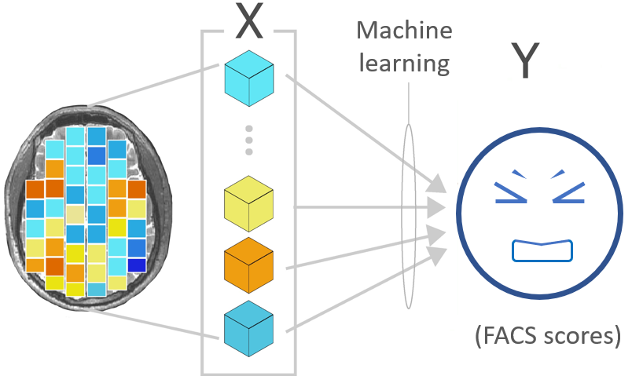
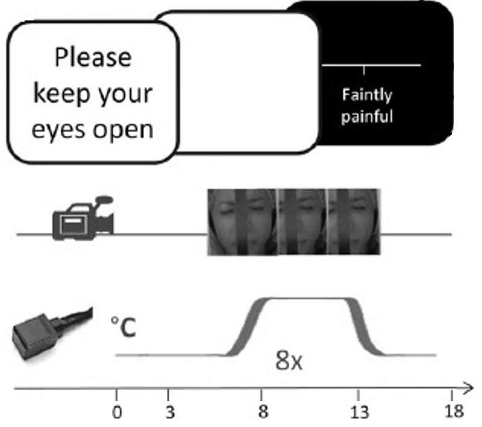
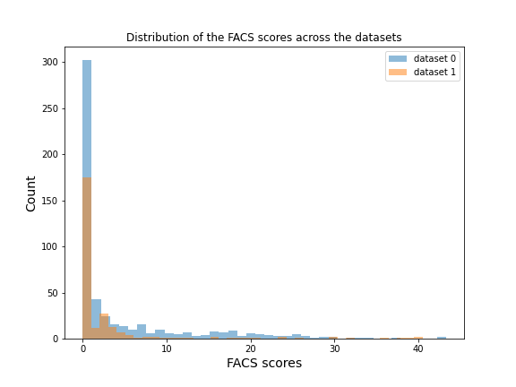
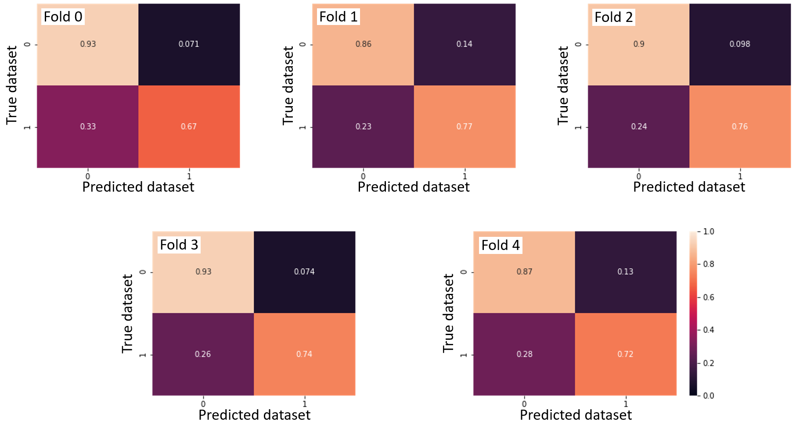

<!-- This is an html comment and this won't appear in the rendered page. You are now editing the "content" area, the core of your description. Everything that you can do in markdown is allowed below. We added a couple of comments to guide your through documenting your progress. -->

## Personal Background

Education:
* B.Sc. in cognitive neuroscience
* Currently a Master's student in Psychology at Université de Montréal

I am interested in the neural correlates of pain and the communication of pain. The goal of my master project is to predict the occurrence and intensity of the facial expression of pain from brain activity (fMRI data) in response to a tonic painful stimuli.

I'm also interested in the different methods used to analyze neuroimaging data.

# Project definition

## Background

Facial expression of pain is an important non-verbal informative element of communication, signaling an immediate threat and a need for help. Facial movements related to the experience of pain are associated not only with the sensory dimension of pain (i.e., pain intensity) but also with its affective dimension (i.e., the unpleasantness of pain). The facial expression can be measured with the Facial Action Coding System (FACS, Ekman & Friesen, 1978), which is based on the possible action of muscles or groups of muscles, called action units. We can compute a composite score (FACS score) taking into account the frequency and the intensity of the contraction of these action units.

**Personal goals**
* Apply machine learning to neuroimaging data :heavy_check_mark:
* Learn visualization tools :heavy_check_mark:
* Improve my coding skills :heavy_check_mark:
* Learn how to run analysis on compute canada and don't be afraid of it :heavy_check_mark:

## Tools

The completion of this project will require the following tool:
* **Python scripts** to write the code for the analysis
* Several python modules:
   * Pandas: to manipulate the behavioral dataframe
   * Numpy: to manipulate arrays
   * Nibabel: to load the fMRI contrast images (from .hdr files to Nifti objects)
   * Scikit-learn: for machine learning stuff
   * Nilearn: to extract and to visualize the fMRI data
   * Matplotlib, seaborn, plotly: to plot some figures
* The analysis will be run on **compute canada**
* The python scripts and figures will be added to the **github** repository

## Data

The dataset that will be used for this project is a secondary private dataset (not open access yet). It includes 55 participants (women = 28, men = 27) aged between 18 and 53 years old. Moderately painful stimuli were applied while they where in the MRI scanner. Their facial expression was recorded during this time by the use of a MRI-compatible camera. Each participant completed 2 runs of 8 painful trials, resulting to a total of 797 observations after removing data with movement artefacs (dataset 1: n = 533 observations; dataset 2: n = 264 observations).

<table>
   <tr>
    <td>Illustration of the experimental paradigme.</td>
    <td>Distribution of the FACS scores across the datasets</td>
  </tr>
  <tr>
    <td></td>
    <td></td>
  </tr>
</table>

## Deliverables

By the end of this course, I will provide
* python scripts for:
   - [X] Prepping the dataset for the analysis
   - [X] Machine learning pipeline
* jupyter notebook for:
   - [X] Visualizing the results
* Static and interactive visualizations of the results
* MarkDown README.md documenting all important information about the project
* Github repository containing the scripts, graphs, report and relevant information

# Results

## Overview

This project was initiated by Marie-Eve Picard on 2nd August 2021 as part of the PSY6983 course. The final presentation of the project was delivered on 20th August 2021. All the deliverables were completed and can be found on this repository (see the Deliverables section below).

### Deliverables

**Python scripts**
  Four python scripts can be found in the [scripts folder](https://github.com/PSY6983-2021/picard_project/tree/main/scripts):
* [main.py](https://github.com/PSY6983-2021/picard_project/blob/main/scripts/main.py) : main script calling functions in prepping_data.py and building_model.py. This script also includes code to save the train and test sets (in numpy format), the coefficients of the regression model (in nii.gz format), the model (in pickle format), the output of the permutation test (in json format) and the bootstrap test (in pickle format).
* [data_to_json.py](https://github.com/PSY6983-2021/picard_project/blob/main/scripts/data_to_json.py) : script to save the fmri data (predictive variable), the target variable (predicted variable) and the group variable (for non iid data: multiple observations per participant, optional) in json format.
* [prepping_data.py](https://github.com/PSY6983-2021/picard_project/blob/main/scripts/prepping_data.py) : script to load the fMRI data in Nifti-like format and to extract the signal according to a nilearn pre-defined mask or to a pre-computed mask.
* [building_model.py](https://github.com/PSY6983-2021/picard_project/blob/main/scripts/building_model.py) : script to compute the regression model, the permutation test and the bootstrap test.

The requirements to run the python scripts can also found in the [scripts folder](https://github.com/PSY6983-2021/picard_project/tree/main/scripts) in the [requirements.txt](https://github.com/PSY6983-2021/picard_project/blob/main/scripts/requirements.txt) file. See also the [scripts_instruction.txt](https://github.com/PSY6983-2021/picard_project/blob/main/scripts/scripts_instruction.txt) for more details.

**Jupyter notebook**
  The jupyter notebook containing the script to generate the figures can be found in the [notebook folder](https://github.com/PSY6983-2021/picard_project/tree/main/notebook).

**Visualization of the results**
  The png/html format of the figures generated in this project can be found in the [images/output subfolder](https://github.com/PSY6983-2021/picard_project/tree/main/images/output). The html files for the interactive plots can found in [Marie-Eve Picard's github repository](https://github.com/me-pic/BH2021_InteractiveViz).

## Regression models

Regression algorithms combined with a principal component analysis (PCA) were used to determine if it is possible to predict FACS scores from fMRI data in healthy adults. Three different regression algorithms were compared ([`Lasso`](https://scikit-learn.org/stable/modules/generated/sklearn.linear_model.Lasso.html), [`Ridge`](https://scikit-learn.org/stable/modules/generated/sklearn.linear_model.Ridge.html), [`SVR`](https://scikit-learn.org/stable/modules/generated/sklearn.svm.SVR.html)) using three different model inputs:
* whole-brain activity: the signal was extracted using the MNI152 brain mask (see [NiftiMasker documentation](https://nilearn.github.io/modules/generated/nilearn.input_data.NiftiMasker.html), mask_strategy='template').
* primary motor area activity: the signal was extracted using [this mask](https://github.com/PSY6983-2021/picard_project/blob/main/masks/mask_BA4.nii).
* whole-brain activity excluding the primary motor area: the signal was extracted using [this mask](https://github.com/PSY6983-2021/picard_project/blob/main/masks/mask_excluding_BA4.nii).

The models were first trained on the first dataset (n = 533 observations) using a 5-fold cross-validation procedure (Table 1) and tested on the second dataset (n = 264 observations; Table 2).

*Table 1: Performance metrics (R2) of the regression models averaged across the 5 folds for the train/validation sets*

| Algorithm | Whole-brain | Primary motor area (M1) | Whole-brain excluding M1 |
| ----------|---------------|---------------|-------------- |
| `Lasso` | 0.19±0.06 | -0.30±0.16 | 0.18±0.03 |
| `Ridge` | 0.20±0.06 | -0.42±0.22 | 0.17±0.05 |
| `SVR` | 0.20±0.06 | -0.18±0.19 | 0.16±0.06 |

**Visualization of the R2 violin plots:**
 [Link to the interactive violin plots](https://me-pic.github.io/BH2021_InteractiveViz/regression_violin_plots.html)

<iframe src="https://me-pic.github.io/BH2021_InteractiveViz/regression_violin_plots.html" width="600px" height="800px"></iframe>

**Visualization of the regression coefficients of the Lasso regression model:**
 The regression averaged coefficients across folds were plotted on the brain using the 99-th percentile of the absolute value in the image.
 [Link to the 2D interactive brain plot](https://me-pic.github.io/BH2021_InteractiveViz/coefs_reg_LASSO.html)

<iframe src="https://me-pic.github.io/BH2021_InteractiveViz/coefs_reg_LASSO.html" width="1000px" height="600px"></iframe>

*Table 2: Performance metrics (R2) of the final regression models tested on the second dataset*

| Algorithm | Whole-brain | Primary motor area (M1) | Whole-brain excluding M1 |
| ----------|---------------|---------------|-------------- |
| `Lasso` | -0.19 | -0.46  | -0.20 |
| `Ridge` | -0.18 | -0.56 | -0.22 |
| `SVR` | -0.18 | -0.39 | -0.17 |

## Classifier model

A SVM classifier was computed to see if it is possible to predict which dataset the fMRI data came from. The linear classifier was able to predict the dataset with an accuracy of 84.2 ± 1.6 %.

*Confusion matrices across the 5-fold cross-validation.*

This result possibly highlights that the fMRI data in the two datasets come from different distributions. This might explained why the regression model computed on the first dataset performed so poorly on the test set (second dataset). The classification accuracy might be due the different parameters used to acquire the fMRI data. The only divergent acquisition parameters were the number of whole-brain volumes acquired during each functional scan (170 volumes vs 160 volumes) and the voxel sizes (3.44 x 3.44 x 3.40 mm vs 3.4 x 3.4 x 3.4 mm). The averaged age of the participants was also different between the datasets (23.4 ± 2.5 years vs 36.0 ± 10.9 years). This age difference may have contributed to the high classification accuracy, although there is no clear evidence to support a difference in brain activity related to facial expression of pain according to different age groups in the litterature.

## Conclusion

The goals of this project were reached. I started this journey with some background in python coding, but during these past few weeks I learned some best practices in coding and how to organize scripts in a more efficient way. I applied different machine learning techniques on neuroimaging data (fMRI contrast images), such as regression and classification techniques. I also learned how to use some functions from the python plotly module. I am also proud to have learned how to perform analysis on Compute Canada, with the help of the TAs.

This project will be continued as part of my master's project. Stay tuned ! :eyes::brain::computer:

## Acknowledgement

I would like to thank Pierre Bellec and the TAs who helped me overcome the various challenges I faced during this course:

* Andréanne
* Désirée
* François

A special mention to Catherine Landry for the shared coffees and the moral suppport.

For any question and comments about the project, please contact me at marie-eve.picard.2@umontreal.ca.

## References

Ekman, P. et Friesen, W. V. (1978). Facial action coding systems. Consulting Psychologists Press.

Kunz, M., Chen, J.-I., Lautenbacher, S., Vachon-Presseau, E. et Rainville, P. (2011). Cerebral regulation of facial expressions of pain. Journal of Neuroscience, 31(24), 8730-8738. https://doi.org/10.1523/JNEUROSCI.0217-11.2011

Vachon-Presseau, E., Roy, M., Woo, C.-W., Kunz, M., Martel, M.-O., Sullivan, M. J., Jackson, P. L., Wager, T. D. et Rainville, P. (2016). Multiple faces of pain: effects of chronic pain on the brain regulation of facial expression. Pain, 157(8), 1819-1830. https://doi.org/10.1097/j.pain.0000000000000587
