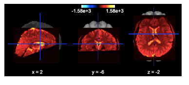
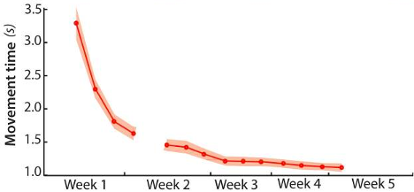

<!-- This is an html comment and this won't appear in the rendered page. You are now editing the "content" area, the core of your description. Everything that you can do in markdown is allowed below. We added a couple of comments to guide your through documenting your progress. -->

## Project definition

### Background

#### About me

Hello my name is Diego, I am a graduate student at Toronto Metropolitan Univeristy studying Biomedical Engineering. I have a background in kinesiology and health information management. I am interested in the connection of mind and body and how we can use technology to improve this connection within the context of performance and rehabilitation.

#### About the project

Motor learning can be understood as a set of processes aimed at learning and refining new skills by practicing (Nieuwboer et al, 2009) This process results in changes within the nervous system that translates to improvements in movement accuracy and smoothness. Neuroscientists have created models to depict motor learning such as Fitts and Posner's 3 stages, however there is no consensus about the speciifc changes that occur in the brain. Although these changes are difficult to quantify, performance with a task can serve an indirect measure that can outline clear stages of learning.

### Personal Goals <!-- Done -->
 * Understand the processing and application of the full neuroimaging workflow, specifically from raw fMRI data to data visualization
 * Build and develop skills in open science applications, particularly for future neuroimaging projects
 * Gaining insight into fMRI data applications, specifically in creating connectivity matrices and brain parcellations

### Tools <!-- Done -->

This project will rely on the following technologies:
<!-- testing thing here -->
<OL>
<LI>Open Neuro fMRI data - doi: 10.18112/openneuro.ds002776.v1.2.0
<LI>Python Scripts
<UL>
<LI>Nilearn - extractring and visualizing data
<LI>Pandas - manipulation and plotting 
<LI>Nibabel - loading images
</UL>
<LI>SciNet - Jupyter Notebook - to implement code for our data/ take first steps within the Teach (University of Toronto) cluster
<LI>Git and GitHub - practice sharing a workspace, fork repositories, version control 
<LI>Bash - Use Terminal for quick and easy access 
</OL>

### Data

For this project, we were working with a Neuroimaging Dataset on Motor sequence learning from Openneuro (Berlot et al. 2020) 

The experiment consisted of 4 imaging sessions, across 5 weeks of training. Participants (N=26) underwent session 1 (ses-01) prior to training onset, session 2 (ses-02) after a week of training and sessions 3-4 (ses-03, ses-04) after 5 weeks. Performance across sesssions 1-3 was paced using a metronome, and in session 4 the performance was at full speed.

Participants executed inside the scanner 6 trained and 6 untrained sequences. Sequence identity (1-12) and sequence type (trained / untrained) for each trial can be found in the accompanying events.tsv files. Additionally, each sequence was performed twice in a row (repetition 1-2 in events.tsv). Berlot et al. 2020

 
### Deliverables
&check; Preprocessed Data 
&#10003; Creating Brain Parcellation 
&#10003; Visualizations 
&#10003; Graphs for Statistical Analysis 
&check; Connecitivty Matrix 

## Results

 
### Tools used and ROIs

 * **Pre-processing Data Scripts:** We learned how to pre-process data for the first time, which is running code through SciNet clusteres and being able to access the fMRI data. It felt really weird, but somehow quite fun as well.
 * **Jupyter Notebook/Jupyter Lab:** We used this platform to code our results based on the preprocessed data. That was quite the challenge because we were hit with all these new libraries that we did not know could produce _so_ many different visualizations.
 * **Git:** Through the modules, and accessing functions used for preprocessing/analysis - Git was a integral part of what we had to learn.
 * **Bash/Terminal:** To be able to locate our data once it was/after preprocessing, we had to be able to use the classic "cd" and "ls" commands to find where all our outputs from the preprocesed data was hidden.
 
##### Human Connectome Project
Through there research, Bertlot et al. (2020) determined 5 areas of interest when investigating motor sequence learning
   * Primary Motor Cortex (M1)
   * Primary Somatosensory Cortex (S1)
   * Premotor Dorsal Area (PMd)
   * Anterior Portion of the Superior Parietal Lobe (SPLa)
 
 Using these areas, I compared them with the work from Glasser et al. (2016) and the Human Connectome Project. Through this, I was able to further divide these 5 areas in to 18 ROIs in which I would use as my nodes for my connectivity matrix.
 
 ##### Considerations
 
Due to an issue in preprocessing, I was only able to get clean data for participant 6 on there final fMRI image.
 

### Results

#### fMRI Image

#### Connectivity Matrix

#### Performance Metrics
 
   
   
## Next Steps
 1. Re-run preprocessing to capture all participants and sessions
 2. Upload data and run analysis on new sessions
 3. Plot Connectomes for each session against performance metrics
 4. Analyze plot for stages of learning

 ## Conclusion
 
The ideal result would have had plots for all sessions and comparing them in time against the performance metrics. Based on the performance metric above, the transition from week 1 to week 2 resulted in the largest amount of improvement with the given task. Comparing the images from these weeks would have been interesting as the difference in patterning would translate to a clear stage of learning. Although this was not completed, I reached my personal objectives in creating a script that works to test my postulations. 
 

## References
Berlot E, Popp NJ, Diedrichsen J. A critical re-evaluation of fMRI signatures of motor sequence learning. Elife. 2020 May 13;9:e55241. doi: 10.7554/eLife.55241. PMID: 32401193; PMCID: PMC7266617.
  
Glasser MF, Coalson TS, Robinson EC, Hacker CD, Harwell J, Yacoub E, Ugurbil K, Andersson J, Beckmann CF, Jenkinson M, Smith SM, Van Essen DC. A multi-modal parcellation of human cerebral cortex. Nature. 2016 Aug 11;536(7615):171-178. doi: 10.1038/nature18933. Epub 2016 Jul 20. PMID: 27437579; PMCID: PMC4990127.

