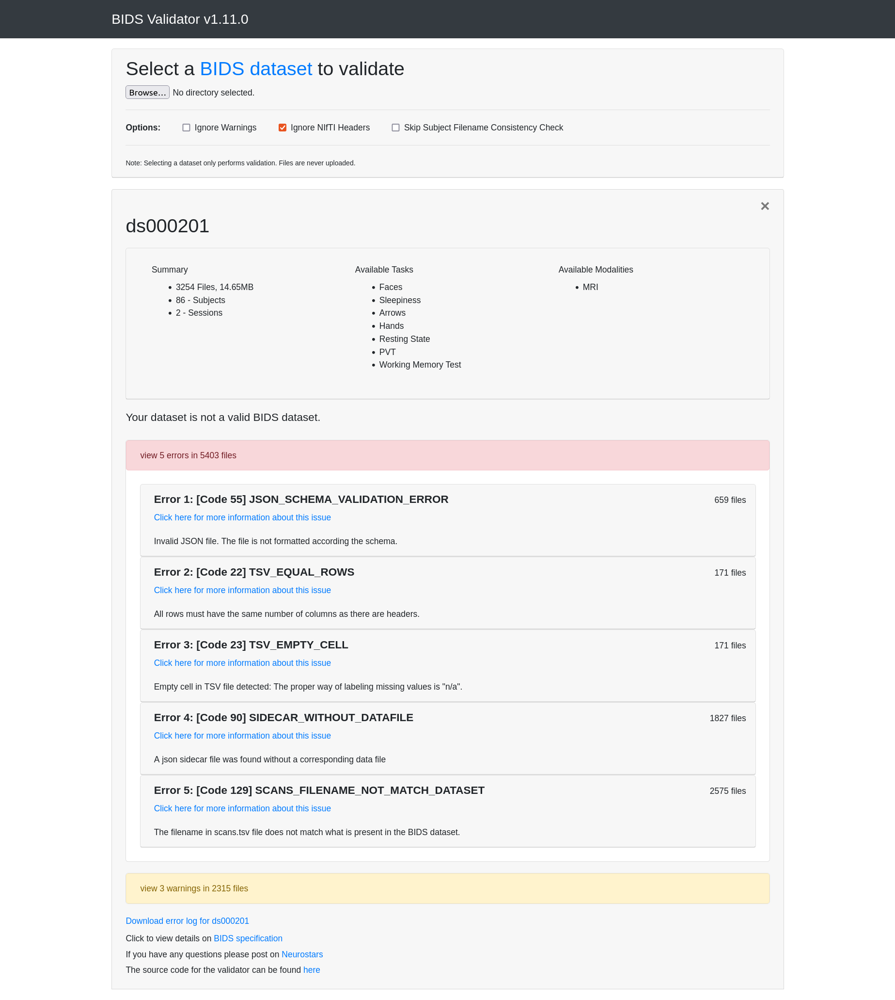
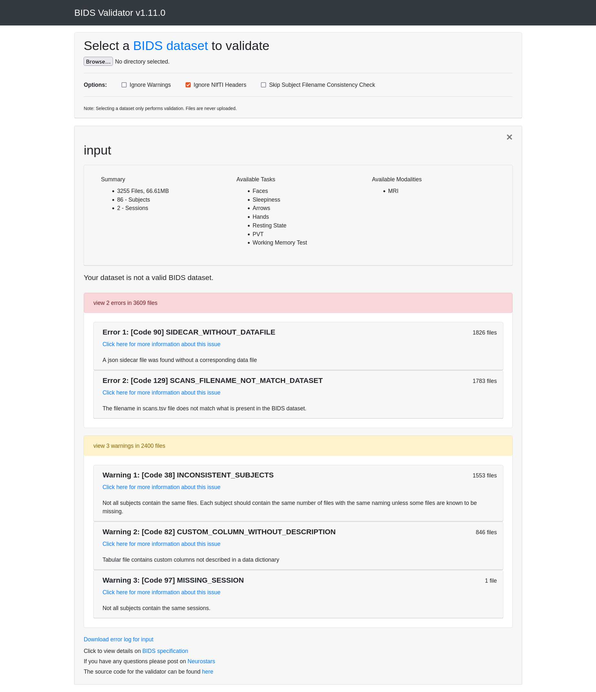
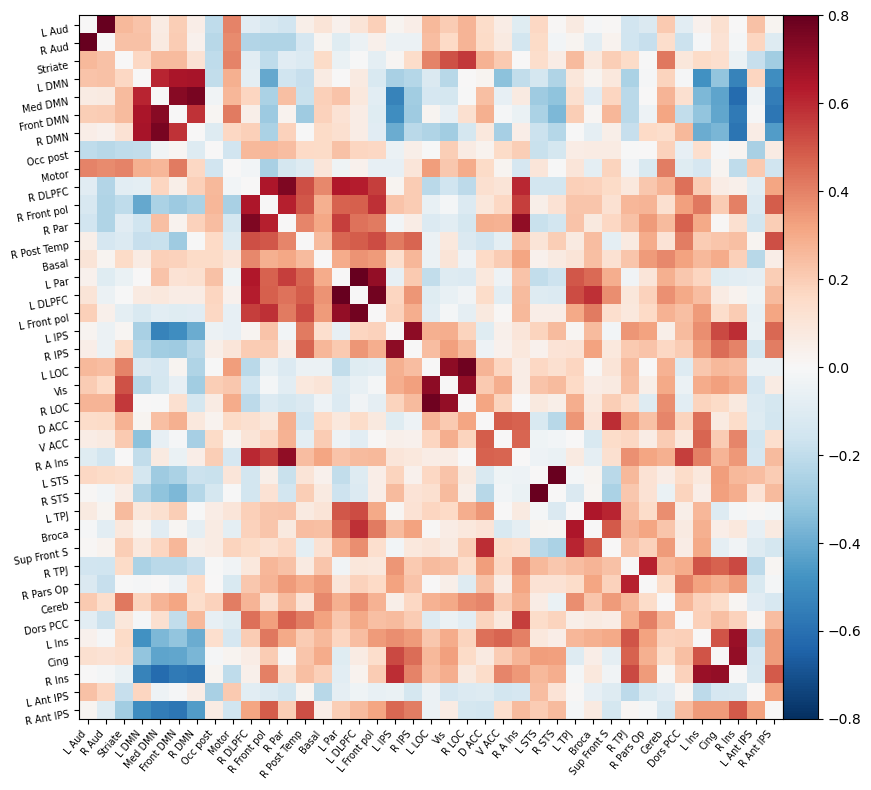
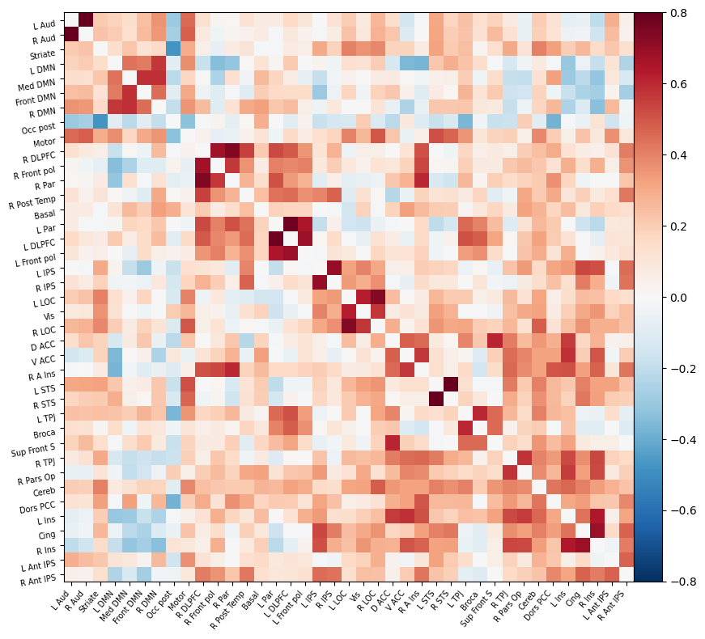
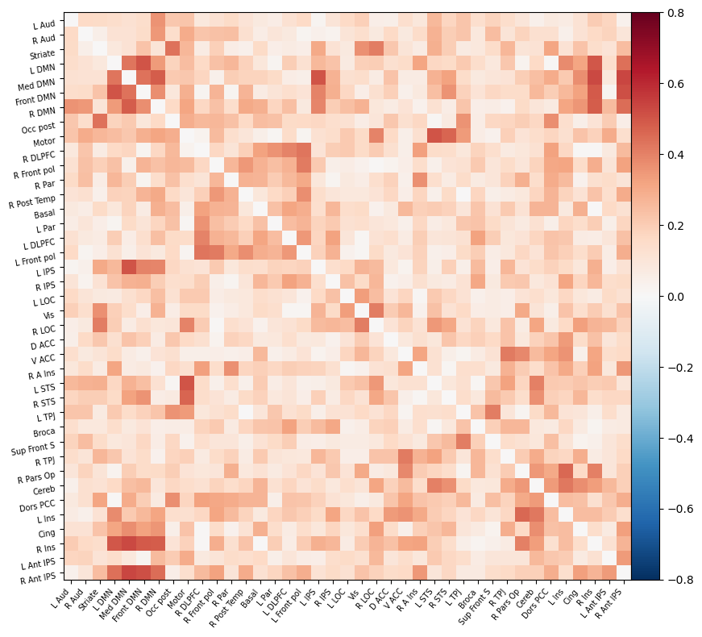
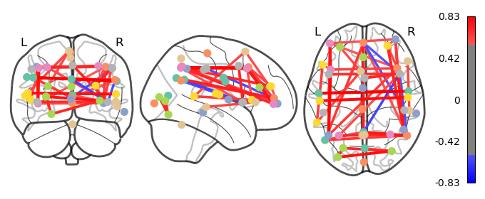
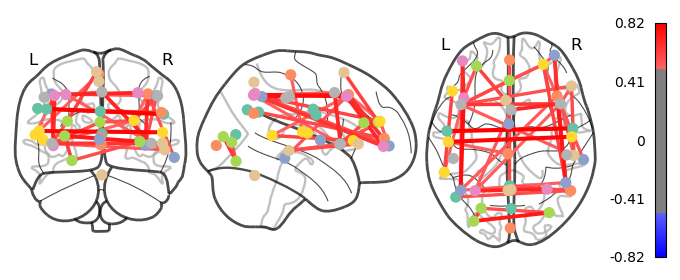

<!-- This is an html comment and this won't appear in the rendered page. You are now editing the "content" area, the core of your description. Everything that you can do in markdown is allowed below. We added a couple of comments to guide your through documenting your progress. -->

#### About Me

<a href="https://github.com/Thomas-Pr">
   
    <b>Thomas Perrin</b>
</a>

Hello and welcome to my project! My name is Thomas Perrin, I am currently pursuing a Master of Engineering degree in Biomedical Engineering at Polytechnique Montreal. I have previously studied mostly medical devices and images analysis at IMT Atlantique in France. Exploring neuroimaging and learning about open-source tools is a new and inspiring part of my journey in Biomedical Engineering!

#### Project Description

Sleep deprivation is commonplace in modern society, but little is known about the functional mechanisms and correlates of sleepiness in the awake brain. Sleepiness is a brain state with pervasive effects on cognitive and affective functioning ([Killgore, 2010, Tamm et al., 2020](#references)). Adult fMRI studies have demonstrated associations between restricted sleep and amygdala-prefrontal functional connectivity ([Reidy et al., 2016](#references)), with inhibition of top-down-control in emotion ([Tamm et al., 2020](#references)). Therefore, it would be interesting to explore and predict whether a participant is sleep deprived or not based on a functional connectivity estimation.

Main question: **Can resting-state functional connectivity predict sleep deprivation?**

### Tools

* [Git](https://git-scm.com/) and [GitHub](https://github.com/) for project management.
* [DataLad](https://www.datalad.org/) for retrieval and version control of data.
* [Neurodesk](https://www.neurodesk.org/) to use a flexible and scalable data analysis environment for reproducible neuroimaging.
* [BIDS-validator](https://bids-standard.github.io/bids-validator/) to check updated dataset integrity.
* [FMRIPrep](https://fmriprep.org/en/stable/) for fMRI data preprocessing
* [Python](https://www.python.org/) for dataset management and visualization (Nilearn, Pandas, NiBabel, Matplotlib, ...), in [Visual Studio Code](https://code.visualstudio.com/) and [Jupyter Notebook](https://jupyter.org/).

### Data

* Data used: [Resting-State fMRI from the Stockholm Sleepy Brain Study: Effects of Sleep Deprivation on Cognitive and Emotional Processing in Young and Old](https://openneuro.org/datasets/ds000201/versions/1.0.3). A functional brain imaging study where 86 healthy participants underwent MRI after normal sleep and partial sleep deprivation (only 3 hours of sleep) in a crossover design. Three experiments were performed investigating emotional mimicry, empathy for pain, and cognitive reappraisal, as well as resting state fMRI (rs-fMRI).
* Fit with the research question: This study aimed to investigate the effects of partial sleep deprivation (PSD) on resting state brain connectivity, emotional contagion, empathy, and emotional regulation.
* Obtained from: [OpenNeuro](https://openneuro.org/). The full dataset is multimodal (T1- and T2-weighted structural images, diffusion images, raw polysomnography data, task-based and resting state fMRI images). 
* Usage: For the reduced scope of this project, only the rs-fMRI data of the two sessions for one subject will be used, but the pipeline can then be used in the same way to analyze more subjects. The full dataset structure and metadata files can be retrieved without downloading the heavy dataset thanks to DataLad. This is useful to update the dataset to be BIDS-compliant and analyze data for only one subject.

Note: An old page for this dataset can also be found on the deprecated website OpenfMRI ([A multimodal brain imaging dataset on sleep deprivation in young and old humans: The Sleepy Brain Project I](https://legacy.openfmri.org/dataset/ds000201/)).

### Deliverables

* A GitHub repository containing all the elements of the project
* A markdown file for the project description
* A Python script to update the dataset to be BIDS-compliant
* A markdown file providing the Bash commands to download the dataset, run the Python script, and run fMRI preprocessing, all using DataLad
* A Jupyter Notebook for visualization
* A requirements.txt file to specify the Python environment for the script and the notebook

## Results

### Progress overview: Retrace my Steps

**1. Git & GitHub: Version Control the Project.**
  * The repository was updated throughout the following steps of the project.
  * Organization of the repository:
    * Modules: Modules completed during the first weeks of BrainHack School.
    * data: Raw data for the project, not synced to source control because the dataset is too large for Git.
    * docs: Documentation (project presentations, could also include Markdown and reStructuredText (reST) files).
    * results: Results, including figures (could also include checkpoints, hdf5 files, pickle files, and tables, had the project been more complex).
    * scripts: Scripts (Python, bash, .ipynb notebooks).
    * src: Reusable Python modules for the project (imports, empty for now).
    * tests: Tests for the code (empty for now).
  * Resources:
    * [Version control with Git](https://gcapes.github.io/git-course/)
    * [Introduction to Git and GitHub](https://emdupre.github.io/git-course/)
    * [The Good Research Code Handbook](https://goodresearch.dev/) for the project template.

**2. OpenNeuro: Select the Dataset.**
  * The data was already converted from DICOM to NIfTI.
  * BIDS organization except for a few errors (see [bids_validation](https://github.com/brainhack-school2023/perrin_project/tree/e5138662c5facfead956ddd53dde26edd5aa6b3d/docs/bids_validation) folder).

**3. DataLad: Version Control the Dataset**
  * The [OHBM Brainhack TrainTrack: DataLad](https://handbook.datalad.org/en/latest/code_from_chapters/OHBM.html), [The DataLad Notebook](https://handbook.datalad.org/en/latest/) and the use case [A basic automatically and computationally reproducible neuroimaging analysis](https://handbook.datalad.org/en/latest/usecases/reproducible_neuroimaging_analysis_simple.html) were the most useful tools to get me started.
  * [OpenNeuro Quickstart Guide: Accessing OpenNeuro datasets via DataLad](https://handbook.datalad.org/en/latest/usecases/openneuro.html) to properly  obtain the dataset with DataLad.
  * Organization of the dataset following [the YODA principles](https://handbook.datalad.org/en/latest/basics/101-130-yodaproject.html) and *datalad run* to capture everything relevant to reproduce the analysis, i.e. to run the code to fix BIDS errors

**4. BIDS-Validation: Reproducible Neuroimaging Organization.**
  * [The BIDS Starter Pack](https://bids-standard.github.io/bids-starter-kit/index.html)
  * [BIDS Validator](https://bids-standard.github.io/bids-validator/)
  * Prepare the dataset to use with tools like fMRIPrep, see [Deliverable 3](#results).

**5. NeuroDesk: Connecting to a flexible and scalable data analysis environment for reproducible neuroimaging.**
  * [Getting Started with Brain Imaging Tools via the Neurodesktop Container](https://github.com/brainhack-school2022/dimitrijevic_project/blob/658c4f8bdadda289845feb707cd77c6a6363a43f/BrainHackCloud_steps/neurodesk_access.md) by [Andjela Dimitrijevic](https://github.com/Andjelaaaa).
  * Guide to use [Neurodesk](https://www.neurodesk.org/) for this project (instructions as of June 1st 2023): 
    * Open 'Play' then 'Neurodesk Lab' (for keeping data across sessions)
    * Choose the link closest to your location.
    * In the left panel under 'Softwares' load the fmriprep module.
    * In the 'Notebook' section launch 'Neurodesktop'.

**6. fMRIPrep: Preprocessing Pipeline for fMRI Data.**
  * [Getting started with BIDS, fMRIPrep, MRIQC](https://sarenseeley.github.io/BIDS-fmriprep-MRIQC.html).
  * [BIDS App Tutorial #2: fMRIPrep](https://andysbrainbook.readthedocs.io/en/latest/OpenScience/OS/fMRIPrep.html).
  * [Usage Notes](https://fmriprep.org/en/stable/usage.html).
  * [Outputs of *fMRIPrep*](https://fmriprep.org/en/stable/outputs.html) to have a description of the output dataset to use for visualization and analysis. 
  * Estimated runtime per subject on Neurodesk: 6 to 7 hours.

**7. Python: Visualization of the data.**
  * The access to the data has been done following the format of datasets using [nilearn.datasets.fetch_openneuro_dataset](https://nilearn.github.io/dev/modules/generated/nilearn.datasets.fetch_openneuro_dataset.html). [PyBIDS](https://bids-standard.github.io/pybids/) was also considered but in the end not used to work with BIDS datasets. 

Note:

Step 5. was originally intended to be executed using Docker, but after encountering storage and outdated software issues with my laptop, Neurodesk was used to finish the project in time. Here are the resources used before the issues prevented the final installation:
  * [Using containers (Docker/Singularity) in science](https://neurohackweek.github.io/docker-for-scientists/).
  * [Install Docker Engine on Ubuntu](https://docs.docker.com/engine/install/ubuntu/#set-up-the-repository.)
  * Optional: [Install Docker Desktop on Ubuntu](https://docs.docker.com/desktop/install/ubuntu/).
  * [NiPreps: Executing with Docker](https://www.nipreps.org/apps/docker/)
  * And for maximal reproducibility with containers, the DataLad use case [An automatically and computationally reproducible neuroimaging analysis from scratch](https://handbook.datalad.org/en/latest/usecases/reproducible_neuroimaging_analysis.html).

### Tools I learned during this project

* **Neuroimaging:** Functional MRI principles, organization for neuroimaging data, and visualization of functional connectivity for resting-state networks.
* **Open science workflow:** Tools to create a reproductible neuroimaging workflow from preprocessing to data visualization.

### Results

#### Deliverable 1: GitHub repository

The GitHub repository contains all the elements of the project.

#### Deliverable 2: project report

The [README.md](https://github.com/brainhack-school2023/perrin_project/blob/e5138662c5facfead956ddd53dde26edd5aa6b3d/README.md) markdown file describes the project. It can be found on [my BrainHack School 2023 repository](https://github.com/brainhack-school2023/perrin_project/blob/e5138662c5facfead956ddd53dde26edd5aa6b3d/README.md) as well as the [BrainHack School website](https://school-brainhack.github.io/project/). 

#### Deliverable 3: dataset manipulation scripts

* A Python script ([bids_fix.py](https://github.com/brainhack-school2023/perrin_project/blob/e5138662c5facfead956ddd53dde26edd5aa6b3d/scripts/bids_fix.py)) to update the dataset to be BIDS-compliant.
* A Markdown file ([datalad_commands](https://github.com/brainhack-school2023/perrin_project/blob/e5138662c5facfead956ddd53dde26edd5aa6b3d/scripts/datalad_commands)) containing the DataLad bash code to obtain the dataset, run the above-mentioned Python script, and run the fMRI preprocessing, all using version-control with DataLad.
* Just below are the results using BIDS Validator before fixing the errors by and after running the script. The two errors remaining are explained by the way the dataset was retrieved using DataLad (the dataset's structure is there but the big files are not downloaded), as shown on the screenshot from the [DataLad FAQ](https://handbook.datalad.org/en/latest/basics/101-180-FAQ.html) below.

*BIDS Validator errors before and after fix.*

*DataLad FAQ paragraph on BIDS Validator issues.*

#### Deliverable 4: analysis notebook

A Jupyter Notebook ([sleep_connectivity.ipynb](https://github.com/brainhack-school2023/perrin_project/blob/e5138662c5facfead956ddd53dde26edd5aa6b3d/scripts/sleep_connectivity.ipynb)) for visualization of connectomes and analysis. The results can also be found [here](https://github.com/brainhack-school2023/perrin_project/tree/e5138662c5facfead956ddd53dde26edd5aa6b3d/results).

The results obtained for the first subject (sub-9001) are presented below.

*Correlation matrices after normal sleep (left) and partial sleep deprivation, i.e. only 3 hours of sleep the night before data acquisition (right).*

*Difference between the two correlation matrices.*

*Corresponding connectomes after normal sleep (left) and partial sleep deprivation, i.e. only 3 hours of sleep the night before data acquisition (right).*

Adult fMRI studies have demonstrated associations between restricted sleep and amygdala-prefrontal functional connectivity. Therefore, the expected result is to see differences in functional connectivity in the amygdala and the prefrontal cortex.

The atlas used to define the regions of interest is the MSDL brain Probabilistic atlas available with Nilearn. A threshold has been set to keep only the 5% of edges with the highest values and make the connectomes easier to read.

The biggest visible differences are:
* Between the right anterior intraparietal sulcus (R Ant IPS), with functions related to perceptual-motor coordination and visual attention, and the default mode network (DMN).
* Between the right insular cortex (R Ins), believed to be involved in consciousness and emotion, and the DMN.
* Between the different parts of the DMN.
* Between the superior temporal sulcus (STS), involved in language and social processing and the motor cortex (Motor).

Overall, the connectivity seems to be a little less intense after PSD regarding the connectomes. Furthermore, a few of the connections to the frontal part of the brain which were visible after normal sleep are not present anymore.

While these results seem to be in line with previous studies (effects on prefrontal functional connectivity and emotion regulation), which is encouraging, the analysis has been done on only one subject and mostly qualitatively, thus relevant conclusions cannot be drawn on so little data.

#### Deliverable 5: final project presentation

Slides ([Perrin_Thomas_Project_Wrap_Up.pdf](https://github.com/brainhack-school2023/perrin_project/blob/2adfa80fcc5c220127a14716bf989345251faf05/docs/Perrin_Thomas_Project_Wrap_Up.pdf)) for the final project presentation to conclude the month of BrainHack School, following the provided template. The results presented there are a snapshot at this moment but are not up-to-date, the final results are presented right above.

## Conclusion and acknowledgement

The objectives of the project, which were to learn about neuroimaging tools and open science, and to set up the workflow from data retrieval to visualization, were completed. Although the results are limited to only one subject, the possibility to analyze at least one subject was encouraging to envision a larger analysis in order to answer the main question properly.

With more time and resources, the prospect of this project would have been to process more subjects, using a High Performance Computing infrastructure such as [Alliance Canada](https://alliancecan.ca/en) or [Brainhack cloud](https://brainhack.org/brainhack_cloud/tutorials/hpc/). This additional data would have been used to build a Machine Learning model with [NiLearn](https://nilearn.github.io/stable/index.html) and find out if resting-state functional connectivity could effectively predict sleep deprivation.

A special thanks goes to the TAs at Polytechnique Montreal, Jan and Andjela, for their tips and guidance, especially for pointing me to the project-saving tool Neurodesk when all other options had failed.

Also, the [NeuroStars](https://neurostars.org/) forum was helpful when I encountered issues with BIDS validation and fMRIPrep.

Finally, I would like to thank the BrainHack School organizers who have built this course and modules. It really provides guidance on how to learn the most useful tools for neuroimaging and open-science, in a way that is very efficient to actively acquire new skills and knowledge.

## References

* Gustav Nilsonne and Sandra Tamm and Paolo d’Onofrio and Hanna Å Thuné and Johanna Schwarz and Catharina Lavebratt and Jia Jia Liu and Kristoffer NT Månsson and Tina Sundelin and John Axelsson and Peter Fransson and Göran Kecklund and Håkan Fischer and Mats Lekander and Torbjörn Åkerstedt (2020). The Stockholm Sleepy Brain Study: Effects of Sleep Deprivation on Cognitive and Emotional Processing in Young and Old. OpenNeuro. \[Dataset] [doi:10.18112/openneuro.ds000201.v1.0.3](https://doi.org/10.18112/openneuro.ds000201.v1.0.3)
* Killgore WD. Effects of sleep deprivation on cognition. Prog Brain Res. 2010;185:105-29. [doi:10.1016/B978-0-444-53702-7.00007-5](https://doi.org/10.1016/b978-0-444-53702-7.00007-5). PMID: 21075236.
* Reidy BL, Hamann S, Inman C, Johnson KC, Brennan PA. Decreased sleep duration is associated with increased fMRI responses to emotional faces in children. Neuropsychologia. 2016 Apr;84:54-62. [doi:10.1016/j.neuropsychologia.2016.01.028](https://doi.org/10.1016/j.neuropsychologia.2016.01.028). Epub 2016 Jan 25. PMID: 26821063.
* Tamm S, Schwarz J, Thuné H, Kecklund G, Petrovic P, Åkerstedt T, Fischer H, Lekander M, Nilsonne G. A combined fMRI and EMG study of emotional contagion following partial sleep deprivation in young and older humans. Sci Rep. 2020 Oct 21;10(1):17944. [doi:10.1038/s41598-020-74489-9](https://doi.org/10.1038/s41598-020-74489-9). PMID: 33087746; PMCID: PMC7578048.
