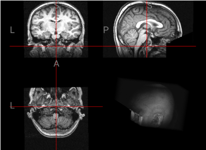
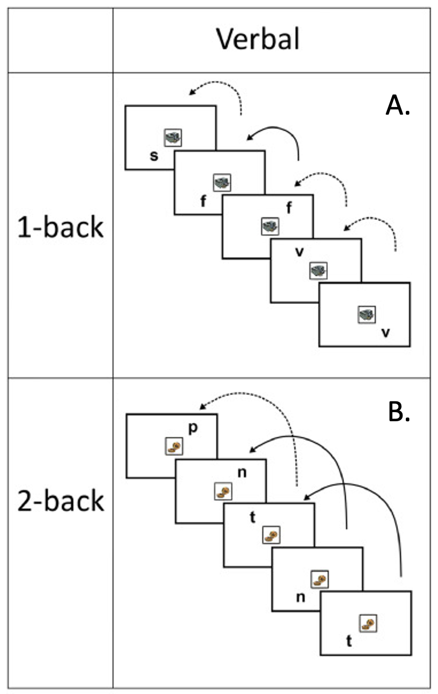
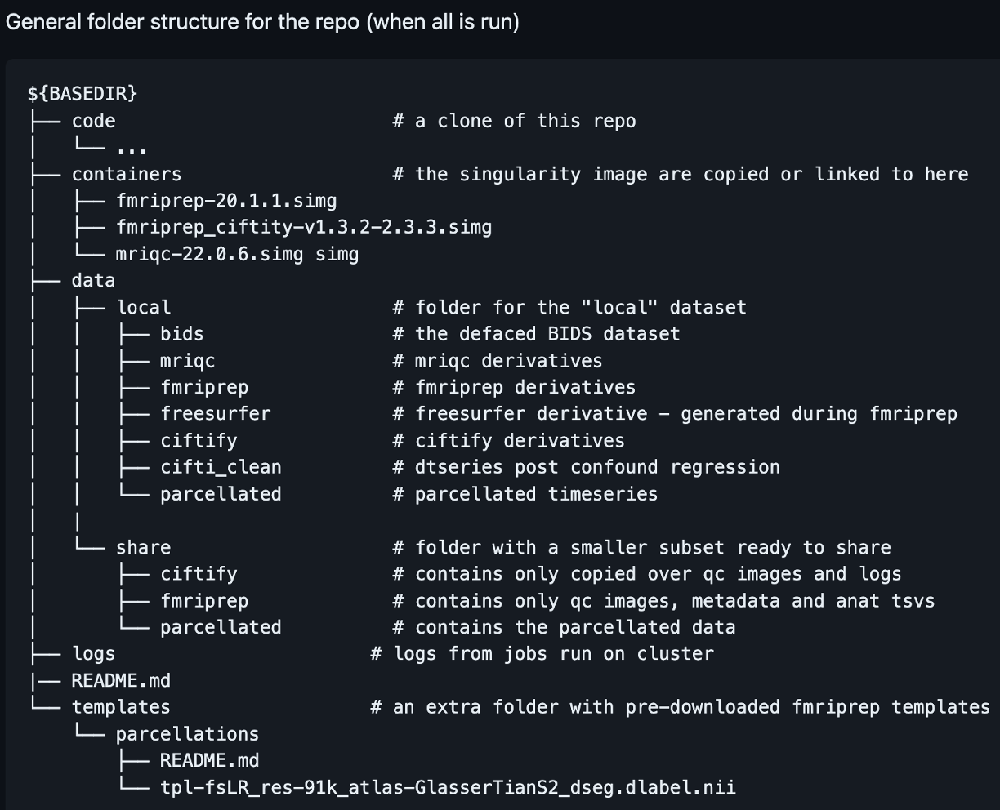
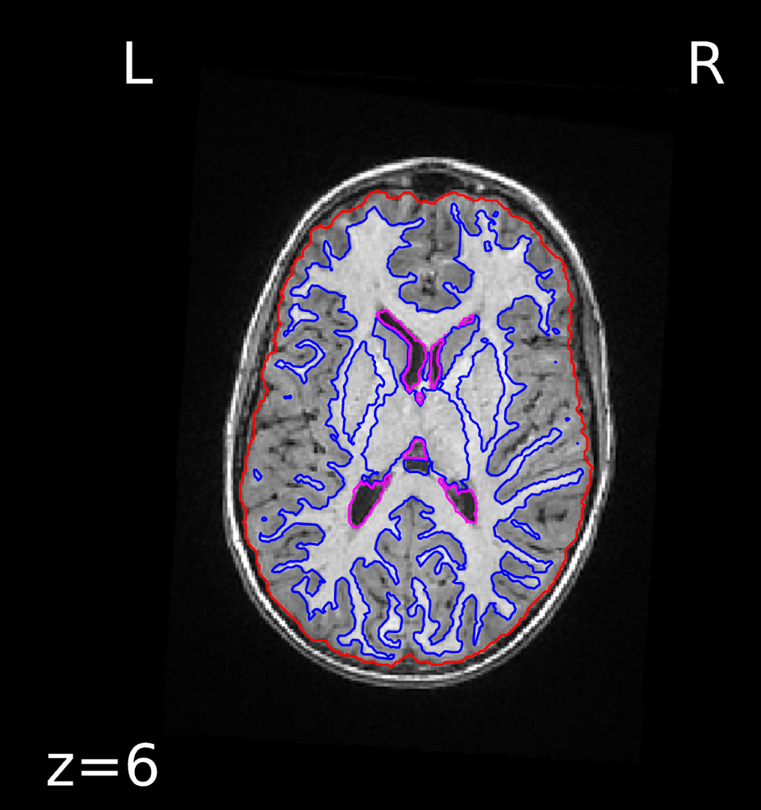
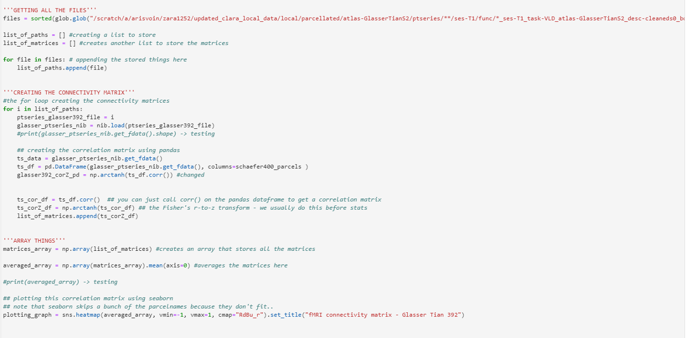
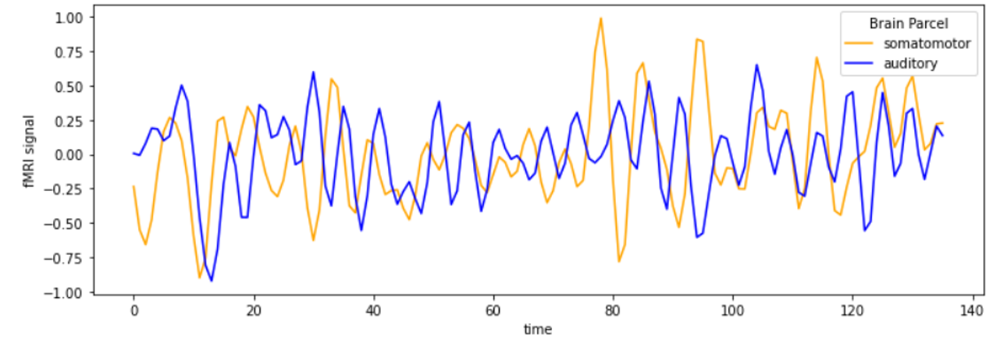
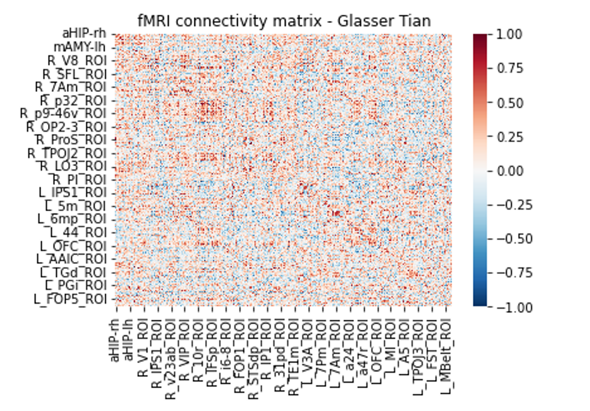
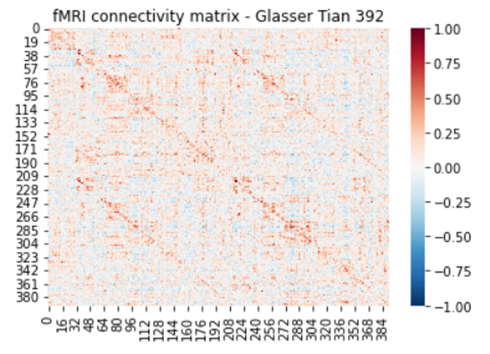

<!-- This is an html comment and this won't appear in the rendered page. You are now editing the "content" area, the core of your description. Everything that you can do in markdown is allowed below. We added a couple of comments to guide your through documenting your progress. -->

## Project definition

### Background

#### About us
Hello, we are team Pipasaurus! The three of us are undergraduate summer research students in the Translational Imaging and Genetics Research (TIGR) Laboratory at the Centre for Addiction and Mental Health (CAMH) in Toronto. We are a multidisciplinary team with diverse educational backgrounds: Zara is studying biomedical and electrical engineering at McMaster University, Fariah is studying psychology at York University, and Clara just finished her undergraduate degree studying interdisciplinary medical sciences at Western University. As newcomers to neuroimaging, Brainhack School 2023 presented the perfect opportunity for us to develop our skill sets in an immersive, beginner-friendly environment. Functional MRI is one modality of special interest to us, particularly because we will be working with fMRI data this summer.

#### About the project

Attention Deficit Hyperactivity Disorder (ADHD) is one of the most common neurodevelopmental disorders worldwide. Moreover, there is a high prevalence of ADHD among children (Morkem et al., 2020). The characteristics symptoms of ADHD, namely poor working memory, greater reliance on external feedback, and abnormal reward processing are of interest to us because these characteristics have been associated with changes in brain activity patterns in distinct networks. In addition, previous studies also suggest that there are substantial individual differences in reactions to reward and feedback manipulation among those with ADHD (Hammer et al., 2015). 

### Personal Goals <!-- Done -->
 * Understand the processing and application of the full neuroimaging workflow, specifically from raw fMRI data to data visualization
 * Build and develop skills in open science applications, particularly for future neuroimaging projects
 * Gaining insight into fMRI data applications, specifically in creating connectivity matrices and brain parcellations

### Tools <!-- Done -->

This project will rely on the following technologies:
<!-- testing thing here -->
<OL>
<LI>Open Neuro fMRI data - doi: 10.18112/openneuro.ds002424.v1.2.0
<LI>Python Scripts
<UL>
<LI>Nilearn - extractring and visualizing data
<LI>Pandas - manipulation and plotting 
<LI>Nibabel - loading images
</UL>
<LI>SciNet - Jupyter Notebook - to implement code for our data/ take first steps within our the Niagara (University of Toronto) cluster
<LI>Git and GitHub - practice sharing a workspace, fork repositories, version control 
<LI>Bash - Use Terminal for quick and easy access 
</OL>

### Data

For this project, we were working with a Neuroimaging Dataset on Working Memory and Reward Processing in Children With and Without ADHD from OpenNeuro (Lytle et al., 2020). 

The dataset contains 79 children at session T1 (mean age = 10.4, 14 female). A subset of the participants 48 individuals returned two years later to complete a follow-up standardized testing session (n = 48, mean age = 12.6, SD = 0.94). 35 participants at session T1 and 18 participants at session T2 had a diagnosis of ADHD. All participants diagnosed with ADHD were male. Participants were recruited from the greater Chicago area.

Participants completed eight n-back working memory tasks in the scanner which varied in three factors: reward amount, feedback delay, and judgment type. In all tasks, participants were presented with a series of letters one at a time. These letters were located in one of four positions around a fixation box. 

In the verbal working memory task (V), which is what we were looking at,  participants were asked to judge whether the letter that appeared on the screen was the same letter as the one presented n letters back.

Participants made responses by selecting one of two buttons on a right-handed button box. Prior to the beginning of each block, the program would indicate which task instructions were to be followed (1-back, 2-back or fixation) with varying amounts of trials and questions. 

Tasks also varied in reward amount. Participants were told that they would make $.02 or $.25 for every correct answer for the small (S) and large (L) reward tasks, although all participants were compensated the same by the end of the tasks. Participants were reminded of what reward amount was being offered by one of two images. For small reward tasks, the image was two coins, and for the large reward tasks, the was a stack of paper bills. 

Tasks contained one of two feedback times, immediate (I) or delayed (D). In the delayed feedback tasks, participants would continue to view a black fixation square. At the end of each experimental block, participants would be told their percentage of correct responses.

In all tasks, trial timing was adhered to. Participants were presented with the letter in one of the four corners, where the letter disappeared and only the fixation square remained. Participants then continued to see a fixation period of 600 ms. In delayed feedback, the fixation square remained black.
 
Some Limitations included:
* Right-handed
* Native English speakers
* Have normal or corrected to normal vision and have no history of neurological or psychological disorder
* Prematurity of less than 36 weeks
* Head injury causing overnight hospitalization
* Hearing loss, or contraindications for MRI
* Participants could not be taking medication affecting the central nervous system other than ADHD medication, and all participants with ADHD were required to be male

**Our Chosen Task:**
Our group had chosen to focus on one task from the eight- the Verbal, Large Reward, Delayed Feedback (VLD).  Of the 73 participants who completed the VLD task, 30 participants were diagnosed with ADHD as opposed to the 43 participants who were not. Due to problems our group ran into with preprocessing data (which will be discussed later), we were only able to obtain processed data for the first 10 participants, 4 of whom could not be used as a result of not completing the VLD task. Of our six participants, five individuals were diagnosed with ADHD.
 
 <!-- This is now done - task schematic images have been added! --> 
<body>
 <h4>Verbal Task and Large Reward with Delayed Feedback</h1>
  <figure>
  
   <figcaption>Figure 1. Schematic of verbal task design adapted from Lytle et al. (2020) illustrating correct (solid arrow) and incorrect (dashed arrow) trials in the (a) 1-back, (b) 2-back tasks.</figcaption>
  </figure>
  <figure>
   
   <figcaption>Figure 2. Schematic of the delayed feedback large reward adapted from Lytle et al. (2020) illustrating trial timing.</figcaption>
  </figure>
 

</body>
 

### Deliverables
&check; Preprocessed Data 
&#10003; Creating Brain Parcellations 
&#10003; Visualizations 
&#10003; Graphs for Statistical Analysis 
&check; Connecitivty Matrix 

## Results
 
### Progress overview

This project was initiated by Clara Sun, Fariah Sandhu and Zara Khan, based off of the OpenNeuro Dataset from James R. Booth et al on 22nd May 2023. The final presentation of this project was delivered on 2nd June 2023. All deliverables were given an attempt to be completed, where the ones that were, can be found on this repository. 

### Tools we learned to use during this project

 * **Pre-processing Data Scripts:** We learned how to pre-process data for the first time, which is running code through SciNet clusteres and being able to access the fMRI data. It felt really weird, but somehow quite fun as well.
 * **Jupyter Notebook/Jupyter Lab:** We used this platform to code our results based on the preprocessed data. That was quite the challenge because we were hit with all these new libraries that we did not know could produce _so_ many different visualizations.
 * **Git:** Through the modules, and accessing functions used for preprocessing/analysis - Git was a integral part of what we had to learn.
 * **Bash/Terminal:** To be able to locate our data once it was/after preprocessing, we had to be able to use the classic "cd" and "ls" commands to find where all our outputs from the preprocesed data was hidden.

### Results

#### Deliverable 1: A Github repository with code scripts and data preparation

The data we obtained from Lytle et al. (2020) via OpenNeuro was already validated based on the Brain Imaging Data Structure (BIDS) standards. Thus, we were able to proceed directly to preprocessing data by forking the schizophrenia Canadian Neuroimaging Database (SCanD) project codebase developed by Erin Dickie and TIGR Lab. An overview of the general folder structure for the repository (after all scripts are run) is shown below.
 

An example of output from the SCanD project preprocessing pipeline fMRI prep anatomical step is shown below for subject 3, a child without ADHD. Specifically, the image below shows the template T1-weighted image with contours delineating the detected brain mask (red outline) and brain tissue (blue outline) segmentations. These outputs were reviewed for quality assurance purposes.

Our project GitHub repository can be accessed here: https://github.com/brainhack-school2023/csun_project/ 

Our preprocessing scripts adapted from Erin Dickie’s SCanD_project: https://github.com/sunclara/SCanD_project-brainhack2023 

#### Deliverable 2: A jupyter notebook of the analysis codes and visualizations
 
Based on resources contained within Erin Dickie’s Krembil Centre for Neuroinformatics (KCNI) summer school slides and modules, we were able to produce graphs as well as brain images via the preprocessed data. For example, using nilearn, nibabel, and matplotlib, we were able to plot slices of the brain as well as a line graph which displayed fMRI signal vs time of any brain parcellation. In the context of our data, we chose to plot the somatomotor region vs the auditory region. 
 
The code for parcellation graph comparing fMRI signal vs. time with the somatomotor and auditory regions:

  <figure>
  
  </figure>                                                                                                 

BOLD fMRI signal over time for somatosensory and auditory regions:
  <figure>
   
  </figure>                                                                                                     

#### Deliverable 3: A connectivity matrix based on one task
 
Once again, following Erin Dickie’s KCNI modules, we were able to create and compare connectivity matrices based on children with and without ADHD. The analysis code can be found within this repository under “brainhacks_connectivity matrix.ipynb”. Using a list, we were able to sum up the values of each participant with ADHD, average out these values (using numpy), and then plot the models using previous code in order to see a connectivity matrix. 

 Participant (subject 3) without ADHD:
 <!-- Adding the first kinda bougie connectivity matrix --> 
   <figure>
   
  </figure>   

 
 Participants with ADHD:
 <!-- Add the sucky connectivity matrix --> 
  <figure>
   
  </figure>   
 
## Conclusion 

The personal objectives within this project were met as well as some deliverable goals. We all started Brainhacks with no previous knowledge on neuroimaging and the tools used with neuro-analysis on fMRI data. Moreover, most of us had limited skills with code. During our time in Brainhacks school, we were exposed to many different skills and techniques that we did not know existed. We learned lots from the modules such as the introduction to python and fMRI modules that set the foundation for our knowledge. We then applied these skills with the homework which prepared us for our project. We would like to take these skills that we learned over the course of a month in future personal projects over the summer, and develop them further. 

We are also glad to have had wonderful TAs as well as our supervisor, Erin Dickie, that helped us perform analysis on SciNet within the Nigara cluster.

## Acknowledgements
We would like to thank Erin Dickie for leading and organizing Brainhacks school for the Toronto Hub and giving us the wonderful opportunity to be able to join. We would also like to thank our TAs who would join our online discord calls, and were always available to help whenever we needed it:
* Ju-Chi Yu
* Ryan Yeung

A special mention to the 12th floor and their coffee machine, and Major League Hacking for providing us with merch and pizza on our last day!

## References
 Hammer, R., Cooke, G. E., Stein, M. A., & Booth, J. R. (2015). Functional neuroimaging of visuospatial working memory tasks enables accurate detection of attention deficit and hyperactivity disorder. NeuroImage Clinical, 9(C), 244–252. https://doi.org/10.1016/j.nicl.2015.08.015

Lytle M. N., Hammer R., & Booth J. R. (2020). Working memory and reward in children with and without Attention Deficit Hyperactivity Disorder (ADHD). OpenNeuro.10.18112/openneuro.ds002424 Lytle MN, Hammer R & Booth JR (2020). A neuroimaging dataset on working memory and reward processing in children with and without ADHD. Data in Brief, 28,105801.

Morkem, R., Handelman, K., Queenan, J. A., Birtwhistle, R., & Barber, D. (2020). Validation of an EMR algorithm to measure the prevalence of ADHD in the Canadian Primary Care Sentinel Surveillance Network (CPCSSN). BMC Medical Informatics and Decision Making, 20(1), 166–166. https://doi.org/10.1186/s12911-020-01182-2

