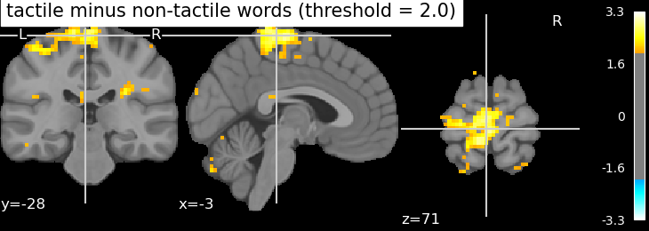

<!-- This is an html comment and this won't appear in the rendered page. You are now editing the "content" area, the core of your description. Everything that you can do in markdown is allowed below. We added a couple of comments to guide your through documenting your progress. -->

## Project definition

### Background

This project aims to explore brain activation of participants when presented with tactile words in Mandarin Chinese. The data used is from an OpenNeuro dataset which contains 672 stimulus words and functional data of 11 Chinese participants. My personal goal of this project is to familiarize myself with python, statistics and basic fMRI analysis techniques since I had no experience in any of them. For data analysis, I used General Liniear Model analysis to investigate brain responses to the stimulus words.

### Tools

The project relies on the following technologies:
 * This README is built using [Markdown](https://guides.github.com/features/mastering-markdown/), to structure the text.
 * Extraction, analysis and visualization of fMRI data is done with `nilearn`
 * The detail of this project is stored in a [Jupyter Notebook](https://jupyter.org/index.html)

### Data

The dataset contains 672 words of Mandarin Chinese with semantic ratings ranged from 0-7 and functional data of 11 participants recorded while listening to the stimulus words.
The functional data are all preprocessed and available from [OpenNeuro website](https://openneuro.org/datasets/ds004301/versions/1.0.2)

### Deliverables

At the end of this project, I'll have :

 * Markdown README.md for the description of the current project
 * Jupyter notebook including the code, and the fMRI brain images

### Tools I learned during this project
 For completing this project, one will need:
 * **Nilearn** for loading and visualizing fMRI data
 * **Numpy** to manipulate arrays
 * **Pandas** to manipulate dataframe

### Results

Left hemisphere was more activated compared to the right in general as all the stimuli were speech sounds. 
In terms of activation areas compared to non-tactile words, tactile words activated large areas of parietal lobe where somatosensory cortex is located at but also partially activated visual cortex. It might be due to overlapping features of tactile and visual words.

### Conclusion and Limitations

This project aimed to investigate brain activation when presented with tactile vs non-tactile words. Although there was a strong tendency that the somatosensory cortex was particulary activated, no area was significantly activated when setting a threshold as 3.0 in z-score which implies the necessesity of larger amount of data.  It is also unfortunate that my pc leads to kernal crash every time I try to analyze data of 5 or more runs and this inhibited me from second level analysis.

## Acknowledgements
This project taught me a lot and I can not believe that I could learn python, statistics, GLM and fMRI analysis at the same time in such a limited amount of time. About a few months ago, I had no idea where to start python and now I can use it to extract, analyze and visualize fMRI data! I'm quite sure that I couldn't have achieved this without Brainhack school.

In the end, I'd like to express my huge thanks to all of the organizers and TA's, especially Yu-Shiang without whom I could never have finished my project, and Dr.Josh and Dr. Lee, who hosted such as amazing program at National Taiwan University.

## References
[Wang, S., Zhang, Y., Zhang, X., Sun, J., Lin, N., Zhang, J., & Zong, C. (2022). An fMRI Dataset for Concept Representation with Semantic Feature Annotations. Scientific data, 9(1), 721.](https://doi.org/10.1038/s41597-022-01840-2)
