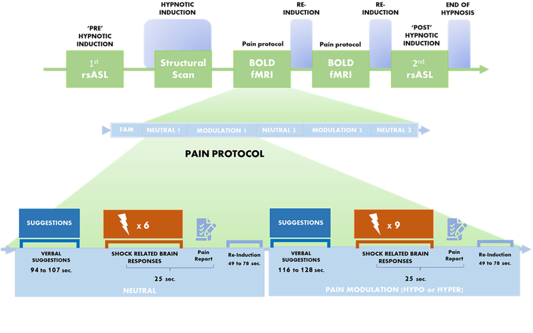

<!-- This is an html comment and this won't appear in the rendered page. You are now editing the "content" area, the core of your description. Everything that you can do in markdown is allowed below. We added a couple of comments to guide your through documenting your progress. -->

## Project definition

### Background
Pain is a multi-dimensional experience involving the activation of sensory, limbic and prefrontal brain areas. Hypnosis is psychological tool able to modulate pain perception using verbal suggestions. In the present study, verbal suggestions were used to induce a state of hyperalgesia, to increase pain perception, and hypoalgesia, to reduce pain perception. Suggestions were given while subjects were in the MRI scanner in order to record brain related activity. Immediately after the suggestions, a series of noxious electrical stimuli were administered to assess pain-related responses.

The aim of this project was to predict pain intensity ratings from fMRI brain images.

				     

**Personal goals**
* Apply machine learning to neuroimaging data :heavy_check_mark:
* Learn visualization tools :heavy_check_mark:
* Improve my coding skills :heavy_check_mark:

### Tools

For the completion of this project, I used the following tool: 
* **Jupyter Notebook** to write the code for the analysis
* Python modules: 
   * Pandas: to manipulate the excel with the pain ratings
   * Numpy: to manipulate arrays
   * Nibabel: to load the fMRI contrast images 
   * Scikit-learn: to process machine learning analysis
   * Nilearn: to visualize the fMRI data
* The python scripts and figures will be added to the **github** repository

### Data

The dataset comes from Desmartaux et al., 2021 and is access restricted. It includes 24 participants (13 women and 11 males) and mean age is 26.9. But I had to exclude one participant since no pain rating was present. Participants
completed a fMRI scanning session where they received hypnosis suggestions. Suggestions were divided in neutral, hypoalgesic and hyperalgesic suggestion.
After the verbal suggestions, a series of either 6 or 9 painful stimuli were administered.

	
				     
In total, each participant received 72 electrical shocks. A part one participant that received 60 electrical shocks. 
Consequently, the final data set included 23 participants for a total of 1644 trials/shocks across all participants.
The excel with the pain ratings for each participants can be found at [Hypnosis_Pain_ratings.xlsx](https://github.com/brainhack-school2022/monti_project/blob/main/Hypnosis_Pain_ratings.xlsx). 

### Deliverables

* Jupyter notebook for the Machine learning pipeline
* Jupyter notebook for visualizing the data and the results
* MarkDown README.md containing information about the project
* Github repository providing the scripts, graphs, report and relevant information

## Results

### Actual Deliverables
* [ML_Project_Hypnosis.ipynb](https://github.com/brainhack-school2022/monti_project/blob/main/ML_Project_Hypnosis.ipynb) : script with the machine learning algorithm. 
* The Jupyter notebook with the data visualization need to be add.

### GLM
 
A General Linear Model, for which the code can be found [here](https://github.com/dylansutterlin/decoding_pain_experience), was applied to generate contrast maps.

Here some beta maps visualization:
				     

### Regression models

A regression algorithm combined with a principal component analysis (PCA) was used to den intensity rating from fMRI data. A ([`Lasso`](https://scikit-learn.org/stable/modules/generated/sklearn.linear_model.Lasso.html) regression algorithms was applied. The models were trained on the first dataset using a 5-fold cross-validation procedure and tested on the second dataset. The following parameters were used: `GroupShuffleSplit(n_splits = 5, test_size = 0.3, n_components=0.80, random_seed=42)`.

Here the results:

									

The regression model computed on the first dataset performed very poorly on the test set (second dataset). A Pearson R close to zero means that the model doesn’t fit the data. A R2 negative means that the model was worst that the chance in predicting the ratings. It is possible that computing two different model, one for each condition, it will be possible o achive a bette result. 
ter

## Conclusion

My personal goals were reached. Independently of the result, I could run my first machine learning model and understand better the logic behind it. Moreover, I learned new techniques of data visualization and I improved my skills in coding. 

This is just the beginning of my journey with python. I will continue coding and analysing fMRI data. To this aim, my future goal is to apply machine learning to the fMRI data that I’m going to obtain during my PhD, and try to to predict pain and effort perception rating. 

## Acknowledgement

I would like to thank Pierre Bellec for organizing such useful course and all the instructors for the support. I would especially thank Marie-Eve for the immense patience in explaining what I was not understanding and Dylan to accept me as part of the team.  

For any question and/or comments contact me at ilaria.monti@umontreal.ca.

## References

Desmarteaux, C., & Rainville, P. (2021). Brain Responses to Hypnotic Verbal Suggestions Predict Pain Modulation. Frontiers in Pain Research, 2, 18.
Franz, M., Schmidt, B., Hecht, H., Naumann, E., & Miltner, W. H. R. (2021). Suggested visual blockade during hypnosis : Top-down modulation of stimulus processing in a visual oddball task. PloS One, 16(9), e0257380. https://doi.org/10.1371/journal.pone.0257380

Wiech K. Deconstructing the sensation of pain: the influence of cognitive processes on pain perception. Science. (2016) 354:584–7. doi:https://10.1126/science.aaf8934
