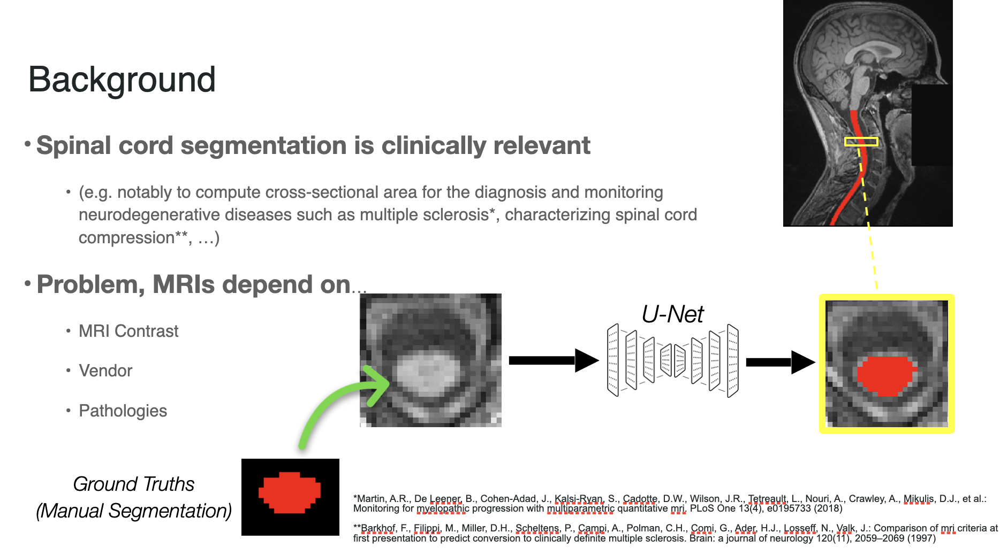
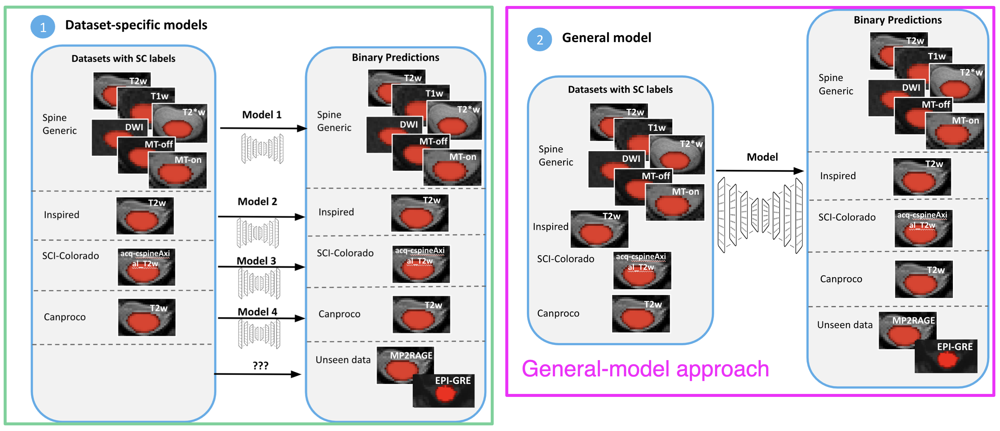
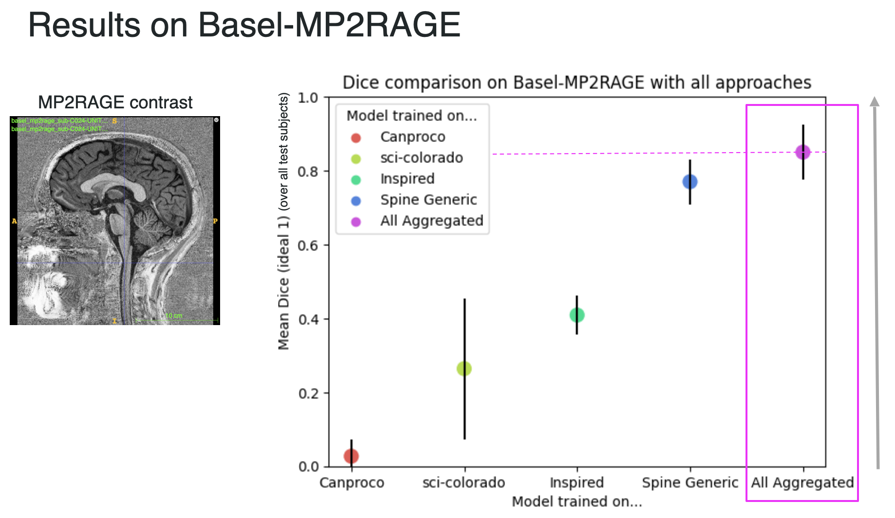

<!-- This is an html comment and this won't appear in the rendered page. You are now editing the "content" area, the core of your description. Everything that you can do in markdown is allowed below. We added a couple of comments to guide your through documenting your progress. -->

## Project definition

### Background

Spinal cord segmentation is the process of identifying the spinal cord area in MRI images. This is clinically relevant notably to compute cross-sectional area for the diagnosis and monitoring of neurodegenerative diseases such as multiple sclerosis.

Performing automatic spinal cord segmentation is complicated even with deep learning methods due to the wide range of MRIs that can be produced from various contrasts, machine vendors and pathologies of the patient. This results in very different output images that no individual model can handle yet.

Typically, we use one model per data sub-set to reduce the complexity of the task, like a specific contrast (e.g. T2w), and end up with *N* models where we test each of them to select the optimal model for new images. This is not reliable and scalable.

My goal is to build a more general model to automatically perform spinal cord segmentation across contrasts, vendors and pathologies.

Below is a visual example of the segmentation result on one subject using a contrast outside of the training scheme comparing the ground truth or manual segmentation (left) with the aggregated model (center) and one of the specific models (right).

### Tools

Main tools: Python/Pytorch/Git/ssh/Jupyter Notebooks

Most important: [nnU-Net](https://github.com/MIC-DKFZ/nnUNet) -> a state-of-the-art “self-configuring method for deep learning-based biomedical image segmentation”.

### Methodology
Train and compare 2 frameworks (individual models vs. general model) for performing automatic spinal cord segmentation.

### Data

Various (6) Spinal Cord MRI datasets available at Neuropoly with manual segmentation.

Our training datasets:
* Spine Generic Public Database* (multi-subject), n=244, 3 vendors, 6 contrasts (T2w, T1w, T2*w, 3D axial GRE (MTon), GRE-T1w (MToff), DWI), pathology: Mild Compression, Healthy Controls.
* INSPIRED, n=79, 1 contrast (acq-cspineAxial_T2w), pathology: Degenerative Cervical Myelopathy (38), Spinal Cord Injury, Healthy Controls.
* SCI-Colorado, n=80, 1 contrast (T2w), pathology: Spinal Cord Injury.
* Canproco, n=445, 1 contrast (T2w), pathology: MS.

Test datasets (outside training distribution):
* Basel-mp2rage, n=283, 1 contrast (MP2RAGE "UNI"), pathology: Multiple Sclerosis (180), Healthy Controls (103).
* Extra: [Rohan](https://github.com/brainhack-school2023/banerjee_project)’s fMRI test set, n=8, 1 contrast (EPI-GRE).

**Cohen-Adad, J., Alonso-Ortiz, E., Abramovic, M., Arneitz, C., Atcheson, N., Barlow, L., Barry, R.L., Barth, M., Battiston, M., Büchel, C., et al.: Open-access quantitative mri data of the spinal cord and reproducibility across participants, sites and manufacturers. Scientific data 8(1), 219 (2021)

### Objectives

* Create a script for converting N BIDS datasets into one large “nnU-Net-ready” dataset train/test split. Read more [here](https://github.com/brainhack-school2023/bouchard_project/tree/main/docs).
* Compare a general model to specific models for spinal cord segmentation on the datasets’ test sets. Results shown [here](https://github.com/brainhack-school2023/bouchard_project/blob/main/results/results_analysis.ipynb).
* Test the resulting 2 frameworks on a fifth and sixth dataset to demonstrate the generalizability capabilities of the larger model. Results shown [here](https://github.com/brainhack-school2023/bouchard_project/blob/main/results/results_analysis.ipynb).

### Deliverables

* A [Github repository](https://github.com/brainhack-school2023/bouchard_project) with codes and scripts to reproduce training and testing.
* A [jupyter notebook](https://github.com/brainhack-school2023/bouchard_project/blob/main/results/results_analysis.ipynb) of the analysis codes and visualizations for comparing the results.
* Documentation. This README file and the README in `docs/`.
* Model checkpoints for the nnUnet models trained on all 4 datasets (right now available on /duke for Neuropoly members).

## Results

### Progress overview

The project was initiated by Louis-François Bouchard, based on the existing BrainHack template. I started from existing scripts for the nnU-Net method and adapted them for my needs. There are now all necessary updated scripts in the `scripts` folder and documentation in `docs` through a clear README file to reproduce the project. A notebook is available with all results as well as the final project presentation powerpoint for more information. Ultimately, the project was a success and the hypothesis (aggregating datasets == better general model) was confirmed.

### Tools I learned during this project

 * **Git, GitHub, Git-Annex -** I learned to better use git, github and git-annex for training models and creating a project repository with appropriate documentation and hierarchy.
 * **nnU-Net -** I learned to successfully prepare data, train a model, and analyze the results for spinal cord segmentation using the nnU-Net model framework (library).
 * **Python/Pytorch/Notebooks/BIDS/ssh/GPU training/bash -** I got more familiar with pytorch for training and testing models remotely on a server with multiple GPUs. I also used and wrote many bash scripts for pre-processing images (from BIDS to nnU-Net, but also re-orienting, resampling..) and automate tasks more efficiently. Overall, this project helped me develop important skills as well as understanding the necessary steps in working on this kind of project from scratch.

### Results

#### Deliverable 1: A GitHub repository with code and scripts to reproduce the project

This README along with the README in the `docs` folder allows anyone to reproduce these experiments and use the `scripts/` and notebooks adapting the commands with their own paths and data.

#### Deliverable 2: A notebook with results analysis

The deliverable 2 is available in the [results/](https://github.com/brainhack-school2023/bouchard_project/tree/main/results) folder where I show both quantitative (mean dice results) and qualitative (visual results) results of the different (3) experiments. 
The experiments were (i) to compare the general model to specific models on their respective tasks (e.g. compare the general model to the spine generic-trained model on the spine generic test set to see if the general model kept a similar "understanding" of this sub-set of the data), (ii) compare the general model to the specific models to two unseen sets of data (with unseen image contrasts), including the Basel dataset with MP2RAGE contrast and [Rohan](https://github.com/brainhack-school2023/banerjee_project)'s fMRI test set with EPI-GRE contrast.

Bellow is the most important outcome, showing how the aggregated (or general) model outperforms specific models on unseen data, here reporting the mean dice over the Basel-MP2RAGE dataset, which uses a contrast (MP2RAGE) that was not seen in any training scheme prior testing.

See more interesting results in [the notebook](https://github.com/brainhack-school2023/bouchard_project/blob/main/results/results_analysis.ipynb)!

#### Deliverable 3: Documentation

I believe this documentation along with `docs/README` and the comments in the different scripts allows for anyone to re-use and replicate this project easily.

#### Deliverable 4: Model checkpoints

Right now the models are available on `duke/` for Neuropoly students. An improved version of the general model will be shared and pushed to [SCT](https://github.com/sct-pipeline) once the results are satisfying enough.

## Conclusion and acknowledgement

To conclude, I believe this project was a success, showing how aggregating datasets can build a more general model while keeping the "specialized capabilities" similar. Adding more diverse data is a promising next step to further improve the model as well as performing proper visual analysis and cross-validation to ensure the validity of the results and better understand the results' quality and problems to solve.

I wanted to highlight some limitations of this project like the fact that the datasets are of various sizes, which may hurt the comparison. Likewise, most datasets use the T2w contrast only, which is not ideal for building a more general model, but was the only way to correctly split our dataset and keep contrast "not seen in training" outside any training frameworks and only in our testing datasets. Finally, the time constraints didn't allow me to perform proper cross-validation of the different models as well as in-depth analysis of the results visually, as mentioned above for an interesting next step.

Still, the goal of this project was to learn how to use nnU-Net, improve my git, github and git-annex skills and improve my understanding of MRIs, contrasts and spinal cord segmentation. In those terms, the project was a success and is a promising start for my PhD work.