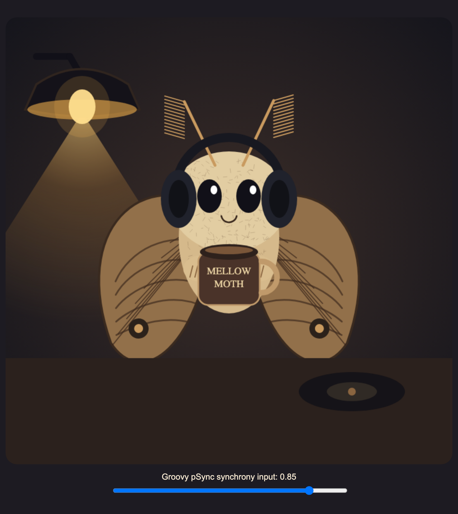

## Project definition
---

### Background

Interpersonal synchrony is the temporal coordination of actions between people. It shows up across music-making, dance, conversation, sport, and ritual, and is often described as a kind of "social glue": moving or acting together in time supports affiliation, cooperation, and group cohesion.

Music and rhythmic movement are especially useful for studying synchrony because they give people a predictable temporal structure to align with. Tarr and colleagues review evidence linking interpersonal synchrony and music-making to social bonding, including mechanisms such as self–other merging and endogenous opioid activity during rhythmic group activity ([Tarr et al., 2014](https://pmc.ncbi.nlm.nih.gov/articles/PMC4179700/)). Group drumming is a particularly good paradigm because it lets researchers study synchronization in a shared, interactive setting. Gordon and colleagues used a three-person group drumming task and found that both physiological and behavioural synchronization predicted participants' experience of group cohesion ([Gordon et al., 2020](https://www.nature.com/articles/s41598-020-65670-1)).

I am a PhD student in psychology at Université de Montréal working on rhythm, synchrony, group drumming, and social cohesion in clinical and research contexts. **pSynchronicity** is inspired by this literature, but the BrainHack School goal was computational rather than experimental: to build the technical infrastructure for a real-time group tapping paradigm — input capture, timestamping, metronome generation, synchrony estimation, and feedback visualization.



### The paradigm

Participants begin by tapping along with a metronome (**synchronization** phase), then keep tapping together after the metronome stops (**continuation** phase).

| Phase | Duration | Task |
|---|---:|---|
| Synchronization | 45 seconds | Tap with the metronome |
| Continuation | 35 seconds | Keep tapping together after the metronome stops |

Each round lasts 80 seconds, and the metronome tempo is randomly selected between 100 and 140 BPM at the start of each round. An initial participant mapping (e.g. three pads or keys → P1, P2, P3) lives in a configuration so the paradigm can scale to more participants.

### Tools

This project relied on:

1) **Git and GitHub** — forks, branches, and submodules to develop and share the work;
2) **[goofi-pipe](https://github.com/dav0dea/goofi-pipe)** — a modular, node-based real-time data pipeline framework, used here as the backbone for receiving, processing, and routing synchrony data;
3) **Python** — to write custom goofi-pipe nodes;
4) **MIDI** — as the first real-time tapping input;
5) **OSC** — to stream the group synchrony score out of the pipeline;
6) **pygame** — for the standalone real-time visual feedback window.

### Data

Rather than an offline dataset, the "data" here is a **live stream**: every tap is captured as a MIDI note-on event and timestamped in real time. MIDI tapping was chosen as the first test signal because it is accessible, low-latency, and easy to test with a keyboard, drum pad, or MIDI controller, adaptable to any number of digital instruments allowing for personalization for participants. The pipeline is deliberately built around a more general synchrony concept, so the same architecture can later accept other time-series inputs (see *Future work*).

### Project deliverables

- A goofi-pipe fork containing custom synchrony nodes, linked into the project repository as a **Git submodule**.
- A working real-time MIDI-tapping → synchrony-scoring → visual-feedback pipeline.
- A standalone visual feedback application (`psync_visualizer.py`).
- Project documentation and this project page.

## Results
---

### Progress overview

During BrainHack School I forked and modified goofi-pipe, linked it into my project repo as a submodule, and built an end-to-end real-time synchrony-feedback workflow using MIDI as the first working signal. All custom nodes live in my goofi-pipe fork under `src/goofi/nodes/`. The data flows like this:

```text
MidiIn ──▶ SyncAnalyzer ──▶ GroupSyncScore ──▶ OSCOut ──▶ psync_visualizer
MetronomeGenerator ──▶ SyncAnalyzer   (and ──▶ AudioOut for the click)
```

### The nodes I built

**1. `MidiIn` — the tap sensor.** Turns physical taps into labelled events. It opens any MIDI input port(s); every note-on becomes a `tap`. A `participant_map` (e.g. `*:61:P1, *:63:P2, *:66:P3`) maps each `(device, note)` to a participant, so one drum pad with three pads becomes three people. Output carries `tap_time`, `participant`, `note`, `velocity`, and `port_name`.

**2. `MetronomeGenerator` — the conductor / clock.** Defines the trial and emits the beat everyone syncs to. A drift-corrected beat thread walks the timeline **synchronization** (audible clicks) → **continuation** (silent) → **stopped**. It outputs the beat (`beat_time`, `beat_index`, `bpm`, `beat_interval`, `phase`, `elapsed`) plus an `audio_click` during the sync phase only. Stopping emits a `stopped` beat so the whole pipeline halts cleanly.

**3. `SyncAnalyzer` — per-participant measurer.** For each tap, it measures how well *that person* keeps time over a sliding window (default 2.5 s) — deliberately simple, with no participant-vs-participant maths here:
- `async_ms` — tap offset from the nearest beat (− = anticipating);
- `within_window` — 1 if `|async| ≤ threshold` (default 100 ms, [Repp 2005](https://link.springer.com/article/10.3758/BF03206433));
- `metro_sync` — fraction of recent taps that landed on the beat;
- `mean_iti_ms` — that person's current tapping tempo.

**4. `GroupSyncScore` — the group metric (the novel part).** Collects everyone's latest numbers and answers *"how many are in sync right now?"* — for any number of participants, with a phase-dependent rule:
- **synchronization** → in sync = matches the metronome (`metro_sync ≥ metro_sync_min`);
- **continuation** → in sync = matches the group's tempo (`|mean_iti − group median| ≤ tempo_tol_ms`).

It outputs `n_in_sync`, `n_total`, `frac_in_sync` (0–1), and a per-person `P*_in_sync` flag. **`frac_in_sync`** (0 = nobody, 1 = everyone) is the single moment-by-moment number that drives the feedback.

### Output & visual feedback

The built-in **`OSCOut`** node streams the group scores over OSC (prefix `/goofi`, port 9001). A standalone pygame window, **`psync_visualizer.py`** (the "Mellow Moth", shown above), listens for that OSC and animates a moth by `frac_in_sync`: still when nobody is in sync, then roaming and flapping as the group locks in.

### Tools and skills I learned during this project

1) **Git & GitHub in depth** — forks, branches, and especially **submodules** to link my edited goofi-pipe fork into the project repo;
2) **goofi-pipe node development** — how to write custom input/analysis/output nodes and wire them into a live graph;
3) **Real-time pipeline thinking** — timestamping, sliding windows, drift-corrected timing, and phase-driven logic;
4) **OSC messaging** — decoupling the analysis pipeline from the visual feedback so they can run independently;
5) **Python for real-time interactive systems** — threading for the metronome and a pygame feedback loop.

### Future work

The current demo uses MIDI tapping, but the pipeline is framed as a general signal-processing problem:

> input signal → timing / coupling estimate → synchrony score → real-time feedback

Because of this design, future versions could route other synchrony signals into the same node structure:

- **Heart rate variability** — physiological regulation and interpersonal coupling;
- **Respiration** — breathing rate and phase alignment as a synchrony feature;
- **Movement** — accelerometers, motion capture, or webcam-based tracking of body coordination;
- **Audio** — microphone detection of clapping, drumming, or vocal timing for more naturalistic group music-making.

This makes the project relevant to music cognition, social neuroscience, affective neuroscience, and music therapy, where synchronization may be altered or therapeutically meaningful (e.g. group drumming, and social-bonding studies).

## Conclusion and acknowledgement
---

Coming into BrainHack School, I had a research idea about group synchrony but limited tooling to realize it. I leave with a working, modular, real-time pipeline — and, just as importantly, the version-control, node-development, and real-time engineering skills to keep building on it. Reframing synchrony as a flexible signal-processing problem (rather than only a tapping measure) is the part I am most excited to carry into my PhD work.

Huge thanks to the BrainHack School organizers, instructors, and teaching crew for the guidance and the opportunity. 🦋

## References

Gordon, I., Gilboa, A., Cohen, S., Milstein, N., Haimovich, N., Pinhasi, S., & Siegman, S. (2020). Physiological and Behavioral Synchrony Predict Group Cohesion and Performance. *Scientific Reports, 10*, 8484. https://www.nature.com/articles/s41598-020-65670-1

Repp, B. H. (2005). Sensorimotor synchronization: A review of the tapping literature. *Psychonomic Bulletin & Review, 12*(6), 969–992. https://link.springer.com/article/10.3758/BF03206433

Tarr, B., Launay, J., & Dunbar, R. I. M. (2014). Music and social bonding: "self-other" merging and neurohormonal mechanisms. *Frontiers in Psychology, 5*, 1096. https://pmc.ncbi.nlm.nih.gov/articles/PMC4179700/
