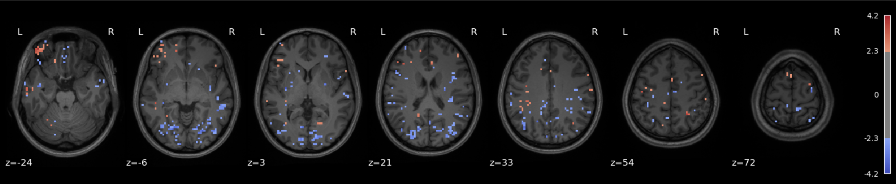
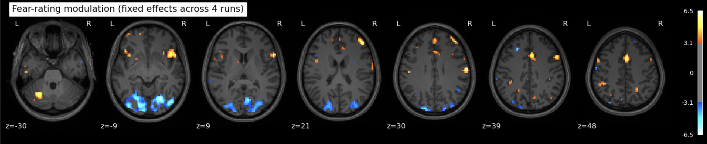

<!-- This is an html comment and this won't appear in the rendered page. You are now editing the "content" area, the core of your description. Everything that you can do in markdown is allowed below. We added a couple of comments to guide your through documenting your progress. -->

## Project definition

### Background

Discovering *"the neural signature of X"* is the bread and butter of neuroimaging research. There are myriad analytic approaches neuroscientists may deploy to this end, each with their own strengths and limitations, but none that can, on its own, deliver a singular, definitive neural signature of ***anything***. 

This limitation is both methodological and epistemological. Different methods afford different perspectives (Davis et al., 2014). Moreover, each method enables distinct types of inference about the neural underpinnings of a given construct (Popov et al., 2018). 

For Brainhack School 2025, I wanted to gain hands-on experience with the most popular analytic approaches to neuroimaging on a single subject; that is, mass univariate (GLM), predictive (ML) and representational (RSA).

### Tools

- git and github for version control and documentation
- nibabel/nilearn for NIfTI image loading and saving, GLM fitting, decoding, and visualization
- scipy for statistical functions, distance metrics (for RSA)
- scikit-learn for predictive modeling, cross-validation, hyperparameter tuning
- scipy and pandas for data manipulation and RSA
- matplotlib/plotly for plotting
- Jupyter Book for interactive documentation and results dissemination

### Data

The dataset was contributed by my colleague and labmate [Darius Valevicius](https://dariusliutas.com/), and includes fMRI recordings from participants who viewed short video clips of various animals and rated, in real time, the extent to which each clip elicited fear. The dataset is already preprocessed, including motion correction and spatial normalization. 

### Deliverables

- [Github repo](https://github.com/brainhack-school2025/manuel_project)
- Jupyter notebook (see repo)
- [Jupyter Book site](https://shwnmnl.github.io/neurofear) 
- [Slide deck](https://www.canva.com/design/DAGoggkx5Qc/0rdEuKNYpgVpxGgaHn7XuA/edit?)

## Sneek peek of results

The repository and jupyter notebook for this project [can be found here](https://github.com/brainhack-school2025/manuel_project). Note however that since I'm using pilot data from my colleague's current reserach project, I'm unable to share the data that would render the notebook truly reproducible. 

In addition, [a Jupyter book site can be found here](https://shwnmnl.github.io/neurofear) that walks through each of the three analyses step by step and includes some interactive plots. 

### Approach 1 - GLM : Fear-related activation maps from 1 and 3 runs

The data for this participant includes 3 separate runs. Analyses were conducted on a sinlge run, as well as all three, in order to cultivate an intuition about what different amounts of data look like.

The question being asked here is: *Which voxels show a linear relationship with subjective fear, irrespective of animal category?*

As we’re working with fear, we’d hope to recover regions such as insula, thalamus, periacqueductal gray matter, locus cerulus, parabrachial nucleus and nucleus of solitary tract, medial frontal gyrus, anterior cingulate, amygdala and hippocampus, hypothalamus and maybe some ventromedial or dorsolateral prefrontal cortex. 

One run

Three runs

See the [Jupyter book](https://shwnmnl.github.io/neurofear) for a deeper interpretation of these results, including both anatomical (Harvard-Oxford) and network-based (Schaefer) atlases, but suffice it to say that we were not able to recover fear-related subcortical regions, but some associative/integrative prefrontal regions are present.

Here's an interactive version that includes all runs. 

  <iframe src="/html/fearmap_view.html"
          style="position: absolute; top: 0; left: 0; width: 100%; height: 75%; border: none;">
  </iframe>

### Approach 2 - ML : Decoding fear ratings

Here, the question(s) being asked is/are: *Can we predict the psychological condition (animal category or fear rating) of a trial from its corresponding brain activation pattern?*

Many variations were attempted, to little avail. Predicting either animal category (classification) or fear rating (regression) was unsuccessful, but since fear ratings are ordinal, multi-class classification was attempted and led to barely-higher-than-chance performance, with a mean accuracy across runs of 23% (5 classes to predict). It may be that the features used aren't informative enough, in addition to the relative paucity of data to train on. 

### Approach 3 - RSA : Comparing the neural and behavioral structure of fear

For this approach, the question being asked is: *Do similarities and differences in brain activation patterns in different ROIs reflect similarities and differences in fear ratings across trials?*

The Superior Frontal Gyrus (SFG) shows the strongest (but small in absolute terms) and statistically significant correspondence with the fear rating RDM (ρ = 0.079, p ≈ 0.0009). Since the SFG is implicated in executive function and emotion regulation, it could be counted as a plausible candidate for representing or modulating the conscious experience of fear.

Here's an interactive plot to compare the fear RDM to different brain ROI RDMs.

<iframe src="/html/rdm_slider_plot.html" width="100%" height="600px" frameborder="0"></iframe>

## Conclusion

The aim of this project was not to pin down a singular neural signature of fear, but to explore how different analytic methods—mass univariate analysis, predictive modeling, and representational similarity analysis—characterize the neural architecture of a psychologically rich construct. The results reflect the mixed promises and limits of each approach.

Taken together, these results do not point to a singular neural “signature” of fear, but rather show how fear becomes legible in different ways depending on the lens applied. The GLM captures reliable spatial contrasts, predictive modeling asks whether neural patterns are sufficient for inference, and RSA examines whether psychological similarity is mirrored in brain dynamics. Each method reveals partial truths.

If there is a takeaway, it is methodological rather than anatomical: capturing the neural instantiation of psychological constructs may require triangulation across models and perspectives. In the future, I’d like to see more papers that try all three of these approaches (including both decoding and encoding) and I hope to work on this a bit more, potentially with more of Darius’ data once it’s been collected, to try to lead by example.

In the meantime however, I’m quite pleased with what I able to learn and experiment with over the course of the last four weeks of Brainhack School 2025.

## References
1. Davis, T., LaRocque, K. F., Mumford, J. A., Norman, K. A., Wagner, A. D., & Poldrack, R. A. (2014). *What do differences between multi-voxel and univariate analysis mean? How subject-, voxel-, and trial-level variance impact fMRI analysis.* **Neuroimage, 97, 271-283.**

2. Popov, V., Ostarek, M., & Tenison, C. (2018). *Practices and pitfalls in inferring neural representations.* **NeuroImage, 174, 340-351.**
