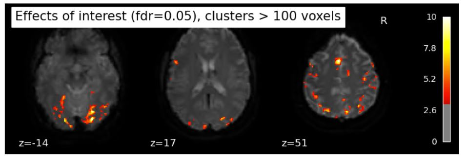

## Project definition
---
### Background

Neuroimaging is widely used to understand neurophysiological processes associated with obesity and responsiveness to weight loss interventions ([Carnell et al. 2012](https://onlinelibrary.wiley.com/doi/10.1111/j.1467-789X.2011.00927.x)). Functional MRI studies examining the food cue reactivity in obesity compared to lean individuals have shown BOLD differences in brain regions involved in energy regulation, cognitive control and reward valuation ([Harding et al. 2018](https://www.nature.com/articles/ijo2017237)). These alterations may be implicated in the development of obesity, as well as a predictor of lower success in weight loss intervention ([Hermann et al. 2019](https://www.sciencedirect.com/science/article/pii/S2213158219301536?via%3Dihub)). However, it is unclear if intervention targeting weight loss and cardiometabolic improvement, such as bariatric surgery, could reverse these alterations in brain functional reactivity to food cues. My project aims to identify brain regions that react to snack images in individuals with severe obesity, and examine changes in food cue reactivity after weight loss induced by bariatric surgery.

### Tools
This project relied on numerous tools such as:
1) Git and GitHub to use and share methods;
2) High performance computing (HPC), such as Alliance Canada, for executing scripts; 
3) Python packages, such as nilearn, for food cue reactivity analyses.

### Data
The dataset was collected from 2016 to now at Quebec Heart and Lungs Institute. Ninety-four participants with severe obesity scheduled to undergo bariatric surgery were recruited. Participants were scanned prior to, 4, 12 and 24 months after bariatric surgery. For this project, a T1 and three fMRI runs with [Becker-DeGroot-Marshack auction task](https://onlinelibrary.wiley.com/doi/10.1002/bs.3830090304) (duration: 10 minutes 27 seconds) from one participant will be used. Forty-five randomized images (15 high-sweet, 15 high-salt and 15 low caloric density) were presented to the participant for 4 seconds. ThepParticipant must bid between 0 to 5$ for each snacks in the next 4s. The auction part will not be evaluated in this project.

### Project deliverables 
At the end of this project, these files will be made available:
1) Python scripts to analyse brain reactivity to food cues;
2) Figures of this results; 
3) A repository on GitHub to share my methods;
4) Scripts on Alliance Canada which will be usefull to all members of my lab.

## Results
---
### Progress overview
First, this project involved correcting the format of my dataset. I had to convert it to BIDS format and preprocess the Nifti files with fmriprep. These steps took longer than expected. So far, only one participant's files have been converted to BIDS format and preprocessed. However, I was able to run a first-level general linear model on this participant to present: 1) BOLD activity in the visual cortex and the superior frontal gyrus (SFG) when images were shown at this participant (effect of interest)  and 2) no significant region of BOLD activity when contrasting high vs low calorie snacks.

##### Figure 1. BOLD activity when images are shown (for run #1 of one participant)

##### Figure 2. BOLD activity contrast between high vs low calorie snacks (for run #1 of one participant)

### Tools I learned during this project
1) [dcm2niix](https://github.com/rordenlab/dcm2niix): I learned how to convert data from Dicom to Nifti and what I must check to validate that the convertion went well;
2) [BIDS-validator](https://bids-standard.github.io/bids-validator/): I learned how to standardize a dataset into BIDS format;
3) [fmriprep](https://fmriprep.org/en/stable/): I learned how to execute fmriprep and what is the output after the execution;
4) [Nilearn](https://nilearn.github.io/stable/index.html): I learned how to use Nilearn on Jupyter Notebook to visualize data and examine the contrast of high vs low calorie food cues in a one participant's run;
5) [Alliance Canada](https://alliancecan.ca/fr): I learned how to manage time, cpus, and memory to run a bash file;
6) [GitHub](https://github.com/): Before this school, I had trouble using it. But now, I'm very glad to know much and how it could help me to produce reproductible research.  

### Deliverables
The results of my project was mostly:
1) BIDS transformation of one participant's file to better use standardized pipeline;
2) Use fmriprep to had clean preprocessed data for one participant;
3) Create Alliance Canada scripts that could be share to all members of my lab;
4) Use Nilearn from Jupyter Notebook to visualize contrast for high vs low calorie food cues.

### Future work
For this study, I'll have to convert all my dataset into a BIDS format and execute fmriprep on my Nifti files using Alliance Canada. Then, I would be able to go further in my analysis, which means to execute 2nd and 3rd level general linear model. 

## Conclusion and acknowledgement
First, I was a bit disappointed not to have gone far in analyzing my data. But I realized that thanks to this school, I finally have the necessary notions to standardize dataset and to proceed with the analysis of my data. I have learned more than if I had simply worked on analyses in Nilearn.  

I would like to thanks all the Brainhack School organizators and all the crew. Mostly, thanks for this awesome opportunity!

## References
Carnell S, Gibson C, Benson L, Ochner CN, Geliebter A. Neuroimaging and obesity: current knowledge and future directions. Obes Rev. 2012 Jan;13(1):43-56. doi: 10.1111/j.1467-789X.2011.00927.x. Epub 2011 Sep 8. PMID: 21902800; PMCID: PMC3241905.

Harding IH, Andrews ZB, Mata F, Orlandea S, Martínez-Zalacaín I, Soriano-Mas C, Stice E, Verdejo-Garcia A. Brain substrates of unhealthy versus healthy food choices: influence of homeostatic status and body mass index. Int J Obes (Lond). 2018 Mar;42(3):448-454. doi: 10.1038/ijo.2017.237. Epub 2017 Sep 25. PMID: 29064475.

Hermann P, Gál V, Kóbor I, Kirwan CB, Kovács P, Kitka T, Lengyel Z, Bálint E, Varga B, Csekő C, Vidnyánszky Z. Efficacy of weight loss intervention can be predicted based on early alterations of fMRI food cue reactivity in the striatum. Neuroimage Clin. 2019;23:101803. doi: 10.1016/j.nicl.2019.101803. Epub 2019 Mar 27. PMID: 30991304; PMCID: PMC6463125. 
